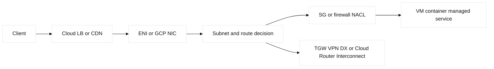
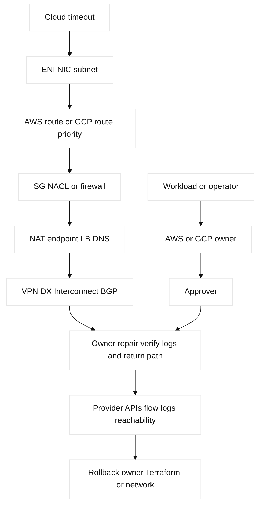

# 12. Cloud Networking: AWS and GCP Semantics

## A. Learning objectives and prerequisites

Map a packet from a cloud workload through routes, interfaces, controls, load
balancers, and hybrid links; distinguish AWS VPC from GCP VPC semantics; and
verify an allow or deny with provider evidence. Prerequisites are IP routing,
ACLs, BGP, VPN, DNS, and load balancing. Examples use fictional accounts,
`10.50.0.0/16`, `10.60.0.0/16`, and non-runnable placeholders.

## B. Portable mental model

Cloud networking is virtual forwarding with provider-owned hardware. A workload
uses an ENI/NIC, a subnet route decision, a stateful or stateless firewall,
and possibly NAT, endpoint, transit, or load-balancer service. Control planes
create objects asynchronously; data planes enforce the converged state. A
route table entry does not prove a security-group rule, return route, health
check, or quota is correct.



## C. AWS and GCP inventory

**Fact:** AWS VPCs are regional, subnets belong to one Availability Zone, and
route tables are associated with subnets. Internet Gateway provides Internet
routing for eligible public paths; a NAT Gateway provides initiated outbound
IPv4 translation; ENIs are attachment points. Security groups are stateful
allow rules, while network ACLs are stateless ordered subnet boundaries. VPC
endpoints and PrivateLink provide private service access; Transit Gateway
(TGW) centralizes routed attachments; peering is non-transitive. Site-to-Site
VPN and Direct Connect offer different encrypted versus private-underlay
semantics. Route 53 is DNS, not a route table. ELB, CloudFront, Global
Accelerator, Network Firewall, VPC Flow Logs, and Reachability Analyzer each
observe different points.

GCP VPC networks are global resources with regional subnets. Custom routes and
dynamic routes from Cloud Router influence forwarding; HA VPN is encrypted
connectivity and Interconnect is private connectivity, both requiring BGP or
static routing decisions. VPC firewall rules are stateful, identity/tag-aware
policy; Cloud NAT is managed egress translation. VPC Network Peering is not a
transitive router. Private Service Connect (PSC), Private Google Access, Cloud
Load Balancing, Cloud DNS, Cloud Logging, VPC Flow Logs, Connectivity Tests,
Shared VPC, and Cloud Armor provide distinct service or governance boundaries.
GCP route priority and AWS route-table specificity are not interchangeable.

## D. Safe configuration shapes and ownership

Illustrative Terraform, deliberately incomplete and non-runnable until provider
versions, credentials, regions, quotas, and IDs are supplied:

```hcl
resource "aws_vpc" "lab" { cidr_block = "10.50.0.0/16" }
resource "google_compute_network" "lab" { name = "lab-net"; auto_create_subnetworks = false }
# Ownership contract: Terraform owns these cloud objects; controllers own appliances.
```

CLI/API shapes are read-first: AWS `describe-route-tables`, `describe-network-
interfaces`, `describe-security-groups`, `describe-network-acls`, `describe-
flow-logs`, `get-network-insights-path`; GCP `gcloud compute routes list`,
`firewall-rules list`, `networks subnets describe`, Connectivity Tests, and
Cloud Logging queries. A provider plan is not a successful apply. Terraform
state, import, drift, locks, secrets, provider schema, and asynchronous
operation status must be reviewed. Ansible may configure a VM or appliance;
it does not replace cloud route ownership.

For a hybrid edge, a Cisco IOS-XE shape might be `show ip bgp summary`, `show
ip route vrf CLOUD`, and a lab-only `neighbor 192.0.2.2 remote-as 65120` under
a bounded address family. Linux evidence is `ip route get 10.60.0.10`, `ip
rule`, `ip neigh`, and `tcpdump -ni eth0`. These are device-relevant shapes,
not a claim that AWS or GCP exposes customer-managed switches or PIM.

## E. Verification and expected evidence

Start with workload NIC, subnet/route, destination specificity, and return
route. Then inspect SG/NACL or GCP firewall direction, NAT/endpoint, LB target
health, DNS answer, quotas, and flow logs. AWS Reachability Analyzer can test
modeled paths; GCP Connectivity Tests can model firewall/routes. VPN evidence
includes tunnel/IKE and BGP state; Direct Connect/Interconnect evidence adds
virtual circuit, VLAN/attachment, and route advertisements. Logs may be
sampled or delayed. A healthy result is a successful packet and a matching
control-plane explanation, not merely an object in `ACTIVE` state.

| Area | AWS semantics/owner | GCP semantics/owner | Evidence |
|---|---|---|---|
| Route | Subnet route table, TGW propagation, or VPN/DX owner; specificity wins. | Global VPC with regional subnet and route priority; Cloud Router advertises state. | `describe-route-tables`; `gcloud compute routes list`; reachability test. |
| Firewall | Stateful SG on ENI plus stateless ordered NACL on subnet. | Stateful priority-ordered VPC firewall using tags/service accounts. | Rules, logs, and both-direction test. |
| LB/VPN | ALB/NLB health/listener; VPN encrypts, DX is private, TGW routes. | LB backend/health check; HA VPN encrypts, Interconnect is private, Cloud Router BGPs. | Target health, tunnel/BGP, attachment and route advertisements. |
| Logs/quota | VPC Flow Logs, CloudTrail/service events, NAT/LB metrics, account quotas. | VPC Flow Logs, Cloud Logging/audit events, NAT/LB metrics, project/region quotas. | Timestamped query and quota event; logs may lag or sample. |

Terraform owns only declared cloud objects: pin provider versions, lock and
back up remote state, import pre-existing objects deliberately, and treat a
drift plan as a review gate. No controller may write the same route,
attachment, or firewall field. `ACTIVE` still needs forwarding read-back.

## F. Failure lab: route exists, flow denied

Start with an AWS-like VPC and GCP-like VPC, private application subnet,
managed egress, DNS, and a hybrid prefix. Inject a missing AWS return route,
NACL deny, SG omission, GCP firewall priority conflict, Cloud NAT port limit,
unhealthy LB backend, or BGP advertisement failure. Symptom: timeout, one-way
connection, or a DNS answer with no service.

Falsify from workload NIC and route specificity through policy, translation,
health, DNS, hybrid control, and logs. Stop test traffic, restore the saved
Terraform plan/state fixture or lab rule, and verify old and new sessions.
Never solve an unknown deny by opening `0.0.0.0/0`; record the precise rule and
owner first.



## G. Hands-on exercise, answer, and rubric

Model the same three-tier service in AWS and GCP on paper or a local graph.
Deliver route tables, firewall semantics, DNS/LB path, hybrid prefix policy,
Terraform ownership table, evidence commands, and one failure injection.
Answer: annotate every hop and direction, then prove route, policy, health,
and return path independently. Score: 25% semantic accuracy, 25% evidence,
20% ownership/safety, 15% hybrid design, 15% cost/quota reasoning. SDE2: build
a read-only drift and reachability report. Staff: set account/project
boundaries, quota headroom, egress controls, exit strategy, and SLO evidence.

### Worked lab record

- Safety boundary and reserved fixture: fictional account/project and reserved
  CIDRs; read-only calls or local graph; no public target or broad allow rule.
- Prechecks and baseline: record provider/region versions, NICs, routes,
  SG/NACL or firewall, LB health, tunnel/BGP, logs, and quota headroom.
- Saved config/plan: retain `terraform plan -out=lab.tfplan`, state-lock metadata,
  and provider operation IDs; import existing objects rather than recreating.
- Injected fault: missing return route, deny/priority, unhealthy backend, NAT
  port limit, or failed hybrid advertisement.
- Symptom: timeout, one-way flow, DNS to dead service, or quota rejection.
- Hypothesis/falsifier: test NIC/route, policy, NAT/endpoint, LB/DNS, hybrid,
  then logging; each read-back and negative test must falsify one branch.
- Expected output: selected route/rule, healthy backend, expected log disposition,
  and successful bidirectional test.
- Repair: correct one owner’s object and re-read the converged provider state.
- Rollback: restore the saved plan or import/reconcile after checking order.
- Cleanup: destroy lab resources only, verify no attachment/rule remains, unlock
  state, and archive clean plan/log evidence.

## H. Interview Q&A

Each answer explicitly includes **Answer**, **Wrong turn**, **Evidence**, and
**Follow-up**; apply that format when extending this set.

| Q | Answer | Wrong turn | Evidence | Follow-up |
|---|---|---|---|---|
| 1 | AWS AZ subnet vs GCP regional subnet. | Treating them as identical. | Subnet/AZ or region read-back. | Design failure-domain placement. |
| 2 | Both filter statefully, with different attachment/priority semantics. | Copying SG rules to GCP unchanged. | Rule and flow-log evidence. | Explain return traffic. |
| 3 | Public IP needs route, policy, binding, return state, quota. | Blaming DNS alone. | Reachability and route analysis. | Add a negative test. |
| 4 | Private service boundary, not transitive routing. | Assuming endpoint transit. | Endpoint/service attachment state. | State consumer/provider ownership. |
| 5 | TGW/Cloud Router exchange routes, not authorization. | Expecting overlap to work. | Propagation/BGP and policy read-back. | Bound prefixes. |
| 6 | Logs are delayed, directional, and possibly sampled. | Treating absence as proof. | Query time/filter metadata. | Correlate packet capture. |
| 7 | Terraform owns only declared, imported state. | Two writers for one route. | Locked state and drift plan. | Define import/rollback. |
| 8 | VPN encrypts; private circuits change underlay, not routing needs. | Assuming private means healthy. | Tunnel/circuit/BGP and flow evidence. | Design HA. |

1. **Are AWS subnets and GCP subnets equivalent?** **Answer:** both are IP segments, but their failure scope differs. **Wrong turn:** treating AZ and regional semantics as equal. **Evidence:** subnet/AZ or region read-back. **Follow-up:** place a failed workload. Both are IP segments, but
AWS subnets are AZ-scoped while GCP subnets are regional within a global VPC.
2. **Are security groups and GCP firewall rules equivalent?** **Answer:** both filter statefully in broad terms, but attachment and priority differ. **Wrong turn:** copying rules unchanged. **Evidence:** rule and flow-log read-back. **Follow-up:** test return traffic. Both are stateful
conceptual filters, but matching dimensions, attachment, priority, and logs
differ; verify provider semantics.
3. **Why does a public IP not prove Internet reachability?** **Answer:** route, gateway, policy, binding, return state, and quota must align. **Wrong turn:** blaming DNS alone. **Evidence:** reachability analysis and flow logs. **Follow-up:** add a negative test. Route, gateway,
policy, service binding, return state, and quota still have to align.
4. **When choose PrivateLink or PSC?** **Answer:** for private provider/consumer service boundaries. **Wrong turn:** assuming endpoint transit. **Evidence:** endpoint/service attachment state. **Follow-up:** name each owner. For private service consumption with a
provider/consumer boundary; the endpoint is not a generic transitive router.
5. **What does TGW or Cloud Router do?** **Answer:** they centralize or exchange routing state. **Wrong turn:** treating routing as authorization. **Evidence:** propagation/BGP and firewall policy. **Follow-up:** bound prefixes. They centralize or exchange routing
state; they do not automatically authorize traffic or fix overlapping CIDRs.
6. **Why inspect flow logs cautiously?** **Answer:** they can be delayed, directional, sampled, and filtered. **Wrong turn:** treating absence as proof. **Evidence:** query window/filter metadata and packet test. **Follow-up:** correlate LB logs. They are point-in-time, direction-
specific, and may be delayed or sampled; absence is not universal proof.
7. **What does Terraform own?** **Answer:** only resources declared/imported in its state and contract. **Wrong turn:** two writers for one route. **Evidence:** lock, plan, state, and drift. **Follow-up:** define rollback owner. Only resources declared in its state and
ownership contract; import and drift must be intentional.
8. **How do VPN and DX/Interconnect differ?** **Answer:** VPN encrypts over an underlay; private circuits change transport, not routing needs. **Wrong turn:** assuming private means healthy. **Evidence:** tunnel/circuit, BGP, and flow state. **Follow-up:** design HA. VPN encrypts over an underlay;
private circuits avoid that Internet path but still need routing, HA, and
policy.

## I. References and evidence labels

## J. Ownership and paired-object contract

Terraform owns declared AWS VPC/TGW and GCP network/firewall/Cloud Router
objects; providers own generated routes and managed LB internals. Every
create/update is paired with describe/read-back, flow/reachability evidence,
and a saved plan for rollback. The cloud approver owns quota and failure-domain
review.

## K. Detailed reproducible failure lab

```text
mkdir -p /tmp/ccna12-lab
printf '%s\n' '{"aws_route":"198.51.100.0/24->tgw-lab","gcp_route":"203.0.113.0/24->vpn-lab","read_back":true}' > /tmp/ccna12-lab/objects.json
cp /tmp/ccna12-lab/objects.json /tmp/ccna12-lab/baseline.json
python3 -c 'import json; p="/tmp/ccna12-lab/objects.json"; x=json.load(open(p)); x["read_back"]=False; json.dump(x,open(p,"w"))'
python3 -c 'print("PLAN_OK READ_BACK_FAIL route=198.51.100.0/24")'
cp /tmp/ccna12-lab/baseline.json /tmp/ccna12-lab/objects.json; cmp /tmp/ccna12-lab/objects.json /tmp/ccna12-lab/baseline.json
rm -f /tmp/ccna12-lab/objects.json /tmp/ccna12-lab/baseline.json; rmdir /tmp/ccna12-lab
```

Expected output is `PLAN_OK READ_BACK_FAIL route=198.51.100.0/24`;
`cmp`/`rmdir` prove rollback and cleanup. Ordered request shape is plan,
create, operation ID, describe, flow/reachability test, destroy. AWS SG/NACL
and GCP firewall, VPN versus DX/Interconnect, LB, DNS, logs, and quotas are
distinct read-back objects.

## L. Worked answer, rubric, and SDE2/Staff follow-ups

**Criterion-by-criterion completed submission:** mechanism, evidence, injected
failure, repair, rollback, and Staff follow-up are each stated and verified:
routes, policies, entry services, hybrid links, and logs are paired objects;
AWS/GCP API and flow reads isolate the fault; the saved plan rolls back; Staff
governs quota, cost, and AZ/region risk.

AWS/GCP semantics 25/25, paired request/read-back evidence 25/25, pinned mock
and saved plan 20/20, rollback/cleanup 20/20, ownership 10/10: **100/100**.
SDE2 adds negative reachability tests; Staff adds quota, cost, and AZ/region gates.

| Rubric criterion | Learner artifact | Expected evidence | Pass/fail threshold | SDE2 follow-up answer | Staff follow-up answer |
| --- | --- | --- | --- | --- | --- |
| AWS/GCP semantics (25%) | Provider comparison for subnet, route, policy, LB, VPN | Object IDs, scope, route/policy/health semantics | Pass if similar names are not treated as equivalent | I would encode a provider-neutral contract with separate adapters and assertions. | I would govern AZ/region failure scope, quotas, cost, and provider exit options. |
| Paired read-back (25%) | Request-to-read-back matrix | Route/policy/LB/VPN/log/quota response plus flow proof | Pass if API success is not the forwarding assertion | I would fail the pipeline when effective state or data-plane proof is absent. | I would require a named owner for every cloud object and evidence stream. |
| Bounded fault (20%) | One fixture route/policy mismatch and saved plan | Reachability/log delta, plan diff, request ID | Pass if no real account is contacted and only one object differs | I would use mocked responses and negative reachability tests before apply. | I would gate changes on blast radius, quota headroom, and rollback feasibility. |
| Recovery/cleanup (20%) | Restored mock state and empty fixture | Second plan, object comparison, no credentials/artifacts | Pass if baseline is reproducible and cleanup is verified | I would make state lock, plan hash, and cleanup assertions automatic. | I would retain audit evidence and decide whether rollback or forward repair is safer. |
| Ownership (10%) | Cloud/Terraform/security/ADC RACI | Route, policy, LB, VPN, logging, and quota owners | Pass if provider and IaC writers are not ambiguous | I would reject two writers for one route or policy object. | I would own cross-cloud standards while accepting provider-specific limits. |

**Completed score:** 25/25 + 25/25 + 20/20 + 20/20 + 10/10 = **100/100**.

## M. Reproducible lab record

**Disposable fixture/topology and safety:** a local response file models paired AWS and GCP API
responses. It uses documentation-shaped names only, no credentials, project,
account, quota mutation, VPN, load balancer, or cloud execution.

1. **Disposable fixture/topology and exact setup inputs:** `workload -> route ->
   policy -> LB/VPN -> service`, with AWS route `198.51.100.0/24` and GCP
   route `203.0.113.0/24`:

   ```bash
   LAB_DIR=$(mktemp -d /tmp/ccna12.XXXXXX)
   printf '%s\n' 'provider=aws route=198.51.100.0/24 target=tgw-EXAMPLE policy=ALLOW lb=healthy vpn=up logs=enabled quota_nat_ports=10000' > "$LAB_DIR/objects.txt"
   printf '%s\n' 'provider=gcp route=203.0.113.0/24 next_hop=cloud-router-EXAMPLE policy=ALLOW lb=healthy vpn=up logs=enabled quota_nat_ports=10000' >> "$LAB_DIR/objects.txt"
   cp "$LAB_DIR/objects.txt" "$LAB_DIR/baseline.txt"
   ```

2. **Baseline command and expected baseline:** `awk '{print "BASELINE " $0}'
   "$LAB_DIR/objects.txt"`. **Illustrative expected output:** two rows with
   `policy=ALLOW`, `lb=healthy`, `vpn=up`, and `logs=enabled`.

3. **Injected fault:** alter only the AWS route target to model a stale read-back:
   `sed -i 's/target=tgw-EXAMPLE/target=blackhole-EXAMPLE/' "$LAB_DIR/objects.txt"`.

4. **Measurable assertion and sample expected output:**
   `awk '{if ($0 ~ /target=blackhole-EXAMPLE/) print "ASSERT PLAN_OK READ_BACK_FAIL route=198.51.100.0\\/24"}' "$LAB_DIR/objects.txt"`.
   **Illustrative expected output:** `ASSERT PLAN_OK READ_BACK_FAIL route=198.51.100.0/24`.
   Provider logs and reachability tools remain unexecuted in this fixture.

5. **Repair command/decision:** after confirming account/project and route owner,
   `sed -i 's/target=blackhole-EXAMPLE/target=tgw-EXAMPLE/' "$LAB_DIR/objects.txt";
   cmp "$LAB_DIR/objects.txt" "$LAB_DIR/baseline.txt"`.

6. **Rollback command/decision:** `cp "$LAB_DIR/baseline.txt"
   "$LAB_DIR/objects.txt"`; rollback if the object ID, provider, or writer is
   uncertain. A real cloud rollback must use the saved plan and provider policy.

7. **Cleanup verification:** `rm -f "$LAB_DIR/objects.txt"
   "$LAB_DIR/baseline.txt"; rmdir "$LAB_DIR"; test ! -e "$LAB_DIR"`.
   **Observed result:** only a local run is observable; **illustrative result:**
   exit status `0`, with no claim of AWS/GCP execution.

| Networking layer | AWS evidence | GCP evidence |
| --- | --- | --- |
| Route | VPC route table, TGW/VPN propagation | VPC route, Cloud Router dynamic route |
| Policy | security group, NACL, Network Firewall | VPC firewall, hierarchical policy, Cloud Armor |
| Entry | ALB/NLB/GWLB, target health | external/internal load balancer, backend health |
| Hybrid | Site-to-Site VPN or Direct Connect | HA VPN or Interconnect and Cloud Router |
| Observation | VPC Flow Logs, CloudWatch, CloudTrail | VPC Flow Logs, Cloud Logging, audit logs |

**Fact:** [AWS VPC documentation](https://docs.aws.amazon.com/vpc/latest/userguide/what-is-amazon-vpc.html)
and [Google Cloud VPC documentation](https://cloud.google.com/vpc/docs/overview)
define the provider models. **Vendor terminology:** [AWS Reachability Analyzer](https://docs.aws.amazon.com/vpc/latest/reachability/) and
[GCP Connectivity Tests](https://cloud.google.com/network-intelligence-center/docs/connectivity-tests/overview).
**Observed lab result:** provider logs can lag an induced test by the selected
retention and delivery path. **Engineering inference:** a cloud mapping is
complete only when route, policy, health, and return evidence are named.
