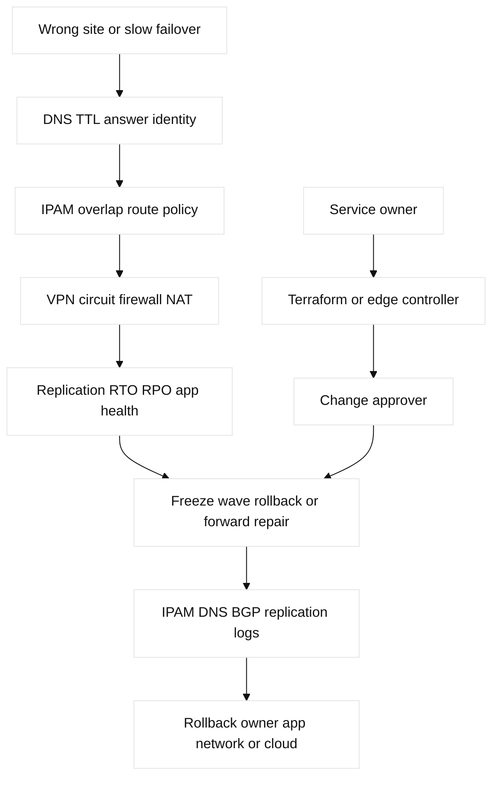

# 13. Private, Public, Hybrid, and On-Premises Design

## A. Learning objectives and prerequisites

Compare private cloud, public cloud, on-premises, and hybrid deployment models;
choose boundaries using address, identity, data gravity, cost, and capacity;
and plan migration, failover, and exit. Prerequisites are routing, cloud
semantics, security, DNS, and HA concepts. Use fictional sites and reserved
`10.70.0.0/16`/`198.51.100.0/24` ranges.

## B. Portable mental model

An application is a chain of identities, names, packets, data stores, and
operational owners. Physical private cloud adds racks, power, optics, switches,
hypervisors, VMs, containers, and failure domains. Public cloud replaces much
of that with provider APIs and quotas. Hybrid adds route exchange, DNS,
identity federation, data replication, and a shared incident boundary. The
network is not the whole architecture: the request path must include policy,
state, dependencies, and return traffic.


## C. Model and design inventory

Private cloud offers control over hardware, placement, optics, hypervisors,
VMs, containers, virtual switches, and data locality, but the owner carries
capacity, refresh, power, patching, and failure repair. Public cloud offers
elastic managed services, global provider fabric, and consumption pricing,
but adds quotas, API dependency, regional semantics, egress cost, and less
physical visibility. Hybrid combines them; it is an operating model, not just
one VPN.

Address planning must include CIDR, summarization, overlap, IPAM ownership,
IPv4 exhaustion, IPv6, NAT, DNS split horizon, and future mergers. Identity
includes users, workloads, service accounts, device posture, certificates,
and authorization domains; network location alone is not identity. Data
gravity is the cost and latency pressure created by data size, replication,
compliance, and stateful dependency. **Engineering inference:** moving compute
without its data and identity dependencies can increase, not reduce, latency.

Failure domains include host, rack, AZ/region, site, carrier, provider, and
control plane. HA may be active-active or active-standby; DR requires explicit
RTO/RPO, SLO, replication, DNS/traffic steering, and failback tests. Capacity
needs headroom, oversubscription, buffer/microburst tolerance, IP space,
circuits, quotas, licenses, and cost/FinOps guardrails. Governance must define
ownership, audit, secrets, change, break-glass, portability, and exit.

## D. Safe configuration shapes and mappings

```text
! Lab-only on-prem edge shape; Cisco syntax varies
router bgp 65070
 neighbor 192.0.2.2 remote-as 65170
 address-family ipv4
  network 10.70.0.0 mask 255.255.0.0
  neighbor 192.0.2.2 prefix-list HYBRID-IN in
! Linux evidence: ip route, ip rule, ip neigh, ss -tn, tcpdump
```

AWS TGW/VPN/DX and GCP Cloud Router/HA VPN/Interconnect are mappings of
connectivity and route exchange, not identical private-cloud routers. Use
Terraform for declared cloud attachments and routes, Ansible for repeatable
guest/appliance configuration, and a separately owned controller for fabric
state. All mutations require a plan, saved config, prechecks, bounded prefixes,
and a rollback or forward-repair decision. A migration wave should have a
dual-run or tested failback path.

## E. Verification and expected evidence

Verify address/IPAM and DNS ownership before route testing. At on-prem collect
interfaces, optics, VLAN/VRF, BGP/OSPF, route policy, tunnel/IKE, firewall,
NAT, and captures. At cloud collect route tables, attachment propagation,
firewall/security rules, flow logs, health checks, DNS, quotas, and provider
events. At application/data layers collect connection pools, replication lag,
latency, error rate, and identity token/certificate evidence. Compare both
directions and failure domains; a green tunnel is not a green application.

| Concept | Mechanism/limit | Evidence |
|---|---|---|
| Address overlap | Ambiguous prefixes require renumbering, NAT, or isolation; summaries hide collisions. | IPAM export, both RIBs, traceroute. |
| Data gravity | Volume, latency, compliance, and replication cost pull compute toward data. | Replication lag, bytes, RTT, egress estimate. |
| Migration math | At 2 Gbps usable, 12 TB takes about 13.3 hours before overhead; add measured replication lag and a safety margin. | Transfer counters and RPO report. |
| Failover | RTO is restore time; RPO is acceptable data loss; DNS TTL is not application readiness. | Health gate, DNS answer/TTL, write/read test. |
| Ownership | Service owner coordinates network, cloud, identity, data, and provider owners; one writer per route/DNS field. | RACI, change record, audit trail. |

AWS TGW/VPN/DX and GCP Cloud Router/HA VPN/Interconnect are connectivity
semantics, not interchangeable routers. Terraform owns declared cloud
attachments/routes, the on-prem edge owns bounded BGP policy, and DNS/data
owners approve cutover. Read back route, identity, replication, and cost state.

## F. Failure lab: migration split path

Start with a service in private site A, a standby in public cloud B, shared DNS,
and a private route exchange. Inject overlapping CIDR, asymmetric BGP policy,
stale DNS, identity trust failure, replication lag, egress cost guardrail, or
an AZ/site loss. Symptoms are intermittent clients, stale writes, long
latency, or failover to an unhealthy target.

Falsify with IPAM, DNS answer/TTL, both route tables, BGP attributes, tunnel,
firewall, identity logs, replication, and application traces. Freeze the wave,
restore the last known ownership state, and verify reads/writes separately.
Forward repair requires a documented address/identity and data migration plan;
do not advertise a broad summary to hide overlap.



## G. Hands-on exercise, answer, and rubric

Design a two-site private/public hybrid for a stateful API. Deliver a failure-
domain map, address and identity plan, DNS and routing policy, cost/capacity
assumptions, RTO/RPO/SLO, migration waves, failback, and ownership matrix.
Answer: keep state and identity dependencies explicit, advertise only bounded
prefixes, and test a real failover plus failback. Score: 25% requirements,
25% failure design, 20% evidence, 15% cost/capacity, 15% governance. SDE2:
automate preflight and route assertions. Staff: defend the boundary, exit
criteria, blast radius, and organizational ownership model.

### Worked lab record

- Safety boundary and reserved fixture: fictional site A/B, `10.70.0.0/16`,
  `198.51.100.0/24`; no production route, identity, or data.
- Prechecks and baseline: inventory CIDRs/owners, DNS TTL, BGP policy, tunnel,
  firewall, replication lag, RTO/RPO, cost, quota, and capacity headroom.
- Saved config/plan: capture IPAM, DNS, Terraform plan/state metadata, edge
  config, and a migration decision record.
- Injected fault: overlap, asymmetric policy, stale DNS, identity failure,
  replication lag, egress guardrail, or site/AZ loss.
- Symptom: wrong site, stale writes, latency, or unhealthy failover.
- Hypothesis/falsifier: IPAM, DNS, both routes, BGP, transport/policy,
  identity, replication, then application traces; each test must reject one.
- Expected output: bounded prefixes, intended DNS answer, writable primary,
  replication within RPO, and measured RTO gate.
- Repair: freeze the wave and correct the smallest owner-controlled boundary.
- Rollback: restore prior DNS/routes and confirm reads/writes at the old site.
- Cleanup: remove temporary routes/translation, prove old state and archive
  the reverse-cutover evidence.

## H. Interview Q&A

Each answer explicitly includes **Answer**, **Wrong turn**, **Evidence**, and
**Follow-up**; use those labels for every numbered response above.

| Q | Answer | Wrong turn | Evidence | Follow-up |
|---|---|---|---|---|
| 1 | Hybrid includes coordinated identity, data, DNS, routing, and ownership. | Calling one VPN the architecture. | Dependency map and change owner. | Define incident RACI. |
| 2 | VPN is transport only. | Equating tunnel-up with service-up. | App, route, and return tests. | Add failback. |
| 3 | Overlap requires renumbering, NAT, or isolation. | Advertising a broad summary. | IPAM and both RIBs. | Choose a migration wave. |
| 4 | Data gravity is measurable volume/latency/compliance/replication pressure. | Moving compute without state. | Bytes, RTT, lag, egress. | Calculate cutover budget. |
| 5 | Active-active trades utilization for conflict/health complexity. | Assuming redundancy solves consistency. | Write/read and failover test. | Set RPO/RTO. |
| 6 | RPO is loss tolerance; RTO is restore time. | Treating link redundancy as either. | Timed restore and data report. | Run a game day. |
| 7 | Exit needs tested portability and cost boundaries. | Leaving it to procurement. | Export/restore and egress estimate. | Name an exit owner. |
| 8 | Service owner coordinates all domains. | Assigning a tunnel owner alone. | RACI, ticket, evidence bundle. | Set escalation thresholds. |

1. **What makes a design hybrid?** **Answer:** coordinated private/public identity, data, DNS, routing, and ownership. **Wrong turn:** calling one VPN the architecture. **Evidence:** dependency map and RACI. **Follow-up:** define incident scope. Coordinated operation across private and
public environments, including identity, data, DNS, routing, and ownership.
2. **Why is a VPN not a hybrid architecture?** **Answer:** it is one transport dependency, not application/state design. **Wrong turn:** equating tunnel-up with service-up. **Evidence:** app, route, and return tests. **Follow-up:** add failback. It is one transport dependency;
the application still needs policy, state, observability, and failback.
3. **How does address overlap change migration?** **Answer:** it prevents unambiguous routing and requires NAT, renumbering, or isolation. **Wrong turn:** advertising a broad summary. **Evidence:** IPAM and both RIBs. **Follow-up:** choose a wave. It prevents unambiguous
routing and often forces translation, renumbering, or isolation.
4. **What is data gravity?** **Answer:** data volume, latency, compliance, and replication cost pull compute toward state. **Wrong turn:** moving compute without measuring state. **Evidence:** bytes, RTT, lag, and egress. **Follow-up:** calculate cutover budget. Data volume, latency, compliance, and replication
cost pull compute toward the data; quantify it before relocating workloads.
5. **Active-active or standby?** **Answer:** active-active improves utilization but needs conflict and health handling; standby simplifies writes. **Wrong turn:** assuming redundancy solves consistency. **Evidence:** write/read and failover test. **Follow-up:** set RPO/RTO. Active-active can improve utilization but needs
conflict, routing, health, and consistency handling; standby simplifies writes
but increases recovery time and idle cost.
6. **What does RPO measure?** **Answer:** RPO is acceptable loss; RTO is restore time. **Wrong turn:** treating link redundancy as either. **Evidence:** timed restore and data report. **Follow-up:** run a game day. Acceptable data loss in time; RTO measures time
to restore service. Neither is guaranteed by a redundant link alone.
7. **Why include exit planning?** **Answer:** APIs, identity, formats, and egress create lock-in. **Wrong turn:** leaving portability to procurement. **Evidence:** export/restore and egress estimate. **Follow-up:** name an exit owner. Provider APIs, identity, data formats, and
egress costs create lock-in; tested portability is a design constraint.
8. **Who owns a hybrid incident?** **Answer:** the service owner coordinates all domain owners. **Wrong turn:** assigning only the tunnel owner. **Evidence:** RACI, ticket, and evidence bundle. **Follow-up:** set escalation thresholds. The pre-agreed service owner coordinates
network, cloud, identity, data, and provider evidence; a tunnel owner alone
cannot prove application health.

## I. References and evidence labels

## J. Ownership and completion contract

Service owns migration/data consistency; on-prem owns physical links, routing,
and firewall; cloud owns provider objects; Terraform owns declared attachments;
evidence reads IPAM, DNS, RIB/FIB, tunnel, and application state; rollback owner
executes tested failback.

## K. Detailed reproducible failure lab: migration mock

```text
mkdir -p /tmp/ccna13-lab
printf '%s\n' '{"old":"192.0.2.0/24","new":"198.51.100.0/24","dns":"old","rpo_s":30,"rto_s":120}' > /tmp/ccna13-lab/cutover.json
cp /tmp/ccna13-lab/cutover.json /tmp/ccna13-lab/baseline.json
python3 -c 'import json; p="/tmp/ccna13-lab/cutover.json"; x=json.load(open(p)); x["dns"]="new"; json.dump(x,open(p,"w"))'
python3 -c 'print("CUTOVER_READY DNS=new RPO=30 RTO=120")'
cp /tmp/ccna13-lab/baseline.json /tmp/ccna13-lab/cutover.json; cmp /tmp/ccna13-lab/cutover.json /tmp/ccna13-lab/baseline.json
rm -f /tmp/ccna13-lab/cutover.json /tmp/ccna13-lab/baseline.json; rmdir /tmp/ccna13-lab
```

Expected output is `CUTOVER_READY DNS=new RPO=30 RTO=120`; `cmp`/`rmdir` prove
failback and cleanup. Ordered requests are IPAM, route/tunnel plan, health/read
test, DNS change, propagation/read-back, and failback.

## L. Worked answer, rubric, and SDE2/Staff follow-ups

**Criterion-by-criterion completed submission:** mechanism, evidence, injected
failure, repair, rollback, and Staff follow-up are each stated and verified:
deployment boundary, addressing, routing, identity, and data gravity shape the
design; propagation/failover/read-write evidence proves it; tested failback is
the rollback; Staff owns capacity and exit evidence.

Address/identity/data gravity 25/25, RTO/RPO/DNS/route evidence 25/25, bounded
fixture 20/20, failback/cleanup 20/20, ownership/exit 10/10: **100/100**.
SDE2 adds TTL and write/read tests; Staff adds capacity, cost, and exit evidence.

| Rubric criterion | Learner artifact | Expected evidence | Pass/fail threshold | SDE2 follow-up answer | Staff follow-up answer |
| --- | --- | --- | --- | --- | --- |
| Address/identity/data gravity (25%) | Private/public/hybrid dependency map | IPAM, identity, data volume, latency, compliance | Pass if transport is not mistaken for architecture | I would test overlap and service identity separately from routing. | I would choose placement using measured latency, cost, compliance, and failure scope. |
| RTO/RPO/DNS/route evidence (25%) | Cutover and failback runbook | TTL, RIB/FIB, DNS, tunnel/BGP, read/write state | Pass if forward and reverse paths are both demonstrated | I would automate TTL, route, and application read/write assertions. | I would set RPO/RTO gates and require a tested failback owner. |
| Bounded migration fault (20%) | One wrong DNS/route wave in local fixture | Negative read, impact scope, wave boundary | Pass if no real site or cloud is touched | I would canary one cohort and stop on a threshold breach. | I would approve wave size, customer communication, and exit criteria. |
| Failback/cleanup (20%) | Restored old target and residue checklist | Baseline comparison, dependency cleanup, measured recovery | Pass if failback is timed and reversible | I would capture the failed artifact and prove the old path works. | I would own data consistency, capacity during failback, and egress cost. |
| Ownership/exit (10%) | RACI and portability record | Service, network, cloud, data, identity, and exit owners | Pass if incident coordination is explicit | I would keep provider adapters and export formats testable. | I would fund and rehearse exit, restore, and vendor-independent recovery. |

**Completed score:** 25/25 + 25/25 + 20/20 + 20/20 + 10/10 = **100/100**.

## M. Reproducible lab record

**Disposable fixture/topology and safety:** a local cutover file models an on-prem edge, private
service, public-cloud service, DNS target, and bounded read/write check. It
does not change DNS, BGP, a tunnel, a site, or a provider.

1. **Disposable fixture/topology and exact setup inputs:** `client -> DNS ->
   on-prem/private or cloud/public service`, with an explicit failback target:

   ```bash
   LAB_DIR=$(mktemp -d /tmp/ccna13.XXXXXX)
   printf '%s\n' 'service=orders dns_target=private route=onprem primary=writable rpo_s=30 rto_s=120 ttl_s=60' > "$LAB_DIR/cutover.txt"
   cp "$LAB_DIR/cutover.txt" "$LAB_DIR/baseline.txt"
   ```

2. **Baseline command and expected baseline:** `awk '{print "BASELINE " $0}'
   "$LAB_DIR/cutover.txt"`. **Illustrative expected output:**
   `dns_target=private route=onprem primary=writable rpo_s=30 rto_s=120 ttl_s=60`.

3. **Injected fault:** point DNS to a cloud target without updating the route:
   `sed -i 's/dns_target=private/dns_target=cloud/' "$LAB_DIR/cutover.txt"`.

4. **Measurable assertion and sample expected output:** `awk '{if ($0 ~
   /dns_target=cloud/ && $0 ~ /route=onprem/) print "ASSERT CUTOVER_SPLIT DNS=cloud ROUTE=onprem"}' "$LAB_DIR/cutover.txt"`.
   **Illustrative expected output:** `ASSERT CUTOVER_SPLIT DNS=cloud ROUTE=onprem`.
   This does not claim a DNS or application request actually ran.

5. **Repair command/decision:** after validating route and service owner,
   `sed -i 's/dns_target=cloud/dns_target=private/' "$LAB_DIR/cutover.txt";
   cmp "$LAB_DIR/cutover.txt" "$LAB_DIR/baseline.txt"`.

6. **Rollback command/decision:** `cp "$LAB_DIR/baseline.txt"
   "$LAB_DIR/cutover.txt"`; roll back when the DNS TTL, route, or writable
   primary is not the approved wave. Forward repair requires an observed health
   and read/write check in a real non-production environment.

7. **Cleanup verification:** `rm -f "$LAB_DIR/cutover.txt"
   "$LAB_DIR/baseline.txt"; rmdir "$LAB_DIR"; test ! -e "$LAB_DIR"`.
   **Illustrative result:** exit status `0`; no public/private/hybrid execution.

| Design dimension | Private/on-prem | Public cloud | Hybrid networking question |
| --- | --- | --- | --- |
| Addressing | VLAN/VRF/IPAM pools | VPC/VPC-network CIDRs | Do prefixes overlap or require translation? |
| Routing | BGP/OSPF/static/EVPN | provider routes and gateways | Who advertises and accepts each prefix? |
| Capacity | links, ports, buffers, hardware | quotas, bandwidth, NAT ports | Where is the bottleneck during failover? |
| Operations | device/controller telemetry | flow, audit, and service logs | Which team owns the first broken hop? |

**Fact:** [RFC 1918](https://www.rfc-editor.org/rfc/rfc1918) defines IPv4 private
address space and [RFC 4271](https://www.rfc-editor.org/rfc/rfc4271) defines
BGP. **Vendor terminology:** AWS [hybrid connectivity](https://docs.aws.amazon.com/whitepapers/latest/aws-vpc-connectivity-options/)
and GCP [hybrid connectivity](https://cloud.google.com/network-connectivity/docs/concepts/overview).
**Observed lab result:** a local namespace can demonstrate asymmetric routes,
but not provider circuit behavior. **Engineering inference:** every migration
plan needs a tested reverse path and failback, not only a forward cutover.

## N. Artifact-backed submission

Observed bundle: [`13-private-public-hybrid.json`](fixtures/observed/13-private-public-hybrid.json). The v3 evaluator derives selected path, BGP route, listener, and egress policy from effective hybrid control and a separate per-path service fixture. The control fault exposes failover mismatch without a second plane mutation; evaluator-only private-path loss is the negative control. Module-specific scoring: [worked submissions](fixtures/worked-submissions.md#14-b-module-13--13-private-public-hybrid).
