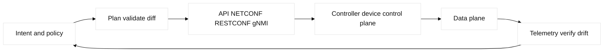
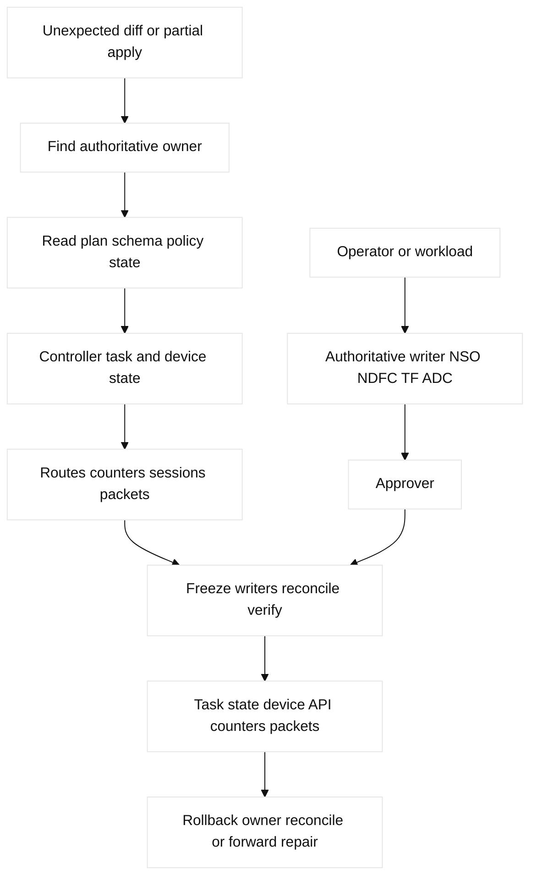

# 14. Automation, SDN, and Infrastructure as Code

## A. Learning objectives and prerequisites

Separate intent, desired state, device state, and forwarding evidence; choose
CLI, API, model-driven telemetry, Ansible, Terraform, NSO, NDFC, F5, or A10
for a bounded task; and design safe, idempotent automation. Prerequisites are
routing, fabrics, cloud, security, and Linux shell skills.

## B. Portable mental model

An operator or system declares intent. A controller or tool validates policy,
renders or translates it, applies changes through an API, and observes
converged state. The device control plane programs the data plane. Automation
success means neither “HTTP 200” nor “command accepted”; it means the intended
state is present, forwarding works, and evidence is recorded.



## C. Concept inventory

SDN centralizes or coordinates control decisions; NFV virtualizes network
functions such as firewall, router, or ADC. Controllers expose APIs and policy,
but physical failure and forwarding remain distributed. CLI/SSH is imperative;
REST/SOAP are API styles; NETCONF edits YANG-modeled XML; RESTCONF exposes
YANG resources over HTTP; gNMI streams or retrieves modeled state. YANG defines
schema, types, constraints, and XPath paths. OpenConfig supplies vendor-neutral
models but does not erase implementation gaps. JSON, XML, YAML, and XPath have
different encoding and validation rules.

Ansible is task/playbook orchestration and should be idempotent. Terraform,
Pulumi, and CloudFormation manage declarative resource graphs, state, import,
drift, provider schema, locks, dependencies, and async operations. Terraform
state is ownership data and contains sensitive material unless protected.

Cisco NSO uses service models, NEDs, FASTMAP, and a CDB; it can coordinate
multi-device transactions but NED behavior is vendor/release-specific. NDFC
owns data-center fabric intent and generated switch configuration. Catalyst
Center and Meraki provide controller APIs. F5 AS3/iControl and A10 REST expose
ADC objects. NX-API is Cisco device API. Do not let two systems own the same
field. Pagination, retries, rate limits, eventual consistency, secrets,
RBAC, testing, and rollback are part of the network design.

## D. Safe configuration shapes

```text
NETCONF read-only shape: <get><filter type="subtree">...YANG path...</filter></get>
RESTCONF read-only: GET /restconf/data/openconfig-interfaces:interfaces
gNMI read-only: get /interfaces/interface[name=Ethernet1/1]/state/counters
Ansible: gather facts -> assert -> diff -> gated change -> verify
Terraform: init -upgrade is controlled; plan -out=lab.tfplan; apply lab.tfplan
```

Use fictional hosts and `example.invalid`; these are non-runnable shapes until
credentials, models, provider versions, and permissions are supplied. A safe
mutation has precheck, saved config/plan, approval, canary, timeout, retry
budget, verification, and cleanup. Python libraries should parse structured
responses rather than scrape human CLI output. NSO/NDFC/F5/A10 ownership must
be explicit in the service catalog.

## E. Verification and expected evidence

Verify tool diff and policy before execution; then query controller task state,
device running/configured state, NETCONF/RESTCONF/gNMI operational state, route,
neighbor, interface, counter, and application evidence. Check idempotency by
running the read-only/dry-run path again. For Terraform inspect plan, state,
provider operation, and cloud flow logs; for Ansible inspect changed count and
facts. A successful transaction with a wrong VNI, route, ACL, VIP monitor, or
secret is a failed change.

| Concept | Mechanism/ownership limit | Read-back evidence |
|---|---|---|
| YANG/NETCONF/RESTCONF/gNMI | Schema/model paths enable structured config or state; vendor deviations require capability checks. | `<get>`, RESTCONF `GET`, gNMI `Get`, model/capability response. |
| NSO/NDFC | NSO service/NED/FASTMAP/CDB coordinates devices; NDFC owns fabric intent; neither proves FIB state. | Transaction/task, CDB/NDFC intent, NX-OS running and operational state. |
| AS3/A10/NX-API | ADC/device APIs create objects but listener, pool, monitor, TLS, and persistence must be read back. | AS3 declaration/iControl or A10 REST response plus VIP/member counters. |
| Terraform state | State records ownership and may contain secrets; import establishes an existing object boundary; drift requires review. | Locked state, `plan`, import ID, provider read, cloud logs. |
| Retry/pagination | Eventual consistency and rate limits can produce partial views; retries need bounds and idempotency keys. | Request IDs, page cursors, retry counts, final complete object set. |

Ownership contract: one authoritative writer per field—NSO for its service,
NDFC for fabric intent, AS3/A10 for their ADC objects, and Terraform for
declared cloud resources. An approver gates mutation; the rollback owner is
named in the change record. Linux/FRR or a local mock supplies safe read-back
without claiming provider or appliance behavior.

## F. Failure lab: drift and partial convergence

Start with a service model for a fictional leaf pair, cloud route, and ADC VIP.
Inject out-of-band CLI drift, a stale Terraform state object, a NED/model
mismatch, API rate limiting, a paginated response bug, or a controller task
that applies only one leaf. Symptom: perpetual diff, asymmetric forwarding,
or an apparently healthy API response with no traffic.

Falsify by comparing intent, plan, controller task, device operational state,
and packet/counter evidence. Stop the pipeline, preserve logs and state, and
prevent a second writer. Repair by import/reconcile or a bounded forward change;
rollback only after checking dependency order. Never delete a resource to make
a diff disappear without a backup and owner approval.



## G. Hands-on exercise, answer, and rubric

Create a local mock API and a declarative service for a VLAN/VNI, route, and
VIP. Deliver YANG/JSON intent, plan, idempotency test, secret handling,
failure injection, evidence transcript, and ownership matrix. Answer: one
authoritative writer, structured reads, bounded plan, canary, and data-plane
verification. Score: 25% model/API choice, 25% safety, 20% evidence, 15%
idempotency/drift, 15% ownership. SDE2: add retry/pagination tests. Staff:
define platform contracts, multi-vendor lifecycle, policy review, and
break-glass governance.

### Worked lab record

- Safety boundary and reserved fixture: local mock, namespaces, and
  `example.invalid`; no appliance, provider, secret, or production target.
- Prechecks and baseline: query capabilities/schema, ownership catalog, locked
  Terraform state, plan, controller/device state, API rate limits, and packets.
- Saved config/plan: keep JSON/YANG intent, `lab.tfplan`, state snapshot,
  controller task IDs, and ADC declaration.
- Injected fault: out-of-band drift, stale state, model mismatch, rate limit,
  pagination bug, or one-sided apply.
- Symptom: perpetual diff, partial leaf change, or HTTP success with no flow.
- Hypothesis/falsifier: compare intent, plan/state, task, device operational
  state, and counters/packets in that order; complete page and request IDs are
  the falsifier for an incomplete-read hypothesis.
- Expected output: one owner, deterministic diff, complete object set,
  idempotent second plan, and successful data-plane assertion.
- Repair: stop competing writers; import/reconcile or apply one bounded change.
- Rollback: restore the saved plan/state or forward-repair dependency order;
  require approver and preserve audit evidence.
- Cleanup: remove mock objects, unlock state, clear lab drift, rerun read-back,
  and prove no residual task or VIP/route remains.

## H. Interview Q&A

Each answer explicitly includes **Answer**, **Wrong turn**, **Evidence**, and
**Follow-up**; use those labels for every numbered response above.

| Q | Answer | Wrong turn | Evidence | Follow-up |
|---|---|---|---|---|
| 1 | Intent is desired outcome; state is configured/operational reality. | Treating a diff as forwarding proof. | Device state and packet test. | Define convergence. |
| 2 | NETCONF is RPC/XML; RESTCONF is HTTP/YANG resources. | Choosing by protocol fashion. | Capability/model read-back. | Compare transaction needs. |
| 3 | OpenConfig normalizes common models but gaps remain. | Assuming vendor behavior vanishes. | Model support and output. | Test unsupported leaves. |
| 4 | Idempotency converges without cumulative side effects. | Appending duplicate config. | Second plan/diff. | Add rollback test. |
| 5 | State is ownership and may contain secrets. | Sharing an unlocked state file. | Lock, backup, access audit. | Practice import/drift. |
| 6 | NSO coordinates modeled services; NDFC specializes in fabric intent. | Giving both the same field. | CDB/NDFC and device read-back. | Write an ownership contract. |
| 7 | Freeze writers, preserve evidence, reconcile dependencies. | Deleting to hide drift. | Task/state/device/FIB evidence. | Choose forward repair. |
| 8 | Structured models are schema-checked, unlike unstable text. | Scraping CLI as truth. | JSON/XML/gNMI fields and counters. | Test pagination/retry. |

1. **What is the difference between intent and state?** **Answer:** intent is desired outcome; state is configured/operational reality. **Wrong turn:** treating a diff as forwarding proof. **Evidence:** device state and packet test. **Follow-up:** define convergence. Intent expresses the
desired outcome; state is configured and operational reality. The diff is not
proof of forwarding.
2. **NETCONF or RESTCONF?** **Answer:** both use YANG; NETCONF uses RPC/XML and RESTCONF HTTP resources. **Wrong turn:** choosing by fashion. **Evidence:** capability/model read-back. **Follow-up:** compare transaction needs. Both use YANG models; NETCONF uses structured RPC
and XML, RESTCONF uses HTTP resources. Select by platform and transaction needs.
3. **Why use OpenConfig?** **Answer:** it normalizes common models with gaps. **Wrong turn:** assuming vendor behavior disappears. **Evidence:** supported model and output. **Follow-up:** test unsupported leaves. It can normalize common telemetry/configuration,
but unsupported leaves and vendor deviations still require validation.
4. **What makes an operation idempotent?** **Answer:** repetition converges without cumulative side effects. **Wrong turn:** appending duplicate config. **Evidence:** second plan/diff. **Follow-up:** add rollback test. Repeating it converges to the same
state without duplicate or cumulative side effects; verify with a second plan.
5. **Why is Terraform state sensitive?** **Answer:** it records ownership and may contain secrets. **Wrong turn:** sharing unlocked state. **Evidence:** lock, backup, access audit. **Follow-up:** practice import/drift. It records ownership and may include
secrets or identifiers; protect, lock, back up, and limit access.
6. **NSO versus NDFC?** **Answer:** NSO coordinates modeled multi-device services; NDFC specializes in fabric intent. **Wrong turn:** assigning both one field. **Evidence:** CDB/NDFC task and device read-back. **Follow-up:** write an ownership contract. NSO coordinates modeled services across devices;
NDFC specializes in data-center fabric intent. Product scope and ownership
must be confirmed for the release.
7. **How handle partial apply?** **Answer:** freeze writers, preserve task/state, reconcile dependencies. **Wrong turn:** deleting to hide drift. **Evidence:** task, state, device, FIB. **Follow-up:** choose forward repair. Stop competing writers, preserve task/state
evidence, identify completed dependencies, then reconcile or forward-repair.
8. **Why not scrape CLI?** **Answer:** structured models are schema-checkable; CLI text is unstable. **Wrong turn:** treating text as universal truth. **Evidence:** JSON/XML/gNMI fields and counters. **Follow-up:** test pagination/retry. Text is unstable and ambiguous; structured models
provide schema and machine-checkable fields, though not universal semantics.

## I. References and evidence labels

## J. Ownership and transaction contract

Terraform owns cloud state; NSO owns modeled service/CDB transactions; NDFC
owns fabric intent/tasks; F5 AS3/iControl and A10 REST own ADC declarations.
The evidence owner reads task status and effective state, and rollback uses a
transaction revert or approved forward repair. One writer owns each field.
Paginated reads retain page token, count, retry/backoff, and request ID.

## K. Detailed reproducible failure lab

```text
mkdir -p /tmp/ccna14-lab
printf '%s\n' '{"page":1,"next":"p2","task":"nso-1","committed":true}' > /tmp/ccna14-lab/api.json
cp /tmp/ccna14-lab/api.json /tmp/ccna14-lab/baseline.json
python3 -c 'import json; p="/tmp/ccna14-lab/api.json"; x=json.load(open(p)); x["next"]="p3"; x["committed"]=False; json.dump(x,open(p,"w"))'
python3 -c 'print("TASK nso-1 COMMIT_FAIL NEXT=p3 RETRY=bounded")'
cp /tmp/ccna14-lab/baseline.json /tmp/ccna14-lab/api.json; cmp /tmp/ccna14-lab/api.json /tmp/ccna14-lab/baseline.json
rm -f /tmp/ccna14-lab/api.json /tmp/ccna14-lab/baseline.json; rmdir /tmp/ccna14-lab
```

Expected output is `TASK nso-1 COMMIT_FAIL NEXT=p3 RETRY=bounded`; `cmp`/`rmdir`
prove rollback and cleanup. Real ordered shapes are NSO validate/commit/read
CDB, NDFC intent/task/read device state, F5 declaration/task/read-back, and A10
REST `POST`/operation ID/`GET` pages/read-back. HTTP 200 or page one is not
convergence.

## L. Worked answer, rubric, and SDE2/Staff follow-ups

**Criterion-by-criterion completed submission:** mechanism, evidence, injected
failure, repair, rollback, and Staff follow-up are each stated and verified:
intent, state, API, and forwarding are distinct; plan/request/controller/device
reads prove convergence; the owning layer reconciles; the prior plan rolls back;
Staff governs import, retries, and break-glass use.

Model choice 25/25, transaction/pagination/retry/read-back 25/25, idempotent
fault 20/20, restore/cleanup 20/20, exclusive ownership 10/10: **100/100**.
SDE2 adds schema/property tests; Staff adds partial-apply and break-glass policy.

| Rubric criterion | Learner artifact | Expected evidence | Pass/fail threshold | SDE2 follow-up answer | Staff follow-up answer |
| --- | --- | --- | --- | --- | --- |
| Model choice (25%) | Intent/state/API/device ownership map | YANG/schema, plan/state, controller task | Pass if one authoritative writer is named | I would validate schema support and reject ambiguous ownership in CI. | I would set escalation, break-glass, and lifecycle policy for each owner. |
| Transaction quality (25%) | Pagination/retry/read-back matrix | Request ID, page completion, retry class, effective state | Pass if no partial success is accepted without reconciliation | I would use bounded retries, page-token completeness, and post-write assertions. | I would define provider/controller SLAs and partial-apply recovery boundaries. |
| Idempotent fault (20%) | One stale field/drift fixture | First diff, second stable plan, device/cloud read-back | Pass if repeat execution has no cumulative side effect | I would run plan twice and compare normalized state. | I would control import, drift ownership, and emergency writers. |
| Restore/cleanup (20%) | Prior plan/state and controller task transcript | Restored object, task completion, no test resource | Pass if rollback and cleanup are independently proven | I would preserve failed state and verify cleanup through the same API. | I would decide rollback versus forward repair based on dependency order and risk. |
| Exclusive ownership (10%) | Terraform/NSO/NDFC/device/ADC RACI | State address, CDB/task, intent/device, AS3/A10 read-back | Pass if no two writers own one field | I would alert on out-of-band drift and document import. | I would approve a cross-platform ownership contract and audit evidence. |

**Completed score:** 25/25 + 25/25 + 20/20 + 20/20 + 10/10 = **100/100**.

## M. Reproducible lab record

**Disposable fixture/topology and safety:** a local API response file models Terraform, NSO CDB,
NDFC intent, F5 AS3, and A10 REST request/read-back. It does not contact any
controller, device, cloud account, or ADC.

1. **Disposable fixture/topology and exact setup inputs:** `desired intent ->
   API/controller -> device/cloud state -> forwarding read-back`:

   ```bash
   LAB_DIR=$(mktemp -d /tmp/ccna14.XXXXXX)
   printf '%s\n' 'owner=terraform object=route[198.51.100.0/24] plan=1 state=1 import=complete drift=none pages=1 retries=0 controller_task=none device=present f5_as3=present a10_rest=present' > "$LAB_DIR/automation.txt"
   cp "$LAB_DIR/automation.txt" "$LAB_DIR/baseline.txt"
   ```

2. **Baseline command and expected baseline:** `awk '{print "BASELINE " $0}'
   "$LAB_DIR/automation.txt"`. **Illustrative expected output:** `plan=1
   state=1 import=complete drift=none pages=1 retries=0` and all controller/ADC
   read-backs are present.

3. **Injected fault:** model an accepted request whose device read-back is stale:
   `sed -i 's/device=present/device=stale/' "$LAB_DIR/automation.txt"`.

4. **Measurable assertion and sample expected output:** `awk '{if ($0 ~
   /device=stale/) print "ASSERT TASK nso-1 COMMIT_FAIL NEXT=p3 RETRY=bounded DEVICE_READ_BACK=STALE"}' "$LAB_DIR/automation.txt"`.
   **Illustrative expected output:** `ASSERT TASK nso-1 COMMIT_FAIL NEXT=p3 RETRY=bounded DEVICE_READ_BACK=STALE`.

5. **Repair command/decision:** after checking the owning layer and task ID,
   `sed -i 's/device=stale/device=present/' "$LAB_DIR/automation.txt"; cmp
   "$LAB_DIR/automation.txt" "$LAB_DIR/baseline.txt"`.

6. **Rollback command/decision:** `cp "$LAB_DIR/baseline.txt"
   "$LAB_DIR/automation.txt"`; roll back if state, task, or device ownership
   is uncertain. Never delete a resource merely to hide drift.

7. **Cleanup verification:** `rm -f "$LAB_DIR/automation.txt"
   "$LAB_DIR/baseline.txt"; rmdir "$LAB_DIR"; test ! -e "$LAB_DIR"`.
   **Observed result:** only local file operations can be observed;
   **illustrative result:** exit status `0`, with no controller/ADC execution.

| Automation layer | State or API | Networking read-back |
| --- | --- | --- |
| Terraform | plan, state, import, drift | cloud route, firewall, LB, quota |
| NSO/NDFC | service intent, task, CDB/controller state | device diff, EVPN/VRF, convergence |
| Device API | NETCONF, RESTCONF, gNMI, NX-API, A10/F5 API | effective configuration and counters |
| Host | namespace, socket, route, capture | listener, route, packet, application result |

**Vendor terminology:** NSO, NED, FASTMAP, CDB, NDFC, AS3, iControl REST,
NX-API, and OpenConfig have platform-specific meanings and version boundaries.
**Engineering inference:** one authoritative writer per object layer, explicit
state/import/drift handling, and read-after-write verification are design
recommendations that must be tested in the target estate.

**Fact:** [RFC 6241](https://www.rfc-editor.org/rfc/rfc6241) specifies NETCONF,
[RFC 8040](https://www.rfc-editor.org/rfc/rfc8040) specifies RESTCONF, and
[OpenConfig](https://www.openconfig.net/) publishes models. **Vendor
terminology:** [Cisco NSO](https://nso-docs.cisco.com/), [NDFC](https://www.cisco.com/c/en/us/products/cloud-systems-management/data-center-network-manager/index.html),
[F5 AS3](https://clouddocs.f5.com/products/extensions/f5-appsvcs-extension/latest/),
and [A10 APIs](https://documentation.a10networks.com/). **Observed lab result:**
a mock API can return success while a data-plane assertion fails. **Engineering
inference:** ownership and post-change forwarding checks are first-class API
requirements.
