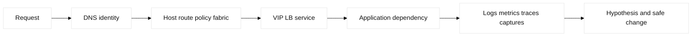
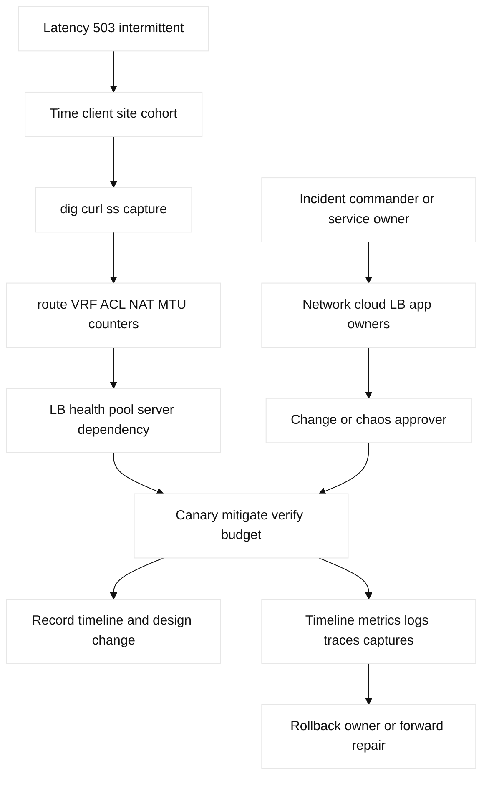

# 15. Observability, Troubleshooting, and Design Synthesis

## A. Learning objectives and prerequisites

Lead an evidence-first diagnosis, choose captures and counters, define SLOs,
capacity, HA/DR, and design a safe network change. Prerequisites are modules
01–14. Use only fictional services and reserved addresses.

## B. Portable mental model

Trace a request from name and identity through endpoint, access, route, policy,
translation, tunnel/fabric, load balancer, server, and return path. At every
hop distinguish configured, control-plane, forwarding, and application state.
Observability combines metrics, logs, traces, captures, and counters. RED
(rate, errors, duration) describes services; USE (utilization, saturation,
errors) describes resources. A hypothesis needs a falsifier and a smallest
safe test.



## C. Operations and design inventory

Baseline interface errors/flaps, MAC/ARP/ND, route/RIB/FIB/CEF, OSPF/BGP/BFD,
STP/LACP, VRF, NAT/conntrack/session, ACL/firewall, TCAM, buffers, queue
drops, RF SNR, LB members, DNS TTL, and service latency. Tools include `ping`,
`mtr`, `dig`, `curl`, `ss`, `ip`, `tcpdump`, Wireshark, `ethtool`, and `iperf`.
Use SPAN/RSPAN/ERSPAN carefully; a capture point can miss offload,
encapsulation, asymmetric, or encrypted traffic. Counters are evidence of
where a device counted a condition, not always its cause.

SLOs turn availability, latency, loss, jitter, and DNS/TLS objectives into
error budgets. Capacity includes link utilization, ECMP flow distribution,
oversubscription, buffer/microburst behavior, TCAM, conntrack, NAT ports,
IP space, RF airtime, cloud quotas, licenses, and headroom. HA/DR requires
failure domains, active-active or standby behavior, RTO/RPO, health detection,
fencing, dependency order, and tested failback. Design reviews should state
requirements, assumptions, packet path, ownership, cost, blast radius, exit,
and evidence of success.

An incident loop is detect, declare, scope, preserve evidence, hypothesize,
falsify, mitigate, communicate, verify, and learn. Changes use ticket or
record, peer review, canary, maintenance window, break-glass policy, rollback
or forward repair, and post-change checks. Chaos experiments are bounded,
authorized, and reversible.

## D. Safe configuration and evidence shapes

```text
Cisco read-only: show interfaces counters errors; show ip route; show ip cef;
 show arp; show ip bgp summary; show platform hardware fed active drops
Linux read-only: ip route get 198.51.100.20; ss -s; ethtool -S eth0;
 tcpdump -ni eth0 host 198.51.100.20; iperf3 -c 198.51.100.20
Cloud: flow logs, LB health/access logs, route analysis, firewall logs, quota events
```

Record time synchronization, command scope, query filters, sampling, and
redaction. Do not run packet generators, clears, debug floods, failovers, or
config changes against production from this module. A lab plan should save
state before mutation and include cleanup. Terraform/Ansible/controller
changes require an owner and post-apply data-plane assertion.

## E. Verification and expected evidence

Build a timeline using monotonic and synchronized timestamps. Test from the
client and server sides, compare adjacent capture points, and correlate RED
with USE. Verify DNS answer and TTL, TCP/TLS handshake, route and return path,
firewall decision, LB monitor/member/session state, application dependency,
and resource saturation. For a design, verify SLO math, capacity at failure,
RTO/RPO exercise, quota/cost alarms, ownership, and exit assumptions. A single
successful ping is weak evidence for a stateful service.

| Concept | Mechanism/limit | Evidence artifact |
|---|---|---|
| RED/USE | RED measures service rate/errors/duration; USE measures resource utilization/saturation/errors. Neither alone proves cause. | Dashboard with aligned timestamps and labels. |
| SLO budget | For 99.9% availability over 30 days, budget is 43.2 minutes; burn rate needs the same window and request denominator. | SLO calculation and alert record. |
| Failure capacity | Four 100G paths at 70% target give 280G; after one failure, 210G. Compare failed-path peak, not average. | ECMP, queue, buffer, and utilization snapshot. |
| Incident artifact | Timeline, hypothesis/falsifier, owner, change/canary, rollback, and user impact make diagnosis auditable. | Ticket, evidence bundle, decision log, postmortem. |
| Observability limits | Captures miss offload/encryption/asymmetry; counters are local/cumulative; logs can be delayed or sampled. | Capture point, query filter, sampling and clock metadata. |

## F. Failure lab: intermittent 503 and latency

Start with a client, DNS, VIP, two members, routed fabric, and a hybrid
dependency. Inject a 10% loss link, ECMP imbalance, MTU black hole, exhausted
NAT/conntrack, overloaded queue, stale DNS, unhealthy member, or slow database.
Symptom: elevated latency, retries, 503s, or only some clients failing.

Hypotheses are naming, client path, route/VRF, policy/NAT, LB health/persistence,
server saturation, dependency, or return path. Falsify with `dig`, `mtr`,
`curl -v`, `ss`, captures, counters, route/MAC/neighbor state, flow logs, LB
logs, and server RED/USE. Mitigate the smallest scope (drain one member or
stop a lab generator), preserve evidence, restore or forward-repair, then
verify error budget and both directions.



## G. Hands-on exercise, answer, and rubric

Design and troubleshoot a three-site service with DNS, VIP, fabric, cloud
dependency, and SLO. Deliver a packet-path table, RED/USE dashboard sketch,
capacity/failure calculation, hypothesis tree, evidence transcript, canary,
rollback, and postmortem. Answer: scope by time and cohort, prove each layer,
falsify alternatives, mitigate narrowly, and verify the user-facing SLO. Score:
25% evidence, 20% model, 20% safety, 20% design/capacity, 15% communication.
SDE2: automate a read-only evidence bundle. Staff: set review gates, ownership,
error-budget policy, DR game days, and an architecture decision record.

### Worked lab record

- Safety boundary and reserved fixture: isolated lab service and reserved
  addresses; authorized fault only, no production generators, clears, debugs,
  failovers, or config changes.
- Prechecks and baseline: synchronize clocks, record DNS/TLS, routes/VRFs,
  LB members, RED/USE, counters, flow logs, and SLO/error-budget state.
- Saved config/plan: preserve dashboard queries, captures, change ticket,
  dependency graph, and rollback/forward-repair decision.
- Injected fault: 10% loss, ECMP imbalance, MTU black hole, NAT/conntrack
  exhaustion, queue overload, stale DNS, unhealthy member, or slow database.
- Symptom: latency, retries, 503s, or cohort-specific failure.
- Hypothesis/falsifier: time/cohort, DNS, client path, route/policy/NAT, LB,
  server, dependency, return path; `dig`, `curl`, captures, logs, and counters
  reject alternatives in that order.
- Expected output: one scoped cause, correlated timestamps, user impact, and
  SLO burn-rate decision with no unexplained new errors.
- Repair: drain one lab member or stop the generator; canary the smallest fix.
- Rollback: restore saved state only after checking session/data dependencies;
  otherwise use approved forward repair.
- Cleanup: remove the fault, restore topology, rerun baseline and health,
  close the change, and attach timeline, evidence, and postmortem artifacts.

## H. Interview Q&A

Each answer explicitly includes **Answer**, **Wrong turn**, **Evidence**, and
**Follow-up**; use those labels for every numbered response above.

| Q | Answer | Wrong turn | Evidence | Follow-up |
|---|---|---|---|---|
| 1 | Scope change, cohort, and exact request first. | Running random clears. | Timeline and client/server tests. | Name the smallest safe test. |
| 2 | A falsifier makes a hypothesis testable. | Promoting a plausible story. | Timestamped command/capture. | Record rejected branches. |
| 3 | Capture proves what reached one point, with limits. | Treating it as end-to-end proof. | Capture point and filters. | Compare adjacent points. |
| 4 | RED links service outcome to USE resource pressure. | Using either dashboard alone. | Aligned rate/errors/utilization. | Calculate burn rate. |
| 5 | Counters are local/cumulative/sampled. | Reading a counter as cause. | Adjacent counters and time. | Correlate logs/traces. |
| 6 | Headroom uses normal, burst, failed path, growth, and quotas. | Averaging utilization. | Capacity worksheet and failure snapshot. | Set an N+1 gate. |
| 7 | Dependencies and data may make reversal unsafe. | Rolling back reflexively. | Change record and session/data checks. | Choose forward repair. |
| 8 | Review includes requirements, path, failure, cost, ownership, and exit. | Reviewing only topology. | ADR, SLO, capacity, RACI. | Run a design game day. |

1. **What is the first troubleshooting question?** **Answer:** what changed, who is affected, and what request fails? **Wrong turn:** running random clears. **Evidence:** timeline and client/server tests. **Follow-up:** choose the smallest safe test. What changed, who is
affected, and what exact request fails? Scope prevents random commands.
2. **Why use a falsifier?** **Answer:** it makes a hypothesis testable. **Wrong turn:** promoting a plausible story. **Evidence:** timestamped command/capture. **Follow-up:** record rejected branches. It makes a hypothesis testable and prevents a
plausible story from becoming an unsafe change.
3. **What does a packet capture prove?** **Answer:** what reached that capture point, with limits. **Wrong turn:** treating it as end-to-end proof. **Evidence:** point, filter, and adjacent capture. **Follow-up:** account for encryption/offload. What reached that capture point, with
limitations from encryption, offload, sampling, and asymmetry.
4. **RED versus USE?** **Answer:** RED measures service outcomes; USE measures resource pressure. **Wrong turn:** using one dashboard alone. **Evidence:** aligned rate/errors/utilization. **Follow-up:** calculate burn rate. RED measures service traffic and outcomes; USE measures
resource pressure. Use both to connect symptom and cause.
5. **Why can a counter be misleading?** **Answer:** it is local, cumulative, or sampled. **Wrong turn:** reading it as cause. **Evidence:** adjacent counters and time correlation. **Follow-up:** correlate logs/traces. It is local, cumulative or sampled,
and may count a symptom after the actual fault. Correlate time and adjacent
points.
6. **How calculate headroom?** **Answer:** model normal, burst, failed-path, growth, and quota load. **Wrong turn:** averaging utilization. **Evidence:** capacity worksheet and failure snapshot. **Follow-up:** set an N+1 gate. Model normal and failed-path load, bursts,
oversubscription, convergence, quotas, and growth; average utilization alone
misses saturation.
7. **What makes rollback unsafe?** **Answer:** dependencies, data/schema changes, sessions, or changed failure conditions. **Wrong turn:** rolling back reflexively. **Evidence:** change record and state checks. **Follow-up:** choose forward repair. State dependencies, data/schema changes,
ongoing sessions, and a changed failure condition may make reversal worse.
8. **What belongs in a Staff design review?** **Answer:** requirements, path, failure, capacity, security, ownership, cost, and exit. **Wrong turn:** reviewing topology only. **Evidence:** ADR, SLO, capacity, RACI. **Follow-up:** run a game day. Requirements, packet path,
failure domains, capacity, HA/DR, security, ownership, cost, observability,
migration, exit, and explicit verification.

## I. References and evidence labels

## J. Ownership and completion contract

The incident commander owns scope and communication; network, cloud, ADC, and
application owners own evidence; the approver owns canary scope; rollback or
forward-repair owner owns state safety. Every signal records source, timestamp,
sampling, retention, and falsifier.

## K. Detailed reproducible failure lab: local fixture

```text
mkdir -p /tmp/ccna15-lab
printf '%s\n' '{"dns":"ok","route":"ok","vip":"ok","member":"ok","status":200,"latency_ms":20}' > /tmp/ccna15-lab/state.json
cp /tmp/ccna15-lab/state.json /tmp/ccna15-lab/baseline.json
python3 -c 'import json; p="/tmp/ccna15-lab/state.json"; x=json.load(open(p)); x["member"]="slow"; x["status"]=503; x["latency_ms"]=900; json.dump(x,open(p,"w"))'
python3 -c 'print("503 MEMBER_SLOW latency_ms=900")'
cp /tmp/ccna15-lab/baseline.json /tmp/ccna15-lab/state.json; cmp /tmp/ccna15-lab/state.json /tmp/ccna15-lab/baseline.json
rm -f /tmp/ccna15-lab/state.json /tmp/ccna15-lab/baseline.json; rmdir /tmp/ccna15-lab
```

Expected output is `503 MEMBER_SLOW latency_ms=900`; `cmp`/`rmdir` prove repair
and cleanup. Ordered evidence is `dig`, `curl -v`, route/VRF, ACL/NAT, LB
health/access, server RED/USE, then return-path capture.

## L. Worked answer, rubric, and SDE2/Staff follow-ups

**Criterion-by-criterion completed submission:** mechanism, evidence, injected
failure, repair, rollback, and Staff follow-up are each stated and verified:
packet path, control state, saturation, and service behavior are correlated;
logs/metrics/flows/state falsify layers; a canary repairs the issue; baseline
restore rolls back; Staff sets SLO, N+1, DR, cost, and exit gates.

Packet path/falsifiers 25/25, RED/USE/log/capture/counter evidence 25/25,
bounded fixture 20/20, canary/rollback/cleanup 20/20, ownership/design 10/10:
**100/100**. SDE2 adds an evidence bundle; Staff adds SLO, N+1, DR, cost, and
exit gates.

| Rubric criterion | Learner artifact | Expected evidence | Pass/fail threshold | SDE2 follow-up answer | Staff follow-up answer |
| --- | --- | --- | --- | --- | --- |
| Packet path/falsifiers (25%) | Layered hypothesis tree and packet path | Route, policy, capture, service, and resource evidence | Pass if each hypothesis has a falsifier | I would choose the smallest safe test and preserve timestamps. | I would align evidence ownership and incident command across domains. |
| RED/USE/log/capture evidence (25%) | Correlated evidence bundle | Rates/errors/duration, utilization, logs, flows, state | Pass if signals are time-aligned and scoped | I would normalize labels and build a bundle keyed by request/cohort. | I would set SLOs, retention, cost, and audit requirements. |
| Bounded fault (20%) | One slow-member or route-policy fixture fault | Measured symptom, change diff, user-impact boundary | Pass if no uncontrolled production test occurs | I would canary one cohort and auto-stop on error/latency threshold. | I would approve game-day scope and customer communication. |
| Canary/rollback/cleanup (20%) | Forward repair and rollback decision log | Stable baseline, canary result, restoration, clean fixture | Pass if rollback safety is evaluated, not assumed | I would check dependency and schema compatibility before rollback. | I would choose forward repair when rollback threatens data or sessions. |
| Ownership/design (10%) | ADR, SLO, capacity, RACI, exit gates | Named owner, approver, capacity model, recovery plan | Pass if design includes failure, cost, security, and exit | I would turn the ADR into executable acceptance checks. | I would own N+1, DR, cost, compliance, and vendor-exit decisions. |

**Completed score:** 25/25 + 25/25 + 20/20 + 20/20 + 10/10 = **100/100**.

## M. Reproducible lab record

**Disposable fixture/topology and safety:** a local state file models a client, DNS, route/policy,
load-balancer member, and evidence timeline. It does not generate production
traffic or access a cloud, router, switch, NSO/NDFC, F5, or A10 system.

1. **Disposable fixture/topology and exact setup inputs:** `client -> DNS ->
   route/policy -> VIP -> member`, with a timestamped baseline:

   ```bash
   LAB_DIR=$(mktemp -d /tmp/ccna15.XXXXXX)
   printf '%s\n' 'request=req-1 dns=ok route=ok policy=allow member=healthy latency_ms=40 errors=0 slo=within timeline=baseline' > "$LAB_DIR/incident.txt"
   cp "$LAB_DIR/incident.txt" "$LAB_DIR/baseline.txt"
   ```

2. **Baseline command and expected baseline:** `awk '{print "BASELINE " $0}'
   "$LAB_DIR/incident.txt"`. **Illustrative expected output:** `member=healthy
   latency_ms=40 errors=0 slo=within timeline=baseline`.

3. **Injected fault:** make one pool member slow: `sed -i 's/member=healthy
   latency_ms=40/member=slow latency_ms=900/' "$LAB_DIR/incident.txt"`.

4. **Measurable assertion and sample expected output:** `awk '{if ($0 ~
   /member=slow/ && $0 ~ /latency_ms=900/) print "ASSERT 503 MEMBER_SLOW latency_ms=900"}' "$LAB_DIR/incident.txt"`.
   **Illustrative expected output:** `ASSERT 503 MEMBER_SLOW latency_ms=900`.
   Logs, traces, and captures are required in a real lab; this file is not an
   observed service result.

5. **Repair command/decision:** after confirming the member identity and canary,
   `sed -i 's/member=slow latency_ms=900/member=healthy latency_ms=40/'
   "$LAB_DIR/incident.txt"; cmp "$LAB_DIR/incident.txt" "$LAB_DIR/baseline.txt"`.

6. **Rollback command/decision:** `cp "$LAB_DIR/baseline.txt"
   "$LAB_DIR/incident.txt"`; roll back only when dependencies, sessions, and
   state are safe. Otherwise drain the member and forward-repair with approval.

7. **Cleanup verification:** `rm -f "$LAB_DIR/incident.txt"
   "$LAB_DIR/baseline.txt"; rmdir "$LAB_DIR"; test ! -e "$LAB_DIR"`.
   **Observed result:** record only a learner-run local status;
   **illustrative result:** exit status `0`.

| Signal | Networking question | Example evidence |
| --- | --- | --- |
| Logs | Which component rejected or timed out? | DNS, firewall, ADC, node, cloud audit |
| Metrics | Is capacity or convergence degrading? | loss, latency, SNAT, buffer, route churn |
| Flow/packet | Did the expected five-tuple traverse? | VPC Flow Logs, SPAN, tcpdump |
| State | Did intent become forwarding behavior? | Terraform/NSO/NDFC state, RIB/FIB |

**Fact:** [RFC 2544](https://www.rfc-editor.org/rfc/rfc2544) describes
benchmarking methodology and [Google SRE](https://sre.google/sre-book/service-level-objectives/)
explains SLO practice. **Vendor terminology:** Cisco platform drop commands,
cloud flow logs, and ADC health/access logs have release-specific fields.
**Observed lab result:** `tcpdump` and `ss` show only the selected namespace
and socket state. **Engineering inference:** diagnosis is strongest when
independent evidence converges across request, control, forwarding, and
resource layers.
