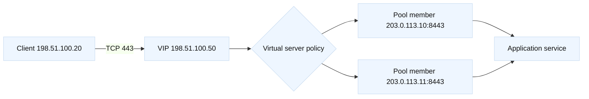

# VIPs and virtual servers

## Learning objectives

By the end of this topic, a learner can describe a virtual IP (VIP) as the
client-facing address of a service, distinguish it from a pool member and a
node, and trace a connection through a virtual server. The learner can explain
how destination address translation, source address translation (SNAT),
profiles, and default pools change the packet journey. They can also choose
read-only evidence for a symptom without assuming that “the VIP is down” is a
complete diagnosis. Examples use F5 BIG-IP terminology, but the reasoning
applies to other reverse proxies and load balancers.

## Mental model

Fact: a virtual server is a listener with an address, service port, and policy
that accepts traffic and selects a destination. The VIP is the address clients
use; it is not necessarily an address configured on an application host.
Fact: a pool is a collection of members, and a member is an address and port
that can receive traffic. A node is the reusable host object behind one or
more members. Profiles describe protocol behavior such as TCP, HTTP, or TLS.
These object boundaries are vendor terms; the exact defaults and command syntax
are version-dependent and must be checked against the installed release.

Inference: drawing the path as client -> VIP -> pool member -> application
prevents a common troubleshooting error: testing the member and concluding the
VIP must work. A listener may have the wrong profile, no eligible members, a
policy rejection, or a route/SNAT problem even when the member answers a
direct probe.



## Worked example

| Object | Answers | Verify |
| --- | --- | --- |
| Virtual server | Where and how traffic is accepted | Address, port, profiles |
| Pool | Which destinations are eligible | Members and states |
| Member | Exact target address and port | Route and service |
| SNAT | How replies return | Source visibility and capacity |

Suppose the fictional service `orders.lab.example` resolves to
`198.51.100.50`. The design has a client-side HTTPS virtual server on port 443
and two pool members on port 8443. The application team reports intermittent
timeouts. First record the intended contract: DNS name, VIP address, listener
port, member ports, health monitor, TLS ownership, and whether the application
expects the original client address. This is a fact collection step, not a
configuration change.

A safe review sketch can be represented as JSON, which is useful for a ticket:

```json
{
  "name": "vs_orders_lab_443",
  "destination": "198.51.100.50:443",
  "pool": "pool_orders_lab_8443",
  "members": ["203.0.113.10:8443", "203.0.113.11:8443"],
  "client_address_preservation": "verify-before-change"
}
```

For an authorized read-only inspection, a BIG-IP operator might use the local
configuration utility or REST GET endpoints documented for their release. A
generic diagnostic record is safer than copying credentials or production
addresses:

```text
GET /mgmt/tm/ltm/virtual/~Common~vs_orders_lab_443
GET /mgmt/tm/ltm/pool/~Common~pool_orders_lab_8443/members
```

Correlate three observations: the virtual server status, the pool/member
availability reason, and a client-side connection trace. If both members are
available but only one path times out, compare member response latency and the
return route. If both are unavailable, inspect monitor send/receive strings,
the member port, and whether the monitor is testing HTTP while the port speaks
TLS. If the VIP accepts a SYN but no HTTP response follows, separate TCP
establishment from HTTP processing and TLS negotiation.

SNAT deserves explicit reasoning. Fact: without a suitable return route, a
server can send replies somewhere other than the load balancer. Inference: a
SNAT pool or automap may make the path symmetric, but it can remove the
application’s view of the client address and can exhaust translation ports.
Document the trade-off and test capacity before changing it. Likewise, a
default pool is convenient but can conceal an unintended fallback when a policy
selects a different pool.

## When this breaks

A VIP can fail before a pool decision: wrong VLAN, route domain, disabled
listener, address collision, or a port mismatch. It can fail during selection
when every member is marked down, a monitor is too strict, or a traffic policy
returns an empty pool. It can fail after selection when SNAT is absent, the
server firewall rejects the translated source, or the response route is
asymmetric. TLS, HTTP, and application failures can look like load-balancer
failures when only the front-door symptom is measured.

Do not “fix” a down monitor by making it accept any response. A monitor that
passes a login page while the dependency is broken creates a false healthy
signal. Do not add a member repeatedly while a duplicate address or stale DNS
record is still unresolved. Fact: client DNS caching may keep an old VIP after
a change. Inference: a short-lived test using a hosts-file entry can isolate
DNS from listener behavior, but it must be removed after the test.

## Operational checklist

1. Confirm the name, VIP, port, partition/tenant, and intended owner.
2. Check listener enablement, address status, VLAN/route-domain context, and
   attached profiles.
3. Inspect pool and member states, monitor reason, member port, and recent
   transitions.
4. Test from an approved local or lab client with timestamps and a request ID.
5. Compare client-side, VIP-side, and member-side evidence; record SNAT and
   return-path assumptions.
6. Review recent changes and configuration snapshots before proposing a diff.
7. State rollback, validation, and owner approval for every change.

## Questions and answers

1. **Is a VIP the same as a virtual server?** Usually a VIP means the listener
   address, while a virtual server includes address, port, profiles, and
   policies. The terms are often used loosely, so inspect the object model.

Interview reasoning: For “Is a VIP the same as a virtual server,” distinguish the address from the LTM listener contract: the virtual server owns profiles, policies, pool selection, SNAT, and persistence. Trace a client tuple to the VIP and a second tuple to the member, then compare direct-member and VIP tests. The caveat is that a reachable VIP can still have no eligible pool member or an incorrect route domain.

2. **Why can a member answer while the VIP fails?** The direct test bypasses
   listener policy, profiles, SNAT, monitors, and return-path behavior.

Interview reasoning: For “Why can a member answer while the VIP fails,” distinguish the address from the LTM listener contract: the virtual server owns profiles, policies, pool selection, SNAT, and persistence. Trace a client tuple to the VIP and a second tuple to the member, then compare direct-member and VIP tests. The caveat is that a reachable VIP can still have no eligible pool member or an incorrect route domain.

3. **What does a pool do?** It supplies eligible destination members and a
   selection method; it does not by itself establish DNS or TLS semantics.

Interview reasoning: For “What does a pool do,” state the mechanism and where it operates, then give the tuple, state transition, and evidence that distinguish the leading hypotheses. Explain the operational trade-off and a worked diagnostic. The caveat is that a successful local check proves only that check, so validate the complete request path and define rollback.

4. **When is SNAT risky?** It can hide client identity and consume finite
   translation resources; it also changes what server ACLs observe.

Interview reasoning: For “When is SNAT risky,” show the two tuples and the return route: SNAT changes the source seen by the backend so replies return through the stateful LTM. Verify the self IP, backend ACL view, translated-port utilization, and client identity headers. It solves asymmetry but hides the original source and has finite port capacity, so scale translation addresses deliberately.

5. **What does a monitor prove?** Only that its specific probe received its
   expected response from its probe path; it does not prove every user flow.

Interview reasoning: For “What does a monitor prove,” state exactly what the probe sends and expects: source, destination port, Host/SNI, URI, status or body, interval, and timeout. Replay it from the same path and compare a real request and origin logs. A deeper F5 monitor improves fidelity but can make a dependency outage eject every member, so its dependency budget must be explicit.

6. **Why check profiles?** TCP, HTTP, TLS, and persistence profiles can alter
   parsing, handshake, headers, and connection reuse.

Interview reasoning: For “Why check profiles,” state the mechanism and where it operates, then give the tuple, state transition, and evidence that distinguish the leading hypotheses. Explain the operational trade-off and a worked diagnostic. The caveat is that a successful local check proves only that check, so validate the complete request path and define rollback.

7. **What is the safest first action?** Collect read-only state and a narrowly
   scoped trace, preserving timestamps and request identifiers.

Interview reasoning: For “What is the safest first action,” state the mechanism and where it operates, then give the tuple, state transition, and evidence that distinguish the leading hypotheses. Explain the operational trade-off and a worked diagnostic. The caveat is that a successful local check proves only that check, so validate the complete request path and define rollback.

Fact: [RFC 9110 HTTP semantics](https://www.rfc-editor.org/rfc/rfc9110) and
[RFC 9293 TCP](https://www.rfc-editor.org/rfc/rfc9293) define protocol behavior.
Fact: F5’s [BIG-IP virtual server concepts](https://techdocs.f5.com/) and
configuration reference define product objects; consult the version-specific
manual. Inferences are explicitly marked above: path drawings, SNAT trade-offs,
and test recommendations are engineering judgments rather than universal
vendor guarantees.
