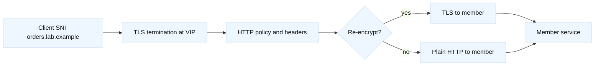

# Certificates, SNI, and termination

## Learning objectives

This topic explains how a TLS certificate, a hostname, Server Name Indication
(SNI), and a termination point fit together. You will learn to distinguish a
certificate-name mismatch from an untrusted issuer, an expired certificate,
and a protocol-version failure. You will also learn why re-encryption creates a
second TLS conversation and why a load balancer cannot infer application
ownership merely from a successful handshake. Examples use fictional names and
reserved addresses, with commands intended for observation in a lab.

## Mental model

Fact: TLS authenticates a peer using a certificate chain and negotiated names,
algorithms, and protocol parameters. In HTTPS, the client normally sends a
hostname in SNI during ClientHello; a server can select a certificate and
policy before HTTP exists. Fact: a reverse proxy may terminate client TLS and
open a separate cleartext or TLS connection to a pool member. Those are two
independent handshakes with separate certificates and trust decisions.

Inference: draw a certificate boundary on every hop. “The certificate is good”
is incomplete unless it identifies which connection, hostname, trust store,
and clock were tested. A certificate can be valid for the front door while the
proxy-to-server certificate is expired, or vice versa.



## Worked example

| Check | Front-end TLS | Upstream TLS |
| --- | --- | --- |
| Name | Client SNI and SAN | Member SNI and SAN |
| Trust | Client trust store | Proxy trust bundle |
| Evidence | VIP handshake | Proxy-to-member handshake |
| Owner | Edge/platform team | App/platform team |

Assume `orders.lab.example` points to `198.51.100.50`, and the front-end
listener serves HTTPS. The intended certificate names include the exact DNS
name, its issuer chain is available to clients, and its validity window covers
the lab clock. Start with a local, non-mutating inspection:

```sh
openssl s_client -connect 198.51.100.50:443 \
  -servername orders.lab.example -showcerts </dev/null
```

The `-servername` option is essential for SNI testing. Capture the leaf subject
and SAN values, issuer, validity dates, negotiated protocol, and verification
result. Repeat with an intentionally different reserved hostname only to
observe the default certificate in a controlled lab; never use that test to
claim that all clients behave identically. `curl --resolve` can bind a name to
the reserved address while retaining the intended Host and SNI names:

```sh
curl --resolve orders.lab.example:443:198.51.100.50 \
  --cacert ./lab-ca.pem -Iv https://orders.lab.example/health
```

If the client reports “no alternative certificate subject name,” compare the
requested name to SAN, not just the legacy Common Name. If it reports an
unknown issuer, inspect whether the server omitted an intermediate and whether
the client trust store intentionally contains the issuing root. If it reports
expiry or “not yet valid,” compare both endpoint and client clocks. Fact: a
certificate’s date checks are time-dependent. Inference: clock drift is a
high-value hypothesis when multiple unrelated certificates fail together.

For re-encryption, inspect the second hop from the proxy’s permitted lab
source, using the member name that the certificate expects. A front-end success
proves only the first handshake. Record whether the proxy validates the member
certificate, which trust bundle is used, and whether SNI is sent upstream.
Avoid disabling verification as a permanent fix; if a lab needs a temporary
diagnostic bypass, label it, time-box it, and restore verification immediately.

Certificate rotation is a dependency exercise. Build a change record listing
certificate, key, chain, SNI mapping, listener, member trust bundle, expiration,
owner, and rollback artifact. Never place private keys in tickets, shell
history, or examples. A safe “dry review” compares fingerprints and names,
then validates the candidate chain offline before approval.

## When this breaks

Common failures include missing SAN, wrong SNI mapping, an incomplete chain,
expired or not-yet-valid dates, unsupported signature algorithms, protocol
version mismatch, and a client that does not trust the issuer. A proxy can also
serve the right certificate but forward the wrong Host header, causing an
application routing error after TLS succeeds. TLS inspection tools may show a
different result from a browser because trust stores, proxy paths, and SNI
inputs differ.

Mutual TLS adds client authentication. Fact: the server requests a client
certificate and validates its chain and policy; the client must possess a
usable private key. Inference: troubleshoot mTLS in stages—server certificate,
then client certificate request, then client chain and authorization—rather
than treating every alert as “bad TLS.” A termination proxy must deliberately
forward identity (for example, a verified header) only under a documented trust
boundary; an arbitrary client-supplied identity header is not authentication.

## Operational checklist

1. Name the exact hop, address, port, SNI, and trust store under test.
2. Check SAN, issuer chain, validity dates, key usage, and negotiated protocol.
3. Compare direct member and VIP handshakes without exposing private material.
4. Verify whether upstream SNI and certificate validation are enabled.
5. Check clock synchronization and recent certificate/profile changes.
6. Stage rotation with a known-good rollback artifact and owner approval.
7. Validate from representative clients, then remove temporary diagnostics.

## Questions and answers

1. **Why does SNI matter?** It lets one address select among hostname-specific
   certificates and policies before HTTP headers are available.

Interview reasoning: For “Why does SNI matter,” walk the handshake fields rather than saying only “encrypted”: SNI selects identity, SAN matches the name, the chain reaches a trusted root, and protocol policy permits negotiation. Test client-to-LTM and LTM-to-member independently. Re-encryption protects the second hop but creates a second certificate/trust lifecycle; front-end success does not prove backend authorization or readiness.

2. **Does a valid leaf prove trust?** No. The client also needs a trusted chain,
   correct dates, and acceptable usage and algorithms.

Interview reasoning: For “Does a valid leaf prove trust,” state the mechanism and where it operates, then give the tuple, state transition, and evidence that distinguish the leading hypotheses. Explain the operational trade-off and a worked diagnostic. The caveat is that a successful local check proves only that check, so validate the complete request path and define rollback.

3. **What does termination mean?** The endpoint decrypts and completes one TLS
   session; a later re-encrypted session is a separate security decision.

Interview reasoning: For “What does termination mean,” state the mechanism and where it operates, then give the tuple, state transition, and evidence that distinguish the leading hypotheses. Explain the operational trade-off and a worked diagnostic. The caveat is that a successful local check proves only that check, so validate the complete request path and define rollback.

4. **Why test with `--resolve`?** It preserves hostname and SNI while choosing
   a controlled address, separating DNS from endpoint behavior.

Interview reasoning: For “Why test with `--resolve`,” state the mechanism and where it operates, then give the tuple, state transition, and evidence that distinguish the leading hypotheses. Explain the operational trade-off and a worked diagnostic. The caveat is that a successful local check proves only that check, so validate the complete request path and define rollback.

5. **What is a chain error?** The peer may omit an intermediate or present an
   order the client cannot build to a trusted root.

Interview reasoning: For “What is a chain error,” state the mechanism and where it operates, then give the tuple, state transition, and evidence that distinguish the leading hypotheses. Explain the operational trade-off and a worked diagnostic. The caveat is that a successful local check proves only that check, so validate the complete request path and define rollback.

6. **Does mTLS authenticate authorization?** A client certificate authenticates
   a certificate holder; application policy still decides what it may do.

Interview reasoning: For “Does mTLS authenticate authorization,” walk the handshake fields rather than saying only “encrypted”: SNI selects identity, SAN matches the name, the chain reaches a trusted root, and protocol policy permits negotiation. Test client-to-LTM and LTM-to-member independently. Re-encryption protects the second hop but creates a second certificate/trust lifecycle; front-end success does not prove backend authorization or readiness.

7. **Why avoid a verification bypass?** It removes an intended identity check
   and can hide the actual trust or naming defect.

Interview reasoning: For “Why avoid a verification bypass,” state the mechanism and where it operates, then give the tuple, state transition, and evidence that distinguish the leading hypotheses. Explain the operational trade-off and a worked diagnostic. The caveat is that a successful local check proves only that check, so validate the complete request path and define rollback.

Fact: [RFC 8446 TLS 1.3](https://www.rfc-editor.org/rfc/rfc8446), [RFC 6066
SNI](https://www.rfc-editor.org/rfc/rfc6066), and [RFC 5280 PKI](https://www.rfc-editor.org/rfc/rfc5280)
define protocol and certificate concepts. Fact: [OpenSSL s_client
documentation](https://docs.openssl.org/) documents the diagnostic tool. F5
certificate and client/server SSL profile behavior is version-specific; use
[F5 BIG-IP documentation](https://techdocs.f5.com/). Statements marked Fact
are standards or documented terminology; marked Inference statements are
operational reasoning and should be validated in the local design.
