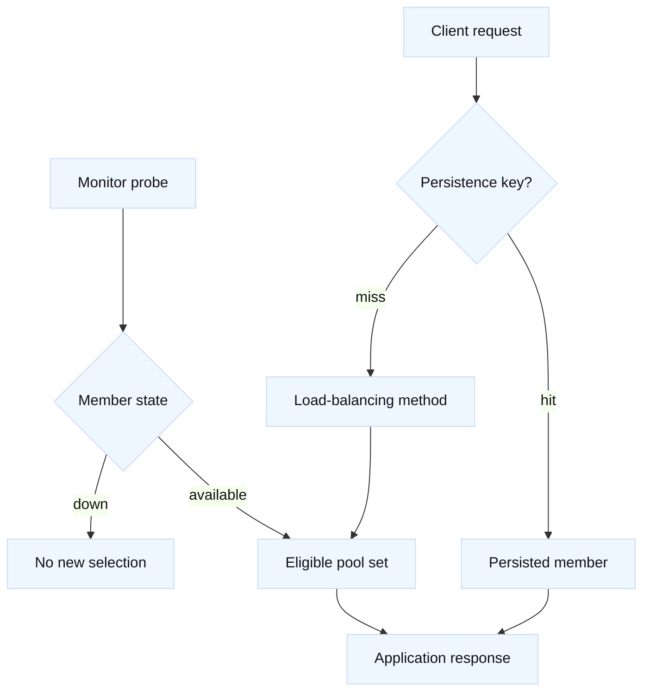

# LTM monitors, pools, and persistence

## Learning objectives

Learn how LTM monitors produce member health signals, how pools select among
eligible members, and how persistence changes the otherwise stateless selection
decision. Learn to read “down” reasons without over-trusting a probe, and to
distinguish a failed monitor from a failed user request. The examples use
`app.lab.example`, members in documentation ranges, and safe read-only
diagnostics. Product defaults vary by release and profile, so treat object names
as illustrative.

## Mental model

Fact: a monitor periodically sends a probe through a configured path and marks
a target according to its receive criteria. A pool contains members and a load
balancing method; only members considered available are normally candidates.
Persistence associates later flows with a prior selection using a configured
key, such as a cookie or source address. Fact: persistence is not health and a
persisted mapping can outlive a member’s usefulness depending on timeout and
failure handling.

Inference: model each request as two decisions: “is this member eligible?” and
“which eligible member receives this flow?” This makes it easier to explain why
round-robin appears fair in a small test while persistence sends one user to a
single node for hours.

## Diagram



## Worked example

| Signal | What it says | What it does not say |
| --- | --- | --- |
| Monitor up | Probe matched its criteria | Every user flow works |
| Pool state | Candidate availability | Application correctness |
| Persistence hit | Key mapped to a member | Load is evenly distributed |
| Request trace | One observed transaction | Future member health |

The fictional pool `pool_catalog_lab_8080` contains `203.0.113.10:8080` and
`.11:8080`. Its monitor sends `GET /healthz`, expects status 200 and the body
`ready`, and runs from the load-balancer context. This is a contract to verify
with the application owner; it is not a universal health endpoint design.

A read-only review record might be:

```text
pool: pool_catalog_lab_8080
monitor: mon_catalog_healthz
member: 203.0.113.10:8080 state=down reason="receive string not found"
member: 203.0.113.11:8080 state=up
persistence: cookie, timeout=900s (confirm owner requirement)
```

First test the exact protocol expected by the monitor from an approved lab
source. If the endpoint is TLS, an HTTP monitor on port 8080 will fail even if
the application is healthy on 8443. If the app returns a redirect, the monitor
may need a deliberate receive rule rather than silently following redirects.
Record response status, headers, body length, and latency; avoid logging
credentials or personal data.

If users report alternating errors, inspect persistence. A cookie can pin a
browser to a member while a command-line client without that cookie rotates.
Conversely, source-address persistence behind NAT can pin many users together.
Inference: compare a fresh client, a cleared cookie, and a deliberately retained
cookie in a lab, while preserving correlation IDs. Do not infer fairness from
two requests. Examine distribution over a meaningful sample and account for
long-lived connections.

A monitor passing does not prove dependency health. It may omit database access,
authorization, queue capacity, or the user’s path. Layered monitors can test a
cheap endpoint and deeper synthetic check, but deeper checks cost resources and
can create load. Fact: the selected monitor’s receive criteria determine its
signal. Inference: use the smallest endpoint that represents the failure mode
without turning health checking into an outage source.

## When this breaks

False downs arise from wrong port, TLS/SNI mismatch, firewall policy, DNS
resolution from the monitor context, a changed response body, timeout too
short, or a maintenance page that still returns 200. False ups arise when a
shallow endpoint ignores a broken dependency. Pool selection can fail through
priority groups, disabled members, capacity limits, or an unexpected policy.
Persistence can cause hotspots, stale sessions, and confusing recovery after a
member returns.

Do not change monitor intervals or receive strings during an incident without
capturing the prior state and agreeing on rollback. A monitor change can make
every member appear healthy or down simultaneously. Fact: changing persistence
can alter user session placement. Inference: drain or expire mappings only when
the application’s session behavior and user impact are understood.

## Operational checklist

1. Record pool, member address/port, monitor request, receive criteria, and
   source context.
2. Compare monitor evidence with a real request and application logs.
3. Check selection method, priority groups, disabled states, and connection
   reuse.
4. Identify persistence type, key, timeout, and failure behavior.
5. Measure member distribution with correlation IDs, not anecdotal requests.
6. Snapshot current configuration before a proposed change.
7. Set owner-approved validation and rollback criteria.

## Questions and answers

1. **Does an up monitor guarantee a working service?** No; it proves only the
   probe’s narrow request and expected response succeeded.

Interview reasoning: For “Does an up monitor guarantee a working service,” state exactly what the probe sends and expects: source, destination port, Host/SNI, URI, status or body, interval, and timeout. Replay it from the same path and compare a real request and origin logs. A deeper F5 monitor improves fidelity but can make a dependency outage eject every member, so its dependency budget must be explicit.

2. **Why can a healthy member receive no traffic?** Persistence, priority,
   policy, connection reuse, or a disabled state can bypass normal selection.

Interview reasoning: For “Why can a healthy member receive no traffic,” state the mechanism and where it operates, then give the tuple, state transition, and evidence that distinguish the leading hypotheses. Explain the operational trade-off and a worked diagnostic. The caveat is that a successful local check proves only that check, so validate the complete request path and define rollback.

3. **What is a receive string?** A match condition in a monitor response, such
   as `ready`; its syntax and matching rules depend on the monitor type.

Interview reasoning: For “What is a receive string,” state the mechanism and where it operates, then give the tuple, state transition, and evidence that distinguish the leading hypotheses. Explain the operational trade-off and a worked diagnostic. The caveat is that a successful local check proves only that check, so validate the complete request path and define rollback.

4. **Why is source persistence risky behind NAT?** Many clients can share one
   observed source and become pinned to one member.

Interview reasoning: For “Why is source persistence risky behind NAT,” explain the persistence key and lifetime, then inspect key cardinality, member skew, table pressure, expiry, and failover behavior. A shared NAT address can concentrate many users on one member. Persistence preserves session continuity but weakens distribution and can retain a bad mapping; shared application state may allow a shorter timeout.

5. **How should a monitor endpoint be designed?** Make it cheap, authenticated
   as appropriate, deterministic, and representative of the stated failure.

Interview reasoning: For “How should a monitor endpoint be designed,” state exactly what the probe sends and expects: source, destination port, Host/SNI, URI, status or body, interval, and timeout. Replay it from the same path and compare a real request and origin logs. A deeper F5 monitor improves fidelity but can make a dependency outage eject every member, so its dependency budget must be explicit.

6. **What evidence distinguishes a monitor failure?** Probe status/reason,
   packet or server logs, and an equivalent controlled request.

Interview reasoning: For “What evidence distinguishes a monitor failure,” state exactly what the probe sends and expects: source, destination port, Host/SNI, URI, status or body, interval, and timeout. Replay it from the same path and compare a real request and origin logs. A deeper F5 monitor improves fidelity but can make a dependency outage eject every member, so its dependency budget must be explicit.

7. **Why retain pre-change state?** It makes review, comparison, and rollback
   possible when a monitoring change has broad effects.

Interview reasoning: For “Why retain pre-change state,” state the mechanism and where it operates, then give the tuple, state transition, and evidence that distinguish the leading hypotheses. Explain the operational trade-off and a worked diagnostic. The caveat is that a successful local check proves only that check, so validate the complete request path and define rollback.

Fact: [RFC 9110](https://www.rfc-editor.org/rfc/rfc9110) defines HTTP response
semantics and [RFC 6265](https://www.rfc-editor.org/rfc/rfc6265) cookie behavior.
Fact: F5’s [Local Traffic Manager documentation](https://techdocs.f5.com/)
documents monitors, pools, health states, and persistence profiles for a given
release. The two-decision model and recommendations above are engineering
inferences, explicitly labeled as such.
