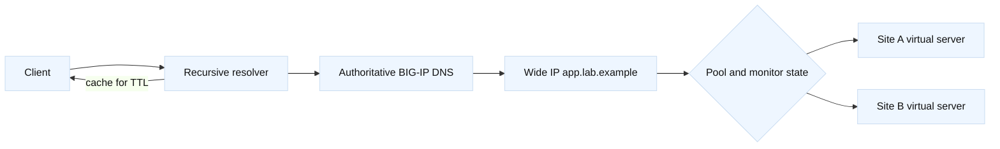

# GTM Wide IPs, TTL, and steering

## Learning objectives

This topic builds a practical model of BIG-IP DNS, historically called GTM. You
will connect a DNS name to a Wide IP, understand pools and virtual servers,
reason about monitor state and site selection, and include DNS caching and TTL
in an incident timeline. You will practice distinguishing an authoritative
answer from a client’s cached answer. All names and addresses are fictional or
reserved for documentation.

## Mental model

Fact: a Wide IP represents an application name and service, and its pools hold
candidate virtual servers. A BIG-IP DNS server evaluates configured availability
and steering logic when answering an authoritative query. A virtual server in
this model describes a reachable service endpoint associated with a server and
data center object. Monitors contribute health state but do not measure every
recursive resolver or client path.

Fact: DNS TTL tells caching resolvers how long an answer may be reused; it does
not force every cache or application to discard data immediately. Inference:
an endpoint change has two timelines—authoritative decision time and cache
convergence time—so a failover can be correct at the authority while users
continue to reach the old address.



## Worked example

| Evidence | Authority | Resolver/client |
| --- | --- | --- |
| Current policy answer | Yes | Not necessarily |
| Cached answer age | No | Often observable as TTL |
| Steering inputs | Configured at authority | Location may differ |
| Existing TCP session | Not controlled by DNS | May persist |

`app.lab.example` has a Wide IP with Site A at `198.51.100.60` and Site B at
`198.51.100.70`. A topology record names both virtual servers, their data
centers, monitor, pool order, and intended steering rule. A read-only query to
the authority can show the current answer:

```sh
dig @198.51.100.53 app.lab.example A +noall +answer +authority
dig @198.51.100.53 app.lab.example A +ttlunits
```

The address `.53` is a reserved documentation address in this example; replace
it only in an authorized lab. Query a recursive resolver separately to expose
cache behavior. Record UTC time, resolver identity, answer, TTL, and flags.
If authority answers Site B while a user still sees Site A, that is not by
itself a steering failure; compare the user’s resolver and cached TTL.

Suppose Site A’s monitor turns down because `/healthz` no longer contains
`ready`. The Wide IP may select Site B, but only if the pool and fallback rules
permit it. Check whether the monitor tests the intended port and protocol, and
whether the virtual server’s address is reachable from the monitor context.
Fact: “available” is a configured health result. Inference: a monitor outage
should be correlated with application and network evidence before declaring a
site outage.

Steering choices have different assumptions. Round-robin distributes answers;
topology chooses based on client subnet or location data; ratio and priority
express preference; global availability commonly falls back when preferred
targets are unavailable. Document what happens when location is unknown,
health is stale, or all pools are down. Never present a policy as universally
optimal. A low TTL can reduce stale-answer duration but increases query load;
it cannot guarantee instant migration.

## When this breaks

Failures include querying a non-authoritative server, stale recursive cache,
wrong delegation, DNSSEC validation problems, exhausted or incorrect pools,
monitor false state, and a fallback that silently returns a maintenance site.
Anycast or network path issues can make one authority appear healthy from one
location and unreachable from another. A DNS answer can be syntactically valid
while the endpoint is unavailable.

Do not repeatedly lower TTL during an incident and expect existing cached
answers to change retroactively. Do not change steering weights before capturing
the prior state and estimating resolver query volume. Inference: application
connection reuse means a DNS answer change may not move already-open sessions.
For controlled verification, use a short-lived lab name and explicit resolver
queries, never a production cache flush without owner approval.

## Operational checklist

1. Identify authoritative servers, Wide IP, record type, pools, virtual servers,
   data centers, monitors, and fallback behavior.
2. Compare authority and recursive answers with timestamps and TTLs.
3. Check delegation, DNSSEC status where applicable, and reachability from more
   than one approved vantage point.
4. Correlate monitor state with endpoint and application evidence.
5. Estimate cache convergence and connection reuse before claiming failover.
6. Snapshot policy and weights before a change; define rollback and validation.
7. Communicate the expected stale-answer window to incident stakeholders.

## Questions and answers

1. **Does Wide IP answer every DNS query?** It is a logical application object;
   authoritative server configuration and delegation determine who answers.
2. **Does a low TTL force immediate failover?** No; caches and clients may keep
   answers, and existing connections do not perform DNS again.
3. **What does a monitor prove?** Only the configured probe’s view of one
   virtual server at its observation time.
4. **Why query authority and resolver separately?** The authority shows current
   policy; the resolver reveals cache and delegation effects.
5. **What is fallback?** The rule used when preferred pools or targets cannot
   satisfy availability or steering criteria.
6. **Why can users in two regions differ?** Their recursive resolvers, cached
   TTLs, topology inputs, or network paths can differ.
7. **What is a safe incident artifact?** Timestamped `dig` output, policy
   state, monitor reasons, and endpoint evidence with no credentials.

## Primary references and fact-inference labels

Fact: [RFC 1034](https://www.rfc-editor.org/rfc/rfc1034), [RFC 1035](https://www.rfc-editor.org/rfc/rfc1035),
and [RFC 2181](https://www.rfc-editor.org/rfc/rfc2181) describe DNS operation,
records, and TTL interpretation. Fact: F5 [BIG-IP DNS documentation](https://techdocs.f5.com/)
defines Wide IP, pool, monitor, and steering behavior by release. The two
timelines and operational recommendations are engineering inferences.
