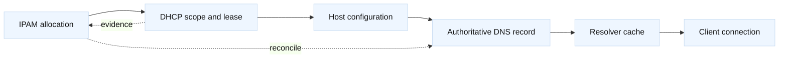

# DDI, IPAM ownership, and drift

## Learning objectives

DDI combines DNS, DHCP, and IP address management, but combining tools does not
automatically create one source of truth. This topic teaches how to assign
ownership, trace an address from allocation to lease to DNS record, and detect
drift without overwriting evidence. It distinguishes authoritative data from a
cache, a lease, or a manually entered record. Examples use `192.0.2.0/24`,
`2001:db8::/64`, and the local name `printer.lab.example`.

## Mental model

Fact: IPAM records intended ownership and allocation metadata; DHCP leases
assign addresses under a lease policy; DNS maps names to addresses according to
authoritative zone data. They have different lifecycles and authorities. A DHCP
lease ending does not automatically prove DNS deletion, and a DNS record does
not prove a host currently owns or answers at that address.

Inference: every address should have an owner, purpose, lifecycle, and evidence
source. A reconciliation process should report conflicts before it changes
anything. “The database says free” and “the network is unused” are different
claims requiring different observations.

## Diagram



## Worked example

| System | Primary fact | Typical lifecycle |
| --- | --- | --- |
| IPAM | Owner and allocation intent | Reservation to release |
| DHCP | Lease to client identity | Offer, renew, expire |
| DNS | Name-to-address mapping | Publish, age, remove |
| Host | Observed configuration | Boot, change, shutdown |

The fictional team reserves `192.0.2.40` for `printer.lab.example`, with an
owner, location, and expiration date in IPAM. A DHCP scope covers `.20-.99`,
while the printer uses a reservation at `.40`. An operator starts read-only:

```text
IPAM: 192.0.2.40 status=reserved owner=facilities expires=2026-12-31
DHCP: client-id=lab-printer lease=192.0.2.40 valid-until=2026-08-31T22:00Z
DNS: printer.lab.example A 192.0.2.40 TTL=300
```

Compare authoritative DNS, not only a workstation cache. Use `dig` against an
approved local authority and inspect DHCP lease logs for the client identifier,
not just a hostname that a client can self-report. Then check whether the host
responds on an approved management port. No ping result can prove ownership;
ICMP may be blocked and another host may answer due to duplication.

Drift categories are useful. An orphan is a lease with no current IPAM owner.
A stale record is DNS pointing to an expired allocation. A duplicate is two
systems claiming one address. A phantom is an IPAM allocation with no lease or
observed host. A naming mismatch is a valid lease whose forward and reverse DNS
names disagree. Fact: these systems expose different evidence. Inference: a
reconciler should produce a report containing confidence and timestamps instead
of automatically deleting records.

For IPv6, include router advertisements, DHCPv6 where used, and privacy
addresses in the model. A single stable IPAM row may not represent every active
address. Reverse DNS authority and delegation should be explicit. Security
controls matter: IPAM exports may contain sensitive topology, so redact them
from examples and restrict access.

## When this breaks

An address has more than one identity in practice. The DHCP client identifier
may differ from a host name, a virtual machine can retain a lease while its
workload moves, and a container platform may allocate addresses outside the
traditional DHCP path. Treat MAC, client identifier, hostname, serial number,
and ownership ticket as separate correlation keys. A reconciliation report
should show which keys agree and which are missing, rather than collapsing them
into a single “owner” field. Establish a retention period for old leases and
records so an address can be reused without confusing yesterday's identity with
today's. For incident work, preserve a point-in-time export and a hash or
version identifier for each source; otherwise a later report can silently
change the evidence being discussed.

Drift grows when teams make emergency manual DNS edits, DHCP and IPAM use
different scopes, automation retries without idempotency, leases are reused,
or clocks and identifiers differ. Split-brain authority can make two operators
believe they own the same range. A cache can mask a corrected record. A stale
static host can collide with a newly allocated DHCP address.

Never “fix” drift by mass-deleting DNS or leases. First freeze the evidence,
identify authoritative owners, and assess impact. Inference: quarantine a
conflict in a small lab range or reservation list while an owner confirms the
intended state. A safe change names the exact record or lease, records before
and after state, and defines rollback.

## Operational checklist

1. Establish authority for IPAM, DHCP scope, forward DNS, and reverse DNS.
2. Compare allocation, lease, DNS, and observed-host evidence with timestamps.
3. Classify orphan, stale, duplicate, phantom, or naming-mismatch drift.
4. Include IPv6 RA/privacy-address behavior where relevant.
5. Protect exports and redact identifiers from tickets and examples.
6. Require owner approval for reconciliation changes and preserve rollback.
7. Re-query authority and lease state after change; account for cache TTL.

## Questions and answers

1. **Does DNS prove an address is in use?** No; it proves an authoritative
   mapping exists, not that a host currently owns or answers there.

Interview reasoning: For “Does DNS prove an address is in use,” record resolver identity, A/AAAA/CNAME data, flags, response code, authority, and TTL, then compare the recursive answer with an authoritative query. Split-horizon DNS, `/etc/hosts`, and service discovery can produce different views. A correct DNS answer proves only name resolution; route, VIP, TLS, policy, and application health still require separate probes.

2. **What proves a DHCP lease?** The authoritative DHCP server’s lease record
   tied to a client identifier and validity interval.

Interview reasoning: For “What proves a DHCP lease,” state the mechanism and where it operates, then give the tuple, state transition, and evidence that distinguish the leading hypotheses. Explain the operational trade-off and a worked diagnostic. The caveat is that a successful local check proves only that check, so validate the complete request path and define rollback.

3. **Why not auto-delete stale records?** The apparent staleness may be a
   delayed lease update, static host, or split authority; deletion can break it.

Interview reasoning: For “Why not auto-delete stale records,” state the mechanism and where it operates, then give the tuple, state transition, and evidence that distinguish the leading hypotheses. Explain the operational trade-off and a worked diagnostic. The caveat is that a successful local check proves only that check, so validate the complete request path and define rollback.

4. **What is IPAM’s role?** It records allocation, ownership, purpose, and
   lifecycle; exact capabilities depend on the product and process.

Interview reasoning: For “What is IPAM’s role,” state the mechanism and where it operates, then give the tuple, state transition, and evidence that distinguish the leading hypotheses. Explain the operational trade-off and a worked diagnostic. The caveat is that a successful local check proves only that check, so validate the complete request path and define rollback.

5. **How detect duplicates?** Correlate authoritative records with controlled
   ARP/ND or switch evidence and host identity, recognizing each limitation.

Interview reasoning: For “How detect duplicates,” state the mechanism and where it operates, then give the tuple, state transition, and evidence that distinguish the leading hypotheses. Explain the operational trade-off and a worked diagnostic. The caveat is that a successful local check proves only that check, so validate the complete request path and define rollback.

6. **Why include TTL in drift work?** A corrected authority may remain hidden
   behind resolver caches until their permitted lifetime ends.

Interview reasoning: For “Why include TTL in drift work,” treat TTL as a normal cache-freshness bound, not a synchronized switch. Lower it ahead of a migration, wait through the old maximum, change authority, and watch both destinations with fresh and cached queries. Existing sessions and local overrides may outlive TTL, so keep the old endpoint safe until measured convergence and define rollback.

7. **What makes reconciliation safe?** Read-only report, explicit authority,
   narrow diff, approval, audit trail, and tested rollback.

Interview reasoning: For “What makes reconciliation safe,” state the mechanism and where it operates, then give the tuple, state transition, and evidence that distinguish the leading hypotheses. Explain the operational trade-off and a worked diagnostic. The caveat is that a successful local check proves only that check, so validate the complete request path and define rollback.

Fact: [RFC 2131 DHCP](https://www.rfc-editor.org/rfc/rfc2131), [RFC 1034 DNS](https://www.rfc-editor.org/rfc/rfc1034),
and [RFC 4861 Neighbor Discovery](https://www.rfc-editor.org/rfc/rfc4861) describe
the protocol roles. Fact: [RFC 4941 IPv6 privacy addresses](https://www.rfc-editor.org/rfc/rfc4941)
explains why IPv6 observations vary. Product behavior is implementation
specific; consult the local DDI vendor documentation. The ownership model,
drift categories, and reconciliation advice are engineering inferences.
