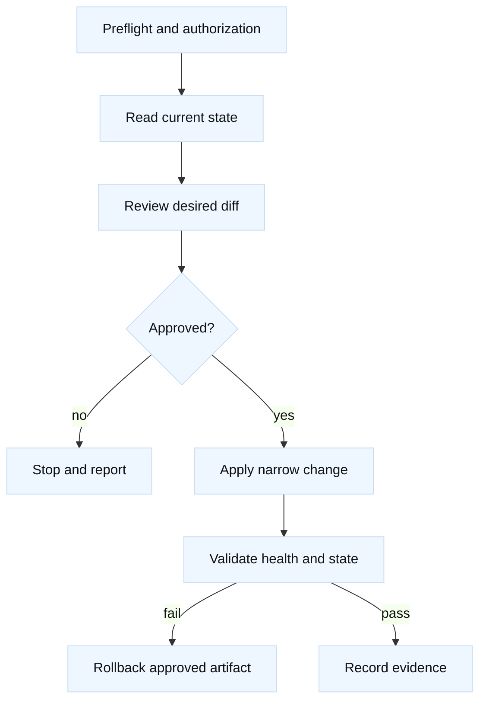

# F5 automation, SSH, and change safety

## Learning objectives

This topic presents a safe operating model for automating F5 BIG-IP inspection
and narrowly scoped changes. You will distinguish REST and SSH transport from
the authorization and audit controls around them, design idempotent reads and
writes, and build a preflight, diff, validation, and rollback sequence. The
examples use a fictional device name and local placeholder credentials only;
they do not contain secrets and should not be pointed at production.

## Mental model

Fact: an automation client is a program that authenticates to a management
interface, requests an operation, and receives a response. REST resources and
the tmsh command line expose product state, but endpoint paths, permissions,
transactions, and response fields vary by BIG-IP release. SSH supplies a
remote shell and is not automatically safer than REST. Authentication proves
identity; authorization, audit, network controls, and change review constrain
what that identity can do.

Inference: treat every change as a small transaction with four artifacts:
desired state, observed pre-state, resulting diff, and post-change evidence.
This allows a reviewer to answer what changed, why, and how to undo it without
searching shell history. Reads should be the default mode, and production
credentials should come from an approved secret mechanism outside source code.



## Worked example

| Stage | Read-only artifact | Stop condition |
| --- | --- | --- |
| Preflight | Target, role, sync and health | Unknown ownership or conflict |
| Diff | Allow-listed desired changes | Unexpected field difference |
| Apply | Request ID and response | Timeout or partial result |
| Validate | Read-back, monitors, lab request | Any required check fails |

The target `bigip-a.lab.example.invalid` is intentionally non-resolving. A
read-only Python sketch can demonstrate request construction without opening a
connection:

```python
from dataclasses import dataclass

@dataclass(frozen=True)
class ReadRequest:
    host: str
    resource: str

request = ReadRequest(
    "bigip-a.lab.example.invalid",
    "/mgmt/tm/ltm/virtual/~Common~vs_orders_lab_443",
)
print(f"Would GET https://{request.host}{request.resource}")
```

For an authorized environment, adapt the vendor SDK or REST client to use
certificate verification, a least-privilege account, a bounded timeout, and a
request identifier. Capture status code, selected fields, and server audit
reference; redact tokens, cookies, and private addresses where reports leave
the restricted system. A safe preflight checks device health, current config
version, sync/HA status, object existence, and whether another change is in
progress. If any precondition is unknown, stop rather than guessing.

SSH can be useful for a documented read such as `tmsh list ltm virtual
vs_orders_lab_443`. Use an approved key, host-key verification, forced command
or restricted role where possible, and a session transcript that excludes
secrets. Never place passwords in command arguments or disable host-key checks
just to make a script pass. REST and SSH should produce equivalent evidence for
the same object; a mismatch is a reason to investigate version, partition, or
authorization context.

Idempotency means rerunning a desired-state operation does not create duplicate
objects or progressively alter unrelated settings. Compute a narrow diff from
the observed object, require an explicit allow-list of fields, and reject
unknown differences. A change to a VIP’s pool should not silently replace its
TLS profile. After applying, validate object state, monitor status, a reserved
lab request, logs, and HA/config-sync expectations. “The API returned 200” is
not sufficient evidence of service health.

Rollback is a planned operation, not an assumption that deleting the new object
will restore old behavior. Save the exact prior fields, know dependencies, and
define who may invoke rollback. For a failed validation, stop further retries,
preserve timestamps and responses, and escalate with the smallest useful log
excerpt. Fact: automation can amplify a bad assumption. Inference: rate limits,
dry-run mode, approval gates, and a canary object reduce blast radius.

## When this breaks

Automation fails when API versions differ, a partition is omitted, an account
lacks permission, tokens expire, TLS validation is bypassed, a device is in a
sync conflict, or a script assumes response fields that changed. SSH may fail
because of host-key rotation, shell quoting, terminal paging, or a different
tmsh context. Concurrent changes can invalidate a preflight diff.

The most dangerous failure is partial success: one device changes, the peer
does not, or a retry creates an unintended second object. Do not auto-retry
non-idempotent writes without understanding server semantics. Inference: lock
or serialize changes per device/service, record correlation IDs, and make
“unknown outcome” a state requiring read-back rather than blind retry.

## Operational checklist

1. Confirm target, owner, maintenance window, authorization, and rollback.
2. Use verified TLS or SSH host keys, least privilege, and secret-free logs.
3. Read current state and capture config/sync context before computing a diff.
4. Restrict writes to an allow-list and use dry-run or approval gates.
5. Apply one narrow change with timeout and correlation ID.
6. Validate state, monitors, representative lab traffic, logs, and HA status.
7. Record evidence; if uncertain, stop and use the approved rollback path.

## Questions and answers

1. **Is SSH inherently safer than REST?** No. Safety depends on identity,
   authorization, host verification, auditing, and change controls.
2. **What is idempotency?** Repeating the same desired-state request converges
   without duplicate or unintended additional changes.
3. **Why capture pre-state?** It supports review, precise diffs, and rollback.
4. **Why verify TLS in an API client?** Without server identity validation, a
   management credential may be sent to an impostor endpoint.
5. **What should happen after an uncertain timeout?** Read back state and audit
   evidence; do not blindly retry a potentially completed write.
6. **Why serialize changes?** Concurrent edits can invalidate assumptions and
   produce split or partial configuration.
7. **What is a useful post-change check?** Object read-back plus health signal
   and a controlled request, not merely an HTTP success status.

## Primary references and fact-inference labels

Fact: [RFC 8446](https://www.rfc-editor.org/rfc/rfc8446) describes TLS used to
protect management sessions, and [RFC 4253](https://www.rfc-editor.org/rfc/rfc4253)
describes SSH transport. Fact: [F5 iControl REST and tmsh documentation](https://techdocs.f5.com/)
defines version-specific interfaces and objects. The transaction artifacts,
allow-list, serialization, and retry guidance are engineering inferences.
