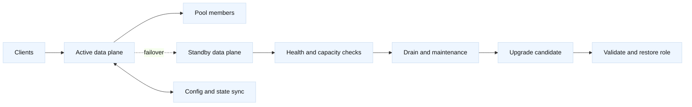

# Load-balancer device lifecycle and upgrades

## Learning objectives

By the end of this topic, you should be able to describe the difference between
a physical BIG-IP appliance, a virtual edition, and a logical traffic service;
explain active/standby high availability (HA); and plan a maintenance event
that has explicit prechecks, drain behavior, capacity assumptions, and rollback.
The examples are instructional and use `198.51.100.0/24`, `203.0.113.0/24`,
and names under `.invalid`. They are not production instructions.

## Mental model

Fact: a load balancer has at least two planes. The data plane accepts client
connections, evaluates virtual-server and policy objects, and sends traffic to
pool members. The management and control planes store configuration, report
health, coordinate HA, and perform software lifecycle work. A physical device
has dedicated interfaces and hardware resources; a virtual device consumes
hypervisor CPU, memory, storage, and virtual networking. Both can expose the
same logical objects, but their failure domains and performance limits differ.

Fact: active/standby HA normally gives one peer the traffic-processing role
while the other is ready to take over. Device trust, failover signaling,
connection mirroring, and configuration synchronization are related but not
identical mechanisms. A peer can have matching configuration while not having
all connection state. Inference: an upgrade plan must state what happens to
long-lived connections instead of promising zero interruption by default.

The key lifecycle states are provisioned, baseline-tested, serving, drained,
upgrading, validating, and retired. “Healthy” is a multidimensional claim: a
peer can answer management requests while a data interface, route, license,
certificate, pool, or monitor is broken. A capacity model should include new
connections per second, concurrent connections, throughput, TLS handshakes,
memory pressure, persistence records, and the number of enabled features.
Virtual editions also need headroom for noisy-neighbor effects and guaranteed
virtual CPU scheduling. Vendor sizing is a fact about a tested platform;
choosing a local headroom percentage is an engineering inference.

Configuration synchronization copies intended objects and settings. State
synchronization may copy ephemeral items such as persistence or connection
records, depending on platform, profile, and feature. Before changing either
peer, record software version, provisioned modules, license state, self and
floating addresses, routes, VLANs, HA status, config-sync status, and the
current traffic role. Treat an unsynchronized peer as a separate change, not
as a harmless warning.

## Worked example

The fictional service `orders-gw` uses a floating address `198.51.100.40` and
two peers named `lb-a.lab.example.invalid` and `lb-b.lab.example.invalid`.
The change is to upgrade the standby peer first, then perform a controlled
role change. A reviewer receives a read-only evidence bundle before approval.

| Phase | Evidence to collect | Stop condition |
| --- | --- | --- |
| Precheck | HA role, sync status, versions, licenses, routes | Split-brain or unknown drift |
| Capacity | CPS, concurrent sessions, CPU, memory, TLS rate | No safe headroom |
| Drain | New-connection rate and member health | Existing sessions cannot be explained |
| Upgrade | Image checksum, backup, console access | Missing recovery path |
| Validation | Role, VIP, monitors, controlled request, logs | Any critical check fails |

First, the operator confirms ownership, window, peer reachability, backup
retention, and a tested image checksum. They compare the candidate's running
configuration with the active peer and resolve drift before proceeding. They
also identify persistence and protocol-sensitive traffic. A WebSocket or a
long file upload may outlive a normal drain interval, while a new HTTP request
can usually reconnect.

The standby is upgraded while the active peer continues serving. The operator
does not infer success from a successful reboot: they verify version, modules,
interfaces, routes, device trust, sync state, and monitor results. Next they
announce a short failover, confirm the standby is eligible, and move the
traffic role using the approved control. During the transition, clients may
reconnect, and connections not mirrored may reset. The team watches error
rate, handshake failures, pool queueing, health monitors, and resource use.

If validation passes, the former active is drained and upgraded, then restored
to standby. If validation fails, the team stops further changes, preserves
timestamps and logs, and returns traffic to the known-good peer only if that
peer is healthy and the rollback is authorized. A rollback is not necessarily
an image downgrade: it might be role reversal, restoring the saved
configuration, disabling a newly exposed feature, or replacing a failed VM.
The exact option depends on evidence and platform support.

## When this breaks

An upgrade becomes risky when configuration drift is hidden by different
partitions, when failover addresses are routed asymmetrically, or when the
standby lacks a license or module used by the active peer. State loss is
visible when persistence-sensitive clients bounce between members or when
long-lived flows reset. A drain that only stops new connections does not
magically finish existing sessions. TLS-heavy traffic can exhaust CPU during
reconnection storms even when average bandwidth is low.

Virtual appliances can fail through a hypervisor migration, datastore delay,
virtual switch mismatch, or CPU overcommit. Physical appliances can fail from
interface, power, fan, or storage faults. In both cases, monitoring may be
green because it checks only the management address. A planned role change
can also reveal stale ARP, MAC learning, routing, or firewall state. Inference:
include network neighbors and client retry behavior in the validation plan.

Never retry a failed failover blindly. Determine whether the role changed,
which peer owns the floating address, and whether both peers might be active.
If split-brain is possible, isolate the unsafe peer through the approved
process and involve the owner. Do not erase evidence while trying to make the
dashboard look normal.

## Operational checklist

1. Confirm service owner, maintenance window, change authorization, and rollback authority.
2. Capture versions, modules, licenses, HA role, config-sync state, backups, and drift.
3. Measure CPS, concurrent sessions, throughput, TLS handshakes, CPU, memory, and queues.
4. Classify traffic that needs persistence, mirroring, or extended drain time.
5. Verify image integrity, console or recovery access, and peer/network prerequisites.
6. Upgrade one peer, read back health, and record evidence before any role change.
7. Drain and fail over with observers watching client errors, monitors, and capacity.
8. Validate controlled traffic, logs, routes, certificates, and synchronization.
9. Restore redundancy, document exceptions, and close only after evidence review.

## Questions and answers

1. **Does configuration sync mirror every connection?** No. Configuration and
   ephemeral state are different; supported mirroring depends on platform and
   feature.
2. **Why upgrade standby first?** It preserves a serving peer while testing the
   candidate, reducing the initial blast radius.
3. **What does drain mean?** Usually stop admitting new flows while allowing
   existing work to finish, subject to protocol and timeout behavior.
4. **Is a virtual load balancer equivalent to hardware?** It may expose similar
   objects, but compute, storage, network, and failure domains differ.
5. **What proves failover succeeded?** Role ownership, reachable service,
   healthy monitors, expected routes, controlled traffic, and observed errors.
6. **What should happen after an upgrade timeout?** Establish whether it
   completed, read back state, preserve evidence, and follow the approved
   recovery path; do not issue a duplicate upgrade.
7. **Why measure TLS handshakes separately from bandwidth?** Handshakes can
   consume substantial CPU even when byte volume is modest.

## Primary references and fact-inference labels

Fact: [RFC 793](https://www.rfc-editor.org/rfc/rfc793) and [RFC 9293](https://www.rfc-editor.org/rfc/rfc9293)
describe TCP connection behavior relevant to resets and retransmission.
Fact: [F5 BIG-IP documentation](https://techdocs.f5.com/) documents device
service clustering, config sync, failover, and version-specific upgrade
procedures. Fact: [NIST SP 800-40](https://csrc.nist.gov/publications/detail/sp/800-40/rev-4/final)
discusses enterprise patch planning. The headroom targets, sequencing,
drain durations, evidence bundle, and rollback decision rules are engineering
inferences and must be adapted to tested local behavior.
