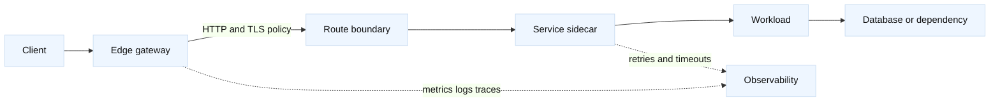

# Proxy architecture and protocol boundaries

## Learning objectives

This topic helps you distinguish L4 load balancing from L7 proxying, place
gateways and sidecars deliberately, and reason about TLS termination,
re-encryption, and passthrough. You will also trace headers, timeout and retry
budgets, protocol boundaries, and observability signals. All service names and
addresses are fictional; `app.lab.example` and `203.0.113.0/24` are examples,
not endpoints to contact.

## Mental model

Fact: an L4 proxy makes decisions using transport information such as IP,
port, and connection state. An L7 proxy terminates an application protocol,
parses messages, and can route using host, path, method, headers, or content
metadata. A gateway is an edge policy point; a sidecar is a local proxy near
one workload. The labels describe placement and responsibility, not a promise
that every product implements every feature.

A proxy is a boundary because it changes who owns a connection. With TLS
termination at the edge, the client authenticates the edge certificate; the
edge then creates a separate upstream connection. Re-encryption protects the
second hop with another TLS session, often with upstream certificate
validation and possibly client authentication. Passthrough keeps the payload
opaque to the proxy and forwards a TCP flow, which preserves end-to-end TLS
but removes L7 routing and inspection at that hop. Fact: these are distinct
cryptographic sessions when termination occurs. Inference: document trust
domains and certificate ownership for every hop.

Headers are part of the application contract. `Host`, `Forwarded`, and
`X-Forwarded-For` can describe the original request, but an application must
trust them only from a controlled proxy. A proxy should avoid appending an
unbounded chain, preserve correlation identifiers, and remove spoofed inbound
values when it is the trusted boundary. IP-derived identity is especially
fragile across NAT and multiple proxies. Protocol upgrades such as WebSocket,
HTTP/2, and gRPC require explicit support for connection semantics and
streaming; a generic HTTP policy can accidentally buffer or close them.

Timeouts are budgets, not isolated knobs. Connect timeout, TLS handshake
timeout, request-header timeout, upstream response timeout, idle timeout, and
client timeout interact. A retry can multiply load: one client request may
become several upstream attempts. Retrying a safe, idempotent read may be
reasonable, while retrying a payment POST can duplicate side effects unless an
idempotency key and application contract exist. Inference: assign a total
deadline and an attempt budget across every proxy hop.

## Worked example

Suppose `app.lab.example` enters an edge gateway at `203.0.113.20:443`, then a
service mesh sidecar forwards to `orders-v2` on a private address. The edge
terminates public TLS, adds a sanitized forwarding chain and trace ID, then
re-encrypts to the sidecar. The sidecar validates the gateway identity and
uses a 900 ms upstream deadline within a 1 s client budget.

| Boundary | Protocol and trust | Useful signal | Common hazard |
| --- | --- | --- | --- |
| Client-edge | HTTPS, public certificate | handshake and 4xx rate | wrong SNI or certificate |
| Edge-sidecar | mTLS or verified TLS | upstream latency, retries | trust mismatch |
| Sidecar-workload | HTTP or gRPC | route and app status | incompatible protocol |
| Workload-dependency | app-specific | saturation and errors | retry amplification |

The request arrives with a forged `X-Forwarded-For`. The edge removes it,
records the peer address, and emits a new `Forwarded` value. It preserves the
trace ID only after validating its syntax and length. The edge routes `/v2/`
to `orders-v2`; all other paths go to a legacy pool. It does not retry a POST.
For a GET, it allows at most one retry before the remaining deadline, and it
logs the attempt count without logging authorization headers or payloads.

During a test, the workload responds slowly. The edge reports a 504 after its
deadline, while the sidecar reports a shorter upstream timeout. Comparing
timestamps shows the sidecar ended the attempt first. The fix is not simply
“increase every timeout”: the team chooses a coherent deadline, verifies that
the application can cancel work, and checks that the dependency is not being
hammered by retries. A controlled request, trace, access log, and dependency
metric confirm the change.

## When this breaks

The architecture breaks when operators assume an L4 hop can inspect HTTP, or
when an L7 hop silently changes framing, compression, upgrade, or streaming
behavior. TLS failures can occur because the edge serves the wrong SNI
certificate, the sidecar does not trust the upstream CA, a name does not match
the certificate, or a passthrough flow reaches a listener that expects clear
text. A successful client handshake proves nothing about the upstream hop.

Header spoofing creates audit and authorization errors when applications trust
client-supplied forwarding fields. Infinite or circular proxy routes create
loops. Different idle timers close long-lived streams. Retries create a retry
storm precisely when a dependency is overloaded. Connection pools can hide
backend exhaustion while edge health remains green. Sidecars add a second
configuration and resource domain; CPU starvation there can look like an app
failure.

Observability also fails when each hop uses a different request ID, clock, or
status taxonomy. Collect synchronized timestamps, hop-level status, selected
headers, connection outcome, retry count, and trace context while redacting
secrets. Inference: a proxy dashboard should show both client-observed and
upstream-observed latency so a boundary is diagnosable.

## Operational checklist

1. Draw every hop and state whether it is L4, L7, termination, re-encryption, or passthrough.
2. Assign certificate, CA, identity, and header ownership at each boundary.
3. Define protocol support for HTTP versions, upgrades, streaming, and gRPC.
4. Set one end-to-end deadline, then derive connect, idle, and attempt budgets.
5. Retry only operations whose side effects and idempotency are understood.
6. Sanitize forwarding headers and preserve bounded correlation and trace fields.
7. Monitor handshakes, status codes, queueing, retries, pool health, and hop latency.
8. Test slow, reset, certificate, malformed-header, and dependency-failure cases.

## Questions and answers

1. **What is the key difference between L4 and L7?** L4 uses transport
   metadata and connection state; L7 understands application messages.
2. **When is passthrough useful?** When end-to-end payload privacy or backend
   certificate ownership matters more than edge L7 inspection.
3. **Why re-encrypt after termination?** To create a protected, authenticated
   second hop rather than leaving internal traffic clear.
4. **Can every POST be retried?** No. A retry can duplicate side effects unless
   the application makes the operation safely idempotent.
5. **Who should set X-Forwarded-For?** A trusted boundary should sanitize and
   set it; applications should distrust arbitrary client input.
6. **Why use a total deadline?** Independent hop timers can exceed the client
   budget and continue work after the caller has gone away.
7. **What does a client 504 prove?** Only that the client-facing boundary
   returned a gateway timeout; inspect upstream evidence to find the cause.

## Primary references and fact-inference labels

Fact: [RFC 9110](https://www.rfc-editor.org/rfc/rfc9110) defines HTTP semantics,
including methods and intermediaries. Fact: [RFC 8446](https://www.rfc-editor.org/rfc/rfc8446)
defines TLS 1.3. Fact: [RFC 7239](https://www.rfc-editor.org/rfc/rfc7239)
defines the standardized `Forwarded` header. Fact: [OpenTelemetry
specification](https://opentelemetry.io/docs/specs/otel/) documents trace and
telemetry concepts. The deadline budgets, header sanitization policy, retry
limits, and placement choices are engineering inferences; validate them with
the selected proxy and application contracts.
