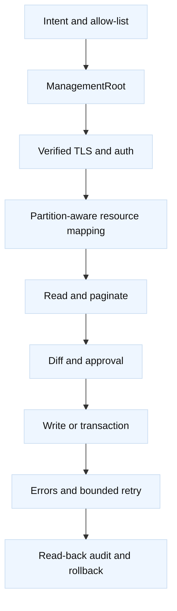

# Comprehensive F5 Python SDK and iControl REST

## Learning objectives

This topic builds a practical mental model for the F5 Python SDK and its
iControl REST resources. You will learn how `ManagementRoot` relates to
authentication and TLS verification, how partitions affect resource mapping,
how to separate reads from writes, and how to make changes idempotent. You will
also design transactions, bounded retries, pagination, tests, mocks, version
guards, audit evidence, and rollback. Names use `.invalid` and no credential or
external service is required.

## Mental model

Fact: the SDK is a client-side object model over BIG-IP management APIs. A
typical entry point is `ManagementRoot`, which carries a management host,
credentials, and session behavior; collections and resource objects map to
REST endpoints. Exact classes, fields, and supported operations depend on SDK
and BIG-IP versions. A successful Python import does not prove that a target
device supports the requested resource.

## Diagram



Authentication proves a principal, while TLS verification proves the server
identity. Never disable certificate verification merely to bypass a lab
warning, and never put a password in source, logs, shell history, or a URL.
Use a secret mechanism supplied by the execution environment, a least-
privilege account, a bounded timeout, and a management network policy. A
fictional read-only construction might look like this (the import is a design
sketch and is not executed here):

```python
from f5.bigip import ManagementRoot

mgmt = ManagementRoot(
    "bigip-a.lab.example.invalid",
    "readonly-user",
    "provided-outside-source",
    verify=True,
)
virtuals = mgmt.tm.ltm.virtuals.get_collection()
for virtual in virtuals:
    print(virtual.name)
```

The important property is intent: this example reads virtual servers. A
resource's `modify`, `create`, or `delete` is a write and needs a separate code
path, approval, and evidence. In many BIG-IP URLs, a partition is represented
by a tilde-qualified path such as `~Common~vs_orders_lab_443`. SDK properties
may expose partition and subfolder differently. Always inspect the object's
`partition`, `subPath`, or self-link rather than assuming `Common`.

## Worked example

The fictional audit checks whether `vs_orders_lab_443` points to the approved
pool in the `Common` partition. It records selected fields, pagination counts,
software version, and a correlation ID. It does not print tokens, cookies, or
full configurations.

| Concern | Read approach | Safe write implication |
| --- | --- | --- |
| Target | verified host and version | refuse unknown version |
| Scope | partition and self-link | allow-list exact object |
| Collection | pagination and count | avoid partial desired state |
| Mutation | diff selected fields | make repeatable and narrow |
| Outcome | status plus read-back | reconcile uncertain timeout |

A production-shaped implementation separates a pure desired-state function
from transport code. First, it obtains a collection, follows `nextLink` or
SDK pagination support, and normalizes only fields relevant to the audit. It
then compares the observed pool reference with the desired reference. If equal,
the operation is a no-op. If different, a reviewer sees the before/after diff,
partition, object self-link, and reason. The write path changes only the
approved field and reads the object back.

Transactions can group compatible changes so a device can validate and commit
them as a unit, but transaction support and semantics are version-specific.
Do not treat a client-side list of calls as atomic. If a transaction is not
available, serialize narrow writes, checkpoint each response, and define what
partial completion means. On HTTP 401 or 403, stop and fix identity or
authorization. On 404, verify partition, path, and version before creating
anything. On 409 or a device busy response, reread state and coordinate with
the change owner. On transient network failure, retry only an idempotent read
or a write with an explicit safe idempotency strategy; unknown write outcomes
require read-back.

Testing should not contact a device by accident. Put transport behind an
interface, mock responses for success, pagination, 401, 404, 409, timeout,
malformed JSON, and partial failure, and assert that secrets are absent from
logs. A contract test against a disposable lab device can verify paths and
fields. Pin a compatible SDK version, detect target software at startup, and
fail closed when a required field or endpoint is missing. Version drift is a
normal maintenance concern, not an exceptional surprise.

## When this breaks

The common failures are wrong partition, stale self-links, an SDK resource
class that does not match the installed release, unverified TLS, expired
credentials, or a collection truncated by missing pagination. A script can
also read one folder while an operator inspects another. Device responses may
return success before asynchronous work reaches the desired state, so read-back
must include status and health where applicable.

Retries are dangerous around creates, deletes, and timeouts. A request may
have reached the device even if the client did not receive the response.
Blindly repeating it can duplicate objects or overwrite a newer operator
change. Inference: use stable names, preconditions, narrow diffs, and a
correlation ID, then reconcile by reading the target. A rollback must restore
captured prior fields and dependencies; deleting a new object can leave
references broken.

Audit evidence fails when logs contain credentials, full cookies, private keys,
or uncontrolled response dumps. Redact deliberately, retain status, timing,
self-link, selected fields, and request IDs. A mock that only tests 200 hides
the most important safety behavior: refusing unsafe scope and handling
unknown outcomes.

## Operational checklist

1. Pin SDK and target-version compatibility; discover target version read-only.
2. Use verified TLS, least privilege, bounded timeouts, and external secret injection.
3. Resolve partition, folder, self-link, and exact resource before mutation.
4. Paginate collections and normalize only allow-listed fields.
5. Separate read, diff, approval, write, validation, and rollback code paths.
6. Use transactions where supported; otherwise serialize and checkpoint writes.
7. Classify errors; bound retries and reconcile every uncertain write by reading.
8. Mock success, pagination, auth, not-found, conflict, timeout, and malformed responses.
9. Record redacted audit evidence and test rollback against a disposable target.

## Questions and answers

1. **What is ManagementRoot?** It is the SDK entry point carrying management
   connection context and exposing mapped BIG-IP resource collections.

Interview reasoning: For “What is ManagementRoot,” describe the safe control loop: discover, normalize an allow-listed state, calculate a minimal diff, obtain approval, apply idempotently, validate behavior, and record redacted evidence. For F5, resolve version, partition, folder, and self-link before mutation and read back after uncertain results. A successful HTTP response is not traffic health, and retries are safe only when reconciliation prevents duplicates.

2. **Why does `verify=True` matter?** It asks the client to validate the
   management server certificate and identity instead of trusting any endpoint.

Interview reasoning: For “Why does `verify=True` matter,” state the mechanism and where it operates, then give the tuple, state transition, and evidence that distinguish the leading hypotheses. Explain the operational trade-off and a worked diagnostic. The caveat is that a successful local check proves only that check, so validate the complete request path and define rollback.

3. **Why is partition awareness essential?** Similar names can exist in
   different administrative scopes, and the REST path encodes that scope.

Interview reasoning: For “Why is partition awareness essential,” state the mechanism and where it operates, then give the tuple, state transition, and evidence that distinguish the leading hypotheses. Explain the operational trade-off and a worked diagnostic. The caveat is that a successful local check proves only that check, so validate the complete request path and define rollback.

4. **Is a 200 response proof of completion?** No. Read back state and relevant
   health, especially when device work is asynchronous.

Interview reasoning: For “Is a 200 response proof of completion,” state the mechanism and where it operates, then give the tuple, state transition, and evidence that distinguish the leading hypotheses. Explain the operational trade-off and a worked diagnostic. The caveat is that a successful local check proves only that check, so validate the complete request path and define rollback.

5. **When is retrying a write safe?** Only when server semantics and the
   operation's idempotency make duplicate execution harmless or impossible.

Interview reasoning: For “When is retrying a write safe,” describe the safe control loop: discover, normalize an allow-listed state, calculate a minimal diff, obtain approval, apply idempotently, validate behavior, and record redacted evidence. For F5, resolve version, partition, folder, and self-link before mutation and read back after uncertain results. A successful HTTP response is not traffic health, and retries are safe only when reconciliation prevents duplicates.

6. **What should a 404 trigger?** Check version, partition, folder, and
   self-link; do not assume the object should be created.

Interview reasoning: For “What should a 404 trigger,” describe the safe control loop: discover, normalize an allow-listed state, calculate a minimal diff, obtain approval, apply idempotently, validate behavior, and record redacted evidence. For F5, resolve version, partition, folder, and self-link before mutation and read back after uncertain results. A successful HTTP response is not traffic health, and retries are safe only when reconciliation prevents duplicates.

7. **Why mock the SDK?** To prove safety and error handling without changing a
   device, while reserving contract tests for a disposable lab.

Interview reasoning: For “Why mock the SDK,” describe the safe control loop: discover, normalize an allow-listed state, calculate a minimal diff, obtain approval, apply idempotently, validate behavior, and record redacted evidence. For F5, resolve version, partition, folder, and self-link before mutation and read back after uncertain results. A successful HTTP response is not traffic health, and retries are safe only when reconciliation prevents duplicates.

8. **What belongs in an audit record?** Target, scope, actor reference,
   correlation ID, redacted before/after fields, status, timing, and validation.

Interview reasoning: For “What belongs in an audit record,” describe the safe control loop: discover, normalize an allow-listed state, calculate a minimal diff, obtain approval, apply idempotently, validate behavior, and record redacted evidence. For F5, resolve version, partition, folder, and self-link before mutation and read back after uncertain results. A successful HTTP response is not traffic health, and retries are safe only when reconciliation prevents duplicates.

Fact: [F5 Python SDK documentation](https://clouddocs.f5.com/products/extensions/f5-icontrol-rest-python/latest/)
documents SDK resource mappings and usage patterns. Fact: [F5 iControl REST
API reference](https://clouddocs.f5.com/api/icontrol-rest/) documents
version-specific endpoints and schemas. Fact: [RFC 9110](https://www.rfc-editor.org/rfc/rfc9110)
defines HTTP status semantics relevant to client error handling. The exact
retry policy, field allow-list, transaction boundary, version pin, redaction
scheme, and rollback design are engineering inferences that require local
testing and change control.
