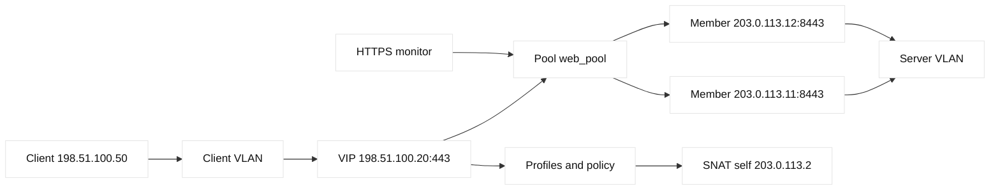
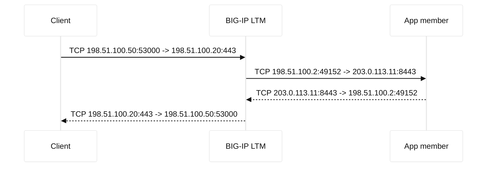

# F5 LTM implementation labs

This implementation track turns the BIG-IP Local Traffic Manager (LTM) object
model into a sequence of safe, repeatable reasoning exercises. It is a learning
reference, not a production configuration guide. Names such as `ltm-lab.example`
and addresses in `198.51.100.0/24`, `203.0.113.0/24`, and `2001:db8::/32` are
reserved for documentation. Substitute an authorized lab appliance only after a
change review.

## Learning objectives

By the end, you should be able to trace a request through self IPs, VLANs, a
virtual server (VIP), pool, member, node, monitor, profiles, SNAT, persistence,
and policy hooks. You should distinguish an LTM module/service from the larger
BIG-IP platform, predict the source and destination IP:port at each leg, and
diagnose symptoms from evidence rather than from object names alone. You will
also practice TLS client/server profiles and a conservative failure workflow.

## Prerequisites

Know IPv4 subnetting, ARP, VLANs, TCP handshakes, HTTP status codes, DNS, and
basic TLS terminology. Have a browser or `curl`, `openssl`, and a text editor.
The labs need either a diagram-only exercise or an isolated BIG-IP VE/lab
environment supplied by an instructor. Do not paste credentials, private keys,
or tenant addresses into commands or tickets.

## Mental model

LTM is the local, per-device traffic-management service on the BIG-IP platform.
BIG-IP is the appliance/software platform that can host LTM, DNS, ASM/AWAF,
APM, and other modules; saying “the BIG-IP” does not identify which module made
a decision. LTM receives traffic on a virtual server address, applies profiles
and policies, chooses a pool member, and creates or translates a server-side
flow. It is a proxy, so the client-side and server-side TCP conversations may
have different endpoints and lifetimes.

The first useful question is “which leg am I observing?” A client packet to
`198.51.100.20:443` may arrive on a VLAN whose BIG-IP self IP is
`198.51.100.2`. After selection, the server leg might leave with source
`203.0.113.2:49152` (a server-VLAN SNAT address) and destination
`203.0.113.11:8443`. Without SNAT,
the source could remain the client address, provided the return route points at
the BIG-IP. A monitor is a synthetic health test, not proof that every request
works; persistence is a selection preference, not a guarantee of session
correctness.

## Architecture

The minimum topology has a client VLAN, a server VLAN, and a self IP on each
VLAN. A self IP is an address owned by BIG-IP on a VLAN and used for management,
routing, failover, or server-side return traffic. A floating self IP is shared
by an active device pair; a non-floating self IP belongs to one device. A VLAN
is the Layer-2 broadcast domain attached to a BIG-IP interface or trunk. A
virtual server binds a VIP and service port, for example `198.51.100.20:443`.

The pool contains members, each an address and service port such as
`203.0.113.11:8443`. A node is the reusable host object behind one or more
members. A health monitor tests a node or member using a protocol-specific
request and expected response. Profiles define TCP, HTTP, TLS, persistence,
and other behavior. SNAT changes the source on the server leg. iRules and
Local Traffic Policies can inspect or transform traffic; use the least powerful
mechanism that expresses the requirement and document evaluation order.



| Object | Answers | Lab observation |
| --- | --- | --- |
| VLAN/self IP | Where can BIG-IP send or receive? | Interface/VLAN and route evidence |
| VIP/virtual server | Which client destination and service are accepted? | Address, port, status, profiles |
| Pool/member/node | Which server endpoint can receive? | Availability and selection |
| Monitor | What synthetic test is healthy? | Send string, receive string, interval |
| SNAT/persistence | What source is seen, and how is selection remembered? | Translation table and persistence record |

## Traffic tuple walkthrough

A TCP flow can be represented as `(protocol, source IP, source port,
destination IP, destination port)`. For a client request, the client-side tuple
is `(TCP, 198.51.100.50, 53000, 198.51.100.20, 443)`. BIG-IP terminates that
connection at the VIP. The server-side tuple might be `(TCP, 198.51.100.2,
49152, 203.0.113.11, 8443)` when SNAT is enabled. The destination changes due
to pool selection and the service-port mapping; the source changes due to SNAT.
The response reverses each leg independently. The client still receives a
response from `198.51.100.20:443`, while the server replies to the translated
source.

If the VIP uses destination address translation but no port translation, the
member may receive port 443. If a pool member is configured as 8443, a service
translation is expected. Never infer this from a diagram: inspect the virtual
server and member service settings. IPv6 adds the same reasoning with
`2001:db8:10::50` and `2001:db8:20::11`; do not assume NAT behavior is identical
between address families.



## Worked examples

Example one is a healthy HTTPS request. The monitor marks both members up,
the VIP accepts 443, the TLS client profile presents a certificate for
`ltm-lab.example`, and the pool selects `.11`. The application log should show
the SNAT address unless an X-Forwarded-For policy is deliberately configured.
Example two is a half-open failure: the monitor succeeds on `/healthz`, but the
real `/checkout` request returns 503. That is evidence that health coverage is
too narrow, not evidence that the monitor is “wrong.” Compare application logs,
HTTP profile behavior, policy branches, and member-specific results.

| Symptom | First evidence | Plausible layer | Safe next test |
| --- | --- | --- | --- |
| Connection refused | VIP listener and packet capture | VLAN, VIP, TCP | Test VIP TCP only |
| 503 from LTM | Pool/member availability | Monitor or pool | Test each member path |
| TLS alert | Client/server profile and certificate chain | TLS/SNI | `openssl s_client` in lab |
| Works once, then wrong user | Persistence record and cookie | Persistence/application | Disable persistence in a copy |
| App sees wrong client | Server-leg tuple and headers | SNAT/header policy | Compare with controlled SNAT |

## Lab 1 - Basic load balancing

Goal: explain a request without changing production state. Draw client
`198.51.100.50`, VIP `198.51.100.20:80`, and members
`203.0.113.11:8080` and `203.0.113.12:8080`. Mark a monitor that requests
`/healthz` and expects `200`. Then answer: which listener receives the SYN,
which member receives the server SYN, and what source address sees the app?

In an isolated appliance, inspect the virtual server, pool, member states,
monitor association, and route table using the read-only UI or equivalent
show commands approved by your instructor. Generate one request with
`curl --max-time 3 http://198.51.100.20/` only if that address is your lab VIP.
Record timestamps, selected member, status code, and both tuples. Do not use a
real public IP or a command that creates, deletes, or enables configuration.

## Lab 2 - Failure detection

Goal: separate monitor state from data-plane behavior. Start with two members
up. In a disposable lab, make `.11` return a non-200 health response or stop
its test service, then observe the monitor interval, timeout, and pool state.
Send several requests and verify they reach `.12`; restore `.11` and observe
the rise interval before declaring recovery. If a monitor marks a member down
but the application is healthy, compare the monitor Host header, URI, TLS
profile, expected response, source route, and firewall rules. The safe inference
is “the configured test failed,” not automatically “the server is dead.”

## Lab 3 - SNAT

Goal: predict return routing. With client `198.51.100.50` and member
`203.0.113.11`, first model no SNAT: the member must route replies for the
client subnet through BIG-IP. Model SNAT using self IP `198.51.100.2`: the
member replies to `.2`, making the return path local to the BIG-IP. Capture
only in the lab and compare application logs with the server-leg source.

Check ephemeral-port exhaustion and translation-table lifetime in a load test
designed for the lab. A policy that adds `X-Forwarded-For: 198.51.100.50` can
preserve client identity at HTTP level, but it is not the same as preserving the
IP-layer source. Treat that header as untrusted unless the application trusts
only the BIG-IP insertion path.

## Lab 4 - HTTPS and SSL offload

Goal: identify TLS termination boundaries. Configure only in a disposable lab
or inspect an existing read-only object: a client TLS profile on the VIP and,
if re-encryption is required, a server TLS profile on the pool leg. Verify the
certificate name, chain, validity, SNI behavior, protocol policy, and whether
the server expects HTTP or HTTPS. Use a reserved lab name and
`openssl s_client -connect 198.51.100.20:443 -servername ltm-lab.example` only
when the VIP is local to your exercise. A successful client handshake does not
prove the server handshake succeeds.

## Lab 5 - Persistence

Goal: understand affinity and its failure modes. Compare source-address,
cookie, and TLS-session approaches conceptually, then inspect the selected
method, timeout, mirror behavior, and fallback. Send two requests with the
same lab cookie and one without it. Confirm whether the cookie maps to a member
and whether a down member causes safe re-selection. Ask whether the application
really requires affinity; shared session storage is often a stronger design.

## Lab 6 - Troubleshooting

Start from the user symptom and collect one fact per layer: DNS answer, client
route, VIP listener, TLS handshake, pool state, monitor result, server-leg
tuple, HTTP response, and application log. Preserve timestamps and correlation
IDs. A packet capture should be narrowly filtered to the reserved VIP and lab
client. Do not “fix” an incident by changing monitors, persistence, or SNAT
before preserving the baseline.

```mermaid
%%{init: {'theme':'base', 'themeVariables': {'primaryColor':'#ffffff','primaryTextColor':'#111111','lineColor':'#333333','secondaryColor':'#eeeeee'}}}%%
flowchart TD
    S[User symptom] --> D{DNS resolves VIP?}
    D -- no --> DNS[Check DNS record and TTL]
    D -- yes --> L{VIP accepts TCP?}
    L -- no --> NET[Check VLAN self IP route ACL]
    L -- yes --> T{TLS completes?}
    T -- no --> TLS[Check SNI chain client profile]
    T -- yes --> P{Pool has available member?}
    P -- no --> MON[Check monitor request and response]
    P -- yes --> A{Server leg returns?}
    A -- no --> APP[Check SNAT route firewall app listener]
    A -- yes --> H[Compare HTTP policy persistence and logs]
```

## When this breaks

Common breakages include a VLAN tag mismatch, a self IP without a usable route,
a VIP listening on the wrong port, a monitor that tests a different virtual
host, an HTTPS server profile pointed at a plaintext member, and a SNAT pool
whose addresses are exhausted. Persistence can pin clients to a degraded
member. An iRule can short-circuit a request before pool selection, while a
Local Traffic Policy can select a different pool based on host or URI. HA
failover can expose assumptions about floating self IPs, MAC learning, and
connection mirroring. These are hypotheses to test with state and packet
evidence, not a checklist of automatic causes.

## Operational checklist

1. Name the module, device, tenant, VLAN, VIP, pool, member, and time window.
2. Record client- and server-side tuples, including translated ports.
3. Verify listener, route, monitor, profile, SNAT, persistence, and policy state.
4. Compare one healthy and one failing member with the same request.
5. Change one reversible variable in an approved lab or change window.
6. Verify response, logs, metrics, persistence, and return routing.
7. Document rollback, observed facts, and inferences separately.

## Questions and answers

1. **Is LTM the same as BIG-IP?** No. LTM is a BIG-IP module/service; BIG-IP
   names the platform. This distinction identifies the correct configuration
   and telemetry surface.

Interview reasoning: For “Is LTM the same as BIG-IP,” state the mechanism and where it operates, then give the tuple, state transition, and evidence that distinguish the leading hypotheses. Explain the operational trade-off and a worked diagnostic. The caveat is that a successful local check proves only that check, so validate the complete request path and define rollback.

2. **What is a VIP?** It is the client-facing address and service binding of a
   virtual server. A VIP alone does not select a healthy application member.

Interview reasoning: For “What is a VIP,” distinguish the address from the LTM listener contract: the virtual server owns profiles, policies, pool selection, SNAT, and persistence. Trace a client tuple to the VIP and a second tuple to the member, then compare direct-member and VIP tests. The caveat is that a reachable VIP can still have no eligible pool member or an incorrect route domain.

3. **What is a node versus a member?** A node is a host object; a member is a
   node plus a service port in a pool. One node may provide several members.

Interview reasoning: For “What is a node versus a member,” a node is an address object, while a member binds that address to a service port and monitor context. Check node state, member state, inherited monitor, and pool selection independently; a healthy host can expose a failed 443 member while 8443 works. Port-specific health is why the distinction matters operationally.

4. **Does an up monitor prove the application works?** No. It proves only that
   the configured synthetic exchange met its criteria at that time.

Interview reasoning: For “Does an up monitor prove the application works,” state exactly what the probe sends and expects: source, destination port, Host/SNI, URI, status or body, interval, and timeout. Replay it from the same path and compare a real request and origin logs. A deeper F5 monitor improves fidelity but can make a dependency outage eject every member, so its dependency budget must be explicit.

5. **Why can the app see a BIG-IP address?** SNAT deliberately replaces the
   client source on the server leg to make return routing predictable.

Interview reasoning: For “Why can the app see a BIG-IP address,” state the mechanism and where it operates, then give the tuple, state transition, and evidence that distinguish the leading hypotheses. Explain the operational trade-off and a worked diagnostic. The caveat is that a successful local check proves only that check, so validate the complete request path and define rollback.

6. **Does X-Forwarded-For undo SNAT?** No. It conveys an HTTP identity header;
   it does not change the IP-layer tuple or make the header inherently trusted.

Interview reasoning: For “Does X-Forwarded-For undo SNAT,” show the two tuples and the return route: SNAT changes the source seen by the backend so replies return through the stateful LTM. Verify the self IP, backend ACL view, translated-port utilization, and client identity headers. It solves asymmetry but hides the original source and has finite port capacity, so scale translation addresses deliberately.

7. **Where does TLS terminate?** At every profile boundary configured to
   terminate TLS. Re-encryption creates a second, independent TLS handshake.

Interview reasoning: For “Where does TLS terminate,” walk the handshake fields rather than saying only “encrypted”: SNI selects identity, SAN matches the name, the chain reaches a trusted root, and protocol policy permits negotiation. Test client-to-LTM and LTM-to-member independently. Re-encryption protects the second hop but creates a second certificate/trust lifecycle; front-end success does not prove backend authorization or readiness.

8. **Can persistence override load balancing?** Yes. A valid persistence
   record can keep selecting one member until timeout, deletion, or failure.

Interview reasoning: For “Can persistence override load balancing,” explain the persistence key and lifetime, then inspect key cardinality, member skew, table pressure, expiry, and failover behavior. A shared NAT address can concentrate many users on one member. Persistence preserves session continuity but weakens distribution and can retain a bad mapping; shared application state may allow a shorter timeout.

9. **Why might a 503 occur with healthy servers?** The pool may be unavailable
   to this VIP, a policy may reject the request, or the monitor may not model
   the real transaction.

Interview reasoning: For “Why might a 503 occur with healthy servers,” state the mechanism and where it operates, then give the tuple, state transition, and evidence that distinguish the leading hypotheses. Explain the operational trade-off and a worked diagnostic. The caveat is that a successful local check proves only that check, so validate the complete request path and define rollback.

10. **What tuple should a capture show?** The client leg targets the VIP; the
    server leg targets the selected member. Compare ports and sources rather
    than expecting one end-to-end TCP flow.

Interview reasoning: For “What tuple should a capture show,” state the mechanism and where it operates, then give the tuple, state transition, and evidence that distinguish the leading hypotheses. Explain the operational trade-off and a worked diagnostic. The caveat is that a successful local check proves only that check, so validate the complete request path and define rollback.

11. **What should be checked first for a TLS alert?** Identify the failing leg,
    then inspect SNI, certificate chain, protocol policy, and server profile.

Interview reasoning: For “What should be checked first for a TLS alert,” walk the handshake fields rather than saying only “encrypted”: SNI selects identity, SAN matches the name, the chain reaches a trusted root, and protocol policy permits negotiation. Test client-to-LTM and LTM-to-member independently. Re-encryption protects the second hop but creates a second certificate/trust lifecycle; front-end success does not prove backend authorization or readiness.

12. **When is an iRule appropriate?** When a reviewed, tested event-driven rule
    is necessary. Prefer a simpler profile or policy when it expresses the
    same behavior, because custom code increases review and failure surface.

Interview reasoning: Map the answer to the BIG-IP LTM object model: virtual server and profiles admit the client flow, a monitor determines member eligibility, a pool chooses a member, and SNAT/persistence influence the server-side tuple. In a diagnosis, compare VIP-side and member-side captures, monitor logs, pool state, persistence records, and return routing. The caveat is that a green monitor is only evidence for that probe; it is not proof that every user request, TLS name, dependency, or capacity budget is healthy.

## Primary references

- [F5 BIG-IP Local Traffic Management documentation](https://techdocs.f5.com/en-us/bigip-14-1-0/big-ip-local-traffic-management.html) (vendor terminology and object behavior).
- [F5 virtual server concepts](https://techdocs.f5.com/en-us/bigip-17-1-0/big-ip-local-traffic-management/tmm-concepts-virtual-servers.html) (VIP and listener concepts).
- [F5 pools and pool members](https://techdocs.f5.com/en-us/bigip-17-1-0/big-ip-local-traffic-management/pools.html) (pool selection and health state).
- [RFC 9293: Transmission Control Protocol](https://www.rfc-editor.org/rfc/rfc9293) (TCP endpoint and connection behavior).
- [RFC 8446: TLS 1.3](https://www.rfc-editor.org/rfc/rfc8446) (TLS handshake and endpoint semantics).
- [RFC 5737: IPv4 documentation blocks](https://www.rfc-editor.org/rfc/rfc5737) and [RFC 3849: IPv6 documentation prefix](https://www.rfc-editor.org/rfc/rfc3849) (safe fictional addresses).

The object descriptions above are vendor facts where they describe F5 terms;
the recommendation to compare healthy and failing members, minimize policy
complexity, and preserve a baseline is an engineering inference for safe
operations.
