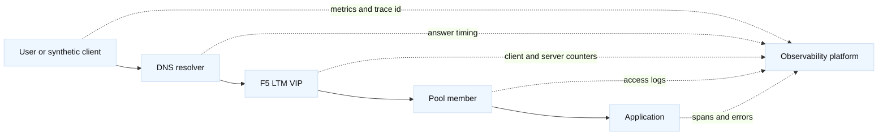

# Network observability and SLOs

## Learning objectives

By the end of this topic, a learner can distinguish metrics, logs, traces,
flows, packets, and synthetic checks; turn an end-user symptom into a bounded
set of network hypotheses; and define a service-level objective (SLO) that can
be measured across DNS, a proxy, an F5 LTM virtual server, and an application.
The learner will also understand why a dashboard is not evidence by itself,
how to preserve timestamps and correlation identifiers, and how to automate a
safe evidence bundle without collecting secrets or personal payloads.

## Prerequisites

Know the TCP connection lifecycle, DNS resolution, HTTP status codes, TLS
handshakes, and the F5 LTM objects virtual server, pool, member, monitor, and
profile. You should be comfortable with `dig`, `curl`, `ss`, `openssl s_client`,
and reading a small Python program. A local lab is enough; the examples use
reserved documentation addresses and `example.invalid` names.

## Mental model

Observability is the ability to ask a new question about a system using the
signals it emits. Monitoring usually starts with known questions, such as “is
the VIP accepting TCP connections?” Both are useful. A metric compresses many
events into a time series; a log records a structured event; a trace links
work across services; a flow record summarizes who talked to whom; and a
packet capture shows protocol behavior at a particular observation point.
None is universally superior. Each has a different cost, retention period,
sampling model, and blind spot.

An SLI is the measured indicator, such as the proportion of valid HTTPS
requests that receive an acceptable response within 500 ms. An SLO is the
target for that indicator, such as 99.9% over a calendar month. An SLA is a
broader agreement that may include consequences. The precise availability
formula is a design choice: count DNS failures, connection failures, TLS
failures, and HTTP errors explicitly rather than hiding them in “requests
seen by the application.” This is an engineering inference that should be
documented with the service owner.

For an F5 path, place observation points at the client test, DNS answer, LTM
client-side connection, LTM server-side connection, pool member, and
application. The two legs of a proxy can have different latency and failure
rates. A healthy monitor proves only that a particular probe path and response
matched expectations; it does not prove that every client request is healthy.

## Diagram



The dotted lines represent telemetry, not request traffic. A useful dashboard
shows the request path and the time window together. A separate panel for
“F5 pool members up” can remain green while a client-side TLS profile is
misconfigured, so panels should be joined by a common service identity and
correlation field.

## Worked example

Assume `checkout.lab.example` resolves to `198.51.100.70:443`, an F5 virtual
server selects two members at `203.0.113.70:8443` and `203.0.113.71:8443`, and
the team reports “checkout is slow.” Start with a five-minute, read-only
comparison rather than changing the pool.

| Signal | Question | Interpretation |
| --- | --- | --- |
| DNS latency and answer | Did clients receive the expected VIP? | A stale or slow answer can precede every other failure. |
| LTM client-side latency | How long until the VIP responds? | Points toward route, TCP, TLS, or policy issues. |
| LTM server-side latency | How long until a member responds? | Separates backend queueing from front-door delay. |
| HTTP result class | Are errors 4xx, 5xx, or timeouts? | Different owners and retry behavior apply. |
| Monitor state | Which member is eligible? | A probe is a narrow health assertion. |
| Trace/request ID | Can one request be followed? | Joins proxy and application evidence. |

Define the SLI before looking for a favorable graph: “valid requests to the
checkout VIP for which DNS resolved to an approved answer and the complete
HTTPS request returned a non-5xx response within 750 ms.” Decide whether
timeouts count as failures (they normally should), whether retries count once
or multiple times, and whether planned maintenance is excluded. Keep that
decision in the service record.

A synthetic check can be intentionally small:

```bash
dig +time=2 +tries=1 checkout.lab.example A
curl --connect-timeout 2 --max-time 5 --resolve checkout.lab.example:443:198.51.100.70 \
  -sS -o /dev/null -w 'code=%{http_code} dns=%{time_namelookup} connect=%{time_connect} tls=%{time_appconnect} total=%{time_total}\n' \
  https://checkout.lab.example/health
```

The command measures a lab endpoint selected by `--resolve`; it does not
change DNS, and its `time_namelookup` value is not a resolver measurement in
this mode. Use the preceding `dig` result for DNS timing. Do not aim it at a
production service without approval.
Capture the UTC timestamp, resolver used, source location, VIP, status code,
and a generated request ID. If the synthetic client reports 1.2 seconds total
while the application trace reports 80 ms, inspect DNS, TCP, TLS, and proxy
queueing. If the LTM server-side histogram rises with application latency,
the likely owner shifts toward the pool or its dependencies. “Likely” is an
inference; confirm with packet or transaction evidence.

A Python evidence collector can produce a redacted record from local commands:

```python
from dataclasses import dataclass
from datetime import datetime, timezone
import re
import subprocess

@dataclass(frozen=True)
class Observation:
    command: str
    output: str
    captured_at: str

ALLOWED = {
    "dns": ["dig", "+time=2", "+tries=1", "example.invalid", "A"],
}

def observe(name: str) -> Observation:
    command = ALLOWED[name]
    result = subprocess.run(command, check=False, text=True,
                            capture_output=True, timeout=5)
    output = result.stdout + result.stderr
    output = re.sub(r"(?i)(authorization:\s*)([^\s]+)", r"\1REDACTED", output)
    return Observation(" ".join(command), output[-4000:],
                       datetime.now(timezone.utc).isoformat())

print(observe("dns"))
```

The allowlist, timeout, truncation, and redaction policy matter more than the
few lines of Python. A real collector should avoid command interpolation,
payload capture, credentials, and unconstrained output. F5 REST evidence can
be gathered with a read-only service account and fields such as virtual-server
status, member state, monitor reason, and counters; never print the token.

## When this breaks

The most common observability failure is measuring only successful traffic.
An application access log cannot describe requests that never reached the
application. Conversely, a packet capture at the client cannot explain an
internal queue after the proxy. Sampling can make rare TLS failures disappear,
and clock skew can make a sequence appear impossible. NTP health and timezone
normalization are therefore part of incident evidence.

High-cardinality labels can make a metrics system expensive or unusable. Do
not label by full URL, user ID, certificate serial, or arbitrary request ID;
use bounded dimensions such as service, VIP, status class, region, and pool.
Put the request ID in logs and traces, where retention and access controls can
be applied deliberately. A metric that says “all members up” can mask one
member serving errors when the monitor endpoint is independent of the real
dependency path. This is why a user-journey synthetic and a monitor are
complementary.

Alert fatigue is another failure mode. A DNS TTL change, LTM maintenance
window, or DDI lease surge may produce expected transitions. Alerts should
name the SLO impact, owner, runbook, and initial query. An alert without a
decision path encourages unsafe changes such as disabling a monitor or forcing
all traffic to one pool member.

## Operational checklist

1. Define the service boundary, valid request, SLI formula, SLO window, and
   error budget with the owner.
2. Verify UTC clocks, DNS resolver identity, VIP, pool, member, and monitor
   names before comparing signals.
3. Correlate client, DNS, LTM, backend, and application evidence by timestamp
   and request ID; write facts separately from hypotheses.
4. Check both proxy legs, status classes, latency percentiles, retries,
   connection counts, SNAT usage, and pool state.
5. Preserve a redacted evidence bundle and record the exact queries and
   dashboard time range.
6. Use a packet capture only with scope, retention, and payload handling
   approved; prefer headers, counters, and synthetic requests first.
7. Tie remediation to the error budget and verify that the SLO improves after
   the change; state rollback before changing traffic.

## Questions and answers

1. **Why are metrics not enough?** Metrics show aggregate behavior but often
   hide a single handshake, route, or request-level failure. Logs, traces, and
   packet evidence fill different gaps.

Interview reasoning: For “Why are metrics not enough,” define the SLO numerator, denominator, threshold, window, and exclusions, then decompose the symptom into DNS, connect, TLS, queue, origin, and retry time. Use request IDs and tail percentiles rather than averages. Retries may improve apparent success while consuming capacity, so report attempts, outcomes, and retry amplification separately.

2. **Should a DNS failure count against an HTTP SLO?** It depends on the
   declared service boundary. Decide explicitly; otherwise teams can exclude
   the most user-visible failure.

Interview reasoning: For “Should a DNS failure count against an HTTP SLO,” record resolver identity, A/AAAA/CNAME data, flags, response code, authority, and TTL, then compare the recursive answer with an authoritative query. Split-horizon DNS, `/etc/hosts`, and service discovery can produce different views. A correct DNS answer proves only name resolution; route, VIP, TLS, policy, and application health still require separate probes.

3. **What does an F5 health monitor prove?** It proves that the configured
   probe received its expected result along its probe path at that time.

Interview reasoning: For “What does an F5 health monitor prove,” state exactly what the probe sends and expects: source, destination port, Host/SNI, URI, status or body, interval, and timeout. Replay it from the same path and compare a real request and origin logs. A deeper F5 monitor improves fidelity but can make a dependency outage eject every member, so its dependency budget must be explicit.

4. **Why use percentiles instead of averages?** Averages hide tail latency,
   while p95 or p99 exposes the experience of slower requests. Choose a
   percentile that matches user impact and sample size.

Interview reasoning: For “Why use percentiles instead of averages,” state the mechanism and where it operates, then give the tuple, state transition, and evidence that distinguish the leading hypotheses. Explain the operational trade-off and a worked diagnostic. The caveat is that a successful local check proves only that check, so validate the complete request path and define rollback.

5. **What is an error budget?** It is the tolerated unreliability implied by
   the SLO, such as 0.1% for a 99.9% target; it guides release and reliability
   trade-offs.

Interview reasoning: For “What is an error budget,” state the mechanism and where it operates, then give the tuple, state transition, and evidence that distinguish the leading hypotheses. Explain the operational trade-off and a worked diagnostic. The caveat is that a successful local check proves only that check, so validate the complete request path and define rollback.

6. **How can a trace cross an F5 proxy?** Preserve or generate a correlation
   header under an approved policy and record both client-side and
   server-side spans; do not trust arbitrary external IDs blindly.

Interview reasoning: For “How can a trace cross an F5 proxy,” identify where each connection terminates and which method, headers, authority, body framing, and timeout cross the boundary. Compare downstream and upstream tuples with request IDs. A proxy improves policy and pooling but can introduce queueing, stale connections, header trust, and retry errors; a timeout after a POST may mean the server changed state even if the client saw no response.

7. **Why normalize time?** Without synchronized clocks, event order and
   latency calculations can be wrong even when every individual log is valid.

Interview reasoning: For “Why normalize time,” state the mechanism and where it operates, then give the tuple, state transition, and evidence that distinguish the leading hypotheses. Explain the operational trade-off and a worked diagnostic. The caveat is that a successful local check proves only that check, so validate the complete request path and define rollback.

8. **When is a packet capture appropriate?** When counters and transaction
   logs cannot distinguish TCP, TLS, MTU, or retransmission hypotheses and the
   capture scope and handling are approved.

Interview reasoning: For “When is a packet capture appropriate,” state the mechanism and where it operates, then give the tuple, state transition, and evidence that distinguish the leading hypotheses. Explain the operational trade-off and a worked diagnostic. The caveat is that a successful local check proves only that check, so validate the complete request path and define rollback.

Fact: [OpenTelemetry concepts](https://opentelemetry.io/docs/concepts/) define
common telemetry signal roles, and [RFC 3339](https://www.rfc-editor.org/rfc/rfc3339)
defines an Internet timestamp format. Fact: F5 publishes BIG-IP statistics and
monitor terminology in its [TechDocs](https://techdocs.f5.com/). The SLI
boundary, label cardinality limits, and evidence ordering above are engineering
recommendations; adapt them to the service’s privacy, retention, and change
policies.
