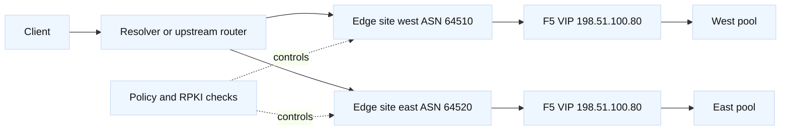

# BGP, anycast, and routing policy

## Learning objectives

This topic gives an SDE1/SDE2 enough routing-policy vocabulary to reason about
traffic entering a service, without pretending that application engineers
should casually edit a provider’s BGP configuration. You will explain ASNs,
prefixes, eBGP, iBGP, route selection, advertisements, withdrawals, anycast,
communities, and asymmetric paths. You will connect those ideas to DNS/GTM
steering, F5 VIP reachability, DDI address ownership, and safe automation.
You will also learn how to investigate a route symptom using read-only
commands and how to separate an origin problem from a propagation or policy
problem.

## Prerequisites

Review IPv4/IPv6 addressing, longest-prefix matching, default routes, TCP
handshakes, DNS TTLs, and the difference between an F5 virtual server and a
pool member. Be comfortable reading `ip route`, `dig`, and a route-monitoring
output. The examples use documentation prefixes and fictional ASNs.

## Mental model

BGP is a path-vector control protocol. A speaker advertises a prefix and
attributes; a neighbor applies import policy, selects a best path, and may
advertise an accepted route to another neighbor after export policy. A route
being present in one table does not prove that every router has it, and a
route being selected does not prove that the application behind the prefix is
healthy.

Fact: longest-prefix matching happens in the forwarding table, while BGP’s
best-path process compares attributes according to implementation and policy.
Common attributes include local preference, AS path length, origin type,
MED, eBGP/iBGP preference, and next-hop reachability. Exact tie-break rules
and defaults are vendor/version dependent. Inference: operational runbooks
should record the policy intent and expected path, not rely on memorized tie
break order.

Anycast assigns the same service prefix to multiple sites. Routing chooses a
topologically preferred site, so “nearest” means best according to routing
policy, not necessarily geographic distance. Anycast is attractive for DNS
and stateless edge services. Long-lived TCP sessions can break when the
selected site changes, so state replication, connection draining, and failure
convergence need explicit design. A GTM/BIG-IP DNS answer can steer a client
to a site before the connection begins; anycast influences the route after the
answer or for a shared service address. These are different control loops.

## Diagram



The two sites advertise one documentation prefix in this model. A DNS/GTM
design might instead return different site-specific VIPs. Do not combine the
two patterns casually: the failure semantics, client caching, and ownership
are different.

## Worked example

The fictional `api.harbor.example` service has west and east F5 clusters. The
network team wants west preferred for customers in the western region, while
the application team wants a site withdrawal to stop new traffic. The first
step is to write a route contract.

| Item | Intended value | Evidence to request |
| --- | --- | --- |
| Prefix | `198.51.100.0/24` | Origin and aggregate policy |
| West origin | ASN 64510 | BGP neighbor and export policy |
| East origin | ASN 64520 | BGP neighbor and export policy |
| Health gate | LTM VIP and pool aggregate | Automation decision log |
| Preference | West in target region | Community/local-pref policy |
| Withdrawal | Stop new advertisements | Timestamped route views |

Before changing anything, inspect local state:

```bash
ip route get 198.51.100.80
dig +short api.harbor.example A
```

Provider tooling may expose `show route`, looking-glass results, BMP feeds,
or a route-collector page. The exact command is platform-specific and should
be obtained from the network owner. Compare at least three perspectives:
origin edge, an external collector, and the client’s recursive path. If west
has withdrawn but the client still reaches west, cached DNS or a stale route
may be involved. If a collector sees east while the client times out, examine
the east F5 VIP, firewall, and return path before blaming BGP.

A safe automation pattern is to calculate a desired state, produce a diff,
and require a separate approval before a routing API call. The health gate
should be conservative: an LTM member monitor is not enough if the VIP policy,
certificate, or application dependency is broken. A controller can require
two independent signals, for example a synthetic HTTPS check and an F5 pool
state summary, with a hold-down timer to prevent route flapping.

```python
from dataclasses import dataclass

@dataclass(frozen=True)
class SiteSignal:
    name: str
    vip_ok: bool
    pool_healthy: bool
    synthetic_ok: bool

def may_advertise(site: SiteSignal) -> bool:
    """Return intent only; this function never changes a router."""
    return site.vip_ok and site.pool_healthy and site.synthetic_ok

signals = [SiteSignal("west", True, True, True),
           SiteSignal("east", True, True, False)]
print({s.name: may_advertise(s) for s in signals})
```

The code deliberately expresses an intent decision rather than using SSH to
run a configuration command. A production controller would add stale-signal
detection, quorum, rate limits, audit records, explicit prefix allowlists,
and a rollback plan. F5 REST or the F5 Python SDK can supply read-only VIP and
pool evidence, while a separate network automation system owns BGP policy.

Communities are useful labels for policy, such as “do not advertise to peer
group X” or “lower preference.” Their meaning is local to an organization or
provider. Never assume a community has the same effect across networks. Prefix
filters, maximum-prefix limits, route-origin validation, and authentication
protect against common control-plane mistakes, but none removes the need for
staged changes.

## When this breaks

A missing route may result from an LTM VIP not being enabled, an F5 self IP or
VLAN issue, a firewall filter, an incorrect aggregate, an import/export
policy, or a provider propagation delay. A route can be present while the
next hop is unresolved. A route can be correct in one address family and
absent in the other during an IPv6 migration. A more-specific advertisement
can attract traffic unexpectedly, and an accidentally retained route can keep
traffic at a drained site.

Anycast introduces state and observability challenges. A client can move
between sites mid-incident, making application logs appear inconsistent. TCP
connections and TLS sessions may fail if the new site lacks connection state
or a compatible certificate/key. Health-based withdrawal can flap when the
health check itself depends on the route it controls. Use hold-downs and an
out-of-band probe where appropriate; these are engineering choices, not BGP
requirements.

Security failures matter too. RPKI route-origin validation can mark a route
invalid, but policy may treat invalid, unknown, and valid differently. A
malicious or accidental announcement can leak private prefixes or attract
traffic. Keep credentials, private keys, and router configuration out of
examples and logs. SSH access should use host-key verification and an
allowlisted command, not a blind `StrictHostKeyChecking=no` shortcut.

## Operational checklist

1. Identify the exact prefix, address family, origin AS, owner, and intended
   traffic policy.
2. Check F5 VIP/listener state, pool health, VLAN/self IP, firewall policy,
   and backend return path before escalating to BGP.
3. Compare route evidence at origin, an external collector, and a client or
   recursive path; record UTC timestamps.
4. Verify prefix filters, communities, local preference, MED, next hop,
   maximum-prefix guards, and RPKI status with the network owner.
5. For anycast, confirm session-state assumptions, certificate consistency,
   drain behavior, and site-level synthetic checks.
6. Automate a plan and diff first; use explicit prefix allowlists, hold-downs,
   approvals, audit logs, and a tested withdrawal/restore procedure.
7. Validate convergence from multiple vantage points and watch for flapping
   after every authorized change.

## Questions and answers

1. **Does BGP choose the geographically nearest site?** No. It chooses a
   policy-selected path, which may correlate with geography but is not a GPS
   distance calculation.
2. **How is GTM/DNS steering different from anycast?** DNS returns an answer
   that the client caches; anycast advertises the same route and lets network
   forwarding select a site after resolution.
3. **Can an F5 monitor withdraw a BGP route automatically?** It can be part of
   a controller’s decision, but the integration, safety gates, and ownership
   are implementation-specific and must be reviewed.
4. **Why can a route be visible but traffic still fail?** The forwarding next
   hop, firewall, VIP, TLS profile, pool, or return path can be broken after
   control-plane convergence.
5. **What is a more-specific route?** A longer prefix that wins longest-prefix
   matching, potentially attracting traffic away from an aggregate.
6. **What is route flapping?** Repeated announcements and withdrawals that
   destabilize convergence and can harm traffic; hold-downs and stable health
   signals reduce it.
7. **Why are communities dangerous to assume?** Their semantics are local to
   a provider or organization; the same numeric value can mean something else.
8. **What should an SDE own?** The application-side health contract, evidence,
   synthetic tests, and safe intent generation; network owners should approve
   and operate authoritative routing policy.

## References and fact-inference notes

Fact: [RFC 4271](https://www.rfc-editor.org/rfc/rfc4271) specifies BGP-4,
[RFC 4632](https://www.rfc-editor.org/rfc/rfc4632) discusses CIDR, and
[RFC 6811](https://www.rfc-editor.org/rfc/rfc6811) defines BGP prefix origin
validation. F5 terms for VIPs and health state are version-dependent and are
documented in [BIG-IP TechDocs](https://techdocs.f5.com/). The health-gated
advertisement pattern, hold-down durations, and anycast suitability guidance
are engineering inferences that require service-specific review.
