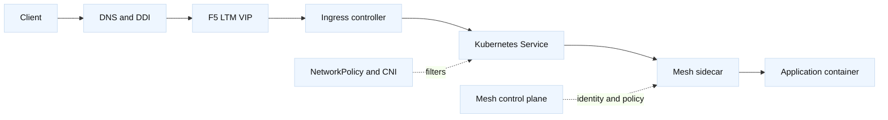

# Kubernetes ingress and service mesh networking

## Learning objectives

You will trace a request from DNS to a Kubernetes ingress address, through a
load balancer, ingress controller, Service, and Pod. You will distinguish a
Kubernetes Service from an F5 VIP and understand where kube-proxy, an
Ingress/Gateway controller, NetworkPolicy, and a service-mesh sidecar act.
You will learn how TLS termination, mTLS, health checks, retries, and
timeouts interact, and how DDI and F5 automation can safely publish or update
cluster endpoints.

## Prerequisites

Know IP routing, NAT, DNS, HTTP/TLS, containers, and basic F5 LTM concepts.
You do not need a live cluster for the examples. Read-only `kubectl` output is
illustrative, and addresses are fictional or from documentation ranges.

## Mental model

A Kubernetes Service is a stable virtual destination for a changing set of
Pods. `ClusterIP` is normally reachable inside the cluster; `NodePort` exposes
a port on nodes; a cloud or appliance integration can create an external
load-balancer address. An Ingress resource describes HTTP routing, while an
Ingress controller implements it. Newer Gateway API resources separate
listeners, routes, and attachment policy more explicitly. Exact behavior
depends on controller and CNI.

An F5 BIG-IP can sit outside the cluster as the client-facing VIP, or an F5
controller can program objects that represent Kubernetes services. Do not
assume a Kubernetes Service and an F5 virtual server have the same health or
session semantics. The F5 monitor may probe a node port or Pod address while a
real request uses a different path. A service mesh adds another proxy, often
one sidecar per Pod, so a request may have client-to-ingress, ingress-to-sidecar,
sidecar-to-sidecar, and sidecar-to-application legs.

Fact: DNS naming, Service discovery, and routing are separate mechanisms.
Inference: every architecture diagram should name the authority for each
address and certificate so that an incident does not turn into a debate about
which controller “owns” the VIP.

## Diagram



The extra hops are useful for policy and telemetry but create more places for
timeouts, retries, certificates, and health assumptions to diverge.

## Worked example

`catalog.lab.example` resolves to `198.51.100.90`. The F5 VIP terminates the
public TLS connection and forwards HTTP to an ingress controller on a private
listener. The ingress routes `/v1/catalog` to Service `catalog`, which picks
Pods. A mesh sidecar encrypts the last hop with workload mTLS.

| Layer | Example object | First read-only question |
| --- | --- | --- |
| DDI | `catalog.lab.example` A record | Is the answer current and authorized? |
| F5 | `vs_catalog_443` | Is the VIP, profile, and pool healthy? |
| Ingress | Host/path rule | Does the route match the request? |
| Service | `catalog:8080` | Are endpoints ready and selected? |
| Mesh | Workload identity | Do certificates and policy permit the call? |
| Pod | Container port 8080 | Does the app serve the expected path? |

Useful evidence might be:

```bash
kubectl get ingress,gateway,svc,endpointslice -n catalog -o wide
kubectl describe service catalog -n catalog
kubectl get networkpolicy -n catalog
dig +time=2 +tries=1 catalog.lab.example A
```

The commands are read-only, but cluster access still requires authorization.
For a local application, `curl --resolve` can test the F5 hostname without
changing DNS. Compare the HTTP `Host`/SNI name, the F5 server-side target,
ingress access log, Service endpoints, and sidecar access log. A 404 at the
ingress suggests route matching; a 503 can mean no endpoints, an ingress
upstream timeout, or a mesh policy rejection. Status code alone is not proof.

Suppose Pods are Ready and direct Service access works, but F5 users receive
502. The F5 member may be a node port whose health monitor sends the wrong
Host header. Or the ingress expects TLS while the pool uses HTTP. Or the
ingress forwards to a mesh sidecar that rejects plaintext. Define the protocol
for each edge and align monitor behavior with the production request contract.

Retries require special care. If the F5, ingress, mesh, and client each retry
three times, one user action can create many backend attempts. A bounded retry
budget should be owned by one layer, and non-idempotent methods should not be
retried without an application contract. Timeout budgets must also be
distributed: a 2-second client deadline cannot sensibly contain a 3-second
F5 timeout plus a 3-second mesh retry.

F5 automation can safely generate a desired VIP and pool plan from a reviewed
cluster inventory, while DDI automation publishes the hostname. A plan should
include namespace, listener, target ports, certificate references, monitor
path, and rollback record. A controller must not delete an old VIP merely
because a transient API read returned an empty list. Use generation markers,
ownership labels, idempotent reconciliation, and a two-person approval for
production changes.

## When this breaks

A frequent failure is port confusion: Service port, target port, node port,
container port, F5 pool port, and TLS mode are all different fields. Another
is readiness mismatch: Kubernetes marks a Pod ready using one probe while the
F5 monitor probes an unrelated endpoint. A Pod can be Ready while a dependency
is unavailable, and a monitor can be green while the real Host/SNI route is
wrong.

NetworkPolicy may block the ingress namespace, node-to-Pod traffic, or mesh
health probes. CNI routing, overlay MTU, and source NAT can produce packet
loss that looks like an application timeout. A DNS record can point to a
retired VIP while the Kubernetes object is correct. Certificate trust can
fail at the F5 edge, ingress, or sidecar independently.

Service meshes can obscure the original source address and add connection
pooling. An F5 persistence cookie may bind a client to an ingress instance,
while mesh load balancing sends each request to another Pod. Draining must be
coordinated across layers. During upgrades, avoid changing the F5 monitor,
Ingress controller, and mesh policy in the same unobserved window.

## Operational checklist

1. Write the hop contract: DNS name, VIP, F5 pool port, ingress listener,
   Service port, target port, Pod port, and TLS ownership.
2. Check DDI answer, F5 virtual-server/profile/pool state, ingress route,
   EndpointSlice readiness, CNI/NetworkPolicy, and mesh policy in order.
3. Match Host and SNI names and verify certificate trust at every TLS edge.
4. Compare timeout and retry budgets; prevent multiplicative retries.
5. Use read-only cluster and F5 evidence with request IDs and UTC timestamps.
6. Automate desired-state diffs with ownership, generation guards, approvals,
   and rollback; never delete on an empty transient inventory.
7. Test drain, failure, certificate rotation, and controller upgrade behavior
   in a local or staging cluster before production.

## Questions and answers

1. **Is an Ingress an actual proxy?** Usually it is a desired resource; the
   controller implements the proxy or programs another data plane.
2. **Why can a Service work while the F5 VIP fails?** The VIP adds DNS,
   listener, monitor, TLS, routing, and policy behavior outside the Service.
3. **Where does mTLS terminate?** It may terminate at F5, ingress, sidecars,
   or multiple legs. Document each trust boundary rather than saying “the
   service uses mTLS.”
4. **What does EndpointSlice tell us?** It shows selected endpoint state, not
   necessarily that the endpoint serves the exact Host, path, and protocol.
5. **Why avoid retries at every layer?** They multiply load and can repeat
   side effects while consuming the caller’s deadline.
6. **What is a safe F5 controller behavior?** Reconcile only owned objects,
   calculate a diff, require valid inventory and approval, and retain a
   rollback artifact.
7. **Can readiness replace an F5 monitor?** No. They can cover different
   paths and contracts; align them intentionally.
8. **What is a common TLS mistake?** Sending plaintext to a TLS listener or
   using an SNI/Host name absent from the certificate and route table.

## References and fact-inference notes

Fact: Kubernetes documents [Services](https://kubernetes.io/docs/concepts/services-networking/service/),
[Ingress](https://kubernetes.io/docs/concepts/services-networking/ingress/),
and [Gateway API](https://gateway-api.sigs.k8s.io/). Fact: F5 publishes
BIG-IP integration terminology in [TechDocs](https://techdocs.f5.com/).
Retry ownership, health alignment, and reconciliation safeguards are
engineering recommendations and depend on the selected CNI, ingress, mesh,
and F5 integration.
