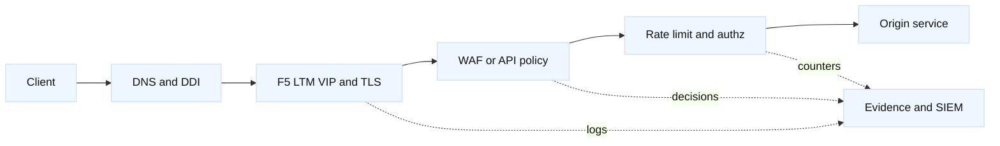

# WAF, API security, and rate limits

## Learning objectives

This topic explains where a web application firewall (WAF), API gateway,
reverse proxy, and F5 LTM policy fit in a request path. You will distinguish
authentication from authorization, input validation from attack detection,
and connection limits from request rate limits. You will design a rate-limit
key, reason about trusted proxy headers, handle false positives, and automate
policy changes safely. Examples cover TLS, mTLS, DNS/DDI ownership, F5
virtual servers, iRules or policies, and observability.

## Prerequisites

Understand HTTP methods and status codes, TLS termination, proxies, DNS,
TCP connections, and F5 virtual servers and profiles. Read-only examples use
fictional domains and reserved IPs. A WAF policy is security-sensitive: this
is a learning design guide, not permission to deploy a rule against a service.

## Mental model

A WAF evaluates application-layer requests, often after TLS termination and
before an origin. It can detect patterns associated with injection, protocol
violations, bots, and abusive payloads, but it cannot prove business intent.
An API gateway may authenticate tokens, enforce schemas, route versions, and
apply quotas. An F5 LTM virtual server supplies the transport and proxy
boundary; ASM/Advanced WAF, an API policy, or an external service may provide
security inspection depending on the licensed and deployed product.

Authentication answers “who is this?” Authorization answers “may this actor
perform this operation on this resource?” Rate limiting answers “how much
work may this key request in a time interval?” These controls overlap in
telemetry but should not be conflated. A valid token can still be abusive, and
an anonymous endpoint can still need a fair-use limit.

A limit has at least a key, algorithm, capacity, window, response, and scope.
Keys might be account ID, API key, client IP, or a composite. IP-only limits
punish NATed users; identity-only limits can be bypassed by credential theft.
The `X-Forwarded-For` header is only useful when the immediate proxy is a
trusted writer and the application knows how to parse a chain. Never accept a
client-supplied address as authoritative.

## Diagram



The order is a design choice. TLS may terminate at F5 and be re-encrypted to
the WAF or origin. mTLS can authenticate a client at the edge, between proxy
legs, or both. The certificate chain and identity mapping must be explicit.

## Worked example

`payments.lab.example` resolves to `198.51.100.110:443`. F5 terminates public
TLS, a WAF policy inspects JSON, and the origin expects the original account
ID. The desired limit is 60 requests per account per minute, with a separate
burst of 10 requests per second for reads. Payment writes must be protected
from retries and should return a documented 429 with a `Retry-After` value.

| Decision | Example | Failure to prevent |
| --- | --- | --- |
| Key | Authenticated account plus route | Shared IP punishes NAT users |
| Method | Token bucket with bounded burst | Fixed windows create boundary spikes |
| Scope | Per region and service | One noisy tenant exhausts all users |
| Response | 429 and `Retry-After` | Clients retry immediately |
| Identity | Validated token claim | Trusting an arbitrary header |
| Audit | Rule ID, decision, request ID | Cannot explain a block |

Start in detection or shadow mode if the deployed product supports it. Build
a baseline of method, route, content type, response class, token result, and
request size without storing payment payloads. A WAF signature match should
be tied to a rule ID and sample evidence, redacted according to policy. Tune
an exception narrowly by route, parameter, and known encoding; a global
disable is difficult to reason about and easy to forget.

At the F5 edge, verify that the virtual server has the expected client TLS
profile, server TLS profile, HTTP profile, WAF policy, and logging destination.
For a lab request:

```bash
curl --resolve payments.lab.example:443:198.51.100.110 \
  -H 'Content-Type: application/json' \
  -H 'X-Request-ID: lab-001' \
  --data '{"amount":1}' https://payments.lab.example/v1/charge
```

Do not use real payment data. Compare the response with F5/WAF decision logs
and the origin trace. If the origin sees no request and the client gets 403,
investigate policy, identity, and WAF evidence. If it sees repeated writes,
inspect retry behavior and idempotency keys. If clients receive 429 while the
per-account rate is low, check key extraction, proxy-chain parsing, clock
windows, and counter scope.

An API policy can validate a schema before the origin. Schema validation is
not business validation: a syntactically valid amount may still be forbidden
by account state. Apply maximum body size and parsing limits before expensive
operations. HTTP/2 and HTTP/3 multiplex many logical requests over fewer
connections, so connection counts are not request-rate controls.

Automation should represent policy as versioned data and generate a diff.
The change plan can include F5 object path, WAF policy version, rule IDs,
limit key, threshold, expected 429 behavior, dashboard, and rollback. Use
the F5 Python SDK or REST only with a least-privilege account and a dry-run
plan where possible. Never put API keys, client certificates, or policy export
payloads in source control. DNS/DDI changes should be owned separately from
WAF policy; a hostname pointing at a new VIP must not silently bypass the
security control.

## When this breaks

False positives occur when a legitimate encoded value resembles an attack,
when a new API version is undocumented, or when a generic signature cannot
understand a framework’s serialization. False negatives occur when traffic is
encrypted beyond the inspection point, an attacker uses an unknown technique,
or a parser discrepancy exists between WAF and origin. Keep the parser and
normalization behavior aligned, and use defense in depth.

Rate limits fail when clocks differ, counters are not shared across F5 HA
members, a NAT gateway collapses many customers into one key, or clients can
rotate a header. Distributed limits need a consistent store or a deliberately
bounded approximation. HA failover can reset counters; document whether a
brief burst is acceptable. Never make a limit so low that health checks or
certificate renewal callbacks are blocked without an explicit exception.

Header trust is a classic proxy bug. Strip or overwrite client-provided
forwarding headers at the trusted edge, append the observed source according
to a documented convention, and have each downstream hop trust only its
immediate predecessor. mTLS authenticates a certificate holder but does not
authorize every API operation; map identity to policy and rotate trust roots.

## Operational checklist

1. Inventory DNS name, F5 VIP, TLS termination points, WAF policy, origin, and
   owner; verify DDI does not bypass the intended control.
2. Define authentication, authorization, schema, WAF, and rate-limit roles
   separately, including status codes and client retry behavior.
3. Choose bounded keys and scopes; document trusted proxy headers, time, burst,
   HA behavior, and mTLS identity mapping.
4. Use shadow/detection mode, synthetic requests, redacted evidence, and
   narrowly scoped exceptions before enforcement.
5. Version policy, calculate a diff, use least privilege, obtain approval,
   and retain rollback and prior policy artifacts.
6. Monitor block rate, false-positive reports, 429 rate, origin load, WAF
   latency, certificate expiry, and policy distribution across HA members.
7. Test failover, parser differences, HTTP/2 multiplexing, retries, and
   certificate/trust rotation in a non-production environment.

## Questions and answers

1. **Is a WAF an authentication system?** No. It may inspect an identity
   signal, but authentication and authorization require explicit mechanisms.
2. **Why not rate-limit by IP only?** NAT, mobile networks, and proxies can
   group many legitimate users, while attackers can distribute source IPs.
3. **Can F5 LTM alone replace a WAF?** LTM provides proxy and traffic policy
   capabilities; WAF protections depend on the deployed module and policy.
4. **Why return 429?** It communicates throttling so clients can apply a
   documented backoff rather than treating the event as a server crash.
5. **What makes a forwarding header trustworthy?** A known proxy writes it,
   downstream trust boundaries are explicit, and client-supplied values are
   removed or ignored.
6. **Does mTLS authorize a payment?** No. It authenticates a certificate
   identity; application authorization and business rules still apply.
7. **How should a WAF exception be written?** Narrowly by rule, route,
   parameter, encoding, and owner with an expiry and test case.
8. **Why do HTTP/2 connections complicate limits?** Many requests share one
   connection, so connection caps do not bound request work.

## References and fact-inference notes

Fact: [OWASP API Security Top 10](https://owasp.org/API-Security/) describes
common API risks, [RFC 6585](https://www.rfc-editor.org/rfc/rfc6585) defines
additional HTTP status codes including 429, and F5 WAF terminology is
version-specific in [BIG-IP TechDocs](https://techdocs.f5.com/). The key
selection, retry, exception, and policy-order guidance is engineering advice;
validate it against the application’s threat model and product behavior.
