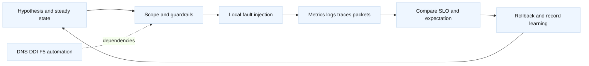

# Network testing and controlled chaos

## Learning objectives

This topic turns networking knowledge into repeatable tests. You will design
unit, integration, contract, synthetic, packet, and failure-injection tests;
select a blast radius; and define stop conditions before introducing loss,
latency, DNS changes, certificate faults, or F5 member failures. You will
connect tests to LTM monitors, GTM/BIG-IP DNS behavior, DDI leases, TLS/mTLS,
and automation plans. The goal is learning how a system behaves, not making a
production outage for its own sake.

## Prerequisites

Know basic Linux networking, Docker, Python, TCP/UDP, HTTP/TLS, DNS, and F5
VIP/pool terminology. Read the local demos and run them only against local or
explicitly authorized targets. Production experiments require a separate
change record, owner, and incident communications path.

## Mental model

A test asks whether a known contract holds under a specified input. Chaos is a
controlled test of a failure hypothesis. Both need a steady-state definition,
an observable outcome, a bounded scope, and a stop condition. A useful test
matrix covers client-to-VIP, VIP-to-member, member-to-dependency, DNS answer,
certificate trust, and control-plane automation rather than only “the server
is up.”

Use layers. A unit test can verify a Python F5 pool-selection function with
no network. A contract test can verify that a monitor expects the same Host,
path, and TLS mode as a real client. An integration test uses Docker and a
local proxy. A synthetic test checks the user journey. A packet test confirms
SYN/SYN-ACK, retransmission, MTU, or TLS behavior. Each layer has different
speed and confidence.

Fact: a health monitor is an observation with its own request and timeout.
Inference: simulate both monitor success and monitor failure, but do not
equate either with every user path. Fact: DNS resolvers cache responses based
on TTL and policy. Inference: a DNS failover test must include clients with
old cached answers, not only a fresh lookup.

## Diagram



The loop emphasizes learning. If the experiment has no observable expected
result, it is not ready to run.

## Worked example

Hypothesis: if one LTM pool member stops answering, the VIP continues serving
requests through the other member within 30 seconds, while active requests
may fail according to the connection-drain policy. Use a local two-container
lab or a staging F5 partition; never stop an unapproved production member.

| Element | Example |
| --- | --- |
| Steady state | Both members pass the same HTTP/TLS monitor |
| Fault | Stop member A or block only its lab port |
| Expected | Monitor marks A down; new requests choose B |
| Signals | VIP success, pool state, monitor reason, request IDs |
| Stop condition | Unexpected error rate, collateral service impact |
| Restore | Start A, confirm monitor recovery, observe re-entry |

Before the fault, record DNS answer, VIP, pool members, monitor interval,
timeout, persistence mode, and baseline request success. Generate ten requests
with a unique lab header and preserve timestamps. Inject the fault, then query
the F5 read-only state and repeat the same requests. A persistent client may
continue using A or its connection may be drained, so test both a fresh client
and a long-lived connection.

For a local experiment, Linux `tc netem` can add delay or loss to a dedicated
network namespace. The command is powerful and should be confined to a lab:

```bash
sudo tc qdisc add dev veth-lab root netem delay 100ms loss 2%
curl --max-time 3 http://127.0.0.1:8080/health
sudo tc qdisc del dev veth-lab root
```

The interface must be explicitly verified first; do not paste this against a
host’s primary interface. A safer alternative is an application-level fake
server that delays responses. For DNS, lower TTLs in a lab zone, change the
answer, query through a caching resolver, and measure old-answer persistence.
Do not use real public names for a failover drill.

Test TLS failures with deliberately expired or wrong-name certificates in a
local server. Test mTLS with a test CA and separate client certificate; prove
that an untrusted client fails while a valid client succeeds. Keep private
keys in temporary, permission-restricted files and delete them according to
the lab’s cleanup policy. The existing `demos/tls_inspect.sh` is observation
only and does not disable verification by default.

Network automation needs tests before deployment. A F5 SDK plan generator can
unit-test object names, destination tuples, monitor paths, and idempotency.
An integration test can apply to a disposable partition, read back state, and
assert that a second run produces an empty diff. A DDI test can validate that
an A record’s owner, IPAM reservation, and DHCP exclusion agree. A GTM test
can evaluate site eligibility without changing live DNS.

Chaos results need interpretation. If a monitor marks A down after one lost
probe, that may be correct or too sensitive depending on the contract. If a
GTM answer changes immediately but clients still use the old site, TTL and
resolver caching are expected. If a certificate rotation test passes only on
one HA member, distribution is incomplete. Record both expected and surprising
behavior; surprises are the value of the test.

## When this breaks

The most dangerous test has ambiguous scope. A wildcard `tc` rule, broad
firewall block, or global DNS change can affect unrelated services. Stale
faults are also common: a qdisc remains after the test, a disabled F5 member is
forgotten, or a test certificate is copied into a real trust store. Use
preflight checks, explicit resource IDs, automatic cleanup where safe, and a
human stop switch.

Tests can give false confidence. A synthetic from one region misses a GTM
topology error in another. A monitor tests `/health` while users call
`/checkout`. A Docker bridge does not reproduce a provider MTU or firewall.
Capture assumptions and add a production-safe observation if the gap matters.

Avoid testing multiple fault dimensions at once until single-fault behavior is
known. Combining DNS withdrawal, F5 failover, certificate rotation, and packet
loss makes attribution difficult. Security and privacy controls apply to
captures, tokens, and test data even when the target is non-production.

## Operational checklist

1. State the hypothesis, steady-state SLO, expected behavior, owner, and
   rollback before injecting a fault.
2. Bound target, interface, namespace, partition, DNS zone, and time window;
   use fictional/local data and a stop condition.
3. Establish baseline DNS, F5 VIP/pool/monitor, TLS, request, and application
   signals with UTC timestamps.
4. Run one controlled fault, observe, and compare fresh and cached clients,
   new and persistent connections, and both proxy legs where relevant.
5. Remove the fault, verify restoration and configuration state, and check for
   collateral impact.
6. Turn the result into a regression, monitor improvement, runbook update, or
   explicit accepted risk.

## Questions and answers

1. **What makes chaos safe?** A bounded target, hypothesis, expected result,
   stop condition, approval, and verified restoration.

Interview reasoning: For “What makes chaos safe,” state the mechanism and where it operates, then give the tuple, state transition, and evidence that distinguish the leading hypotheses. Explain the operational trade-off and a worked diagnostic. The caveat is that a successful local check proves only that check, so validate the complete request path and define rollback.

2. **Why test monitor and user paths separately?** They may use different
   Host headers, ports, TLS profiles, routes, or dependencies.

Interview reasoning: For “Why test monitor and user paths separately,” state exactly what the probe sends and expects: source, destination port, Host/SNI, URI, status or body, interval, and timeout. Replay it from the same path and compare a real request and origin logs. A deeper F5 monitor improves fidelity but can make a dependency outage eject every member, so its dependency budget must be explicit.

3. **Does DNS failover instantly move all users?** No. Resolver and client
   caches can retain old answers for the TTL or longer due to implementation.

Interview reasoning: For “Does DNS failover instantly move all users,” record resolver identity, A/AAAA/CNAME data, flags, response code, authority, and TTL, then compare the recursive answer with an authoritative query. Split-horizon DNS, `/etc/hosts`, and service discovery can produce different views. A correct DNS answer proves only name resolution; route, VIP, TLS, policy, and application health still require separate probes.

4. **Why test fresh and persistent connections?** Load balancers and proxies
   may handle existing flows differently from new selections.

Interview reasoning: For “Why test fresh and persistent connections,” state the mechanism and where it operates, then give the tuple, state transition, and evidence that distinguish the leading hypotheses. Explain the operational trade-off and a worked diagnostic. The caveat is that a successful local check proves only that check, so validate the complete request path and define rollback.

5. **What should a F5 SDK integration test assert?** The desired object graph,
   read-back state, no unintended objects, and an empty second-run diff.

Interview reasoning: For “What should a F5 SDK integration test assert,” describe the safe control loop: discover, normalize an allow-listed state, calculate a minimal diff, obtain approval, apply idempotently, validate behavior, and record redacted evidence. For F5, resolve version, partition, folder, and self-link before mutation and read back after uncertain results. A successful HTTP response is not traffic health, and retries are safe only when reconciliation prevents duplicates.

6. **Is `tc netem` safe anywhere?** No. It changes the selected interface and
   must be limited to an explicitly verified lab namespace or host.

Interview reasoning: For “Is `tc netem` safe anywhere,” state the mechanism and where it operates, then give the tuple, state transition, and evidence that distinguish the leading hypotheses. Explain the operational trade-off and a worked diagnostic. The caveat is that a successful local check proves only that check, so validate the complete request path and define rollback.

7. **Why use a test CA for mTLS?** It isolates trust and prevents a lab client
   or key from being accepted by a real service.

Interview reasoning: For “Why use a test CA for mTLS,” walk the handshake fields rather than saying only “encrypted”: SNI selects identity, SAN matches the name, the chain reaches a trusted root, and protocol policy permits negotiation. Test client-to-LTM and LTM-to-member independently. Re-encryption protects the second hop but creates a second certificate/trust lifecycle; front-end success does not prove backend authorization or readiness.

8. **What is a useful chaos output?** A measured comparison of expected and
   actual behavior plus a durable corrective action, not a dramatic screenshot.

Interview reasoning: For “What is a useful chaos output,” state the mechanism and where it operates, then give the tuple, state transition, and evidence that distinguish the leading hypotheses. Explain the operational trade-off and a worked diagnostic. The caveat is that a successful local check proves only that check, so validate the complete request path and define rollback.

Fact: Linux documents traffic control in its [tc manual](https://man7.org/linux/man-pages/man8/tc.8.html),
and Kubernetes describes [service networking](https://kubernetes.io/docs/concepts/services-networking/).
Fact: DNS caching and TTL semantics are discussed in [RFC 1034](https://www.rfc-editor.org/rfc/rfc1034).
F5 monitor behavior and APIs are release-specific in [TechDocs](https://techdocs.f5.com/).
The guardrails, experiment sequencing, and test matrices are engineering
recommendations rather than universal guarantees.
