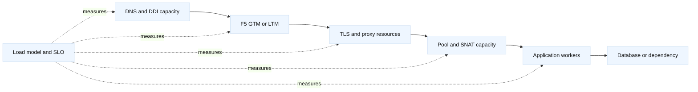

# Capacity, performance, and SLO engineering

## Learning objectives

This topic teaches a practical method for sizing and tuning network paths. You
will relate throughput, requests per second, concurrency, latency, bandwidth,
connection tables, SNAT ports, CPU, memory, and queueing. You will identify
capacity limits in DNS/DDI, F5 LTM/GTM, TLS, proxies, and origins; design a
load test; and turn measurements into an SLO and an actionable forecast. The
examples emphasize safe experiments and explicit assumptions rather than
vendor-specific sizing claims.

## Prerequisites

Know TCP connection setup, HTTP keep-alive, TLS handshakes, DNS caching, F5
VIPs/pools/SNAT, and basic probability or arithmetic. You should be able to
read latency percentiles and use a shell command or Python script to generate
small, authorized lab traffic.

## Mental model

Capacity is not one number. A path can be limited by link bandwidth, packets
per second, concurrent connections, ephemeral or SNAT ports, TLS handshakes,
proxy workers, backend threads, DNS QPS, DHCP leases, or a dependency. The
first saturated resource controls the user experience. Adding servers does
not help if the F5 SNAT pool or upstream firewall is exhausted.

Little’s Law, `L = lambda * W`, links average concurrency (`L`), arrival rate
(`lambda`), and average time in system (`W`) under stable conditions. It is a
useful sanity check, not a promise that a bursty service behaves like a steady
queue. A service receiving 200 requests per second with 0.25 seconds average
latency has about 50 in-flight requests. Tail latency, retries, and long-lived
connections can make the operational resource requirement much higher.

SLOs should describe user-visible behavior. “F5 CPU below 70%” is a useful
capacity indicator, not an availability SLO. A candidate SLI is the fraction
of valid requests whose DNS, TCP, TLS, and HTTP journey completes within a
deadline. A separate SLO can cover DNS answer correctness or certificate
renewal. Error budgets then let a team decide whether to spend effort on a
feature, a capacity increase, or a reliability fix.

## Diagram



Capacity planning follows the request path and includes control-plane
resources. A GTM answer can send traffic to a site that has enough application
CPU but not enough F5 TLS or SNAT capacity.

## Worked example

The fictional `search.lab.example` service expects 300 requests per second at
peak, 20% growth, and a 1-second user deadline. Each request uses an existing
keep-alive connection 80% of the time; the remainder creates a TLS connection.
The F5 server-side SNAT address set has 2,000 usable source ports for the
relevant destination tuple, and the average server-side connection lasts 2
seconds. Actual capacity depends on TMOS version, translation address scope,
connection reuse, and other concurrent destinations; verify it on the target.

| Resource | Calculation or observation | Planning question |
| --- | --- | --- |
| Requests | `300 * 1.2 = 360 RPS` target | Does a burst factor apply? |
| Concurrency | `360 * 0.25 = 90` average | What is p99 latency? |
| New TLS flows | `360 * 0.20 = 72 CPS` average | What is handshake CPU? |
| SNAT flows | `360 * 2 = 720` average | Are translation addresses and destination tuples shared? |
| DNS | Answers and refreshes | Are resolver and authoritative limits known? |
| Headroom | Policy, not a universal number | What failure mode must one site absorb? |

The arithmetic is a planning model. Measure with a representative workload
and verify F5 platform limits in the installed release. If one translation
address and source-port tuple cannot be reused while connections overlap,
2,000 ports may be enough for this average but not for a burst or a second
destination. A SNAT pool distributes pressure; it does not remove the need to
monitor translation failures.

Use a warm-up, steady-state, and cool-down. Separate connection rate from
request rate, record payload sizes, cache state, TLS versions, HTTP methods,
and response distribution. Do not load test a real service without written
authorization and a traffic budget. A local Docker setup can test the
application’s queueing; a staging F5 can test monitors, profiles, and SNAT.

Example shell measurements should be small and explicit:

```bash
curl --resolve search.lab.example:443:198.51.100.120 \
  --connect-timeout 2 --max-time 5 -sS -o /dev/null \
  -w 'code=%{http_code} connect=%{time_connect} tls=%{time_appconnect} total=%{time_total}\n' \
  https://search.lab.example/health
ss -s
```

Compare client timing with F5 client-side and server-side counters, pool
member latency, TLS handshake counts, CPU, memory, connection tables, SNAT
usage, and backend queue depth. A rising client latency with flat backend
latency points toward DNS/TCP/TLS/proxy resources; rising server-side latency
points toward pool or application pressure. That attribution is a hypothesis
until correlated with traces or packet evidence.

Automation can query F5 statistics through a read-only SDK account, combine
them with application metrics, and generate a capacity report. Keep units
explicit and reject stale data:

```python
from dataclasses import dataclass

@dataclass(frozen=True)
class Sample:
    rps: float
    avg_seconds: float
    snat_flows: int

def estimate(sample: Sample) -> dict[str, float]:
    if sample.rps < 0 or sample.avg_seconds < 0:
        raise ValueError("rates and latency must be non-negative")
    return {
        "concurrency": sample.rps * sample.avg_seconds,
        "snat_headroom_ratio": max(0.0, 1.0 - sample.snat_flows / 2000.0),
    }

print(estimate(Sample(360.0, 0.25, 720)))
```

The report should show source, timestamp, interval, aggregation, and whether
the figure is measured or modeled. Do not make an automatic scale-out or BGP
withdrawal from one stale sample. Use hysteresis, minimum observation windows,
and an approval path. F5 pool member scaling and GTM site steering can move
traffic, but DNS TTL means that a new answer does not instantly rebalance all
clients.

Certificates and mTLS affect capacity too. Short-lived certificates increase
renewal and distribution work; frequent TLS handshakes consume CPU; a large
chain increases bytes and handshake processing. Session resumption and
connection reuse may help, but measure compatibility and security policy.
DHCP exhaustion or IPAM allocation delays can prevent a scaling event even
when application capacity exists. DDI capacity belongs in the forecast.

## When this breaks

Average traffic hides bursts, hot keys, and long tails. A load test with one
client IP can exhaust a single SNAT path or trigger an unrealistic WAF limit.
One region can look healthy while GTM topology sends another region to a
smaller site. A test that omits DNS and TLS misses resolver and handshake
capacity. Retries can inflate offered load precisely when the service is
slower, causing a positive feedback loop.

Headroom is not a magic percentage. It depends on failure requirements, burst
duration, scaling time, and cost. If one site must absorb another site’s load,
model that event explicitly. If an F5 HA pair fails over, connection state,
SNAT persistence, and TLS session behavior may differ. Validate failover and
drain rather than assuming active capacity transfers perfectly.

Instrumentation can also become the bottleneck. High-cardinality labels,
packet captures at peak, and verbose WAF logs consume CPU, storage, and
network. Sample deliberately and retain enough evidence for tail failures.
When a limit is reached, state whether to shed load, queue, reject, degrade,
or fail over; a silent timeout is usually the least controllable outcome.

## Operational checklist

1. Define the user journey, SLI, SLO, deadline, error budget, traffic shape,
   growth, and failure-absorption requirement.
2. Inventory DNS/DDI, F5 GTM/LTM, TLS, proxy, SNAT, firewall, pool, backend,
   and dependency limits with units and ownership.
3. Measure request rate, connection rate, concurrency, latency percentiles,
   payload size, retries, CPU, memory, queues, and errors separately.
4. Test warm-up, steady state, bursts, member loss, site loss, TLS rotation,
   DNS caching, and failover only in an authorized environment.
5. Compare modeled and measured capacity; record assumptions, timestamp,
   source, and confidence.
6. Automate read-only reports with stale-data rejection, bounded labels,
   hysteresis, approvals, and a rollback path for traffic changes.
7. Review the forecast after releases, certificate policy changes, DDI growth,
   and every incident that changes the traffic model.

## Questions and answers

1. **What does Little’s Law tell us?** It estimates average in-flight work as
   arrival rate times average time, under stable conditions.
2. **Why is CPU below 70% not an SLO?** Users care about successful and timely
   journeys; CPU is only one possible constraint indicator.
3. **Can adding pool members solve all capacity problems?** No. DNS, F5,
   SNAT, TLS, firewall, database, or a shared dependency may saturate first.
4. **Why separate request rate and connection rate?** Keep-alive and HTTP/2
   multiplexing make them materially different loads.
5. **How does GTM affect capacity planning?** It chooses answers and sites,
   while TTL and cache behavior delay distribution changes.
6. **Why can retries cause an outage?** Slower responses cause clients or
   proxies to add work, increasing load and making responses slower still.
7. **What should a capacity automation report include?** Units, timestamp,
   source, aggregation, assumptions, saturation indicators, and confidence.
8. **How do certificates affect capacity?** Handshakes, chain size, renewal,
   trust validation, and session reuse all consume resources or bandwidth.

## References and fact-inference notes

Fact: [RFC 9293](https://www.rfc-editor.org/rfc/rfc9293) describes TCP, and
[RFC 9114](https://www.rfc-editor.org/rfc/rfc9114) describes HTTP/3. F5
platform limits, statistics, and HA behavior are release-specific in
[TechDocs](https://techdocs.f5.com/). Little’s Law is a queueing identity under
its assumptions; all sizing numbers here are illustrative models. Headroom,
retry budgets, and forecast thresholds are engineering decisions.
