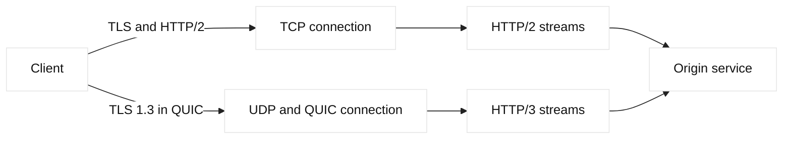

# HTTP/2, HTTP/3, and QUIC

## Learning objectives

Explain HTTP/2 framing, multiplexing, and header compression; describe what
QUIC supplies above UDP; and select evidence for negotiation, loss, and
fallback failures.

## Prerequisites

Know DNS, TCP setup, TLS certificates, HTTP methods, and basic latency, loss,
and MTU terminology.

## Mental model

HTTP/2 keeps HTTP semantics but carries requests and responses as binary
frames on multiplexed streams. A single connection can therefore contain many
concurrent requests instead of requiring one TCP connection per object. Header
compression with HPACK reduces repeated metadata. HTTP/3 keeps the HTTP/2
streaming model but maps it onto QUIC, a transport implemented in user space
over UDP. QUIC supplies encrypted transport, independent stream loss
recovery, connection identifiers, and optional connection migration.

Fact: HTTP methods, status codes, and resource semantics remain application
concepts in all three versions. Fact: TCP provides one ordered byte stream,
while QUIC provides independently ordered streams. Inference: an HTTP/2 loss
can delay unrelated streams because TCP must deliver bytes in order, whereas a
lost QUIC packet containing one stream need not block another stream. This is a
transport consequence, not a promise that HTTP/3 is always faster.

## Diagram

## Worked example

Suppose a fictional image page makes twelve requests. Over HTTP/2, the client
performs one TCP and TLS handshake, then opens streams for the HTML, images,
and API calls. If one packet is lost, all later TCP bytes wait for recovery.
Over HTTP/3, the same logical requests use QUIC streams over UDP. The API
stream can finish while an image stream repairs loss, provided congestion and
server limits allow it. This is a protocol-path comparison, not a performance
benchmark. Measure a representative workload before changing defaults.

## When this breaks

Common failure points include UDP blocked by a firewall, an intermediary that
does not understand HTTP/3, an ALPN mismatch, certificate problems, exhausted
stream limits, and incorrect proxy timeout assumptions. A browser may silently
fall back to HTTP/2, making the page appear healthy while mobile clients with
different paths fail. Collect negotiated protocol, status, handshake errors,
and path-specific packet evidence before tuning application retries.

## Operational checklist

- Record negotiated ALPN, transport, and endpoint before comparing latency.
- Verify UDP policy and MTU separately from TCP reachability.
- Confirm certificate names and TLS versions on every termination point.
- Set bounded stream, connection, and request timeouts.
- Monitor fallback rate instead of assuming HTTP/3 is universally available.
- Test rollback to HTTP/2 without changing application semantics.

## Implementation exercise

Use a local test server and a client that can report negotiated protocol. For
example, `curl --http2 -I https://app.lab.example/` requests HTTP/2 when the
client and server support it; `curl --http3 -I ...` tests HTTP/3 where curl was
built with QUIC support. Treat failures as evidence about support, middleboxes,
or certificates, not proof that an origin is unavailable. Capture the URL,
ALPN result, status code, and timing in a lab note. Do not put credentials in
the command line or test a real target without authorization.

## Questions and answers

### 1. Why can HTTP/2 use one TCP connection for many requests?

HTTP/2 assigns each request and response a stream identifier and wraps work in
frames. Frames from different streams can be interleaved, so a browser can
fetch stylesheets, scripts, and images concurrently over one connection. TCP
still provides one ordered byte stream underneath, so the multiplexing removes
application-level connection overhead but does not remove TCP loss recovery.
The server must also respect stream and connection flow-control windows.

### 2. What does QUIC add beyond UDP?

UDP is only a datagram delivery interface; it does not provide reliable
delivery, congestion control, ordering, or encryption. QUIC implements those
functions above UDP, including packet numbering, acknowledgements, retransmits,
flow control, and a TLS handshake integrated into transport setup. QUIC also
uses connection IDs so a connection can survive some address changes. These
features are protocol facts; whether a deployment benefits depends on paths,
client support, and proxy behavior.

### 3. What is head-of-line blocking in these protocols?

At the HTTP/2 application layer, streams are independent in framing, but TCP
delivers bytes in order. If one segment is missing, later bytes wait in the
receiver even if they belong to other HTTP/2 streams. QUIC acknowledges and
recovers packets while exposing separate ordered streams, so loss on one stream
need not stall another. A shared bottleneck can still affect all traffic, and
HTTP/3 does not make congestion disappear.

### 4. How should an engineer debug an HTTP/3 fallback?

Start by recording the negotiated ALPN and whether the client sent a QUIC
attempt. Check UDP reachability and firewall policy, certificate validity, and
server support. Compare the same request over HTTP/2 to separate application
failure from protocol negotiation. Inspect a packet capture only in an
authorized environment and look for rejected UDP, handshake retries, or
version negotiation. A successful HTTP/2 fallback is useful availability
evidence, but it may conceal path-specific UDP problems.

### 5. How do HPACK and QPACK differ?

HPACK compresses HTTP/2 headers with static and dynamic tables on an ordered
TCP connection. QPACK serves HTTP/3, where independent QUIC streams avoid
unnecessary blocking on table updates by using encoder and decoder streams. It
can trade compression for progress. Neither mechanism authenticates users:
TLS supplies confidentiality and integrity, while the application validates
authorization and request semantics.

### 6. What is the difference between flow and congestion control?

Flow control protects a receiver from an individual sender. Congestion control
protects the shared path and reacts to loss or delay. A request can stall
because an application is not reading, a stream window is exhausted, or the
path is congested. Counters and traces should distinguish those cases before
changing worker limits. Neither HTTP/2 nor HTTP/3 removes resource limits.

| Signal | Verify | Avoid assuming |
| --- | --- | --- |
| ALPN | Negotiated protocol | TCP success proves HTTP/3 |
| UDP log | QUIC reaches endpoint | Reachability proves health |
| Window | Receiver permits data | Slow means congestion |
| Fallback | Client protocol choice | Fallback means outage |

### 5. How do F5 profiles affect HTTP/2 and HTTP/3?

On BIG-IP LTM, client-side and server-side protocol profiles can differ. A
virtual server may accept HTTP/2, terminate TLS, and speak HTTP/1.1 to an
origin pool. That boundary changes multiplexing, headers, timeouts, and
observability. HTTP/3 normally requires a UDP listener and QUIC-aware path; an
ordinary TCP virtual server cannot proxy it by changing an HTTP profile. Verify
TMOS version, profile compatibility, and ALPN counters instead of assuming
pass-through.

### 6. When is HTTP/3 a poor default?

It can be a poor default when firewalls block UDP, middleboxes inspect only
TCP, or the service has little latency sensitivity. It introduces a second
operational path with separate capture, rate-limit, and capacity signals.
Start with an opt-in rollout, compare fallback and error rates by network, and
retain a tested HTTP/2 path. A lower median latency is not worth an outage
domain if UDP failures are invisible.

## Design notes and evidence

Preserve the distinction between application semantics and transport mechanics.
A 200 response proves the application produced a response; it does not identify
whether DNS, TCP, QUIC, TLS, or an LTM policy added delay. Record URI, protocol,
ALPN, connection reuse, and timestamps for DNS, connect, handshake, first byte,
and completion. Compare an affected client with a known-good client from the
same resolver and route. A packet capture can show a UDP black hole while
server logs show that no request arrived; both facts prevent blaming the origin.

For automation, model protocol support as capability data. A plan can query the
VIP, SSL profiles, HTTP profile, UDP listener, and certificate chain, then render
a diff and rollback plan. Reject a change if the certificate SAN misses the
service name, the monitor uses a different protocol than users, or measured
fallback exceeds the threshold. Store observations with UTC timestamps and
versions; do not enable QUIC everywhere because one benchmark improved.
