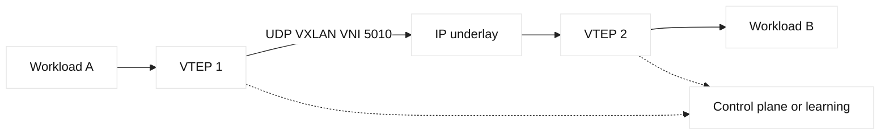

# VXLAN and network overlays

## Learning objectives

Describe VTEPs, VNIs, encapsulation, endpoint learning, and the relationship
between an overlay and its routed underlay. Diagnose MTU and mapping faults.

## Prerequisites

Know Ethernet, VLANs, IP routing, UDP, MAC learning, and basic interface
commands.

## Mental model

VXLAN carries an Ethernet frame inside UDP so a logical Layer 2 segment can
span a routed underlay. The encapsulating device is a VTEP, or VXLAN Tunnel
Endpoint. A 24-bit VXLAN Network Identifier (VNI) provides many more logical
segments than a traditional 12-bit VLAN identifier. The underlay routes VTEP
to VTEP traffic; it does not need to know every tenant MAC address.

Fact: encapsulation adds headers and therefore changes the effective MTU.
Fact: a VTEP must learn where remote MACs or IP destinations live, commonly
through flood-and-learn or a control plane such as EVPN. Inference: overlay
failures often look like ordinary routing failures because the underlay can be
healthy while the VNI mapping, VTEP reachability, or endpoint learning is
wrong.

## Diagram

## Worked example

Consider two fictional hosts in VNI 5010, attached to VTEPs `192.0.2.11` and
`192.0.2.12`. The hosts exchange a frame using their logical segment. VTEP 1
learns the destination endpoint belongs behind VTEP 2, adds the outer headers,
and sends the packet through ordinary underlay routing. VTEP 2 removes the
encapsulation and delivers the original frame. If the underlay MTU is 1500,
the usable inner payload must leave room for the selected encapsulation; exact
overhead depends on addressing and options, so verify rather than memorize a
single number.

## When this breaks

A missing route between VTEPs, inconsistent VNI mapping, stale endpoint
learning, blocked UDP, or an underlay MTU mismatch can each break traffic.
Broadcast and unknown-unicast handling can also overload a segment. A common
misdiagnosis is to inspect only the workload route: the workload may have a
perfect default route while the VTEP has no remote endpoint entry. Compare
inner and outer packet counters and test both small and large payloads.

## Operational checklist

- Verify every VTEP has routed reachability to its peers.
- Record VNI-to-bridge mappings and ownership.
- Confirm endpoint learning or EVPN advertisements are current.
- Calculate and test effective MTU across the full underlay.
- Monitor encapsulation drops, unknown-unicast, and control-plane churn.
- Document rollback before changing mappings or flooding behavior.

## Implementation exercise

On a disposable Linux lab, inspect interfaces with `ip -d link show` and
routes with `ip route`; if a platform exposes VXLAN state, use its documented
read-only show command. Calculate the path MTU from the underlay MTU minus the
encapsulation overhead, then test only lab addresses with a packet-size probe
that sets “do not fragment” where supported. Record VTEP addresses, VNI,
endpoint location, and observed MTU. The exercise is complete when you can
explain whether a failed large packet is an application issue or an overlay
path issue.

## Questions and answers

### 1. Why put VXLAN over a routed underlay?

A routed underlay offers scalable equal-cost paths and separates physical
reachability from tenant segmentation. VXLAN then creates logical segments at
the edge without extending a broadcast domain through every switch. This
supports workload mobility and multi-tenant designs, but it adds operational
state: VTEP reachability, VNI membership, endpoint learning, and MTU planning.
The separation is an architectural pattern, not a guarantee that every
application can move without changing its IP address.

### 2. What does a VNI identify?

A VNI identifies a VXLAN logical segment, analogous to a VLAN identifier but
with a larger namespace. It does not by itself identify a host, route, or
security policy. Devices map local ports or bridge domains to a VNI and must
agree on the mapping. A duplicate or incorrect mapping can place workloads in
the wrong broadcast domain. Always verify the control-plane or configuration
source rather than inferring identity from a familiar VLAN number.

### 3. Why does MTU matter so much?

VXLAN adds an outer Ethernet, IP, UDP, and VXLAN header around the original
frame. If the underlay allows only the old MTU, the encapsulated packet can be
fragmented or dropped. TCP may appear to connect while larger responses stall,
and ICMP-based discovery may be filtered. The safe engineering response is to
measure the effective path MTU, configure consistent underlay margins, and
verify jumbo-frame assumptions end to end instead of changing an application
timeout first.

### 4. How do you distinguish underlay and overlay faults?

First test VTEP-to-VTEP IP reachability and routing independently of tenant
traffic. Then inspect VNI membership, remote endpoint learning, and encapsulated
packet counters. A clean underlay with no remote MAC entry points toward a
control-plane or mapping issue; a missing outer packet points toward routing or
ACL policy. Compare a small and large packet test. These observations narrow
the fault domain without declaring that a single counter proves root cause.

### 5. Why can a routed underlay carry a broadcast-like overlay?

The VTEP receives a local Ethernet frame and decides how to deliver it
remotely. Broadcast and unknown-unicast traffic can be replicated through a
control plane or configured mechanism, while the underlay forwards ordinary
outer IP packets. This enables logical adjacency without extending every
physical broadcast domain. Replication consumes bandwidth and state, so a
design must define flooding limits and convergence after a VTEP failure.

### 6. What does an EVPN-style control plane contribute?

An EVPN control plane can advertise MAC, IP, and VTEP reachability so devices
learn remote endpoints without excessive flooding. It can support policy
attributes and multihoming, depending on implementation. The name alone does
not validate a deployment: verify route targets, VNI membership, freshness,
and data-plane counters. Vendor defaults vary and require release-specific
documentation.

| Layer | Question | Evidence |
| --- | --- | --- |
| Workload | Is local addressing valid? | Interface and route state |
| Overlay | Is endpoint mapping present? | MAC/IP and VTEP tables |
| Underlay | Can outer packets travel? | Routes and counters |
| MTU | Does payload fit? | Size-limited lab probes |

## Design notes and evidence

VXLAN troubleshooting requires two packet views. At the host or workload
interface, verify the inner source and destination addresses, VLAN or tenant
identity, and default gateway. At the underlay interface, verify the outer
VTEP addresses, UDP destination port, and route selected between tunnel
endpoints. An inner packet can be correct while the outer route is missing;
the reverse can also occur when endpoint learning maps a VNI to the wrong
remote locator. Capture only on an authorized lab or mirror port and redact
payloads before sharing evidence.

The control plane is equally important. Static flood-and-learn behavior may
work for a small lab but become noisy at scale. A controller or EVPN exchange
can advertise MAC and IP reachability, but stale advertisements, duplicate
addresses, or an inconsistent VNI-to-VLAN mapping create selective failures.
Compare the source of truth with device state, record sequence numbers and
timestamps, and make the smallest reversible correction. F5 LTM usually sits
at a routed boundary rather than inside the overlay; its pool health can be
green while a tenant-to-tenant route or security policy is broken. GTM answers
should therefore be correlated with the selected site’s underlay and VTEP
health, not treated as proof of end-to-end reachability.

### 5. Why does an MTU change matter in VXLAN?

VXLAN adds an outer Ethernet, IP, and UDP header, reducing the payload that
fits without fragmentation. If hosts retain a 1500-byte interface MTU while
the underlay cannot carry the larger frame, large requests may disappear while
small health checks succeed. Test packet sizes with the DF bit where supported,
inspect ICMP too-big messages, and align host, tunnel, and underlay settings.

### 6. How should overlay changes be automated?

Generate a plan that validates VNI uniqueness, endpoint reachability, MTU
headroom, route policy, and security rules before applying it. Read back the
effective mapping after a change and run a small inner-flow probe through the
affected path. Do not infer success from a controller API response alone:
underlay convergence, ARP/ND, firewall state, and application readiness can
lag behind the control-plane acknowledgement.
