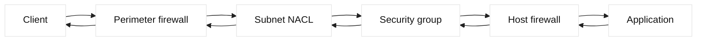

# Firewalls, security groups, and NACLs

## Learning objectives

Distinguish stateful firewalls, security groups, stateless NACLs, and host
firewalls. Build complete flow tuples and least-privilege policy reviews.

## Prerequisites

Know TCP setup, ephemeral ports, IP routing, CIDR, NAT, and transport versus
application errors.

## Mental model

A firewall evaluates traffic against policy and may be stateful, tracking
connections so a permitted reply is accepted without a symmetric rule.
Security groups commonly attach to virtual interfaces or instances and are
often stateful allow lists. A network ACL commonly attaches to a subnet or
boundary and can be stateless, requiring explicit inbound and return rules.
Names and exact semantics vary by platform, so treat those descriptions as
conceptual facts and verify the provider implementation.

Inference: a packet can be allowed at an instance boundary yet denied at a
subnet ACL, host firewall, load balancer policy, or application authorization
layer. “The port is open” is therefore an incomplete statement unless the
source, destination, direction, protocol, and return path are specified.

## Diagram

## Worked example

An API client at `198.51.100.20` connects to fictional service address
`203.0.113.50:443`. The perimeter allows TCP 443, the subnet ACL allows the
forward packet and its return traffic, the security group allows the client
group, and the host firewall permits the listener. A flow log showing the
forward packet but no reply directs attention to the service route or host. A
reset after the packet reaches the host suggests listener or reject behavior;
an HTTP 403 means the network path worked and authorization made the decision.

## When this breaks

Policy drift, NAT changing the observed source, asymmetric routing, stale
security-group membership, and an accidentally broad deny can produce confusing
symptoms. Health checks may originate from a different subnet and therefore
exercise a different rule. During incidents, avoid opening an entire CIDR as a
guess. Build a flow tuple, inspect logs at each boundary, and use a narrowly
scoped, expiring test only after ownership approves it.

## Operational checklist

- Write source, destination, protocol, port, and direction explicitly.
- Identify every filtering boundary, including host and container policy.
- Verify NAT and return-route assumptions with timestamps.
- Confirm health-check sources separately from user sources.
- Require owner, purpose, expiry, and rollback for temporary rules.
- Review logs for both accepted and denied flows without exposing secrets.

## Implementation exercise

Create a policy table for a fictional API: source `198.51.100.20`, destination
`203.0.113.50`, TCP 443, and an ephemeral return port. Mark each boundary as
allow, deny, or unknown, including logging expectations. In a lab, use a
read-only rule listing and `nc -vz` only against your own listener. Explain why
a TCP timeout, a reset, and an application 403 are different evidence. Finish
by proposing the narrowest temporary test rule and its expiry, without applying
it to a real system.

## Questions and answers

### 1. What is the difference between stateful and stateless filtering?

A stateful filter records connection state, such as an established TCP flow,
and can permit return traffic associated with an allowed request. A stateless
filter evaluates each packet independently, so a return path generally needs a
matching rule for the ephemeral source or destination port. Stateful behavior
reduces rule duplication but consumes tracking resources and can be confused
by asymmetric routing. “Stateful” does not mean the filter understands user
identity or application intent.

### 2. Why can an allow rule still produce a timeout?

The rule may match the wrong address after NAT, the return route may differ, or
another boundary may deny the packet. A health check may use a different source
than a user request, and DNS may resolve to another endpoint. Timeouts provide
weak localization; collect flow logs, packet counters, route data, and a
controlled test from the same source subnet. A reset suggests an active reject
or listener behavior, while silence is compatible with several causes.

### 3. How should least privilege be applied to network policy?

Specify the smallest source set, destination, protocol, port, and direction
needed for the dependency. Prefer identity or workload groups where supported,
but document how membership is maintained. Add logging that is useful without
capturing secrets, and give temporary diagnostic rules an owner and expiry.
Review both data flow and return flow. Least privilege is a process of reducing
unnecessary reachability; it is not achieved merely by adding a deny-all rule
after broad allows.

### 4. What evidence belongs in a firewall change review?

Include the dependency owner, exact flow tuple, business purpose, expected
volume, direction, NAT assumptions, rollback, and validation test. Identify
which control evaluates the rule and how propagation is observed. A screenshot
without timestamps is weak evidence. A review should also ask whether a proxy,
service identity, or private endpoint removes the need for broad CIDRs. The
goal is a reversible, auditable change rather than a permanently open port.

### 5. Why is rule order important on some firewalls?

Many policy engines evaluate rules in order and stop at the first match,
although some compile rules or use another precedence model. A broad deny
above a narrow allow blocks intended traffic; a broad allow can bypass useful
logging. Read platform semantics and include an explicit default action. One
source test does not prove another NAT-translated address cannot match a
different rule, so reviews must include the complete evaluated tuple.

### 6. Why are network controls not application authorization?

Network policy decides whether a flow can reach a listener, while application
authorization decides whether a caller may perform an operation. A permitted
TCP connection can still receive HTTP 401 or 403; a blocked flow prevents even
a correctly authorized caller. Keep reachability, workload identity, and
application authorization as separate layers with owners and evidence. Opening
a port is never a substitute for fixing a token or authorization policy.

| Observation | Inspect next | Caution |
| --- | --- | --- |
| SYN timeout | ACL, route, silent drop | Multiple boundaries may drop |
| RST | Listener or reject policy | Reset is not proof of firewall |
| TLS alert | TLS policy or certificate | Network path progressed |
| HTTP 403 | Application authorization | Do not open a port |

## Design notes and evidence

Treat a policy decision as a function of direction, identity, protocol, source
and destination, port, state, and rule order. A client-side SYN may be allowed
by a security group while the return SYN-ACK is rejected by a stateless NACL or
host firewall. A flow through an F5 VIP can also have different tuples on the
client and server sides because of SNAT, so a rule written for the original
client address may never match the backend packet. Capture both legs or use
flow logs with timestamps, action, rule identifier, and byte counters.

Use least privilege as a testable property. Start with a narrow source set and
service port, observe denied and accepted flows, then expand only when evidence
shows a required dependency. Prefer service identities, tags, or groups over
large CIDR ranges when the platform supports them. During a migration, stage a
shadow rule or log-only policy and define a rollback threshold for failed
requests. F5 monitors should be permitted explicitly; otherwise a healthy
member may be marked down even though user traffic is allowed. GTM health
probes may originate from different addresses and need equivalent policy.

### 5. Why can a stateful firewall still drop a valid response?

State tracking depends on seeing the expected tuple and sequence behavior. An
asymmetric route, SNAT change, idle timeout, or failover that lost connection
state can make a legitimate response look unrelated. Compare both directions,
firewall state age, NAT mappings, and idle timers. Do not simply increase every
timeout; that can consume state memory and hide an asymmetric design error.

### 6. What makes a firewall change safe?

Record the exact rule diff, affected zones, expected flows, monitor sources,
expiration or review date, and rollback command. Apply through an approved
pipeline, then test a permitted flow, a deliberately denied flow, and the F5
health check. Preserve evidence and ownership. A green application probe alone
does not prove that failover, alternate VIPs, IPv6, or administrative paths
remain protected.
