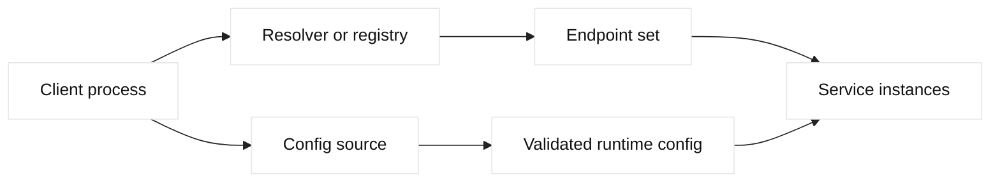

# Service discovery and configuration

## Learning objectives

Separate service location from runtime behavior, design health and lease
semantics, and roll configuration out with validation and rollback.

## Prerequisites

Know DNS caching, TCP lifecycle, HTTP clients, and distributed-systems failure
modes.

## Mental model

Service discovery maps a logical service name to reachable instances, usually
through DNS, a registry API, or a platform-native service object. Configuration
is the set of values that changes application behavior: endpoints, timeouts,
feature flags, and credentials references. Discovery answers “where can I
connect?” while configuration answers “how should I behave?” Combining them
carelessly can make stale endpoints or unsafe defaults hard to diagnose.

Fact: DNS answers are cached according to TTL, and clients can cache beyond the
authoritative server through resolver or library behavior. Fact: registries
need health and membership updates. Inference: removing an instance from a
registry does not instantly terminate every connection, so graceful draining,
short-lived leases, and client retry policy must be designed together.

## Diagram

## Worked example

`checkout.lab.example` advertises three fictional instances. A registry lease
expires after a bounded interval, while a readiness check confirms the process
can reach its database. Clients resolve the name, cache the result according
to policy, and apply a per-request deadline. During deployment, the old
instance is marked draining before its lease is removed, so existing
connections can complete. Configuration version 42 changes a timeout and is
rolled out to one canary first. The effective version and selected endpoint
are logged as metadata, never as a secret.

## When this breaks

Stale DNS, registry partitions, false health positives, bad configuration
parsing, and unbounded retries are recurring hazards. A client may keep using
an endpoint after removal, while a registry may return an instance that is
alive but overloaded. Configuration can also be valid syntactically yet unsafe
semantically, such as a zero timeout or an endpoint from the wrong environment.
Separate discovery, validation, and retry evidence when diagnosing incidents.

## Operational checklist

- Define the owner and source of truth for each service name.
- Document TTL, lease, health, drain, and reconnect behavior.
- Validate configuration schema and semantic ranges before activation.
- Expose effective config and discovery version without secret values.
- Bound retries with deadlines, jitter, and idempotency rules.
- Keep a tested rollback version and an incident-safe stale-data policy.

## Implementation exercise

Write a small design note for `payments.lab.example` with three fictional
instances. Define registration ownership, health signal, TTL or lease length,
connection draining, retry limits, and configuration versioning. Implement a
local resolver stub in memory that returns only instances whose lease has not
expired. Add a test showing that an old client may retain a cached address and
must handle connection refusal. Keep values non-sensitive and do not connect
to a live registry.

## Questions and answers

### 1. Why is DNS-based discovery not immediate failover?

Authoritative DNS can publish a new answer, but recursive resolvers and clients
may retain the old answer until its TTL expires, and some libraries add their
own caching. Existing TCP connections also continue until closed. Therefore a
design combines health-aware publication with client timeouts, reconnects, and
draining. Lowering TTL shortly before an incident may not help caches that
already stored a longer answer, so TTL is a planning parameter rather than an
instant control.

### 2. What makes registry membership trustworthy?

Membership needs an owner, an authentication mechanism, a lease or heartbeat,
and a health check that tests the dependency being advertised. A process that
is alive but unable to serve should not remain eligible. Updates should be
auditable and resilient to a registry partition; clients need a defined stale
data policy. These controls reduce false positives, but no health signal proves
all requests will succeed under every payload or authorization context.

### 3. How should runtime configuration be rolled out?

Validate syntax and semantics before activation, version each change, and make
the effective version observable. Use staged rollout or a canary when a value
can alter load, retries, or security. Separate secret references from ordinary
configuration and avoid printing secret values in logs. A restart-only setting
must be documented because changing the source does not imply every process
has reloaded it. Rollback should identify the previous known-good version.

### 4. What is a dangerous retry interaction?

If a client retries quickly while a server, proxy, and queue also retry, one
logical request can multiply into many physical attempts. During an outage this
creates a retry storm that worsens saturation. Set bounded attempts, deadlines,
jitter, and idempotency rules, and propagate a request budget where practical.
Discovery must return usable endpoints, but it cannot decide whether an
operation is safe to repeat; that belongs to the API contract and client.

### 5. What is the difference between readiness and liveness?

Readiness asks whether an instance should receive new work; liveness asks
whether a process should be restarted or recovered. A service can be alive
while its database is unavailable, so treating liveness as readiness routes
traffic into failures. Readiness failure should normally drain traffic rather
than restart a healthy process. Probe names vary, but this distinction prevents
restart storms and contains dependency incidents.

### 6. How can configuration drift be detected safely?

Publish a version or digest of validated effective configuration and compare it
with intended state. Keep secret values outside ordinary logs and diffs. A
rollback may intentionally pin an older version, so drift detection needs an
approved, time-bounded exception path. The useful signal is that differences
are understood, owned, and observable. Include the effective version in traces
or health metadata without exposing sensitive values.

| Concern | Decision | Evidence |
| --- | --- | --- |
| Location | DNS, registry, or platform object | Answer and endpoint version |
| Eligibility | Readiness and lease | Health result and expiry |
| Behavior | Schema and ranges | Effective config version |
| Recovery | Drain, retry, rollback | Timeline and owner |

## Design notes and evidence

Service discovery is a control loop: an authority publishes an endpoint, a
resolver or client caches it, a health signal determines eligibility, and the
caller opens a connection. Each stage has independent timers. A registry can
show a service as healthy while a stale client cache points at a drained
instance; conversely, an over-aggressive health check can remove every member
during a temporary dependency failure. Record registration time, lease expiry,
health result, resolver cache behavior, and the actual destination observed by
the caller.

Configuration distribution has a similar distinction between desired and
effective state. Git, a secret manager, a Kubernetes ConfigMap, an F5 profile,
and an application process may all hold versions of one setting. Use a
monotonic version, checksum, owner, and expiry where possible. A rollout should
render the intended diff, validate schema and certificate references, deploy to
a canary, and verify behavior before broadening. Never log private keys or
tokens while proving that a client received the new configuration.

F5 GTM can provide DNS-based service discovery for sites, while LTM provides a
VIP and pool for the selected site. DNS TTL and client-side connection reuse
mean discovery is not an instantaneous drain mechanism. If an endpoint is
removed, keep it safe for the maximum expected cache and connection lifetime,
or use an explicit application-level drain protocol.

For SDE2 design, treat discovery as a consistency problem rather than a magic
lookup. Define the authority, cache owner, freshness bound, health signal,
version format, and behavior during partitions. A GTM answer can select a
healthy site while a local LTM pool is draining, and a configuration agent can
acknowledge a version before the process reloads it. Correlate authoritative
records, resolver caches, registry leases, F5 pool state, and application
configuration in one timeline. Use canaries, bounded retries, and read-back
verification; never use a DNS edit as an instantaneous connection drain.
