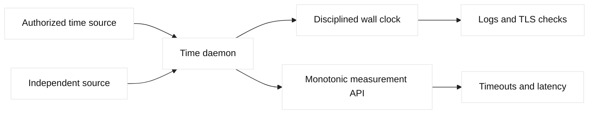

# NTP and time synchronization

## Learning objectives

Explain NTP offset, delay, stratum, and clock discipline; distinguish wall
clock from monotonic duration measurement; and diagnose time-related symptoms.

## Prerequisites

Know UDP, TLS validity intervals, and basic observability concepts.

## Mental model

The Network Time Protocol (NTP) lets a client estimate clock offset and delay
from one or more time servers. A disciplined system clock supports TLS
certificate validity checks, log correlation, leases, distributed tracing, and
scheduled jobs. Modern systems may use chrony or another daemon to select
sources and gradually adjust the clock. Precision Time Protocol (PTP) is a
separate option for environments that need tighter synchronization and
hardware support.

Fact: wall-clock time can jump or be corrected, while a monotonic clock is
intended for measuring elapsed durations. Inference: timeout code should use a
monotonic source, whereas certificate and audit timestamps require a carefully
disciplined wall clock. A synchronized clock does not make logs globally
ordered; clock error and event transport delay still exist.

## Diagram

## Worked example

Three fictional application hosts use two approved time sources. The daemon
selects a source, reports estimated offset and delay, and gradually disciplines
the wall clock. An API measures a 200 ms deadline with a monotonic clock, while
its access log records wall time and synchronization state. One source becomes
unreachable; source agreement and alerting reveal degraded redundancy before a
certificate check fails. The example demonstrates observability and clock
roles; it does not assert a particular daemon's thresholds.

## When this breaks

Blocked NTP traffic, an incorrect source, VM timekeeping problems, oscillator
drift, leap-second handling, and a manually stepped clock can all create
errors. Symptoms include certificates rejected as not yet valid, token replay
windows failing, misleading latency, and logs that appear out of sequence.
Timezone display is a separate presentation concern. Check synchronization
state and raw offset before changing application validation behavior.

## Operational checklist

- Use multiple authorized sources with clear ownership.
- Monitor offset, delay, source reachability, and daemon state.
- Use monotonic time for deadlines, retries, and elapsed measurements.
- Record wall-clock timestamps with timezone and synchronization context.
- Test certificate and token behavior under bounded clock skew in a lab.
- Define escalation and recovery for loss of all trusted sources.

## Implementation exercise

On a lab host, use a read-only command such as `chronyc tracking` or the
platform equivalent to record source, offset, stratum, and synchronization
state. Compare application duration measurements made with a monotonic API to
wall-clock timestamps. Simulate a stale source in a design worksheet, then
define alert thresholds and an escalation path. Never change system time or
point production hosts at an unapproved server for this exercise.

## Questions and answers

### 1. Why should timeout code use a monotonic clock?

Elapsed-time logic assumes that time moves forward at a predictable rate. Wall
clocks can step forward or backward when synchronization corrects drift, when
administrators change settings, or when virtualization affects timekeeping. A
backward step can make a deadline appear not to expire; a forward step can make
it expire early. Monotonic clocks are designed for intervals. Wall time remains
appropriate for human-readable timestamps, but duration calculations should
not depend on calendar corrections.

### 2. What does NTP stratum tell you?

Stratum is a distance-like indicator from a reference clock in the NTP
hierarchy; lower values are generally closer to a reference. It is not a direct
measurement of accuracy or network latency. A low-stratum source can still be
misconfigured, unreachable intermittently, or wrong. Operators should inspect
offset, delay, dispersion, source selection, and agreement among independent
sources. Treat stratum as one input to source quality, not as a ranking that
automatically proves correctness.

### 3. How does clock error affect TLS?

Certificates have validity intervals expressed using wall-clock timestamps. If
a client clock is substantially behind or ahead, it can reject a certificate
as not yet valid or expired even when the certificate and server are correct.
The same symptom can occur with signed tokens and replay windows. Check the
local clock, synchronization state, timezone presentation, and certificate
chain separately; changing validation policy to hide clock error weakens
security and does not repair the underlying time source.

### 4. Can synchronized logs prove event order?

They improve correlation but cannot prove a total order. Each host has residual
offset, timestamps may be buffered before export, and collectors can receive
events out of order. Use trace IDs, sequence numbers, request IDs, and causal
relationships in addition to timestamps. Record synchronization health so an
incident review can bound uncertainty. A timestamp is evidence with an error
interval, not an infallible global clock shared by every process.

### 5. What is clock offset versus network delay?

Offset is the estimated difference between a local clock and a reference;
delay estimates round-trip transit and processing. A client cannot directly
observe the remote clock, so the estimate depends on path symmetry and timing
assumptions. High delay or asymmetry increases uncertainty even when displayed
offset is small. Dashboards should show source state, delay, dispersion, and
offset rather than presenting one number as exact truth.

### 6. Why can a time-source outage be silent for a while?

An oscillator continues advancing after synchronization, and a daemon may
retain an estimate temporarily. Drift accumulates gradually or can become
large under virtualization. Applications may work until a certificate
boundary, token window, scheduled job, or log comparison exposes the error.
Alert on source reachability and offset before application symptoms; maintain
independent sources and a documented policy for loss of trust.

| Use | Clock | Reason |
| --- | --- | --- |
| Deadline | Monotonic | Resists wall-clock steps |
| Certificate | Disciplined wall | Protocol uses calendar time |
| Audit record | Wall plus sync health | Human correlation |
| Latency | Monotonic duration | Measures elapsed interval |

## Design notes and evidence

Time troubleshooting starts by identifying which clock a component uses. A
kernel wall clock may be corrected by NTP, while a monotonic clock measures
durations without jumping when synchronization steps the wall clock. TLS
certificate validity, Kerberos tickets, DNSSEC signatures, distributed locks,
logs, and database conflict resolution often use wall time; timeout loops and
latency histograms should use monotonic time. Record offset, frequency error,
stratum, source, poll interval, leap status, and the measurement timestamp.

The request path crosses multiple clock domains. A client log, F5 LTM event,
GTM monitor result, firewall flow log, and origin trace can appear out of order
even when packets travelled correctly. Normalize to UTC, preserve the original
timestamp and source, and include a clock-quality field in incident evidence.
If a certificate appears “not yet valid,” verify the issuing chain and the
observed system clock before replacing a valid certificate. If GTM health
results flap at a boundary, compare monitor timestamps and offset rather than
immediately changing the load-balancing threshold.

Automation should alert on synchronization health before it causes an outage.
A read-only check can reject a host whose offset exceeds policy, verify that
multiple time sources agree, and annotate deployment evidence with clock
uncertainty. Do not silently force a time step on a production host during an
application incident; stepping can invalidate leases or create duplicate
timestamps. Follow the platform’s approved time-service procedure and test
failover to a secondary source. For every incident, state whether a timestamp
is measured, estimated, or inferred, and give the uncertainty interval.

## Design notes and evidence

For a production design, identify who owns the approved time sources, which
network paths carry synchronization traffic, and how hosts behave when all
sources disappear. Record the daemon's selected source and estimated error in
health telemetry, but avoid treating telemetry transport timestamps as more
accurate than the host clock that created them. When investigating a TLS error,
capture the client wall time, server wall time, certificate validity interval,
and synchronization state at the same incident window. When investigating a
latency alarm, compare monotonic duration with wall-clock log order. This
separation prevents a clock correction from being misreported as a network
spike. Inference: the most useful alert combines source loss with estimated
drift and affected dependency, because a generic “time unhealthy” alert does
not tell an on-call engineer whether to inspect firewall policy, virtualization,
or certificate validation first.
