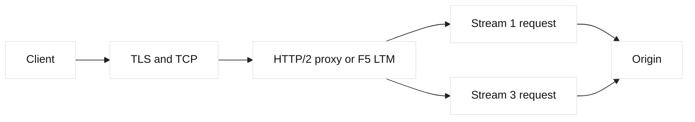

# HTTP/2 deep dive

## Learning objectives

Explain frames, streams, HPACK, flow control, priorities, and graceful
connection handling. Diagnose HTTP/2 failures at a reverse proxy or F5 LTM
without confusing transport, protocol, and application evidence.

## Prerequisites

Know HTTP/1.1, TLS, TCP, DNS, and basic proxy terminology. Readers should be
comfortable reading a request trace and a status code.

## Mental model

HTTP/2 keeps HTTP semantics while replacing textual messages with binary
frames. A connection has stream identifiers; HEADERS and DATA frames carry
request and response work. SETTINGS establishes peer capabilities, WINDOW_UPDATE
controls receive credit, and RST_STREAM cancels one stream. HPACK compresses
repeated headers using static and dynamic tables. These are protocol facts.
Inference: a proxy can preserve application semantics while changing stream
limits, connection reuse, and buffering, so its metrics are part of the path.

## Diagram

## Worked example

An application loads HTML and six assets through one HTTPS connection. The
client sends stream 1 for HTML and additional streams for assets. The proxy
accepts HTTP/2, then uses HTTP/1.1 upstream because that is the configured
backend contract. If stream 3 is reset, inspect the reset code and proxy logs;
do not infer that the whole TCP connection failed. If all streams pause,
inspect TCP loss, connection flow credit, proxy buffering, and origin worker
limits. A read-only F5 review should record virtual-server profiles, negotiated
ALPN, idle timeout, and pool member protocol, without copying credentials.

| Layer | Useful evidence | Typical mistake |
| --- | --- | --- |
| TCP | Retransmits and RTT | Blame HPACK for packet loss |
| HTTP/2 | Stream reset and window | Treat one reset as connection failure |
| Proxy | Protocol translation and queue | Assume end-to-end HTTP/2 |
| Origin | Status and application logs | Ignore upstream limits |

## When this breaks

Incorrect ALPN, incompatible intermediaries, exhausted stream windows, header
table errors, and mismatched idle timeouts are common. A client may fall back
to HTTP/1.1, masking the issue. Large headers can trigger a limit before the
application runs. F5 profile changes can also alter TLS ownership or protocol
translation. Capture negotiated protocol and timestamps at each hop.

## Operational checklist

- Record ALPN and protocol separately on client and upstream hops.
- Monitor active streams, resets, connection windows, and header-limit events.
- Verify proxy and origin idle, request, and queue timeouts.
- Test fallback behavior and graceful drain during deployment.
- Keep TLS profiles and backend protocol ownership explicit.
- Correlate stream IDs with request IDs without logging secrets.

## Implementation exercise

Use a lab endpoint and `curl --http2 -I` to record negotiated behavior. Build a
small table of stream, status, bytes, and elapsed time. Repeat through a local
reverse proxy and identify where HTTP/2 becomes HTTP/1.1. Compare a normal
response with a deliberately bounded header or timeout in your own lab.

## Questions and answers

1. **Why does HTTP/2 use streams?** Streams let many request and response exchanges share one connection while retaining per-request identity. Frames can interleave, reducing connection setup overhead, but TCP ordering still means packet loss can delay every stream on that connection.
2. **What does RST_STREAM mean?** It cancels one stream and carries an error code describing the protocol or application reason. The connection may remain usable. Clients should apply method idempotency and deadline policy before retrying rather than blindly replaying writes.
3. **Why inspect SETTINGS?** SETTINGS advertises limits and capabilities such as maximum concurrent streams and initial windows. A peer can legally constrain concurrency, so a client that assumes unlimited streams may queue or fail despite healthy TCP.
4. **What is HPACK risk?** Dynamic compression tables improve efficiency but require synchronized decoder state. Invalid indexes or oversized header blocks can cause protocol errors. Logging decoded headers must also respect privacy and credential-handling rules.
5. **Why can a proxy hide a problem?** A proxy may terminate client HTTP/2 and use another protocol upstream. Client success then proves only the first hop. Compare both negotiated protocols, queue timing, and origin responses before concluding end-to-end support.
6. **How should priorities be treated?** Priority signals express preferences, but implementations and proxies may ignore or reinterpret them. Use application measurements and bounded resource policies rather than assuming a priority tree guarantees a particular completion order.

## Design notes and evidence

An HTTP/2 investigation should establish where TLS terminates and whether the
next hop is HTTP/2, HTTP/1.1, or another protocol. F5 LTM profiles, pool
monitors, and idle timeouts can change the behavior observed by a client. A
trace should retain timestamps, stream identifiers, response status, and member
selection while redacting cookies and authorization. Compare a healthy request
with the smallest failing request, then test connection reuse separately from
application concurrency. This method is an engineering inference: no single
counter proves causality, but aligned evidence narrows the layer and protects
against changing a profile merely because a symptom appeared after deployment.
