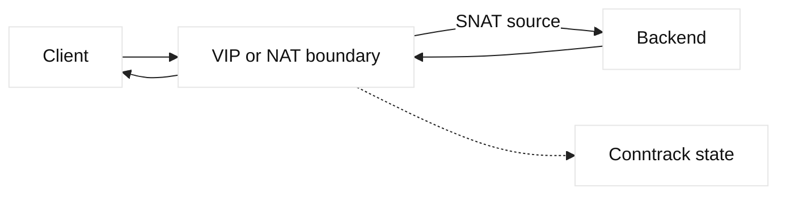

# NAT, conntrack, and SNAT

## Learning objectives

Trace address translation, connection tracking, reverse paths, and SNAT in a
load-balanced request. Explain why ephemeral-port capacity, timeouts, and F5
source-address behavior matter.

## Prerequisites

Know IPv4, TCP five-tuples, routing, and basic virtual-server concepts.

## Mental model

Network Address Translation rewrites packet addresses or ports at a boundary.
Stateful conntrack remembers the original and translated tuple so return
packets can be reversed. SNAT changes the source; DNAT changes the destination.
Fact: translation is state, not merely a string substitution. Inference: a
healthy backend can still fail through a VIP when return routing, SNAT pool
capacity, or state synchronization is wrong.

## Diagram

## Worked example

A client `198.51.100.20:53000` reaches a fictional VIP `203.0.113.50:443`.
The load balancer selects `10.0.0.10:8443` and SNATs the source to a self IP.
The backend replies to that self IP, allowing the device to reverse the state
and deliver the client response. Without SNAT, the backend needs a route back
through the device. A read-only review records original and translated tuples,
pool member route, SNAT mode, idle timeout, and HA state.

| Question | Evidence |
| --- | --- |
| Was translation created? | Conntrack or flow record |
| Is capacity available? | Port and SNAT counters |
| Can replies return? | Backend route and capture |
| Does HA preserve state? | Peer and failover status |

## When this breaks

Asymmetric routing, expired state, port exhaustion, overlapping address space,
and incorrect NAT order cause resets or timeouts. Long-lived WebSockets can
outlive idle state. A backend log may show only the SNAT address, complicating
identity; preserve request IDs and document source visibility.

## Operational checklist

- Record original and translated tuples at each hop.
- Check SNAT port utilization and allocation failures.
- Verify backend return routes and asymmetric paths.
- Align idle timeouts with application connection behavior.
- Validate HA state replication and failover recovery.
- Treat NAT changes as security and capacity changes.

## Implementation exercise

Draw three tuples for a lab VIP: client-side, translated server-side, and
return-side. Use `ss -tn` on your own endpoints and compare observations with a
documented NAT table. Vary an idle timeout in a disposable test and explain
which state expires first.

## Questions and answers

1. **Why does SNAT fix return routing?** It makes the backend's destination a local address owned by the translating device, so the reply returns through that device. It also hides the original client unless another mechanism preserves identity.
2. **What is conntrack state?** It records tuple and protocol state needed to associate reverse packets with an existing flow. Expiration, table pressure, or asymmetric routing can remove that association even while endpoints remain alive.
3. **Why does port exhaustion happen?** A translated address has a finite set of source ports per destination and protocol. Many clients, long-lived connections, or slow state aging can consume that set and cause new flows to fail.
4. **What does hairpin NAT mean?** A client accesses a service through an address that routes back into the same network or device. Special translation and return handling may be needed; test it explicitly rather than assuming ordinary routing applies.
5. **Why can backend logs hide users?** SNAT replaces the source address visible to the backend. Use trusted forwarding metadata or correlated request IDs only where authenticated and safe; never infer identity from an untrusted header.
6. **What is a safe NAT change?** Define tuples, expected return path, capacity impact, rollback, and a lab or canary test. Verify both new and existing connections because state created under the old mapping may behave differently.

## Design notes and evidence

NAT troubleshooting begins with the original tuple, then follows every rewrite
until the backend and return path are understood. A capture at the client can
show a successful SYN while the backend sees a different source and port. F5
SNAT automaps or pools also have capacity and ownership implications; inspect
allocation counters and member routes without changing state during diagnosis.
Conntrack timers should match application behavior, but extending them can
increase memory and port pressure. During HA failover, verify whether state is
replicated and whether existing flows are expected to survive. A DDI record
may describe a public address while the actual private translation is managed
elsewhere, so reconcile DNS, routing, and NAT ownership before an edit.
