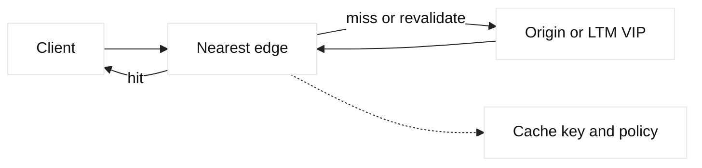

# CDN edge caching

## Learning objectives

Explain cache keys, TTL, freshness, revalidation, purge, origin shielding, and
edge failure behavior. Relate DNS/GTM steering and TLS termination to cache
observability and correctness.

## Prerequisites

Know HTTP caching headers, DNS, TLS, reverse proxies, and basic SLO language.

## Mental model

A CDN is a distributed proxy that may serve a representation from an edge
instead of contacting origin. The cache key commonly includes scheme, host,
path, and selected query or header values. `Cache-Control`, validators, and
TTL influence freshness. Fact: cached content can outlive an origin process.
Inference: cache correctness is a data-contract concern, not simply a latency
optimization.

## Diagram

## Worked example

`app.lab.example/logo.svg` has a one-hour freshness lifetime. The first edge
request is a miss and retrieves it from an origin VIP; later requests hit until
expiry. A deployment replaces the logo, but clients may still see old bytes.
An explicit purge or versioned filename changes behavior. For personalized
responses, the cache policy must exclude cookies or authorization unless the
key safely separates users. Record cache status, age, selected edge, origin
time, and purge version.

| Signal | Meaning |
| --- | --- |
| HIT | Edge served a fresh or usable object |
| MISS | Edge contacted origin |
| REVALIDATED | Validator checked representation |
| Age | Approximate object residence |

## When this breaks

Incorrect cache keys leak variants, long TTL serves stale content, purge lag
confuses deploys, and origin shield overload creates a thundering herd. DNS
steering changes which edge receives new clients but cannot instantly move
already cached objects. TLS or F5 termination can also change headers and
cacheability; inspect each hop.

## Operational checklist

- Define cache key and privacy boundaries explicitly.
- Review cache-control, validators, and stale behavior.
- Version immutable assets and plan purge ownership.
- Monitor hit ratio, age, origin load, and error rate together.
- Test authenticated and personalized responses for isolation.
- Keep origin bypass and rollback paths documented.

## Implementation exercise

Use a local HTTP server and proxy, adding `Cache-Control` and `ETag` headers.
Request an object twice, inspect `Age` or cache-status, modify the origin, and
compare revalidation with a versioned URL. Write down which evidence proves an
edge hit rather than an origin response.

## Questions and answers

1. **What is a cache key?** It identifies which request dimensions select an object. Omitting a meaningful query, host, cookie, or authorization boundary can serve the wrong representation, while adding unnecessary dimensions reduces reuse.
2. **Why use validators?** ETags or modification timestamps let an edge ask whether its object remains current without downloading the full representation. The origin must implement consistent validator semantics for this to be safe.
3. **Does purge erase every client copy?** No. Purge behavior is provider-specific, and browsers or intermediate resolvers may retain data. Versioned immutable URLs provide deterministic rollout while purge handles exceptional corrections.
4. **Why can hit ratio hide an outage?** A high hit ratio may serve old healthy objects while uncached API paths fail. Segment metrics by object class, status, edge, and origin dependency rather than using one aggregate number.
5. **How does GTM relate to a CDN?** DNS steering chooses an answer for new resolution clients. It does not choose every request or instantly invalidate edge state, so CDN policy and DNS TTL must be designed together.
6. **What is origin shielding?** A selected intermediary consolidates misses before reaching origin, reducing duplicate fetches. It can become a bottleneck or failure domain, so capacity and bypass behavior require explicit testing.

## Design notes and evidence

Cache analysis needs a request matrix: host, path, method, query, cookies,
authorization, language, encoding, and expected privacy class. A hit ratio is
not enough because a cache can efficiently serve an incorrect variant. Record
cache status, age, validator result, edge region, origin status, and purge or
version metadata. GTM answers and DNS TTLs influence new edge selection but do
not invalidate cached bytes. F5 LTM can be the origin VIP, so origin health,
monitor semantics, SNAT, and TLS profiles remain relevant on misses. Inference:
the safest rollout uses immutable asset names for ordinary deploys and a
reviewed purge path for urgent corrections, with an origin bypass tested before
traffic is shifted.
