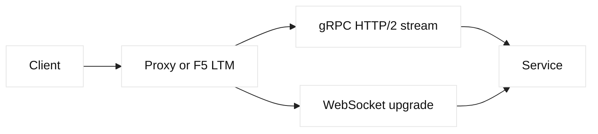

# gRPC, WebSockets, and RPC

## Learning objectives

Compare request-response RPC, streaming gRPC, and WebSockets. Trace HTTP/2,
TLS, proxy, load-balancer, and service-discovery boundaries while preserving
deadlines, identity, and graceful shutdown semantics.

## Prerequisites

Know HTTP, HTTP/2 streams, TLS, DNS, load balancing, and serialization basics.

## Mental model

RPC gives a typed interface to a remote call; gRPC commonly uses Protocol
Buffers over HTTP/2 and supports unary, client-streaming, server-streaming, and
bidirectional calls. WebSockets upgrades an HTTP connection to a long-lived
bidirectional message channel. Fact: a successful TCP or TLS handshake does
not prove an RPC method is authorized or healthy. Inference: long-lived streams
stress idle timeouts, drain policy, and connection tracking more than ordinary
short requests.

## Diagram

## Worked example

A fictional checkout client calls `Quote` using a unary RPC and subscribes to
`Updates` using server streaming. The proxy terminates TLS and routes both to
the same pool, but applies separate idle and maximum-duration policies. A
deployment marks a member draining; new unary calls stop while existing
streams receive a graceful close and reconnect. The client propagates a
deadline and request ID. Logs record method, status, stream duration, and
selected member, not request secrets.

| Property | Unary RPC | Long-lived stream |
| --- | --- | --- |
| Lifetime | Bounded request | Potentially long |
| Retry | Method-dependent | Reconnect and resume |
| LB concern | Per-call selection | Connection pinning |
| Failure evidence | Status and deadline | Close code and duration |

## When this breaks

HTTP/1-only proxies, missing upgrade support, incompatible protobuf versions,
expired idle state, stream limits, and retrying non-idempotent methods cause
failures. A load balancer may select a member once per connection, producing
hotspots for streams. DNS changes do not move established connections. Inspect
protocol negotiation, proxy logs, member state, and client deadlines together.

## Operational checklist

- Document protocol, upgrade, TLS, and backend ownership per hop.
- Set maximum stream and connection lifetimes with graceful drain.
- Propagate deadlines and request IDs across RPC boundaries.
- Define retry and replay safety for every method.
- Monitor active streams, close codes, queue time, and member distribution.
- Test reconnect behavior during DNS, pool, and certificate changes.

## Implementation exercise

Define a local service contract with one unary and one streaming method. Use a
mock transport to inject deadline expiry, member drain, and reconnect. Record
which failures are transport, proxy, serialization, or application status.
Document how an F5 monitor should test readiness without opening a streaming
connection.

## Questions and answers

1. **Why do gRPC calls use HTTP/2?** HTTP/2 supplies multiplexed streams, binary framing, and flow control that fit typed RPC messages. It does not provide method authorization or guarantee that an intermediary preserves every streaming feature.
2. **Why are retries dangerous?** A transport failure can occur after the server committed a write but before the client received its response. Retry only operations whose contract permits replay, use deadlines and idempotency keys, and observe attempt counts.
3. **How does WebSocket upgrade work?** An HTTP request negotiates an upgrade and then the connection carries WebSocket frames. Every proxy and firewall on the path must support the upgrade and preserve appropriate timeout and authentication policy.
4. **Why can streams create load imbalance?** A load balancer often chooses a member when a connection is established. A few clients with long streams can therefore hold disproportionate work even when request counts look balanced.
5. **What should health checks test?** They should test readiness appropriate to the protocol and dependency contract, not merely that a port accepts TCP. A separate lightweight unary health method is often safer than creating a permanent stream.
6. **How should drains be designed?** Stop new assignments, announce a bounded grace period, finish or cancel active work, and let clients reconnect. Coordinate proxy timeout, server shutdown, and client backoff so draining does not become a retry storm.

## Design notes and evidence

RPC observability should include service and method, protocol outcome, status,
deadline, attempt count, stream duration, selected member, and message sizes.
Avoid treating a TCP health check as proof that a gRPC method is ready, because
serialization, authorization, and dependencies can fail later. F5 monitors
should use an explicit lightweight readiness contract; WebSocket upgrades need
separate proxy support and timeout review. DNS or GTM changes affect new
connections while existing streams remain pinned. During a certificate or pool
change, drain deliberately and watch reconnect rate, queue growth, and member
imbalance. These observations support an inference that RPC reliability is a
cross-layer contract rather than a property of protobuf alone.
