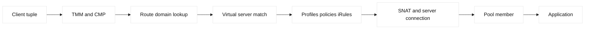

# F5 traffic processing and TMM

## Learning objectives

Trace a packet through BIG-IP TMM, CMP, route domains, virtual servers,
profiles, policies, iRules, OneConnect, SNAT, and pool selection. Build a
packet tuple and debug session that distinguishes client, VIP, and server-side
evidence without assuming vendor defaults.

## Prerequisites

Know Ethernet, IP routing, TCP, TLS, HTTP, NAT, VLANs, and basic F5 LTM object
terms. This is a study guide, not a production configuration procedure.

## Mental model

Traffic Management Microkernel (TMM) is the BIG-IP data-plane process that
handles packet processing. CMP distributes eligible traffic across TMM
instances, while platform and version details determine exact behavior. A
virtual server matches a destination and service, profiles interpret protocols,
policies and iRules can select or modify behavior, and a pool supplies backend
members. Route domains partition address spaces and can influence reachability.
OneConnect can decouple client-side and server-side connection reuse. These are
vendor facts whose defaults must be checked against the deployed release.

## Diagram

## Worked example

Client `198.51.100.20:53000` sends TCP to VIP `203.0.113.50:443`. The client
side tuple is `(198.51.100.20,53000,203.0.113.50,443,TCP)`. TMM matches the
virtual server, applies the client TLS profile, selects a pool member
`10.0.0.10:8443`, and SNATs the server-side tuple to a self address. The
backend sees `(192.0.2.10,ephemeral,10.0.0.10,8443,TCP)`. A route-domain
lookup must find the correct table; identical private addresses in different
domains are not necessarily the same endpoint. OneConnect may reuse a server
connection while HTTP profiles keep request boundaries visible.

| Stage | Tuple or evidence | Question |
| --- | --- | --- |
| Client | Original five-tuple | Did traffic reach BIG-IP? |
| Match | VIP, port, route domain | Which virtual server won? |
| Policy | Profiles and rule log | Was behavior changed? |
| Server | SNAT tuple and member | Can replies return? |
| Response | Status, reset, timing | Which hop failed? |

A debug session starts with timestamps and a request ID. Confirm DNS answer,
VIP listener, VLAN and route domain, virtual-server state, selected profiles,
pool member state, monitor result, SNAT mode, and server-side route. A client
timeout with no SYN to the member points toward listener, policy, or selection;
a member SYN with no response points toward backend path or service. Do not
disable profiles or rules as a first experiment: capture a hypothesis and use
read-only evidence, then test an approved canary.

## When this breaks

CMP hashing or an unsupported feature can create uneven processing. A route
domain mismatch can make a valid address unreachable. Incorrect profile order,
an iRule side effect, OneConnect reuse, monitor false positives, SNAT port
pressure, asymmetric return routing, and MTU problems all produce different
symptoms. A connection can succeed while an HTTP request fails after policy
processing. TMM counters, packet captures on the relevant VLANs, and pool
logs should be correlated rather than interpreted in isolation.

## Operational checklist

- Write client and server tuples with route-domain context.
- Confirm virtual-server destination, profiles, policies, and iRules.
- Check CMP/TMM distribution and feature compatibility for the release.
- Verify monitor semantics separately from user traffic.
- Inspect SNAT allocation, return route, and idle-timeout behavior.
- Capture before/after evidence for any approved change.

## Implementation exercise

Create a fictional request trace with the two tuples above. Mark where TLS
terminates, where HTTP becomes visible, and where source identity changes. Use
read-only show output from a lab or fixture to populate a table of virtual
server, profile, pool, monitor, route domain, and SNAT. Add three hypotheses
for a timeout and one observation that would falsify each.

## Questions and answers

1. **What does TMM do?** TMM is the data-plane component that processes traffic, applies matching and protocol behavior, and forwards packets or connections. Exact process layout and supported features vary by release, so operational conclusions require platform evidence.
2. **Why does CMP matter?** CMP can distribute eligible processing across TMM instances. A feature that prevents parallel processing or creates shared state can affect throughput and imbalance; verify release documentation rather than assuming every virtual server scales identically.
3. **What is a route domain?** It partitions routing and address space so overlapping addresses can be isolated. A route-domain identifier is part of the reachability context; using the right IP with the wrong domain can still select no usable route.
4. **What is OneConnect?** OneConnect can reuse server-side connections independently from client-side connections, allowing request-level distribution in suitable HTTP designs. It changes connection observability and must be tested with persistence, headers, and application expectations.
5. **Why preserve tuples?** Tuples reveal NAT, listener, and return-path changes. Comparing client-side and server-side tuples distinguishes a backend route issue from a virtual-server match or policy issue, especially when backend logs see only SNAT addresses.
6. **What is profile ownership?** A profile declares how BIG-IP interprets a protocol such as TCP, HTTP, or TLS. Teams should document which hop terminates or re-encrypts TLS and which profile owns timeout, header, and protocol behavior.
7. **How should iRules be debugged?** Inspect event scope, conditions, side effects, and logs with bounded sampling. A rule can alter pool choice or headers after basic matching, so remove or bypass it only through an approved, reversible experiment.
8. **Why can a monitor lie?** A monitor tests its configured source, protocol, URI, and expected response, not every user path. A green monitor proves that probe succeeded; compare it with application dependencies, TLS names, and real request evidence.

## Debug-session notes

During a real incident, begin with a UTC timestamp, client source, hostname,
VIP address, port, and request ID. Confirm the virtual-server match using a
read-only configuration query, then inspect client-side connection counters,
selected pool member, monitor state, persistence record, and SNAT translation.
Capture the two five-tuples explicitly: the client leg might be
`198.51.100.44:51522 -> 203.0.113.44:443`, while the server leg is
`192.0.2.20:32771 -> 10.20.1.10:8443`. If the first tuple succeeds but the
second never sends a SYN, investigate pool eligibility, route domain, SNAT
capacity, and policy events. If the SYN leaves but no SYN-ACK returns, inspect
the origin route and firewall. If TLS completes and HTTP fails, move above the
transport layer instead of changing TCP timers.

TMM and CMP observations need restraint. CPU balance, flow counts, and queue
depth can indicate contention, but a single aggregate counter does not prove
that one virtual server is the bottleneck. Compare the affected VIP with a
known-good VIP using the same profile family and traffic shape. OneConnect may
reduce backend connection count while increasing request-level scheduling;
therefore correlate client requests, server-side reuse, persistence, and
origin keep-alive behavior. Route domains and VLANs must be included in every
diagnostic because the same address can be reachable in one partition and
unreachable in another.

For change work, render the object dependency graph before editing. A profile,
monitor, pool, or iRule may be shared by many virtual servers. Prefer a new
versioned object for a canary over modifying a shared object in place. Verify
configuration sync, traffic-group ownership, health, and a representative
request after the change. Record the exact evidence and rollback target; a
device configuration diff without a behavioral probe is incomplete.

In interviews, make the boundary explicit: a virtual server is not a pool,
and a monitor is not an application SLO. Explain which component owns each
decision, what packet or counter would show it, and what evidence would falsify
your hypothesis. This framing prevents a common operational mistake—changing
the origin or DNS answer when the first missing event is actually a client SSL
profile, policy rejection, or server-side route-domain lookup.
