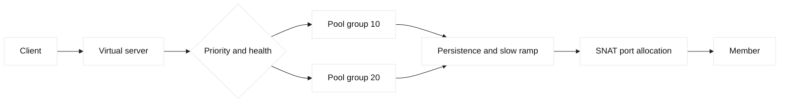

# LTM selection, persistence, and capacity

## Learning objectives

Reason about LTM priority groups, slow ramp, draining, persistence, SNAT port
capacity, and selection evidence. Build a safe debug scenario for uneven load
or failed members.

## Prerequisites

Know TCP, HTTP, pools, monitors, SNAT, and virtual-server terminology.

## Mental model

LTM selects an eligible pool member according to configured method, priority,
connection limits, persistence, and monitor state. Priority groups can keep
lower-priority members unused until higher-priority capacity is unavailable.
Slow ramp admits traffic gradually after a member becomes eligible. Drain stops
new work while allowing existing connections to finish. Persistence can pin a
client to one member and create a hotspot. SNAT maps client sources and has
finite translated-port capacity. These are vendor behaviors whose exact
defaults require release-specific verification.

## Diagram

## Worked example

Two members in priority group 10 are healthy, while group 20 is standby. A
deployment drains one member and persistence still directs returning clients
to it until the record expires or is deliberately handled. New clients select
the other member; if its SNAT address exhausts ports, connections fail despite
healthy monitors. Record client tuple, persistence key, selected member,
priority, ramp state, SNAT address, and allocation result. Compare connection
counts with request counts because long-lived sessions distort simple balance.

| Signal | Evidence | Interpretation |
| --- | --- | --- |
| Member state | Monitor and session state | Eligibility |
| Selection | Persistence and method | Why member won |
| Drain | New versus existing sessions | Shutdown progress |
| SNAT | Port utilization/errors | Capacity constraint |

## When this breaks

Stale persistence, false monitor recovery, misordered priorities, slow-ramp
misconfiguration, connection limits, and SNAT exhaustion cause hotspots or
timeouts. A member can appear idle because clients are pinned elsewhere. A
drain can fail if clients never close. Diagnose with timestamps and per-member
connections, not aggregate pool health alone.

## Operational checklist

- Record selection method, priority, persistence key, and timeout.
- Compare active connections, requests, and response latency per member.
- Verify drain and slow-ramp state before maintenance.
- Check SNAT address and ephemeral-port capacity.
- Test monitor recovery with a representative request.
- Preserve rollback and avoid clearing persistence blindly.

## Implementation exercise

Create a spreadsheet or Python fixture with three members, two priority groups,
five clients, persistence records, and finite SNAT ports. Simulate drain,
expiry, slow ramp, and allocation failure. Explain which observation separates
a selection problem from backend saturation.

## Questions and answers

1. **Why can persistence cause imbalance?** A persistence key maps repeated clients to one member even when another has capacity. Long-lived sessions amplify the effect; inspect key distribution and connection age before changing the load method.
2. **What does slow ramp protect?** It limits how quickly a newly eligible member receives traffic, allowing caches and application workers to warm. It cannot fix a fundamentally unhealthy member or guarantee equal request distribution.
3. **What does drain mean?** Drain prevents new assignments while existing connections complete or reach a bounded deadline. It needs client reconnect behavior and a maximum grace period because some sessions can otherwise remain indefinitely.
4. **Why does SNAT have capacity?** Each translated address and destination has finite source-port combinations. Many clients or long-lived connections consume them; adding addresses changes capacity but also identity and security assumptions.
5. **How do priority groups fail?** If health or thresholds are interpreted incorrectly, standby members may activate unexpectedly or never activate. Verify group configuration, eligibility counts, and the exact reason each member is selected.
6. **Why compare requests and connections?** A single persistent connection can carry many requests, while another member may have many short connections. One metric alone can misrepresent work and hide application-level imbalance.
7. **What is safe persistence recovery?** First identify the key, scope, and expiry, then test a narrow canary or planned expiration. Clearing all records can create a synchronized surge and should not be an emergency guess.
8. **What proves capacity failure?** Correlate allocation errors or port utilization with failed new flows and unchanged member health. A generic timeout is insufficient because route, policy, listener, and backend causes look similar.
