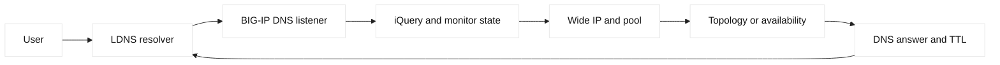

# BIG-IP DNS operations and debugging

## Learning objectives

Trace BIG-IP DNS decisions through listeners, iQuery health, monitors, LDNS
behavior, topology, DNSSEC, TTL, Wide IPs, pools, and virtual servers.

## Prerequisites

Know DNS recursion, authoritative answers, UDP/TCP DNS, TTL, health checks,
and basic GTM terminology.

## Mental model

BIG-IP DNS, historically GTM, answers DNS queries and selects records or Wide
IP pool members. iQuery exchanges control and health information between BIG-IP
systems. Monitors determine eligibility using configured probes. LDNS location
is an input to topology or geography decisions, not a guarantee of end-user
location. Listeners must receive the query on the expected address and VLAN.
DNSSEC adds signing or validation material. TTL controls caching and therefore
how quickly new decisions reach clients; it is not an instant failover switch.

## Diagram

## Worked example

`shop.lab.example` has two sites and a Wide IP with an availability pool. The
LDNS sends a query to a listener; BIG-IP DNS sees one site monitor down and
returns the other virtual-server address with a 60-second TTL. A user continues
to receive the old answer because the resolver cached it. Debug by querying
the listener directly, checking answer flags and TTL, inspecting monitor and
iQuery state, and comparing authoritative versus recursive responses. If
DNSSEC is enabled, validate signatures and time validity separately.

| Evidence | Question |
| --- | --- |
| Listener packet | Did BIG-IP DNS receive query? |
| iQuery state | Is remote object current? |
| Monitor | Is target eligible? |
| Answer/TTL | What did resolver cache? |
| DNSSEC | Is signature valid? |

## When this breaks

Wrong listener, stale iQuery state, monitor source mismatch, topology mapping
errors, low TTL assumptions, DNSSEC key or clock problems, and recursive cache
behavior cause apparent misrouting. A successful direct authoritative query
does not prove every LDNS receives it. Preserve query name, type, source,
answer, TTL, and timestamp in a safe debug record.

## Operational checklist

- Verify listener address, VLAN, UDP/TCP 53, and query type.
- Inspect Wide IP, pool, virtual-server, monitor, and iQuery state.
- Record LDNS source and topology decision inputs.
- Compare authoritative and recursive answers with TTLs.
- Validate DNSSEC signatures, keys, and clock state where applicable.
- Plan TTL and cache effects before failover changes.

## Implementation exercise

Use reserved names in a local DNS fixture. Query an authoritative listener and
a recursive resolver, record TTL and answer order, then mark one fictional
member unhealthy. Explain why cached answers remain and how DNSSEC failure
would differ from monitor failure.

## Questions and answers

1. **What is iQuery for?** It exchanges BIG-IP system information used by DNS objects and health relationships. It is not the client DNS protocol; inspect its state separately from listener reachability and recursive caching.
2. **Why can TTL delay failover?** Recursive resolvers and clients retain answers until their cache policy permits refresh. Publishing a new answer changes future responses but cannot retract every already cached value instantly.
3. **What does LDNS mean?** LDNS is the local recursive resolver making the authoritative query for a user. Its network location may differ from the user, so topology decisions based on LDNS can be approximate.
4. **Why test TCP DNS too?** Large responses, DNSSEC records, or truncation can require TCP. A UDP-only test may pass while clients fail when the response exceeds path limits.
5. **What does a monitor prove?** It proves a configured probe succeeded from its configured source and expected response. It does not prove every client path, TLS name, or application transaction is healthy.
6. **How does DNSSEC change debugging?** A resolver can reject an answer whose signature, chain, or validity interval fails even when the address is correct. Check signatures and clock state rather than disabling validation.
7. **Why inspect listener ownership?** Multiple listeners, VLANs, or addresses can receive different queries and policies. Testing the wrong endpoint can produce a valid but irrelevant answer.
8. **What is safe TTL planning?** Choose TTL from failure-detection, cache-staleness, and query-load goals, then measure resolver behavior. Lowering TTL does not guarantee immediate propagation or avoid existing cache lifetime.
