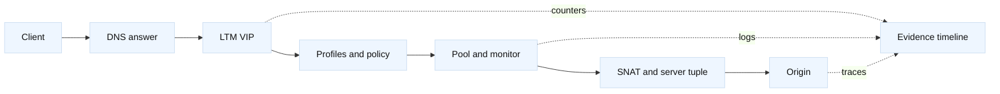

# BIG-IP read-only troubleshooting field guide

## Learning objectives

Map common LTM and BIG-IP DNS symptoms to evidence, choose the correct traffic
leg, and avoid unsafe changes during an incident.

## Prerequisites

Know TCP, TLS, DNS, VIPs, pools, monitors, SNAT, and basic shell diagnostics.

## Mental model

Troubleshoot from the client inward: name resolution, route, VIP listener,
profiles, policy, pool eligibility, server-side tuple, response, and
application. A status code is an observation, not a root cause. BIG-IP
management reads, counters, logs, and packet captures answer different
questions; correlate their timestamps and redact identifiers.

## Diagram

## Worked example

For a reachable VIP returning 503, record the resolver answer and VIP, then
read virtual-server, pool, member, monitor, persistence, and SNAT state. If no
server-side SYN exists, investigate eligibility or policy. If SYN/SYN-ACK
completes but HTTP is absent, inspect TLS/profile and timeout evidence. Compare
the client tuple `198.51.100.8:51000 -> 203.0.113.8:443` with the server tuple
`192.0.2.8:32700 -> 10.20.1.8:8443`; SNAT and route domains explain differences.

| Symptom | Read-only evidence | Falsifies |
| --- | --- | --- |
| VIP unreachable | DNS, route, listener counters | origin-only theory |
| Pool red | monitor request/result, member state | client TLS theory |
| 503 with no SYN | policy, pool, queue, SNAT | origin response theory |
| TLS alert | client/server SSL profiles, chain, SNI | TCP-only theory |
| Asymmetric timeout | both captures, routes, NAT state | HTTP handler theory |

## When this breaks

A green monitor may use another source address or URI. Logs can arrive late or
be sampled. A standby device can have configuration while the active traffic
group owns the address. A management API success does not prove data-plane
health. Never disable TLS verification, flush persistence, or force failover
as a first diagnostic step.

## Operational checklist

1. Record UTC time, source, hostname, VIP, port, request ID, and change window.
2. Compare authoritative and recursive DNS answers.
3. Read virtual-server, profile, policy, pool, member, monitor, and SNAT state.
4. Trace both tuples and identify the first missing handshake or response.
5. Correlate counters, logs, captures, and origin traces before changing state.
6. State the falsifying evidence and obtain approval for any mutation.

## Implementation exercise

Build a symptom matrix from JSON fixtures for VIP-down, pool-red, TLS-alert,
SNAT-exhausted, and origin-500 cases. For each fixture produce the next safe
read-only query and the evidence that would disprove the leading hypothesis.

## Questions and answers

1. **Why start with the client tuple?** It proves which VIP and port the client reached and gives a stable key for correlating LTM counters, captures, and request logs before inspecting the backend leg.
2. **What does a green monitor prove?** Only that its configured source, protocol, URI, credentials, and expected response succeeded at that time; it does not prove every user path or dependency.
3. **How do you distinguish 503 from timeout?** A 503 is an explicit HTTP response; a timeout indicates missing progress. Check who generated the response and whether a server-side connection existed.
4. **Why inspect both TLS profiles?** Client and server sessions can terminate at different boundaries, with separate SNI, SAN, trust, cipher, and expiration requirements.
5. **What evidence shows SNAT exhaustion?** New backend flows fail while existing ones continue, translation-port usage is near capacity, and member reachability works with an alternate source address.
6. **Why avoid forcing failover?** It changes ownership and can destroy useful evidence or expose state-mirroring defects; prove the failure with read-only state first.
7. **What makes a capture useful?** Interface, direction, filter, timestamp, five-tuple, and packet-size context; an unscoped payload dump is noisy and may expose secrets.
8. **When is a monitor change justified?** Only after proving the monitor contract mismatches the user journey, reviewing false-positive risk, and defining a canary and rollback threshold.
