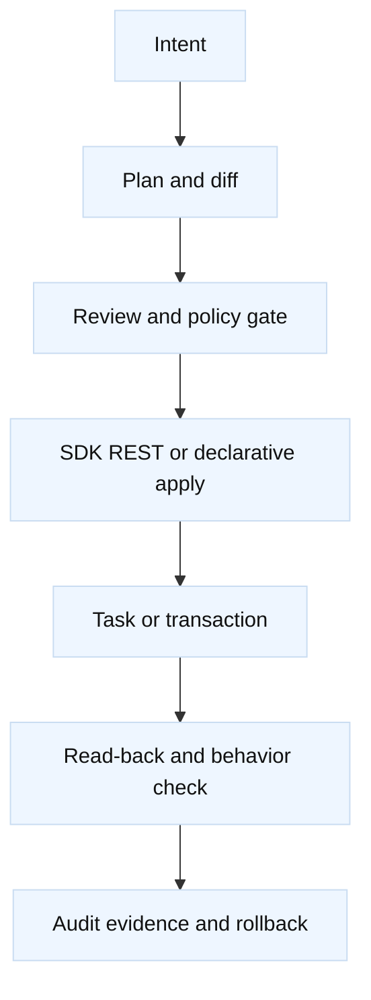

# F5 API and automation toolchain

## Learning objectives

Choose between the Python SDK, iControl REST, AS3, Declarative Onboarding,
FAST, Telemetry Streaming, Ansible, Terraform, tmsh, and SSH; design safe
plans; and reconcile unknown outcomes.

## Prerequisites

Know JSON, HTTP, TLS, Git review, F5 LTM objects, partitions, and idempotency.

## Mental model

The SDK maps Python objects to REST resources. Declarative tools submit a
desired document and let the device reconcile it. tmsh and SSH are imperative
interfaces. Telemetry Streaming is for exporting observations, not configuring
VIPs. The tool does not remove BIG-IP version, partition, RBAC, transaction,
or rollback concerns.

## Diagram

## Worked example

A plan for `Common/orders_pool` discovers version, self-link, members, monitor,
and owner. It follows pagination, normalizes server timestamps, and proposes
only a missing member. A timeout after POST is unknown state: GET the stable
partition-qualified resource before retrying. A declarative tool may be better
for a whole application declaration; the SDK is better for a narrow audit or
custom evidence report.

| Tool | Best fit | Main risk |
| --- | --- | --- |
| SDK/REST | precise reads and narrow changes | version/field drift |
| AS3 | application declaration | ownership overlap |
| DO | base device onboarding | bootstrap lock-in |
| FAST | templated app service | hidden defaults |
| Ansible/Terraform | repeatable pipelines | state drift/import semantics |
| tmsh/SSH | constrained diagnostics | quoting and mutation |
| TS | metrics/log export | sensitive telemetry |

## When this breaks

Missing pagination, wrong partition paths, expired tokens, unsupported fields,
async tasks, 409 conflicts, and partial declarations are common. A 2xx means
accepted, not healthy. Never store tokens, keys, or full response bodies in
plans or logs.

## Operational checklist

1. Pin tool and BIG-IP versions and discover capabilities read-only.
2. Resolve partition, folder, self-link, owner, and deletion policy.
3. Generate a reviewable diff before granting mutation authority.
4. Use validated TLS, least privilege, bounded retries, and task deadlines.
5. Reconcile every timeout and read back effective state.
6. Verify a safe listener, pool, certificate, and telemetry outcome.

## Implementation exercise

Using local JSON fixtures, implement a planner that handles `items` plus
`nextLink`, token expiry, 401/403/404/409, task polling, and an ambiguous
timeout. Assert that dry-run performs no writes and that logs contain no token
or private-key material.

## Questions and answers

1. **When should SDK beat AS3?** Use the SDK for targeted discovery, audits, or a narrow object update; use AS3 for an owned application declaration where complete desired state and lifecycle are explicit.
2. **Why is pagination correctness?** A partial collection produces a false diff, which can miss drift or delete objects that were never read. Follow every documented cursor and record counts.
3. **What does 409 mean?** It often indicates concurrent state or an existing object. Re-read, compare ownership and version, then decide whether to merge, wait, or stop.
4. **How are async tasks verified?** Poll with a deadline and backoff, parse terminal failure, then GET the resource and run a behavioral check; task submission alone is insufficient.
5. **What is the role of RBAC?** It limits which resources and actions an identity can access. A valid token with the wrong partition role can still produce confusing 403 or filtered reads.
6. **Why compare REST and SDK?** The SDK may hide pagination, defaults, or multiple calls. REST inspection exposes the actual URI and payload when debugging version or field behavior.
7. **What belongs in a plan artifact?** Target version, partition-qualified resources, redacted before/after fields, dependencies, actor, correlation ID, approval, rollback, and verification criteria.
8. **What does Telemetry Streaming do?** It exports selected device observations to an external consumer; it does not make a configuration change safe or replace post-change behavioral validation.

## Debug-session notes

When an automation pipeline reports success, compare three records: the
submitted plan, the device’s effective object state, and a data-plane probe.
For example, an AS3 declaration may be accepted while a referenced monitor is
invalid, or Terraform may believe an object exists because its state file is
stale. Read the virtual server, profile references, pool members, monitor
status, and certificate metadata by partition-qualified path. Then make one
safe request through the VIP and correlate its client and server tuples. This
three-way comparison exposes drift without requiring an unsafe production
mutation.

Tool choice should follow ownership. DO can establish base networking and
onboarding; AS3 can own an application service; FAST can provide a reviewed
template; SDK or REST can produce a narrow audit; and Telemetry Streaming can
export observations. Overlapping owners create competing declarations and
oscillating state. Document the source of truth, import existing resources
before adoption, and block destructive operations until ownership is proven.
