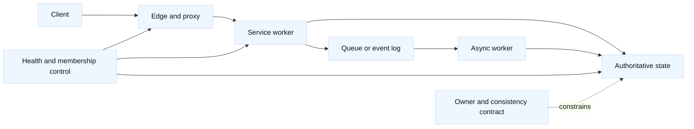

# Distributed systems for networked services

## Learning objectives

- Trace a request through data-plane hops, control-plane decisions, and state
  owners.
- Choose a consistency and delivery model that matches the user-visible
  contract rather than the name of a product.
- Explain partitions, failure detectors, leases, queues, idempotency, and
  backpressure in networking examples.
- Quantify replication traffic, in-flight work, and the cost of a quorum or
  regional failure.
- Compare portable concepts with F5, cloud load balancers, Envoy/NGINX,
  service meshes, WAFs, and API gateways.

## Prerequisites

Know TCP connection setup, HTTP request semantics, DNS caching, load-balancer
health checks, and basic probability. Review [service discovery and
configuration](20-service-discovery-configuration.md), [proxy architecture
and boundaries](08-proxy-architecture-and-boundaries.md), and [capacity and
SLO engineering](16-capacity-performance-and-slo-engineering.md).

## Mental model

Fact: a distributed service has more than a packet path. It has a data plane
that carries requests, a control plane that changes membership or routing, and
state ownership that determines which process may accept or publish a fact.
Fact: a network timeout does not prove that the remote process did not commit a
write. Inference: every design should name the owner of each piece of state,
the evidence used to declare a peer unhealthy, and the behavior after a
timeout.

A useful request record is:

| Question | Example answer |
| --- | --- |
| Data path | Client -> edge proxy -> service -> database |
| Control path | Health probe and membership update -> traffic policy |
| State owner | Database leader owns order sequence; cache owns no authority |
| Consistency | Reads may be stale for 2 seconds; order creation is serialized |
| Delivery | At-least-once event delivery with a deduplication key |
| Boundary | Tenant authorization is checked at the service, not inferred from source IP |

Fact: replication, retries, and queues trade latency, availability, storage,
and correctness in different ways. Inference: use the weakest guarantee that
still satisfies the business invariant, then make the exception visible in the
API. A DNS answer or anycast route can move a request toward a region; it
cannot by itself transfer write authority.

## Diagram

The control path can be healthy while the data path is failing, and the
reverse can also occur. A health probe that checks only TCP or `/healthz` may
not test authorization, a required dependency, or write correctness.

## Worked example: a regional order service

Assume three regions serve `orders.lab.example`. Peak traffic is 900 requests
per second, 25% are writes, and each committed order produces a 2 KiB event.
The design stores three copies: one local copy and two remote copies. These
are planning assumptions, not provider or database limits.

| Quantity | Calculation | Result |
| --- | --- | --- |
| Write rate | `900 * 0.25` | `225 writes/s` |
| Remote replication events | `225 * 2` | `450 events/s` |
| Remote payload rate | `450 * 2 KiB` | `900 KiB/s`, about `7.2 Mbit/s` before protocol overhead |
| In-flight writes at 80 ms average | `225 * 0.080` | `18 writes` in the local commit path |
| Lost work after 4 s of replication lag | `225 * 4` | Up to `900 writes` needing reconciliation if the source is lost |

If the contract requires a write to survive loss of one copy, the client must
wait for a policy such as two acknowledgements, or the system must make a
different durability promise. Waiting for a remote region improves durability
but adds cross-region latency and makes a partition visible to writers. An
asynchronous design keeps the local write path available but exposes a larger
recovery point objective (RPO). An active-active design additionally needs a
conflict rule, such as a per-order owner, a monotonic version, or an explicit
business merge.

Fact: a quorum is a set-overlap technique, not a universal guarantee. For
three replicas, `W=2` and `R=2` have `W+R>N` and therefore overlap when the
same membership and version rules apply. Inference: document membership
changes, stale-read handling, and what happens when a replica is slow; do not
call every two-acknowledgement scheme a consensus protocol.

## Portable concepts and vendor vocabulary

| Portable concept | Examples of vendor surfaces | Interview caveat |
| --- | --- | --- |
| L4/L7 request steering | F5 LTM, cloud network/application LB, Envoy, NGINX | Health and drain semantics differ by release and configuration |
| DNS or global steering | F5 BIG-IP DNS/GTM, managed cloud DNS, authoritative DNS | TTL and client connection reuse delay traffic movement |
| Policy enforcement | WAF, API gateway, mesh sidecar, proxy filter | A block or retry decision may change offered load and identity context |
| Membership and health | LB monitors, service discovery, mesh control plane | A probe result is evidence about one path, not proof of all dependencies |
| Durable state | Database replication, queue, object store, consensus service | Durability, ordering, and conflict behavior must be verified in target documentation |

## Worked example

The regional order-service calculation above shows why a request path and a
replication path must be budgeted together. If the service chooses local
acknowledgement for latency, its recovery contract must name the possible
900-event gap; if it chooses a remote acknowledgement, its write SLO must
include that network path.

## When this breaks

### Failure modes

Use evidence before choosing a remedy. The falsifier is the observation that
would make the leading hypothesis unlikely.

| Symptom | Leading hypothesis | Competing hypothesis | Useful falsifier |
| --- | --- | --- | --- |
| Requests reach a healthy region but reads are old | Replication lag or a stale cache | Client routed to a read replica with a weaker contract | Versioned read from the authority is current while the replica metric claims zero lag |
| A retry reports an unknown write outcome | Response was lost after commit | Request never reached the service | An idempotency lookup shows the operation already committed |
| Only one region accepts writes | Lease or fencing state is split | DNS or LB steering is stale | Storage rejects the old epoch token from the supposed writer |
| Queue depth grows while workers look healthy | Downstream latency or rate limit | Consumer discovery or partition assignment is stale | A local fixture drains at the expected rate with the same payloads |
| Failover causes duplicate events | At-least-once redelivery without deduplication | Producer sent twice due to a client retry | A stable event ID appears twice in the consumer ledger |

Security and privacy are part of the state model. Fact: authorization is an
application decision that should be bound to an authenticated identity and
resource, not merely to a network location. Inference: replicate the minimum
data needed by each region, classify tenant data before choosing replicas,
encrypt links and storage, and audit who can change membership or fencing
policy. A cross-region failover can also cross a data-residency boundary.

## Operational checklist

1. State the user-visible invariant, SLO, RPO, RTO, consistency model, and
   acceptable degradation.
2. Draw client, proxy, service, queue, database, and control paths; mark every
   state owner and security boundary.
3. Define membership, health evidence, lease duration, fencing token, and
   behavior for stale or missing control data.
4. Measure request rate, payload size, replication lag, queue depth, quorum
   latency, duplicate rate, and recovery traffic.
5. Roll out one region or tenant at a time with shadow reads, bounded load,
   and an explicit owner for the decision.
6. Roll back by stopping new writes or traffic at the changed boundary,
   preserving the old authority until evidence confirms convergence.
7. Verify both packet behavior and state behavior: fresh reads, authorized
   writes, duplicate suppression, failover, failback, and audit records.

## Implementation exercise

Implement a standard-library-only replicated key-value simulator. Provide
`put(key, value, request_id, epoch)`, `get(key, read_policy)`, and
`replicate(event)`. Model three replicas, configurable replication delay, a
quorum write, a stale-read option, and a monotonically increasing fencing
epoch.

Tests should cover a lost response after commit, duplicate `request_id`, a
slow replica, a partition that prevents quorum, an old epoch rejected by
storage, replica catch-up, and a conflicting active-active update. Assert the
chosen behavior and expose whether the result is committed, pending, stale,
or rejected. Discuss time and space complexity, then inject a clock that can
advance without sleeping.

## Questions and answers

1. **[SDE2 | system-design] What must be named before choosing replication?**
   Name the invariant, state owner, read/write path, failure domain, RPO/RTO,
   and consistency contract. “Three replicas” is not a design until the
   acknowledgement and recovery rules are defined.

2. **[SDE2 | fundamentals] Does a timeout mean a write failed?** No. The
   request may have committed and the response may have been dropped. Use an
   idempotency key or status lookup, and reconcile before retrying a
   non-idempotent operation.

3. **[SDE2 | debugging] How would you distinguish stale cache from replica
   lag?** Compare a version or commit timestamp from the authority, the read
   replica, and the cache while recording request routing. A cache purge that
   leaves the replica version old falsifies the cache-only hypothesis.

4. **[Staff | system-design] Is active-active always more available?** It can
   accept more local traffic during a partition, but conflict resolution,
   ordering, residency, and operational complexity increase. Choose it when
   the business merge is explicit and measured, not because the topology looks
   symmetrical.

5. **[Staff | operations] Why is DNS failover insufficient for stateful
   writes?** Cached answers and existing connections delay movement, while the
   old region may still receive traffic. A write gate and storage-enforced
   fencing rule are needed before declaring the new region authoritative.

6. **[SDE2 | fundamentals] How is a queue different from a database?** A
   queue or log primarily represents work or events and has delivery and
   ordering semantics. A database represents queryable state. Either can be
   durable, but neither automatically supplies the other’s consistency or
   deduplication contract.

7. **[Staff | trade-off] What would make you reject a quorum design?** If
   cross-region quorum violates the latency SLO, membership changes are not
   safe, or the business cannot tolerate write unavailability during a
   partition, choose a documented weaker guarantee or a different ownership
   model.

8. **[SDE2 | security] Where should authorization be checked after failover?**
   At the service or data boundary that understands identity, tenant, and
   resource. Network reachability, a healthy LB monitor, and a valid route are
   necessary evidence but are not authorization.

## References and evidence labels

Fact: [CAP theorem terminology is summarized by the ACM discussion of
Brewer's conjecture](https://www.cs.berkeley.edu/~brewer/cs262b-2004/PODC-keynote.pdf),
and [RFC 9293](https://www.rfc-editor.org/rfc/rfc9293) defines TCP behavior
relevant to network failure observation. Fact: [RFC 9110](https://www.rfc-editor.org/rfc/rfc9110)
defines HTTP method semantics. Fact: F5, cloud LB, proxy, mesh, and database
behavior is product- and version-specific; consult the deployed product's
documentation. Inference: the ownership tables, rollout gates, failure
hypotheses, and sizing model are engineering guidance, not protocol
guarantees.
