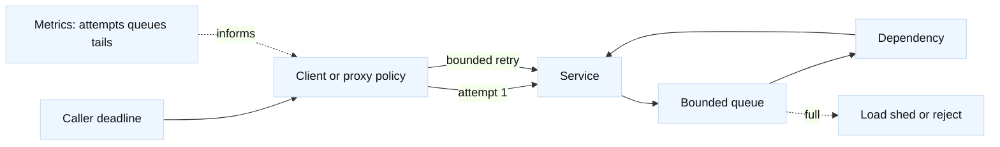

# Retries, deadlines, and backpressure

## Learning objectives

- Separate a request deadline from per-hop timeouts and retry budgets.
- Classify operations by idempotency before allowing automatic retries.
- Explain retry amplification, queue growth, load shedding, and connection
  pool pressure with calculations.
- Design bounded policies for clients, proxies, cloud load balancers,
  Envoy/NGINX, meshes, WAFs, and API gateways without assuming identical
  defaults.
- Diagnose a slow networked service using attempt, queue, and tail-latency
  evidence.

## Prerequisites

Know HTTP status and method semantics, TCP/TLS handshakes, connection pools,
and basic queueing. Review [proxy architecture and protocol
boundaries](08-proxy-architecture-and-boundaries.md), [gRPC, WebSockets, and
RPC](26-grpc-websockets-rpc.md), and [capacity and SLO
engineering](16-capacity-performance-and-slo-engineering.md).

## Mental model

Fact: a timeout is a local observation that a response was not received before
a timer expired; it does not identify where the work stopped. Fact: an HTTP
intermediary can create another request attempt, but it cannot know whether a
non-idempotent server operation committed unless the application supplies a
status or idempotency contract. Inference: propagate one absolute deadline
and a request ID through every hop, then derive smaller budgets without
allowing the sum of timers to exceed the caller's deadline.

Treat each attempt as consuming three resources: time, capacity, and semantic
risk. A retry may help with a transient connection failure, but it adds work
when the service is slow. Backpressure makes overload visible by bounding
queues, concurrency, bytes, or tokens. A queue that can grow without a bound
turns overload into memory pressure and eventually synchronized failure.

## Diagram

The retry policy should be closest to the owner of the semantic operation.
Multiple independent layers can multiply attempts. A mesh retry, gateway
retry, client retry, and SDK retry are not four independent safety nets; they
are one combined offered-load multiplier.

## Worked example: an overloaded search API

Assume a client sends 100 requests per second. A request fails transiently
with probability `p`, and the policy allows at most three total attempts. If
failures are independent and the service has no overload feedback, the
expected attempts per original request are:

`E[attempts] = 1 + p + p^2`

| Condition | Calculation | Expected attempt rate |
| --- | --- | --- |
| Healthy-ish, `p=0.05` | `100 * (1 + .05 + .0025)` | `105.25 attempts/s` |
| Degraded, `p=0.60` | `100 * (1 + .60 + .36)` | `196 attempts/s` |
| Full failure, `p=1` | `100 * 3` | `300 attempts/s` until the deadline stops work |

This is a model: correlated failures, backoff, cancellation, and client
arrival patterns change the result. It shows why a retry policy can nearly
double offered load during the failure it is trying to mask.

Now give the caller a 900 ms deadline. Reserve 100 ms for name resolution and
connection setup, and 100 ms for response handling. The service and all
attempts share 700 ms. If two attempts each wait 500 ms before retrying, the
second attempt cannot complete inside the caller contract. A correct policy
passes the remaining deadline to the next hop and cancels work when it reaches
zero; it does not let every hop independently wait 900 ms.

Backpressure has a similar arithmetic. At 500 requests per second, a bounded
200 ms queue represents at most `500 * 0.2 = 100` average requests of waiting
work under a steady arrival rate. If each queued request holds 32 KiB, that is
about 3.2 MiB before object overhead. A 10,000-item unbounded queue would
represent 320 MiB under the same payload assumption and could be much larger
with headers, buffers, and retained context.

## Policy by layer

| Layer | Safe responsibility | Common trap |
| --- | --- | --- |
| Client or SDK | Own business idempotency and end-to-end deadline | Retrying every error or hiding partial success |
| API gateway or WAF | Enforce tenant limits, reject malformed work, preserve identity | Retrying writes because the upstream socket closed |
| L7 proxy or mesh | Bound attempts, concurrency, and per-hop time | Combining defaults from several layers without an attempt budget |
| L4/load-balancer path | Preserve connection and health semantics | Treating a healthy listener as proof that an application retry is safe |
| Service | Apply admission control and return explicit overload signals | Accepting unlimited work into memory |
| Dependency client | Use a small, owned retry policy with cancellation | Retrying inside a transaction without knowing commit state |

F5 LTM, a managed cloud application load balancer, Envoy, NGINX, a service
mesh, a WAF, and an API gateway can all expose related knobs, but names,
defaults, and retryable conditions differ by product and version. Verify the
effective configuration and count attempts at the service, not just at the
edge.

## Worked example

The search-service calculations above are deliberately simple: they make the
retry multiplier and queue memory visible before a team tunes a product knob.
Replace the independent-failure assumption with measured correlated failures,
then validate the budget at every layer so the client, gateway, mesh, and
dependency client do not each spend the same deadline.

## When this breaks

### Failure modes

| Symptom | Leading hypothesis | Competing hypothesis | Falsifier or next evidence |
| --- | --- | --- | --- |
| Traffic doubles while origin latency rises | Retry amplification | A legitimate traffic spike | Origin logs show one attempt per request and no retry headers |
| p99 is high but p50 is normal | Queue or connection-pool contention | A small set of slow dependencies | Queue wait and pool wait are flat while one dependency spans the tail |
| Writes appear twice | Non-idempotent retry after lost response | Client sent duplicate requests | The same idempotency key maps to one stored result |
| Requests fail at exactly the same duration | Shared timeout boundary | Uniform downstream processing time | Per-hop timestamps show time spent before the suspected boundary |
| CPU falls but errors increase | Load shedding or connection refusal | A process crash or health-check withdrawal | Admission counters rise while process and listener remain healthy |
| Queue drains after recovery, then latency stays high | Recovery storm | Cache warm-up or GC/process pause | Attempt rate is normal and pause/GC evidence explains the tail |

Fact: [HTTP 408 and 504 have defined intermediary/server meanings in RFC
9110](https://www.rfc-editor.org/rfc/rfc9110), but an application may expose
more precise retry guidance. Fact: [HTTP method safety and idempotency are
defined in RFC 9110](https://www.rfc-editor.org/rfc/rfc9110). Inference: use
`Retry-After`, an explicit overload code, or a typed error only when the owner
can make that promise; a generic 5xx is not proof that retrying is harmless.

Security and privacy boundaries matter because retries can replay credentials,
payments, or personal-data writes. Bind idempotency keys to the authenticated
principal and operation, expire them according to the business window, and do
not put tokens or sensitive payloads in logs. Per-tenant concurrency and retry
budgets prevent one caller from consuming a shared pool. A gateway that
terminates TLS may see identity and method fields; an L4 device may not.

## Operational checklist

1. Define the end-to-end deadline, per-hop budget, cancellation behavior, and
   what result is returned when the deadline expires.
2. Classify each operation as safe, idempotent, conditionally idempotent with
   a key, or non-retryable.
3. Count original requests, attempts, retries by layer, queue wait, service
   time, connection-pool wait, and dependency time by tenant.
4. Set bounded attempts, exponential backoff with jitter, concurrency limits,
   queue limits, and a load-shedding response.
5. Roll out one caller or route class at a time; watch retry amplification,
   p99, queue occupancy, error budget, and duplicate outcomes.
6. Roll back by disabling the new retry layer or lowering its budget, while
   preserving enough telemetry to explain the change.
7. Verify timeout, cancellation, partial response, lost response, overload,
   dependency recovery, and credential replay scenarios in a local or
   authorized test environment.

## Implementation exercise

Build a standard-library-only retry and deadline simulator. Its API should
accept an operation type, absolute deadline, maximum attempts, backoff policy,
response sequence, and a deterministic clock. Return attempt timestamps,
remaining budget, final outcome, and whether a retry was semantically allowed.

Test zero and negative budgets, cancellation during backoff, a lost response
after a committed write, `Retry-After`, jitter with a seeded random source,
maximum queue occupancy, per-tenant concurrency, and a dependency that never
responds. Include tests proving that nested policies do not exceed a supplied
attempt token. Discuss `O(a)` time for `a` attempts and memory proportional to
the recorded trace, and never sleep in tests.

## Questions and answers

1. **[SDE2 | fundamentals] Why propagate an absolute deadline?** Relative
   timeouts at each hop can add up beyond the user contract. An absolute
   deadline lets every hop calculate remaining time and stop work when it is
   no longer useful.

2. **[SDE2 | system-design] Which errors are retryable?** Usually a bounded
   set of transient transport or overload outcomes, subject to operation
   semantics. Retryability requires both a transient failure hypothesis and a
   safe way to avoid duplicate effects.

3. **[SDE2 | debugging] How do you prove a retry storm?** Compare original
   request rate with attempt rate at each layer, correlate retry headers and
   request IDs, and check whether attempt rate rises with latency. A flat
   attempt ratio falsifies retry amplification as the primary cause.

4. **[Staff | trade-off] Why not retry aggressively to improve availability?**
   Retries can improve success for isolated transient faults but consume the
   same scarce capacity during correlated failure. Set an error-budget and
   capacity budget, then choose bounded retries, rejection, or degradation.

5. **[SDE2 | coding] How should an idempotency key work?** Store a key bound to
   principal and operation with the committed result or an in-progress marker.
   A duplicate returns the same result, a conflicting payload is rejected,
   and expiry is chosen from the business retry window.

6. **[SDE2 | operations] What is backpressure?** It is a bounded signal that
   downstream capacity is lower than offered work: limit concurrency, queue a
   finite amount, or reject/degrade. It is not simply adding a larger queue.

7. **[Staff | architecture] Where should retries live?** Put semantic retry
   ownership near the operation owner, and keep lower layers transport-aware
   and bounded. If several layers retry, coordinate one total attempt budget.

8. **[SDE2 | security] What can a retry leak or replay?** It can repeat a
   payment, authorization-sensitive action, or personal-data submission. Use
   authenticated keys, redacted telemetry, and explicit operation contracts;
   a network timeout does not erase the server-side effect.

## References and evidence labels

Fact: [RFC 9110](https://www.rfc-editor.org/rfc/rfc9110) defines HTTP
semantics, including method safety, idempotency, and status codes. Fact:
[RFC 9293](https://www.rfc-editor.org/rfc/rfc9293) defines TCP behavior that
helps explain connection failure and timeout evidence. Fact: proxy, mesh,
gateway, cloud LB, and F5 retry defaults are version-specific. Inference: the
retry equations, budget allocations, queue sizes, rollout gates, and
falsifiers are engineering models and must be calibrated with service data.
