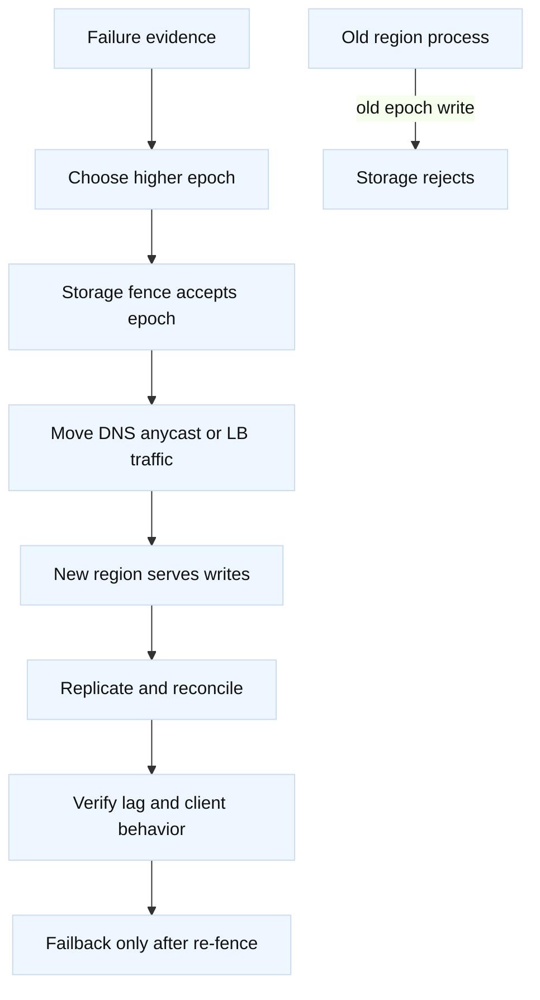

# Replication, failover, and fencing

## Learning objectives

- Distinguish traffic movement from authority to read or write state.
- Compare single-primary, active-active, quorum, and asynchronous replication
  with explicit RPO, RTO, latency, and conflict trade-offs.
- Design leases, epochs, fencing tokens, deduplication, failback, and recovery
  for a multi-region networked service.
- Use lag, health, route, and storage evidence to debug a failover.
- Map the concepts to DNS/GTM, anycast, F5 LTM, cloud load balancers,
  databases, queues, and consensus systems.

## Prerequisites

Know [BGP, anycast, and routing policy](12-bgp-anycast-and-routing-policy.md),
[GTM Wide IPs and TTL](04-gtm-wide-ips-ttl-and-steering.md), [service
discovery](20-service-discovery-configuration.md), and [NTP and time
synchronization](21-ntp-time-synchronization.md). Also review [retries,
deadlines, and backpressure](35-retries-deadlines-and-backpressure.md).

## Mental model

Fact: a failover has at least three separate decisions: where clients send
traffic, which replica is eligible to serve reads, and which process may
accept writes. Fact: DNS TTL, anycast convergence, LB health, and replication
lag measure different things. Inference: do not announce a new route or DNS
answer as proof that the new region is safe to write.

The safest authority transfer has a monotonic generation or fencing token.
Every write carries the generation, and the durable store rejects an old
generation even if the old process is still alive. A lease or failure detector
can help choose a candidate, but it is not itself a fence. Clock skew and a
partition can make two processes believe they are current unless storage
enforces the token.

## Diagram

The order of operations is a policy choice, but the invariant is not: the
old writer must lose authority before the new writer is declared authoritative.
For read-only evacuation, traffic can move earlier, provided stale reads and
cache behavior are acceptable.

## Replication choices

| Model | Strength | Cost or risk | Suitable follow-up |
| --- | --- | --- | --- |
| Single primary with async followers | Simple write ordering and low local write latency | Remote lag and possible data loss on primary loss | How is RPO measured and how are writes fenced? |
| Synchronous quorum | Acknowledged data survives the chosen failure set | Cross-site latency and write unavailability during a partition | What is the membership and quorum-change protocol? |
| Active-active with merge | Local writes in multiple regions | Conflicts, ordering, dedupe, and business merge rules | Which keys have an owner and which operations commute? |
| Log plus consumers | Replayable events and decoupled work | At-least-once delivery, ordering scope, consumer lag | What is the idempotency and replay policy? |
| Object or cache replication | Useful for blobs or derived state | Eventual visibility and stale data | Can the item be regenerated or must it be authoritative? |

Cloud DNS, F5 BIG-IP DNS/GTM, anycast, and application load balancers can
change reachability. F5 LTM or a cloud LB can drain endpoints and preserve or
drop different connection state depending on design. None of those surfaces
alone establishes a database epoch or resolves an active-active conflict.

## Worked example: lag and fencing budget

Assume an order log receives 800 writes per second. Each event is 1.5 KiB and
is asynchronously sent to two remote regions. At a measured 4-second maximum
lag, the unreplicated event count is:

`800 writes/s * 4 s = 3,200 events`

Remote payload bandwidth is:

`800 * 1.5 KiB * 2 = 2,400 KiB/s`, or about `19.2 Mbit/s` before framing,
compression, encryption, and retransmission.

If the declared RPO is 500 events, this observed lag violates the RPO even
though all health checks are green. The candidate choices are to reduce lag,
wait for a synchronous acknowledgement, reduce accepted writes, or change
the declared contract. Sending users to the remote region without addressing
the lag changes reachability, not data loss.

For fencing, assume a candidate obtains a 30-second lease. The design budget
allows 2 seconds for clock uncertainty, 1 second for network and processing
delay, and a 5-second safety margin. The old writer must stop accepting work
well before the effective expiry; the usable safety window is:

`30 - 2 - 1 - 5 = 22 seconds`

This is an engineering budget, not a universal lease formula. Storage-enforced
epochs are stronger than relying on a process to stop on time. A write with
epoch 41 must be rejected after epoch 42 is committed, even if the old
process's local clock or network view is wrong.

## Worked example

The lag and lease calculations above are decision inputs, not automatic
failover triggers. A service can have a reachable candidate and still violate
RPO or lack a durable fence. Record the last acknowledged offset and accepted
epoch before enabling writes in the promoted region.

## When this breaks

### Failure modes

| Symptom | Leading hypothesis | Competing hypothesis | Falsifier or next evidence |
| --- | --- | --- | --- |
| New region receives traffic but writes fail | It lacks the current epoch or quorum | Route reaches the wrong service version | Store audit shows accepted epoch and service logs show validation failure |
| Both regions report leader | Split-brain control view | Dashboard is stale | Durable storage accepts writes from both epochs |
| Failover loses recent orders | Async lag exceeded RPO | Orders were acknowledged before persistence | Commit and replication offsets show the last acknowledged event was remote |
| Failback creates duplicates | Replayed log without dedupe | Clients retried after the switch | Event IDs are unique in the source but duplicated in the consumer ledger |
| DNS changed but users still reach old site | Resolver/client cache or open connection | Authoritative answer did not change | Fresh authoritative and recursive queries both show the new answer |
| Read traffic is healthy but data is old | Replica or cache lag | User is viewing a deliberately stale projection | Authority version and projection version differ beyond the contract |

Fact: [RFC 1034](https://www.rfc-editor.org/rfc/rfc1034) and [RFC
1035](https://www.rfc-editor.org/rfc/rfc1035) describe DNS caching and
responses; TTL does not revoke an already cached answer. Fact: [BGP-4 is
specified by RFC 4271](https://www.rfc-editor.org/rfc/rfc4271), but route
convergence is not application failover. Fact: [NTP is specified by RFC
5905](https://www.rfc-editor.org/rfc/rfc5905). Inference: use monotonic
epochs, storage fencing, lag budgets, and staged traffic movement as safety
controls; verify all lease and HA behavior on the target implementation.

Security and privacy boundaries include operator authority, replication links,
tenant data, and the fence itself. Restrict who can mint or advance an epoch,
authenticate region-to-region replication, encrypt data in transit and at
rest, and audit every authority transition. A failover that crosses a region
or account boundary must re-check identity, key availability, residency, and
policy—not just network reachability.

## Operational checklist

1. Define RPO, RTO, consistency, conflict policy, write ownership, and the
   failure domains the design must survive.
2. Record replication offsets, lag percentiles, acknowledged offsets, queue
   depth, and the maximum recoverable gap.
3. Make authority a durable state transition with a monotonic epoch or token;
   reject old tokens at the write boundary.
4. Separate read evacuation, DNS/route movement, connection drain, and write
   enablement into observable stages.
5. Roll out with a canary tenant or region, shadow reads, bounded traffic, and
   a named incident decision maker.
6. Roll back by stopping new writes at the new authority, preserving the
   highest committed epoch, and reconciling before returning traffic.
7. Verify fresh and cached DNS, route convergence, existing connections, fresh
   reads, authorized writes, duplicate suppression, failover, failback, and
   residency/audit controls.

## Implementation exercise

Implement a deterministic three-region log simulator with `append(event_id,
epoch)`, `replicate(region, offset)`, `promote(region)`, and `read(region)`.
Add configurable lag, dropped responses, a partition, duplicate delivery,
and a clock with bounded uncertainty. Storage must reject an append carrying
an epoch lower than its current fence.

Tests must cover promotion while lagging, stale DNS-style routing to the old
region, an old writer after promotion, replayed events, an active-active
conflict, failback after catch-up, and RPO/RTO calculations. Include a test
that proves a health signal without a storage fence cannot prevent two writers.

## Questions and answers

1. **[SDE2 | system-design] What is the difference between failover and
   fencing?** Failover chooses a new serving path or authority. Fencing makes
   the old authority unable to mutate durable state. Safe write failover needs
   both.

2. **[SDE2 | debugging] What evidence says a DNS change worked?** Check the
   authoritative answer, several recursive answers, client resolver behavior,
   active connection destinations, and the new service's request logs. One
   successful authoritative query does not prove user convergence.

3. **[SDE2 | fundamentals] What does replication lag imply for RPO?** If 800
   writes per second lag by four seconds, as much as 3,200 events are outside
   the remote copy. Compare that gap with the declared RPO and the actual
   acknowledgement contract.

4. **[Staff | system-design] How do you make active-active safe?** Partition
   key ownership where possible, identify commutative operations, attach
   versions or causality, define conflict merges, deduplicate events, and
   expose unresolved conflicts. Symmetry is not a conflict policy.

5. **[SDE2 | operations] Why is a health check not a leader election?** It is
   an observation from a particular probe path. It does not establish a unique
   view of membership or prevent an isolated old leader from writing.

6. **[Staff | trade-off] When is synchronous replication a bad choice?** When
   cross-region latency or partitions make the write SLO unacceptable and the
   business can tolerate measured data loss or delayed reconciliation. State
   the alternative RPO and recovery work explicitly. Explain who accepts that
   risk and how the decision is revisited using measured replication evidence.

7. **[SDE2 | security] Who should be allowed to advance a fence epoch?** A
   narrowly authorized control identity, with durable audit and independent
   verification. A compromised routing account should not automatically gain
   write authority. Require an explicit owner approval and tested emergency
   recovery path.

8. **[Staff | migration] What is a safe failback?** Re-establish replication,
   reconcile and validate the highest epoch, fence the current writer, move
   traffic in stages, then enable writes at the former site. Reversing DNS
   alone is not failback. Confirm clients, queues, replicas, and operators all
   observe the new authority before declaring recovery complete.

## References and evidence labels

Fact: [RFC 1034](https://www.rfc-editor.org/rfc/rfc1034), [RFC
1035](https://www.rfc-editor.org/rfc/rfc1035), [RFC
4271](https://www.rfc-editor.org/rfc/rfc4271), and [RFC
5905](https://www.rfc-editor.org/rfc/rfc5905) define relevant DNS, routing,
and time protocols. Fact: F5 HA, cloud LB, DNS, database, queue, and consensus
implementations have release- and configuration-specific behavior. Inference:
the lease arithmetic, staged runbook, RPO thresholds, and fencing pattern are
engineering guidance that must be tested against the deployed system.
