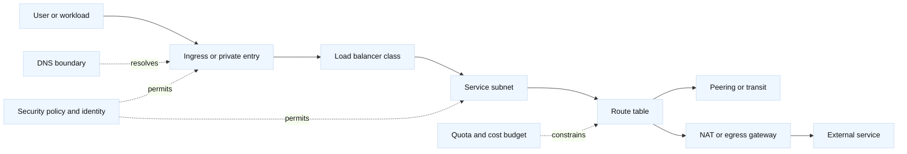

# Cloud networking primitives

## Learning objectives

- Draw a provider-neutral VPC/VNet packet path from a workload to a private
  service, public destination, or load balancer.
- Explain subnets, route tables, gateways, NAT/egress, private connectivity,
  DNS boundaries, identity-aware access, quotas, and cross-zone cost.
- Distinguish stateful security-group-style controls from stateless subnet or
  ACL controls and account for return routing.
- Estimate bandwidth, concurrent flow, NAT, and cross-zone traffic using
  explicit assumptions.
- Translate the model to AWS VPC, Azure VNet, Google Cloud VPC, F5, cloud load
  balancers, Kubernetes, and service meshes without memorizing console names.

## Prerequisites

Know [firewalls, security groups, and NACLs](19-firewalls-security-groups-nacls.md),
[NAT, conntrack, and SNAT](24-nat-conntrack-and-snat.md), [VXLAN and network
overlays](18-vxlan-network-overlays.md), [Kubernetes ingress and service
mesh](13-kubernetes-ingress-and-service-mesh.md), and [capacity and SLO
engineering](16-capacity-performance-and-slo-engineering.md).

## Mental model

Fact: a cloud virtual network is a composition of address spaces, route
selection, forwarding gateways, stateful or stateless policy, and service
endpoints. Fact: a route that exists in one direction does not guarantee a
valid return route, and a permitted packet does not prove that the application
is listening or authorized. Inference: start every diagnosis with the full
tuple and packet path, then identify the owner of each decision.

| Layer | Portable question | Typical owner |
| --- | --- | --- |
| Addressing | Which subnet, prefix, tenant, and overlap rules apply? | Network/platform team |
| Routing | Which longest-prefix route is selected in each direction? | VPC/VNet route-table owner |
| Gateway | Is this public ingress, private endpoint, NAT, transit, or peering? | Cloud/network platform |
| Policy | Which stateful and stateless filters see the packet? | Security and service owners |
| Service | Which LB class, listener, target, and health contract apply? | Edge/application team |
| Identity | Which workload or user is authorized beyond reachability? | Identity/service owner |
| Limits | Which quota, port, flow, bandwidth, or cross-zone budget binds? | Platform and finance |

Provider-neutral terms map approximately to AWS VPC, Azure VNet, and Google
Cloud VPC concepts, but their scope, defaults, quota APIs, and managed-service
behavior are version-specific. Verify the target provider. Kubernetes CNI,
EndpointSlice, kube-proxy/eBPF, NetworkPolicy, and Gateway API behavior belong
to the cluster layer; this topic stops at the cloud network boundary.

## Diagram

For a public request, ask where source addresses are translated and where TLS
terminates. For private service access, ask whether the endpoint is reached
through a local interface, a route, a transit hub, or an application proxy.
For egress, trace the forward route and the return state at the NAT or
firewall. The same workload can have different paths for IPv4 and IPv6.

## Portable primitives and vendor-aware mapping

| Primitive | Provider-neutral role | Examples to verify in target cloud or product |
| --- | --- | --- |
| VPC/VNet/project network | Administrative and routing boundary | AWS VPC, Azure VNet, Google Cloud VPC |
| Subnet | Address and placement boundary, often zonal or regional | Provider subnet and route-table scope |
| Route table | Longest-prefix forwarding decision | VPC/VNet routes, propagated transit routes |
| Internet/public gateway | Public ingress or egress attachment | Provider-managed public gateway semantics |
| NAT or egress appliance | Outbound translation and policy | Managed NAT, firewall, F5 SNAT, proxy egress |
| Peering/transit/private link | Private connection between networks or services | Peering, transit hub, private endpoint, dedicated link |
| L4 load balancer | Address/port distribution with transport semantics | Network LB, F5 virtual server, TCP proxy |
| L7 load balancer | HTTP-aware routing, TLS, policy, and target health | Application LB, F5 LTM, Envoy, NGINX, API gateway |
| DNS boundary | Name resolution and split-horizon policy | Private hosted zone, private DNS, BIG-IP DNS/GTM |
| Identity-aware proxy | Application identity and authorization boundary | Cloud identity proxy, mesh gateway, API gateway |

These are equivalences of concepts, not promises that products behave the
same way. Read the provider documentation for source preservation, health
checks, cross-zone distribution, idle timeouts, quotas, and billing.

## Worked example: egress and cross-zone capacity

Assume three zones each run workloads generating 2,000 requests per second.
Each response is 64 KiB and requests are small enough to ignore for this
planning calculation. Peak response bandwidth is:

`2,000 * 64 KiB * 3 = 384,000 KiB/s`, about `3.07 Gbit/s` before protocol
overhead.

Suppose 60% of traffic remains in its local zone and 40% crosses zones to a
load balancer or target. If monthly response volume is 10 TiB, modeled
cross-zone volume is `10 * 0.40 = 4 TiB`. The cost per byte is provider- and
path-specific, so keep the volume separate from the price until the target
cloud's billing documentation is checked.

For NAT, assume one destination tuple has 48,000 usable source ports per NAT
address in the test model, and 100,000 simultaneous connections target that
destination. The minimum address count is:

`ceil(100,000 / 48,000) = 3 addresses`

If the failure requirement is loss of one address without exhausting the
remaining pool, a simple capacity model needs another address:

`3 usable addresses + 1 failure reserve = 4 addresses`

This is not a universal cloud limit. Ephemeral-port selection, destination
tuples, connection reuse, idle timeout, NAT implementation, and other tenants
change the result. Validate with flow metrics and a permitted load test. A
larger NAT pool does not fix a missing return route, a service quota, or a
downstream rate limit.

## Worked example

The cloud-capacity calculations above separate traffic volume, translation
state, and billing volume. That separation lets an engineer test which
constraint is binding: a NAT allocation failure, a zonal route choice, a
gateway bandwidth quota, or a provider charge. Replace each illustrative
assumption with measurements and target-cloud documentation.

## When this breaks

### Failure modes

| Symptom | Leading hypothesis | Competing hypothesis | Falsifier or next evidence |
| --- | --- | --- | --- |
| Private service connects one way only | Return route or stateful policy is missing | Service listener or DNS is wrong | A packet capture shows a valid SYN-ACK and completed TLS on the same tuple |
| Egress fails only at peak | NAT ports, flow quota, or gateway bandwidth exhausted | External service rate-limits the source | NAT allocation failures are flat while remote 429s rise |
| One zone has high latency | Cross-zone target selection or zonal imbalance | The local workload is CPU-bound | Target and LB metrics show local distribution while application queue grows |
| Public hostname works, private hostname fails | Split-horizon DNS or private zone association | Route or security policy blocks the address | A direct private IP request succeeds with the same authorized identity |
| LB marks targets healthy but users fail | Probe path is shallower than the user path | TLS/SNI or authorization mismatch | A probe using the user protocol and identity succeeds end to end |
| Peered network has no route | Peering exists without route propagation or reciprocal route | Overlapping CIDR or policy deny | A route-table lookup selects the expected next hop and flow logs show allow |
| New workloads cannot launch | Address or service quota exhausted | Image, identity, or control-plane failure | A smaller subnet or quota increase changes placement without path changes |

Fact: [RFC 1812](https://www.rfc-editor.org/rfc/rfc1812) discusses IP router
requirements and [RFC 4291](https://www.rfc-editor.org/rfc/rfc4291) IPv6
addressing; cloud products add provider-specific abstractions. Fact:
[RFC 4787](https://www.rfc-editor.org/rfc/rfc4787) describes NAT behavioral
requirements. Inference: the packet-path table, NAT sizing, cross-zone budget,
and failure falsifiers are engineering methods rather than cloud guarantees.

Security, privacy, and authorization boundaries should be explicit. Treat
public ingress, private service endpoints, transit links, NAT egress, and
identity-aware proxies as different trust boundaries. Use least-privilege
routes and policies, prevent metadata or management-plane exposure, restrict
egress destinations where practical, and log identity plus flow evidence with
redaction. A security-group allow rule is not a business authorization grant.

## Operational checklist

1. Inventory CIDRs, overlap, subnet placement, route tables, propagated
   routes, gateways, DNS zones, policies, endpoints, and ownership.
2. Draw forward and return paths for public ingress, private ingress, service
   to service, and egress; annotate translation and TLS boundaries.
3. Record bandwidth, packets-per-second, concurrent flows, NAT ports, LB
   target limits, address availability, quotas, and cross-zone volume/cost.
4. Verify policy in observation or a canary path, then roll out by zone or
   tenant with flow logs, route checks, and application probes.
5. Roll back route or policy changes from a versioned artifact, preserving the
   last known-good path and avoiding broad emergency allows.
6. Test DNS resolution, TCP/TLS, return routing, health checks, identity
   authorization, zone loss, NAT exhaustion, quota failure, and IPv4/IPv6
   differences in an authorized environment.

## Implementation exercise

Implement a provider-neutral route and egress simulator. Given interfaces,
CIDRs, route tables, security rules, NAT pools, and an L4/L7 load-balancer
class, return the selected next hop and the reverse-path result for a flow.
Use standard-library IP address handling and make rule order explicit.

Tests should cover longest-prefix selection, overlapping or rejected CIDRs,
missing reciprocal routes, stateful return traffic, stateless ACL return
denial, NAT port exhaustion, local versus cross-zone target choice, private
DNS versus public DNS, and an identity denial after network allow. Include
route-table and quota complexity discussion, plus a test that fails if the
simulator labels reachability as authorization.

## Questions and answers

1. **[SDE2 | debugging] How do you debug a private connection failure?**
   Record source/destination/port, resolve the name from the workload, inspect
   forward and return routes, check stateful and stateless policy, then compare
   flow logs with a packet or socket trace. A route alone does not prove a
   listener or authorization.

2. **[SDE2 | fundamentals] What is the difference between a subnet and a
   route table?** A subnet allocates or groups addresses and placement; a
   route table selects forwarding next hops. Their association and scope are
   provider-specific, so verify both rather than assuming same-zone means
   reachable.

3. **[SDE2 | capacity] How would you size NAT?** Estimate concurrent flows per
   destination tuple, usable source ports per translation address, idle time,
   connection reuse, and failure reserve. Then validate allocation failures
   and flow age in the target implementation; total request rate alone is not
   enough.

4. **[Staff | system-design] When choose L4 over L7 load balancing?** Choose
   L4 for transport-level scale or opaque protocols when the service owns
   application policy. Choose L7 when routing, TLS, identity, or HTTP policy
   justifies termination and its latency, trust, and operational cost.

5. **[SDE2 | security] Does a private route make a service trusted?** No. It
   reduces exposure and may provide reachability, but authentication,
   authorization, encryption, and tenant policy still belong at the relevant
   service boundary. Verify identity and policy independently from route
   reachability before treating the connection as safe.

6. **[Staff | trade-off] Why care about cross-zone traffic?** It can add
   latency, a shared failure dependency, and usage cost. First measure the
   traffic volume and locality, then compare zonal redundancy with deliberate
   cross-zone distribution and its budget.

7. **[SDE2 | operations] What should a cloud migration verify?** CIDR
   compatibility, DNS resolution, routes in both directions, translated source
   identity, security policy, LB health, quotas, observability, and rollback.
   A green control-plane deployment is not end-to-end proof.

8. **[Staff | architecture] How do cloud primitives relate to Kubernetes?**
   The cloud network supplies addresses, routes, gateways, and often external
   load balancers. Kubernetes supplies cluster service discovery, endpoint
   programming, policy, and controllers. Define ownership at the handoff so
   two systems do not fight over routes or traffic policy.

## References and evidence labels

Fact: [RFC 1812](https://www.rfc-editor.org/rfc/rfc1812), [RFC
4291](https://www.rfc-editor.org/rfc/rfc4291), and [RFC
4787](https://www.rfc-editor.org/rfc/rfc4787) provide protocol and NAT
background. Fact: AWS VPC, Azure VNet, Google Cloud VPC, F5, and managed load
balancer behavior is documented by each vendor and changes with product,
region, and release. Inference: the equivalence table, quota method, NAT
calculation, cost model, and rollout checklist are portable engineering
guidance; verify exact limits and billing in the target environment.
