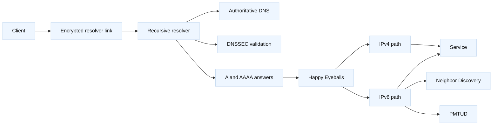

# Modern DNS and IPv6

## Learning objectives

- Explain DNS over UDP, TCP, TLS, and HTTPS, including what each transport
  protects and which party can still observe queries.
- Describe DNSSEC validation, authenticated denial, and negative caching without
  treating encryption as authenticity.
- Trace a dual-stack request through address selection, Happy Eyeballs, IPv6
  Neighbor Discovery, and Path MTU Discovery (PMTUD).
- Design an IPv4-to-dual-stack migration with explicit application, network,
  security, DNS, and operations ownership.
- Diagnose stale DNS, broken DNSSEC, IPv6-only reachability, and PMTUD black
  holes using reproducible evidence.

## Prerequisites

Know [service discovery and configuration](20-service-discovery-configuration.md),
[BGP, anycast, and multi-region networking](../16-bgp-anycast-and-multi-region.md),
[certificates, SNI, and termination](02-certificates-sni-and-termination.md),
and [capacity, performance, and SLO engineering](16-capacity-performance-and-slo-engineering.md).

## Interview scope

- SDE2: trace a DNS-to-connection path, distinguish authenticity from privacy,
  and debug IPv4/IPv6 differences with packet and resolver evidence.
- Staff: assign migration ownership across application, platform, network,
  security, DNS, and operations teams while controlling compatibility risk and
  rollback scope.
- Expected interview artifact: a dual-stack migration decision record with DNS
  transport choices, dependency ownership, measurements, rollout gates, and
  rollback conditions.

## Mental model

**Fact:** DNS is a naming system whose answers come from authoritative servers
through recursive resolvers; DNS transport and DNSSEC solve different problems.
**Fact:** DNS over TLS (DoT) and DNS over HTTPS (DoH) encrypt the client-to-
resolver exchange, while DNSSEC provides signed data and authenticated denial
when a validating resolver can establish a chain of trust. **Engineering
inference:** choose the resolver boundary, logging policy, and validation
responsibility before choosing a privacy transport.

| Layer | Portable question | Typical owner |
| --- | --- | --- |
| Name authority | Which zone and record set is authoritative? | DNS/platform team |
| Recursion | Which resolver answers for this client and view? | Network/platform team |
| Privacy | Is the client-resolver exchange visible to intermediaries? | Security/platform team |
| Authenticity | Is the answer validated, bogus, insecure, or indeterminate? | DNS/security team |
| Address choice | Are A and AAAA answers usable from this network? | Application/platform team |
| Packet path | Which route, Neighbor Discovery, and PMTU apply? | Network/platform team |
| Migration | Who owns each dependency and rollback gate? | Staff technical owner |

**Vendor terminology:** DoT, DoH, DNSSEC, validating resolver, split-horizon
DNS, and Happy Eyeballs are widely used terms, but resolver policy, telemetry,
API names, and defaults vary by operating system, browser, provider, and
appliance release.

**Engineering inference:** A successful lookup does not prove that the selected
address is reachable, that DNSSEC was validated, or that the application can
complete a TLS handshake. Keep those checks separate in the test plan.

## Diagram

The resolver may use ordinary DNS transport upstream even when the client uses
DoT or DoH; privacy is therefore a path and policy property, not a label on a
single packet. The client can race IPv6 and IPv4 connection attempts, but the
winning address should be measured rather than assumed. IPv6 routers do not
fragment packets in transit, so a blocked ICMPv6 Packet Too Big message can
produce a connection that starts successfully and then stalls on larger data.

## Modern DNS transport and DNSSEC

Traditional DNS commonly uses UDP, with TCP available for larger responses,
truncation, and some zone-transfer or resolver workflows. DoT carries DNS in a
TLS session, normally to a resolver-selected service; DoH carries DNS as HTTPS,
which can share port 443 with other traffic. **Fact:** encryption hides query
contents from many on-path observers between client and resolver, but the
resolver can still see the query and an endpoint can infer activity from other
signals. **Vendor terminology:** browser-managed secure DNS may bypass the
host resolver policy; verify precedence and enterprise controls.

**Fact:** DNSSEC signs DNS data and allows a validating resolver to detect an
invalid signature or authenticated nonexistence. It does not encrypt names or
make an operationally incorrect record correct. **Fact:** negative caching uses
the SOA-derived negative TTL rules described by RFC 2308, so deleting or adding
a name may remain invisible to clients that already cached the prior result.
**Engineering inference:** lower TTLs ahead of a planned migration, but model
negative answers separately and restore a useful steady-state TTL after the
change.

## IPv6 dual-stack behavior

An A record supplies IPv4 and an AAAA record supplies IPv6. Dual-stack service
means both paths are intentionally deployed, monitored, secured, and owned; it
does not mean that every client will prefer one family consistently. Happy
Eyeballs allows an implementation to avoid waiting indefinitely on a degraded
family by starting attempts with a short stagger or racing according to its
algorithm and policy.

**Fact:** IPv6 Neighbor Discovery uses ICMPv6 messages for neighbor and router
information. **Fact:** IPv6 PMTUD depends on receiving ICMPv6 Packet Too Big
messages from the path. **Engineering inference:** permit the required ICMPv6
control traffic and test payload sizes through every tunnel, firewall, and load
balancer; an indiscriminate ICMP block is not a reliable security strategy.

## Worked example: resolver migration and dual-stack capacity

Assume a service at `api.example.com` has 20,000 new client connections per
second at peak. During a canary, 70% of clients receive both A and AAAA, 60%
of those clients complete over IPv6, and 5% of IPv6 attempts fail before the
fallback succeeds. The estimated IPv6 connection rate is:

`20,000 * 0.70 * 0.60 = 8,400 connections/s`

The failed IPv6 attempts that create fallback work are approximately:

`8,400 * 0.05 = 420 failed IPv6 attempts/s`

If the old IPv4 edge handles the remaining successful connections, its rough
successful rate is `20,000 - 8,400 = 11,600 connections/s`; measure retries and
connection reuse separately. These figures are planning assumptions, not
capacity guarantees. Check per-family listener limits, firewall state, TLS CPU,
and load-balancer health before increasing the canary.

For DNS, assume an old A answer has a 300-second TTL and a negative answer has a
60-second effective TTL. After correcting the record, a client that cached the
old positive answer can retain it for up to about 300 seconds, while a client
that cached the prior NXDOMAIN can retain that negative result for up to about
60 seconds under the model. Resolver behavior, SOA values, serve-stale policy,
and clock skew can extend or alter observed convergence; query authoritative and
recursive servers to measure it.

Use only documentation addresses in examples: `192.0.2.0/24`, `2001:db8::/32`,
and names below `example.com` or `example.net` are illustrative and must not be
treated as production endpoints.

## When this breaks

### Failure modes

| Symptom | Leading hypothesis | Competing hypothesis | Falsifier or next evidence |
| --- | --- | --- | --- |
| New record is not visible | Positive or negative cache remains | Authority never received the change | Compare authoritative answer, resolver answer, TTL, and SOA serial |
| DNSSEC clients return SERVFAIL | Broken signature, DS, or key-roll chain | Resolver policy or transport failure | Query with validation state and compare an independent validating resolver |
| DoH works but managed clients violate policy | Browser bypasses host resolver | Corporate resolver is unhealthy | Capture or log the actual resolver endpoint and policy decision |
| IPv6 connects, then stalls on large responses | PMTUD or ICMPv6 filtering problem | Server-side flow-control or TLS issue | Vary payload size and inspect Packet Too Big messages and interface counters |
| IPv4 works while IPv6 times out | Missing route, ND, ACL, or listener | AAAA points to a wrong service | Test neighbor state, route, listener, and the same TLS SNI on both families |
| IPv6 appears slower for some users | Path quality or resolver locality differs | Application or device CPU differs | Compare per-family DNS, connect, TLS, and first-byte histograms |
| Rollback does not restore users quickly | Cached A/AAAA or NXDOMAIN remains | Clients retain pooled connections | Query resolver tiers and count new versus reused connections |

## Security and migration ownership

Treat resolver logs, query names, client addresses, and DNSSEC key material as
security-sensitive. Define whether DoT/DoH terminates at an enterprise resolver,
a local agent, or an external service; document retention and access. Do not
assume that encrypted transport makes a third-party resolver acceptable for
every data classification.

For migration, name one accountable owner for each boundary: DNS authority and
registrar, recursive resolver policy, IPv6 routing/ND/PMTUD, edge listeners and
certificates, application address-family behavior, security policy, telemetry,
and customer communication. The Staff owner coordinates the dependency graph,
sets a reversible canary, and defines an irreversible stop condition such as
unbounded IPv6 fallback, DNSSEC validation failures, or an SLO breach that is
not isolated by cohort.

## Operational checklist

1. Inventory authoritative zones, recursive resolvers, split views, DoT/DoH
   policy, DNSSEC chain state, TTLs, negative TTLs, and record ownership.
2. Test A and AAAA answers from representative networks, including validation
   state, resolver path, cache age, and stale-answer behavior.
3. Verify IPv4 and IPv6 routes, Neighbor Discovery, firewall policy, ICMPv6
   Packet Too Big handling, MTU across tunnels, listeners, and TLS certificates.
4. Measure per-family DNS latency, connection success, fallback delay, PMTU
   stalls, retries, pooled connections, and user-visible SLOs.
5. Roll out by service and cohort with a versioned record/config artifact,
   explicit application and network owners, and a tested rollback path.
6. Stop and revert the canary on DNSSEC SERVFAIL growth, unsafe resolver
   disclosure, widespread IPv6 fallback, PMTUD stalls, or material SLO impact.
7. After convergence, restore steady-state TTLs, remove temporary exceptions,
   and record the final owner and evidence in the change review.

## Implementation exercise

Build a standard-library simulator that models a recursive resolver cache and a
dual-stack client. Given A/AAAA records, TTL and negative-TTL values, DNSSEC
status, resolver transport, route availability, PMTU, and connection latency,
return the answer state, selected family, fallback delay, and failure reason.

Tests should cover positive and negative cache expiry, DNSSEC secure/bogus/
insecure states, DoT or DoH policy mismatch, unavailable IPv6 route, blocked
Neighbor Discovery, an ICMPv6 Packet Too Big event, Happy-Eyeballs fallback,
and independent IPv4 success. Include an ownership output that identifies which
team receives each failure; the simulator must not label DNS reachability as
application authorization.

## Questions and answers

1. **[SDE2 | DNS] What does DoT or DoH protect?**

   **Answer:** It encrypts the client-to-resolver exchange against many
   on-path observers. It does not hide the query from the resolver, prove that
   the answer is authentic, or guarantee that a browser uses the intended
   enterprise resolver.

2. **[SDE2 | DNSSEC] What does DNSSEC add?**

   **Answer:** DNSSEC lets a validating resolver authenticate signed DNS data
   and detect a broken signature or authenticated nonexistence. It does not
   provide query privacy, and a valid signature can still authenticate an
   undesirable operational decision.

3. **[SDE2 | caching] Why can deleting a name take longer than expected?**

   **Answer:** Recursive resolvers and clients can retain the positive answer
   until its TTL expires, while a prior NXDOMAIN can be retained according to
   negative-caching rules derived from the zone’s SOA. Check both answer type
   and cache owner before changing records again.

4. **[SDE2 | IPv6] How would you investigate IPv6-only failure?**

   **Answer:** Compare A and AAAA answers, route and Neighbor Discovery state,
   listener and policy, TLS SNI, and packet captures for both families. Then
   vary payload size and inspect ICMPv6 Packet Too Big evidence before blaming
   application code.

5. **[Staff | migration] Who owns a dual-stack migration?**

   **Answer:** One Staff owner coordinates it, but DNS authority, resolver
   policy, network routing/PMTUD, edge, application, security, telemetry, and
   support each own explicit acceptance checks. Roll out by cohort with a
   measured fallback budget and a stop condition for widespread IPv6 failure.

6. **[Staff | trade-off] Would you require DoH for every client?**

   **Answer:** Not without classifying the resolver trust and policy needs.
   Compare managed DoT/DoH, local stub resolution, ordinary DNS inside a
   protected network, logging, latency, outage behavior, and browser bypass
   risk. Choose a documented boundary and test failure of that resolver path.

7. **[SDE2 | PMTUD] Why is blocking all ICMPv6 risky?**

   **Answer:** IPv6 relies on ICMPv6 Neighbor Discovery and Packet Too Big
   signaling for local reachability and path-size learning. Filter by a
   deliberate policy, but preserve required control messages and validate the
   resulting PMTU through the real path.

8. **[Staff | rollback] When would you stop an IPv6 canary?**

   **Answer:** Stop when failures are broad or growing, fallback consumes the
   agreed retry budget, PMTUD stalls affect meaningful payloads, DNSSEC begins
   returning unexpected SERVFAIL, or the service SLO breaches without a cohort
   boundary. Revert the smallest versioned record or advertisement change and
   preserve evidence for the owning teams.

## Evidence and scope

- DNS hierarchy, transport, and negative caching: [RFC 1034](https://www.rfc-editor.org/rfc/rfc1034),
  [RFC 1035](https://www.rfc-editor.org/rfc/rfc1035), and [RFC 2308](https://www.rfc-editor.org/rfc/rfc2308).
- DNS privacy transports: [RFC 7858](https://www.rfc-editor.org/rfc/rfc7858)
  and [RFC 8484](https://www.rfc-editor.org/rfc/rfc8484).
- DNSSEC: [RFC 4033](https://www.rfc-editor.org/rfc/rfc4033), [RFC 4034](https://www.rfc-editor.org/rfc/rfc4034),
  and [RFC 6781](https://www.rfc-editor.org/rfc/rfc6781).
- IPv6, Neighbor Discovery, PMTUD, and address selection: [RFC 8200](https://www.rfc-editor.org/rfc/rfc8200),
  [RFC 4861](https://www.rfc-editor.org/rfc/rfc4861), [RFC 8201](https://www.rfc-editor.org/rfc/rfc8201),
  and [RFC 8305](https://www.rfc-editor.org/rfc/rfc8305).
- See the [fact and inference ledger](../FACT-INFERENCE-LEDGER.md) for the
  repository’s evidence boundary, especially the IPv6 migration and DNSSEC
  failure rows. Vendor and client behavior remains release-, OS-, browser-,
  and deployment-specific.

## References and evidence labels

**Fact:** The RFCs above define protocol behavior and terminology; they do not
guarantee a particular resolver, browser, operating system, firewall, or cloud
load-balancer implementation. **Vendor terminology:** DoT, DoH, DNSSEC,
Happy Eyeballs, and dual-stack controls may have different configuration and
telemetry surfaces across products. **Engineering inference:** the ownership
matrix, capacity calculation, canary gates, and rollback conditions are
portable design guidance that must be tested against the target estate.
