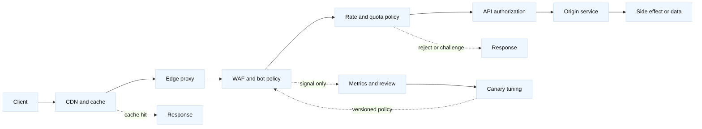

# Edge abuse defense

## Learning objectives

- Explain how WAF rules, rate limits, bot controls, API quotas, and CDN or edge
  controls constrain different abuse paths.
- Model abuse economics: attacker effort, origin cost, cache efficiency,
  account value, detection confidence, and the cost of blocking legitimate
  users.
- Design privacy-aware signals and distinguish a useful abuse signal from an
  identity claim.
- Plan a measured rollout with shadow mode, canaries, explicit stop conditions,
  and a reversible rollback path.
- Compare controls at the CDN, edge proxy, WAF, API gateway, application, and
  origin layers without assuming that one vendor's product boundary is
  universal.

## Prerequisites

Know [proxy architecture and boundaries](08-proxy-architecture-and-boundaries.md),
[firewalls, security groups, and NACLs](19-firewalls-security-groups-nacls.md),
[CDN and edge caching](25-cdn-edge-caching.md), [network observability and
SLOs](11-network-observability-slos.md), and [retries, deadlines, and
backpressure](35-retries-deadlines-and-backpressure.md).

## Interview scope

- SDE2: trace a suspicious request through CDN, edge, WAF, rate-limit, API, and
  origin decisions, then identify the evidence needed to tune one control.
- Staff: establish ownership, privacy constraints, economics, customer-impact
  budgets, rollout gates, and rollback authority across edge, security,
  platform, and application teams.
- Expected interview artifact: an abuse-defense decision record with a request
  path, threat hypotheses, control matrix, cost model, privacy review, metrics,
  canary plan, and stop conditions.

## Mental model

**Fact:** No single edge control observes the whole abuse problem. A CDN can
absorb cacheable volume, a WAF can inspect protocol and request attributes, a
rate limiter can constrain a measured key, and the application can evaluate
business authorization and account state.

**Vendor terminology:** CDN, WAF, bot management, edge function, API gateway,
managed challenge, token bucket, reputation score, and virtual patch are
vendor or product terms whose scope, signal retention, and enforcement order
vary by service and release.

**Engineering inference:** Place a control as close as practical to the cost
or harm it limits, but preserve a later authoritative decision. An edge allow
is not application authorization, and an edge deny is not automatically proof
of malicious identity.

| Layer | Useful control | What it can observe | Main blind spot |
| --- | --- | --- | --- |
| CDN/cache | Cache, request shaping, origin shield | URL, method, cache state, coarse client signals | Dynamic business intent |
| Edge proxy | Connection and request budgets | Connection rate, TLS, headers, path, region | Account history unless propagated |
| WAF | Protocol and exploit rules | HTTP structure, body fields, signatures | Novel business abuse and context |
| Bot control | Challenge or classification | Browser/device behavior and request sequences | Accessibility, privacy, automation legitimacy |
| API gateway | Key, token, and quota policy | API identity, route, quota, response class | Human intent and downstream side effects |
| Application | Authorization and business limits | Account, object, workflow, transaction | Cheap rejection after upstream work |
| Origin | Durable state and final effect | Full service context and outcome | Expensive exposure if upstream controls fail |

Abuse is a systems problem with two distinct questions: “Can this request
reach a service?” and “Should this actor receive this result or cause this
side effect?” The first is an edge and availability concern; the second is an
authorization and business-policy concern. Keep the questions separate in
metrics, logs, and incident decisions.

## Diagram

The path is conceptual. A deployment may combine layers or execute them in a
different order. The important questions are which layer makes each decision,
which key it uses, which response class it produces, and whether the request
has already consumed scarce origin resources.

## Control design and abuse economics

Model at least four abuse families:

- **Availability abuse:** floods, connection hoarding, expensive endpoints,
  cache-bypass requests, and retry amplification.
- **Credential or account abuse:** login spraying, credential stuffing,
  enumeration, session theft, and account takeover attempts.
- **API and business abuse:** scraping, bulk object reads, coupon or inventory
  races, expensive search, and unauthorized automation using valid credentials.
- **Origin-cost abuse:** requests that miss cache, trigger serverless or
  database work, consume egress, or produce billable third-party calls.

For each family, record the attacker's marginal cost, the defender's marginal
cost, the asset at risk, and the harm of a false positive. A WAF signature may
be cheap to evaluate but weak against valid authenticated requests. A strict
per-IP limit may be easy to explain but unfair behind carrier NAT or a shared
corporate proxy. A per-account quota may be more precise but is ineffective
before login and can expose account existence.

Use cache controls deliberately. A cache hit can protect the origin from
repeated public reads, but caching a personalized or authorization-sensitive
response can create a confidentiality failure. Cache keys, bypass rules,
purge behavior, stale serving, and cache poisoning defenses must be reviewed
with the application owner.

## Worked example: rate limit and origin cost

Assume `api.example.com` has a public search endpoint. A normal peak is 800
requests per second (RPS), with 120 ms average origin service time. A suspected
abuser produces 2,400 RPS, and 70% of those requests miss cache. Assume each
cache miss consumes 35 ms of database time and causes $0.00004 of modeled
downstream cost. These are planning assumptions, not provider prices or
limits.

At peak, estimated concurrent origin requests are:

`800 RPS * 0.120 seconds = 96 concurrent requests`

Under the abusive load, cache misses are:

`2,400 RPS * 0.70 = 1,680 origin requests/second`

The modeled downstream cost rate is:

`1,680 * $0.00004 = $0.0672/second`, or about `$241.92/hour`

before other compute, bandwidth, and incident costs. A proposed anonymous
limit of 1,000 RPS for the whole service would still leave too much shared
load, while a limit of 100 RPS per source key could block a large carrier NAT.
Choose a key hierarchy such as authenticated account, API token, source
network signal, and endpoint cost class. Suppose 20 trusted API clients need
40 RPS each and the remaining anonymous traffic is budgeted at 300 RPS. The
service-wide admission budget is then:

`20 * 40 + 300 = 1,100 RPS`

Reserve 20% for measurement error and failover headroom:

`1,100 * 1.20 = 1,320 RPS`

Start in observe-only mode, compare rejected-by-policy predictions with
customer impact, and lower or partition the budget only after measuring real
traffic. A limit that protects the database but causes login or checkout
failures is not a successful design.

## False positives, privacy, and safe rollout

Treat signals as probabilistic unless the application has authoritative
evidence. IP address, user agent, TLS traits, cookies, device identifiers,
geography, and behavioral scores can be shared, unstable, spoofed, or
discriminatory. Minimize collection, document purpose and retention, restrict
access, redact payloads and credentials, and provide an appeal or support path
for blocked legitimate users. Do not use a security score as a hidden
identity proof.

Roll out policy as a versioned artifact:

1. Define the protected resource, abuse hypothesis, owner, and customer-impact
   budget.
2. Measure baseline request volume, cache hit ratio, origin work, response
   classes, latency, conversion, accessibility indicators, and support impact.
3. Run the rule in shadow mode, logging the would-block decision with a reason
   code and sampled evidence.
4. Canary by endpoint, tenant, region, or small traffic percentage. Keep a
   known-good bypass for break-glass operations with audited, time-limited use.
5. Promote only when protection, origin load, false-positive, privacy, and
   SLO gates pass.
6. Roll back the policy version or disable the narrow rule if a stop condition
   fires; preserve logs and the last known-good configuration.

## When this breaks

| Symptom | Leading hypothesis | Competing hypothesis | Falsifier or next evidence |
| --- | --- | --- | --- |
| Origin remains overloaded after WAF deployment | Abuse uses valid requests or cache-bypass variation | WAF is not on the hot path | Compare policy hits, cache misses, and origin work by endpoint |
| Legitimate users receive 429 responses | Key is too coarse, such as shared IP | Client retry storm or quota mismatch | Segment by account, token, network, and retry behavior |
| Attack shifts to a new endpoint | Control protects paths, not an abuse class | New traffic is a legitimate launch | Compare authenticated intent, cost class, and business outcome |
| Cache protects volume but data leaks | Personalized response entered a shared cache | Client-side data is stale only | Inspect cache key, authorization variance, and response headers |
| Bot challenge raises abandonment | Challenge is inaccessible or overbroad | Origin latency is the real cause | Compare challenged cohort, accessibility signals, and control group |
| Attack increases cloud bill despite lower RPS | Requests trigger expensive downstream work | Billing attribution is delayed | Join request IDs to cache misses, calls, and cost telemetry |
| Rollback does not restore traffic | Multiple policy layers changed | Client or DNS caching persists behavior | Diff versioned policies and test a known-good request |
| Privacy review rejects the design | Retention or signal purpose is undefined | Required consent or regional rule differs | Minimize fields and obtain the target jurisdiction decision |

## Operational checklist

1. Name the protected asset, abuse class, policy owner, on-call owner, and
   rollback authority.
2. Inventory CDN, edge, WAF, bot, rate, quota, API, identity, and origin
   controls, including their order and failure behavior.
3. Define keys and limits by endpoint cost and identity state; document shared
   network and accessibility consequences.
4. Verify cache safety for authorization, personalization, invalidation, and
   sensitive response data.
5. Capture reason-coded metrics for allow, challenge, throttle, block, cache
   hit, cache miss, origin work, retries, latency, and customer outcomes.
6. Minimize and protect request signals; set retention, access, redaction, and
   regional handling rules before production logging.
7. Test shadow mode, canary scope, break-glass access, version rollback, and
   failure of the control itself using authorized traffic.
8. Review attack economics after every change: attacker effort, origin cost,
   downstream cost, protection cost, and false-positive cost.

## Implementation exercise

Build a standard-library simulator for an edge policy chain. Given a request
with source key, account state, method, path, body size, cache status, and
endpoint cost class, return `allow`, `cache-hit`, `challenge`, `throttle`, or
`block`, plus an ordered reason code. Support token-bucket limits at service,
source, account, and endpoint scopes; WAF rules; cache bypass for authorized
personalized responses; and a versioned rollback operation.

Use only reserved examples such as `api.example.com`, `198.51.100.0/24`, and
`203.0.113.0/24`. Tests should cover shared NAT, authenticated versus
anonymous traffic, cache poisoning prevention, burst capacity, retry
amplification, false-positive measurement, privacy-redacted logs, shadow mode,
canary promotion, and rollback after a stop condition. The simulator must not
claim that an IP, bot score, or WAF match proves user identity or malicious
intent.

## Questions and answers

1. **[SDE2 | fundamentals] What problem does a WAF solve?**

   **Answer:** A WAF evaluates application-layer request characteristics against
   rules for protocol misuse or known attack patterns. It reduces exposure but
   cannot replace authentication, authorization, secure coding, or business
   abuse controls. Its decision is evidence about the request at that edge
   point, not proof that the caller is malicious or that the origin is safe.

2. **[SDE2 | capacity] Why is a per-IP rate limit insufficient?**

   **Answer:** Many legitimate users can share an address through carrier NAT,
   offices, or proxies, while an attacker can distribute traffic across many
   addresses. Use a key hierarchy and endpoint cost classes, then measure false
   positives and evasion.

3. **[Staff | economics] How would you prioritize edge controls?**

   **Answer:** Rank controls by harm prevented per unit of evaluation, origin,
   provider, and customer cost. Start with cheap cache and connection defenses,
   add identity-aware quotas for expensive actions, and require evidence that a
   stricter control improves net risk rather than merely shifting the attack.

4. **[SDE2 | CDN] When can caching worsen an incident?**

   **Answer:** Caching can worsen confidentiality when authorization-sensitive
   or personalized responses share an unsafe cache key. It can also preserve a
   poisoned response or amplify stale policy. Review cache variance, purge, and
   authorization behavior before increasing cache coverage.

5. **[Staff | privacy] What makes an abuse signal privacy-aware?**

   **Answer:** Collect the least data needed for a defined purpose, limit access
   and retention, redact payloads and credentials, document regional handling,
   and test disparate customer impact. Present scores as risk signals, not
   identity or intent claims.

6. **[Staff | rollout] How do you safely launch a blocking rule?**

   **Answer:** Establish a baseline and customer-impact budget, run shadow mode,
   canary narrowly, monitor reason-coded protection and business metrics, and
   promote only through explicit gates. Keep a tested, audited rollback and
   stop immediately when SLO, false-positive, privacy, or revenue thresholds
   fail.

7. **[SDE2 | debugging] What evidence distinguishes origin abuse from a WAF bug?**

   **Answer:** Correlate request IDs or sampled hashes across edge decisions,
   cache hits and misses, origin work, response classes, and latency. If origin
   work rises without corresponding policy misses or the rule is absent from
   the path, inspect routing and deployment before tuning the signature.

8. **[Staff | architecture] What should happen when an attacker uses valid
   credentials?**

   **Answer:** Keep network reachability, identity authentication, object
   authorization, and business quotas separate. Apply endpoint and account
   budgets, detect abnormal sequences, require step-up controls where justified,
   and coordinate with the account owner without treating automation or a score
   as proof of compromise.

## Evidence and scope

- **Fact:** HTTP-layer filtering, caching, and quota behavior are protocol and
  product mechanisms; exact enforcement order, limits, and billing vary by
  deployment.
- **Vendor terminology:** CDN, WAF, bot management, edge function, managed
  challenge, and API gateway names and capabilities require verification in the
  target vendor, plan, region, and release.
- **Engineering inference:** The control matrix, abuse economics, reason-coded
  metrics, privacy minimization, shadow rollout, canary gates, and rollback
  method are portable design practices, not guarantees of any product.
- See the [fact and inference ledger](../FACT-INFERENCE-LEDGER.md) for the
  repository's evidence and verification guidance.
