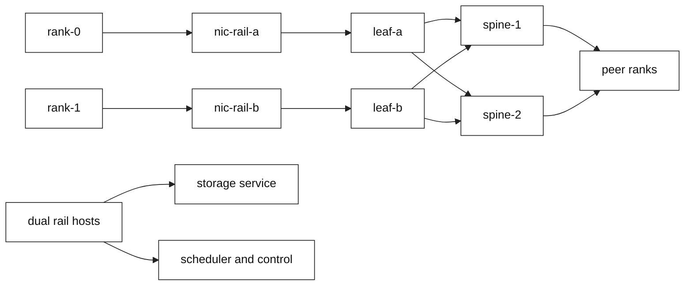
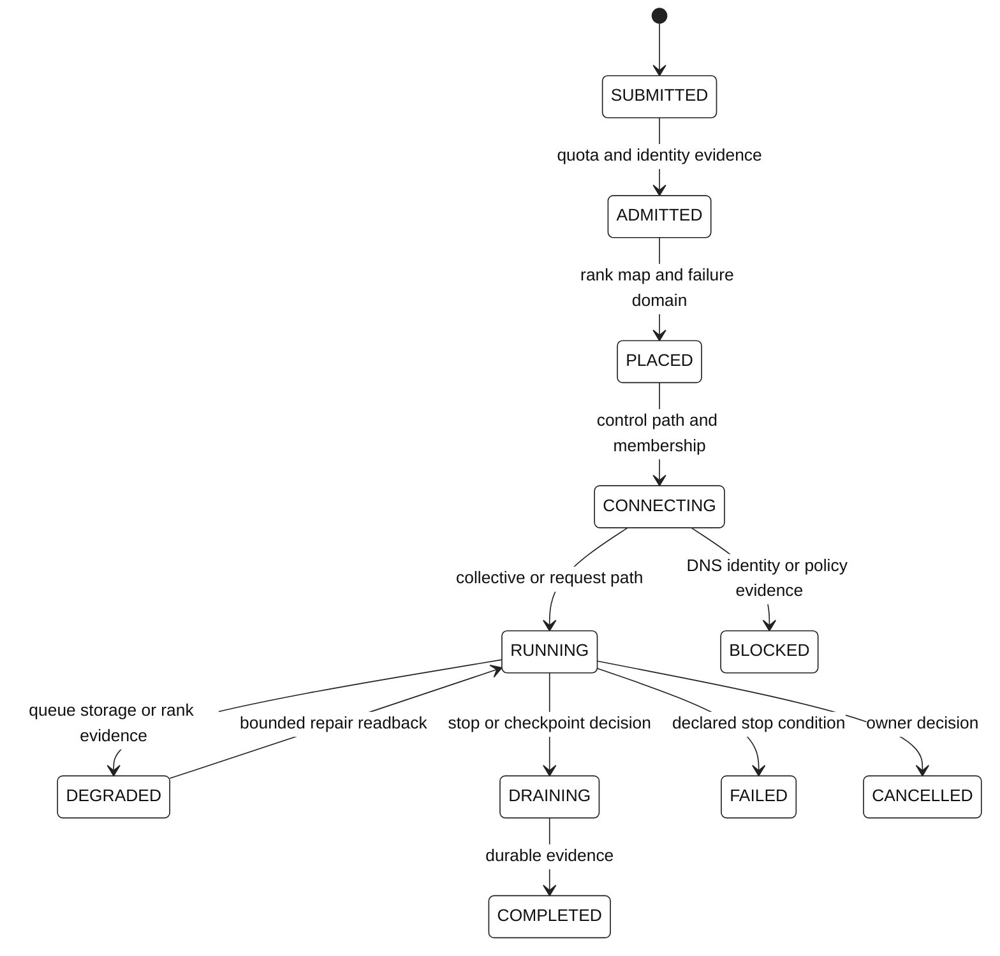
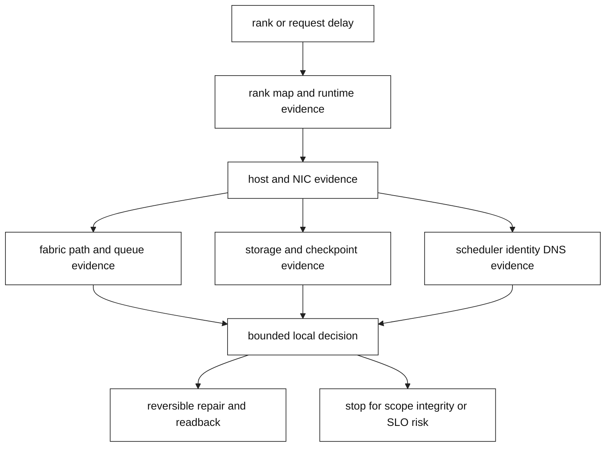

# AI-era data-center networking

This focused topic is a vendor-aware learning treatment of accelerator-cluster
networking. It is an educational model, not a production runbook, benchmark,
procurement recommendation, or instruction to configure a switch, NIC, GPU,
RoCE, InfiniBand, ECN, PFC, BGP, overlay, storage system, or scheduler.

**Role scope:** SDE1 traces a workload path and asks for safe evidence; SDE2
models capacity, congestion, failure domains, and falsifiers; Staff frames a
multi-team decision with migration, adoption, cost, ownership, and stop gates.
**Expected artifact:** an AI-fabric design and verification record containing a
topology/rail map, workload assumptions, capacity worksheet, failure-domain
map, evidence plan, owners, rollout, rollback, and irreversible-failure stop
condition.

## Learning objectives

- Trace training collectives, inference requests, storage, and control traffic
  through compute, host, rail, leaf, spine, and service boundaries.
- Explain Clos/leaf-spine, Ethernet/IP, optional overlays, ECMP, MTU, queues,
  ECN, PFC, loss, and congestion without treating a product label as a
  portable behavior.
- Compare synchronized training with latency-sensitive inference and identify
  why a slow rank can amplify a small tail event.
- Calculate a deliberately bounded capacity and communication lower bound,
  then list the assumptions that prevent it from being a benchmark.
- Use an evidence sequence that can distinguish fabric, storage, scheduler,
  control-plane, identity, and observability explanations.
- Complete a deterministic local fixture, explain its limits, and answer
  SDE1, SDE2, and Staff interview prompts with mechanism and ownership.

## Prerequisites

Read [data-center fabrics](../ccna-networking/11-data-center-fabrics.md),
[VXLAN and overlays](18-vxlan-network-overlays.md), [BGP and anycast](../16-bgp-anycast-and-multi-region.md),
[capacity and SLO engineering](16-capacity-performance-and-slo-engineering.md),
[observability](11-network-observability-slos.md), [Kubernetes ingress](13-kubernetes-ingress-and-service-mesh.md),
and [backpressure](35-retries-deadlines-and-backpressure.md). Be comfortable
with a five-tuple, IP routing, ECMP, MTU, queueing, a control-plane/data-plane
boundary, and a service objective. The local lab does not require GPUs, RDMA,
kernel support, cloud credentials, or privileged access.

## Interview scope

| Level | What a strong answer demonstrates | Practice artifact |
| --- | --- | --- |
| SDE1 | Names compute, host, fabric, storage, control, and security paths; asks for timestamped evidence before blaming a switch. | Annotated path diagram and symptom-to-evidence table |
| SDE2 | Maps ranks to rails, compares Clos blocking assumptions, derives capacity/headroom, and tests competing hypotheses safely. | Fixture report, capacity worksheet, and failure hypothesis tree |
| Staff | Aligns training and inference objectives, assigns owners, stages migration/adoption, quantifies variables, and defines stop gates. | Design review record with options, RACI, rollout, rollback, and stop condition |

**Staff follow-up:** defend two viable fabric options to ML platform, network,
storage, security, and finance stakeholders; explain adoption and migration
stages, cost/risk variables, rollback authority, and the irreversible stop that
protects tenant isolation or data integrity.

## Mental model

An AI cluster is several interacting state machines rather than one thing
called “the network.” Job admission records quota, identity, priority, and
placement. Rank membership records the process/device/host map and collective
epoch. Fabric control records topology intent, routes, ECMP eligibility, and
telemetry state. Host transport records NIC queues and local limits. The data
plane carries messages on a particular rail and path. Storage carries data,
weights, and checkpoints. Security decides which tenant, project, registry,
management, and telemetry flows are allowed. Observability gives each claim a
timestamp, source, retention policy, and clock-confidence caveat.

| State | Authoritative record | Representative owner | Failure question |
| --- | --- | --- | --- |
| Job admission | requested resources, priority, quota, identity, placement | ML platform/scheduler | Was the job placed in a bad failure domain? |
| Rank membership | rank-to-process/device/host map and epoch | runtime/job controller | Did one missing or slow rank block synchronization? |
| Rail/topology | host-to-NIC-to-leaf/spine reachability and eligible paths | network/platform | Is the intended rail actually usable and converged? |
| Congestion | offered load, queue, marking, pause, loss, recovery | host and fabric teams | Is a counter causal, correlated, or absent? |
| Storage/checkpoint | data placement, durability, queue depth, throughput | storage/data platform | Is storage the limiting path? |
| Identity/policy | workload identity, segmentation, certificates, authorization | security and service owner | Was access denied intentionally or accidentally? |
| Evidence | timestamps, provenance, clock quality, sampling, retention | SRE/observability | Can the sequence support a causal claim? |

**Fact:** protocol behavior and a measured fixture observation are different
categories. **Vendor terminology:** “rail,” “RDMA,” “RoCE,” “NCCL,” “collective
offload,” and “lossless Ethernet” may describe a product or deployment
concept, but exact semantics depend on vendor, hardware generation, driver,
runtime, firmware, topology, and release. **Engineering inference:** name the
state owner before selecting a metric or proposing a repair.



Conceptual model: the two rails and two equal-cost spine choices illustrate
possible paths, not a claim about a specific cabling or library algorithm.

## Topology and traffic paths

A Clos or leaf-spine fabric gives leaves multiple paths toward spines and can
use ECMP when routing policy, hashing, links, and failure state permit it.
Nonblocking is a workload-relative design claim: it depends on port rates,
radix, oversubscription, simultaneous flows, failure reserve, and the chosen
traffic matrix. A rack can have two host NICs, one per curriculum rail, with
each NIC attached to a leaf. A rail is a design abstraction here; its physical
meaning must be declared for the target system.

The underlay is the routed transport that supplies reachability. An overlay
can provide logical isolation or mobility, but it adds encapsulation overhead,
control state, and MTU accounting. BUM traffic, overlay control traffic,
management access, storage, and job data need explicit boundaries. Fabric
management reachability is not proof that a collective data path is usable,
and a completed IP flow is not proof that the runtime completed its collective.

Training is mostly east-west communication among ranks, with possible data
ingestion and checkpoint bursts. Inference commonly combines north-south
requests with service-to-service calls, batching, model-weight distribution,
and possibly cache or KV-cache movement. The exact cache ownership,
replication, invalidation, and transport are design choices, not consequences
of the phrase “KV cache.” Storage and scheduler/DNS/identity paths can produce
the same user-visible delay as a congested rail.

**Fact:** Ethernet/IP provides the common frame, packet, addressing, and
routing vocabulary; ECMP path selection follows effective local policy.
**Engineering inference:** topology, hash distribution, link failure domains,
and workload placement meet an objective only after measurement and failure
testing. **Vendor terminology:** an accelerator vendor's rail or topology-aware
collective mode must be checked against the named release and test topology.

## Transport and congestion terminology

| Term | Teaching meaning | Boundary |
| --- | --- | --- |
| Ethernet/IP | Portable frame, packet, route, MTU, and ECMP vocabulary | **Fact:** tie stable behavior to standards; forwarding and queue behavior are release-specific. |
| RDMA | Direct-memory-access communication family used by some high-performance workloads | **Vendor terminology:** pin NIC, OS, driver, runtime, and release; RDMA alone proves no lossless or latency guarantee. |
| RoCE | RDMA technology family carried over Ethernet | **Vendor terminology:** do not transfer QoS, congestion, PFC, counters, or management assumptions across vendors. |
| InfiniBand | Distinct fabric technology and operations ecosystem | **Vendor terminology:** addressing, routing, partitioning, congestion, and management are not one-to-one with Ethernet/IP. |
| ECN | Congestion signaling carried in packet marking where supported | **Fact:** see [RFC 3168](https://www.rfc-editor.org/rfc/rfc3168); exact counters and reaction are implementation-specific. |
| PFC | Priority-scoped pause behavior in relevant Ethernet deployments | **Vendor terminology:** pause propagation and failure scope depend on QoS design and release; this topic provides no thresholds. |

Use this causal chain for diagnosis: `offered load -> egress contention ->
queue growth -> marking, pause, or loss -> sender/runtime reaction -> rank or
request delay -> job or SLO symptom`. A microburst can create a tail event
without sustained average-link saturation. PFC may contain loss for a traffic
class while expanding a congestion failure domain through pause propagation or
head-of-line blocking. A rising counter is a clue, not a root cause.

## Workload communication models

Training collectives include all-reduce, all-gather, and reduce-scatter. Ring,
tree, hierarchical, and topology-aware algorithms are useful abstract models;
the actual runtime selects among algorithms according to its release,
environment, rank map, and capabilities. A synchronized step can be bounded by
the slowest rank, so small path asymmetry can consume a large allocation.

Inference has different success measures: request availability, tail latency,
quality, and cost per useful response. A slow shard, queue, dependency, model
load, prefill/decode stage, or cache path can affect a request cohort without a
collective barrier. The serving design must declare batching, model placement,
weight movement, cache residency, and degradation or shed-work policy.



Conceptual state model: each transition has an authority and evidence source;
fabric reachability alone does not authorize a job to start.

### Transition authority and missing-evidence behavior

These are role boundaries for design review, not real organizations or product
controls. The authority column says who may attest the transition; the evidence
column says the minimum record needed before that role does so.

| Transition | Authoritative owner | Minimum evidence | Missing or contradictory evidence |
| --- | --- | --- | --- |
| `SUBMITTED -> ADMITTED` | ML platform/scheduler | quota, identity, policy, and request record | Fail closed or queue; do not infer admission from a network path |
| `ADMITTED -> PLACED` | ML platform/scheduler | rank/request placement, capacity, and failure-domain map | Queue; reject ambiguous placement |
| `PLACED -> CONNECTING` | Runtime/job controller | membership epoch, host/rail map, and control dependency readback | Fail closed; do not start partial membership |
| `CONNECTING -> RUNNING` | Runtime/job controller with network/platform evidence | usable selected paths, dependency state, and workload admission gate | Block or shed; preserve the failed readback |
| `CONNECTING -> BLOCKED` | Runtime/job controller | explicit dependency, path, identity, or policy failure | Fail closed and name the unresolved dependency |
| `RUNNING -> DEGRADED` | Service owner with platform evidence | objective impact plus independent fabric, storage, or stage signal | Keep serving only if the objective gate permits; otherwise shed/queue |
| `DEGRADED -> RUNNING` | Service owner | repair readback, objective recovery, and evidence correlation | Remain degraded; do not treat a retry as repair |
| `RUNNING -> DRAINING` | Service owner / scheduler | stop, checkpoint, or capacity decision with owner approval | Queue or continue within the declared gate; do not drain on a lone counter |
| `DRAINING -> COMPLETED` | Runtime/job controller | durable output/checkpoint and final objective evidence | Keep draining or fail closed if durability is uncertain |
| `RUNNING -> FAILED` or `RUNNING -> CANCELLED` | Service owner / scheduler | declared stop condition or owner cancellation record | Preserve state and escalate; never invent a failure reason |

The fixture models these as evidence boundaries only. It does not implement a
scheduler, admission controller, runtime, or production state machine.

## Capacity and cost model

Use variables rather than universal ratios or prices. Let installed rail
bandwidth be `2 rails * 200 Gb/s = 400 Gb/s`; choose a planning guardrail of
`0.70`, two concurrent jobs, a per-job peak of `80 Gb/s`, overlap factor
`0.80`, and a largest planned failure domain of `100 Gb/s`. These are fictional
assumptions to replace with measured workload and release-specific evidence.

```text
usable_fabric_bandwidth = installed_bandwidth * utilization_guardrail
                         = 400 * 0.70 = 280 Gb/s
required_training_bandwidth = concurrent_jobs * per_job_peak * overlap_factor
                            = 2 * 80 * 0.80 = 128 Gb/s
failure_safe_bandwidth = usable_fabric_bandwidth - largest_planned_failure_domain
                        = 280 - 100 = 180 Gb/s
headroom_ratio = failure_safe_bandwidth / required_training_bandwidth
               = 180 / 128 = 1.40625
communication_lower_bound_seconds = payload_bytes / effective_bytes_per_second * phases
                                   = 240,000,000 / 80,000,000,000 * 2
                                   = 0.006 seconds
```

The following one-variable-at-a-time table is a synthetic sensitivity exercise,
not a procurement recommendation. Units are `Gb/s`; the installed value is
`400 Gb/s`, required workload is `128 Gb/s`, and the nominal failed member is
`100 Gb/s`.

| Assumption changed | Synthetic input | Usable bandwidth | Failure-safe bandwidth | Headroom classification |
| --- | --- | ---: | ---: | --- |
| Utilization guardrail | `0.60` | `240` | `140` | `1.094x`, narrow |
| Concurrent jobs | `3` (same `80`, `0.80`) | `280` | `180` | `0.938x`, insufficient |
| Workload overlap | `1.00` (two jobs) | `280` | `180` | `1.125x`, constrained |
| Largest failed rail/member | `200` | `280` | `80` | `0.625x`, insufficient |

These values are arithmetic teaching inputs. Placement, ECMP, software, host
limits, framing, synchronized phases, and the target release must be measured
before a real capacity decision.

The lower bound excludes software, serialization, PCIe/NIC behavior, queueing,
protocol headers, topology imbalance, synchronization, and storage. It is not
a measured step time. If placement sends 1.7 times the traffic to rail-a,
installed capacity is unchanged but effective bandwidth for the slow rank can
fall below the worksheet assumption. Recalculate sensitivity for guardrail
`0.60` and `0.80`, overlap `0.60` and `1.00`, one versus two jobs, and one
failed rail. Track rack power/cooling, ports and optics, storage throughput,
cross-zone transfer, reserved accelerator time, and operator complexity as
variables. A Staff design also records who owns each cost and which workload
mix or hardware/release change triggers review.

## Worked example

The fixture baseline models four ranks, two rails, two leaves, two spines, and
separate storage/control services. The all-reduce phase offers `60 Gb/s` per
rail and the checkpoint phase adds `10 Gb/s` per rail. A baseline run therefore
reports `70 Gb/s` on each modeled rail and a clear qualitative queue state.
Injecting `rail_imbalance` changes only local state inputs, selected-link load,
and the derived health/objective fields. Injecting `storage_saturation` can
produce a similar degraded health state, but its independent signal points to
storage capacity rather than rail queue state. This is an **Observed lab
result** only for schema `ai-fabric-fixture/v2`, runner `2.0.0`, and the named
scenario, not a hardware result.

The practical comparison is intentionally asymmetric: first ask which
timestamped evidence differs, then decide which owner can run the next bounded
test. Do not “fix” both by increasing buffers, enabling PFC, buying bandwidth,
or changing a scheduler. A safe local repair is to remove the injected fault
in the fixture and compare baseline, repaired read-back, and rollback replay.

## Observability and safe diagnosis

Use this evidence order: job/runtime timestamps and rank map; host/NIC evidence;
fabric path and control state; queue, marking, or pause telemetry when
authorized; storage and control-plane evidence; independent negative control;
then a bounded simulation repair. Preserve timestamp origin, clock confidence,
sampling, cardinality, retention, tenant privacy, and whether each field is
measured or inferred. Correlate by a synthetic job/rank identifier in the
fixture rather than copying tenant payloads into logs.

| Observation | Competing explanation | Falsifier or next safe evidence |
| --- | --- | --- |
| Queue or ECN mark rises | Rail skew, checkpoint burst, or harmless background load | Compare rank completion, path map, storage latency, and a no-fault control |
| Pause counter rises | Congestion propagation, misclassified traffic, or short burst | Compare affected class, paused path, queue state, and independent workload |
| Runtime retry/stall | Loss, storage, scheduler, or control dependency | Join rank/runtime event to host, fabric, storage, and scheduler timestamps |
| One-rail skew | ECMP hash, placement, failed member, or rail mapping | Recompute path map and test a single bounded placement change |
| Storage latency rises | Checkpoint bottleneck or shared storage contention | Compare storage demand/capacity independently of rail load |
| Clock mismatch | False causal ordering or missing telemetry | Check clock provenance and use monotonic local durations |

## Security and ownership boundaries

Separate tenant/project traffic from management, storage, registry, telemetry,
and job-control paths. Apply least privilege to workload identity, model and
checkpoint access, secrets, and evidence retention. Image and model supply
chain controls matter here, but this topic is not a general AI security guide.
Decide whether a failure closes access, queues work, degrades quality, or sheds
load; name the authority and customer/job objective for that decision.

**Engineering inference:** a network repair is unsafe if it crosses a tenant
boundary, changes an undeclared failure domain, or obscures evidence. Stop when
data integrity or authority is uncertain, the change broadens beyond scope, or
the declared job/service SLO remains breached after bounded rollback. An
automatic retry is not a rollback; rollback restores a known state and verifies
it.

## When this breaks



Conceptual escalation model: evidence moves across ownership boundaries before
the incident commander authorizes a bounded repair or an irreversible stop.

| State | Symptom and direct evidence | Competing hypothesis | Safe local test and owner | Reversible action | Irreversible stop |
| --- | --- | --- | --- | --- | --- |
| `RAIL_SKEW` | One rail carries disproportionate modeled load; rank tails widen | ECMP hash or storage burst | Compare rank map and rail loads; ML platform plus network | Re-run with balanced fictional placement | Stop if tenant placement or identity boundary changes |
| `PATH_UNAVAILABLE` | Link/member unavailable; eligible path count falls | Control convergence or asymmetry | Remove one local link in fixture; network team | Restore declared member and read back | Stop if scope reaches an undeclared link |
| `MTU_INCOMPATIBLE` | Effective MTU below modeled payload/encapsulation | PMTU filtering or runtime framing | Reduce local MTU input and compare phase evidence | Restore baseline MTU input | Stop if packet handling could corrupt data |
| `QUEUE_PRESSURE` | Queue state becomes pressured/marked | Microburst or noisy neighbor | Increase synthetic offered load only | Remove injected load | Stop before production threshold or QoS change |
| `STORAGE_BOUND` | Storage demand exceeds modeled capacity; job delay resembles fabric issue | Rail congestion | Compare storage fault with rail fault | Restore storage capacity input | Stop if checkpoint durability is uncertain |
| `PLACEMENT_SKEW` | Scheduler map concentrates a rail or failure domain | ECMP distribution | Change local rank map only | Restore prior placement | Stop if admission or quota authority is bypassed |
| `CONTROL_BLOCKED` | Scheduler/control dependency unavailable; job cannot start | DNS, identity, certificate, or policy | Toggle local availability field | Restore control input after read-back | Stop on authorization or secret uncertainty |
| `OBSERVABILITY_AMBIGUOUS` | Clock offset or sampling prevents ordering | Real queue event | Compare timestamp confidence and negative control | Restore telemetry assumption | Stop when causal claim cannot be supported |

## Operational checklist

1. State the workload objective: training step/job throughput or inference
   availability/tail latency/quality, with units and deadline.
2. Draw compute, rank, host, NIC, rail, leaf, spine, storage, control, and
   management paths; mark failure domains and owners.
3. Declare vendor, hardware, driver, runtime, firmware, topology, and release
   boundaries before interpreting RDMA, RoCE, InfiniBand, or collective terms.
4. Calculate installed, usable, failure-safe, and required bandwidth with
   overlap, headroom, concurrency, and failure sensitivity.
5. Collect rank map and timestamps before host, fabric, queue, storage, and
   control evidence; record clock confidence and privacy limits.
6. Compare at least one fabric hypothesis with storage, scheduler, control, and
   telemetry alternatives using a negative control.
7. Use only the local fixture for this exercise; do not tune thresholds,
   enable PFC, capture privileged traffic, or mutate a production system.
8. For Staff decisions, record options, owners, adoption, cost/risk, rollout,
   rollback, communication, decision gates, and an irreversible stop condition.

## Local fixture exercise

Run the [AI fabric fixture README](fixtures/ai-data-center/README.md), then:

```bash
python3 book/topics/fixtures/ai-data-center/runner.py --scenario baseline
python3 book/topics/fixtures/ai-data-center/runner.py --scenario baseline --fault rail_imbalance
python3 book/topics/fixtures/ai-data-center/runner.py --scenario inference --fault prefill_saturation
python3 book/topics/fixtures/ai-data-center/test_runner.py
```

Compare `rail_imbalance` and `storage_saturation`. Produce a topology/rail
map, workload path, capacity worksheet, rank-straggler hypothesis tree,
evidence order, fixture output, repair and rollback choice, and confidence
statement. Retain an artifact only below the fixture's `observed/` directory.

## Questions and answers

1. **[SDE1] Draw a training collective path and name data, control, and storage paths.**

   **Answer:** Start at each rank and accelerator, traverse its host NIC and declared rail to a leaf and one eligible spine path, then connect to peer ranks. Separately draw scheduler, identity, DNS, and telemetry control paths, plus dataset and checkpoint storage. The paths have different owners and evidence.

   Wrong turn: drawing every dependency as “the network.” Evidence: rank map, path map, scheduler admission, and storage timestamps. Follow-up: identify which path can block admission before a packet is sent.

2. **[SDE1] Why does a slow rank not prove the switch is faulty?**

   **Answer:** A synchronized phase waits for its slowest participant, but the delay could come from placement skew, a host NIC, a runtime stall, storage, scheduler contention, MTU handling, or clock error. A switch counter is one correlated observation, not a causal proof.

   Wrong turn: treating a queue increase as attribution. Evidence: rank-to-rail map, host counters, path state, storage latency, and a negative control. Follow-up: state the smallest reversible local test.

3. **[SDE1] Compare a training symptom with an inference symptom.**

   **Answer:** Training may show longer synchronized step time because one rank delays a collective. Inference may show tail latency or unavailable requests because a shard, batch queue, model load, dependency, or cache path is slow. Both need workload-specific objectives and evidence.

   Wrong turn: applying training throughput metrics to serving latency. Evidence: step duration, request percentiles, queue depth, and model/cache path. Follow-up: name the degradation or shed-work policy.

4. **[SDE1] Explain ECN and PFC with a deployment caveat.**

   **Answer:** ECN can mark congestion in supported packet paths so a sender or transport can react; PFC can pause selected Ethernet priorities in relevant deployments. Their counters, scope, interactions, and reaction depend on standards, hardware, QoS policy, driver, and release. Neither label guarantees losslessness.

   Wrong turn: prescribing a threshold. Evidence: authorized queue, mark, pause, and runtime signals with release context. Follow-up: explain how pause propagation could widen a failure domain.

5. **[SDE2] Compare a nonblocking and an oversubscribed Clos design.**

   **Answer:** A nonblocking claim compares offered traffic and failure reserve with the available leaf-spine capacity for a stated traffic matrix. An oversubscribed design may be cheaper or adequate for inference but can delay synchronized training under concurrent collectives. Compute the ratio, concurrency, headroom, and largest failure assumption rather than choosing a universal number.

   Wrong turn: equating port count with workload capacity. Evidence: cabling, rates, ECMP distribution, job mix, queue tails, and failure replay. Follow-up: propose a canary workload and a rollback gate.

6. **[SDE2] Diagnose rail skew versus storage saturation.**

   **Answer:** Rail skew should change per-rail offered load, path selection, and possibly queue/mark state while storage demand remains comparable. Storage saturation should change storage queue or capacity evidence and can delay checkpoints without an equivalent rail imbalance. Compare both faults in the fixture and correlate independent timestamps.

   Wrong turn: selecting the largest counter. Evidence: rank map, per-rail loads, storage demand/capacity, and a metadata-only negative control. Follow-up: assign network and storage owners to falsifiers.

7. **[SDE2] What must effective MTU include?**

   **Answer:** Effective MTU includes the smallest payload allowance across host, NIC, link, routing, encapsulation, tunnel, security, and peer paths. An overlay consumes space and may change fragmentation or PMTU behavior. A configured interface value is not evidence that every collective message can traverse the full path.

   Wrong turn: checking only the host interface. Evidence: path-by-path MTU, encapsulation overhead, PMTU signals, and a bounded payload test. Follow-up: state when to stop rather than alter production MTU.

8. **[SDE2] Design telemetry that correlates rank, host, and fabric evidence without leaking tenant data.**

   **Answer:** Use a synthetic or access-controlled job and rank identifier, timestamps with clock-confidence metadata, host and rail labels, path or flow summaries, queue observations, storage events, and retention limits. Hash or minimize sensitive identifiers, separate tenant payloads from diagnostic metadata, and record source provenance.

   Wrong turn: exporting packet payloads by default. Evidence: joinable IDs, sampling policy, retention, and access audit. Follow-up: explain how missing telemetry lowers confidence without proving health.

9. **[SDE2] What do you do when counters rise but the SLO is unaffected?**

   **Answer:** Treat the counter as a signal requiring scope and correlation, not as a reason to tune. Check rank/request objectives, tails, control and storage paths, sampling, and a negative control. If the SLO is unaffected, document the uncertainty and avoid an irreversible change while collecting targeted evidence.

   Wrong turn: enabling PFC or raising buffers immediately. Evidence: objective-aligned SLO, queue duration, affected workload, and release boundary. Follow-up: define the trigger that would justify a bounded canary.

10. **[Staff] How do you expand training capacity while inference shares constrained resources?**

   **Answer:** Set separate training throughput and inference tail-SLO objectives, reserve failure headroom, and compare isolation, time-slicing, and shared-fabric options. Assign scheduler, network, serving, storage, security, and finance owners; stage a measured canary; communicate capacity assumptions; and roll back or shed training if the inference gate breaches. Stop on tenant or data-integrity risk.

   Wrong turn: maximizing accelerator count without service objectives. Evidence: traffic matrix, failure reserve, cost variables, tail SLO, and adoption readiness. Follow-up: identify the decision gate for procurement or topology migration.

11. **[Staff] How would you migrate across a topology or release boundary?**

   **Answer:** Pin old and new vendor, hardware, firmware, driver, runtime, and topology assumptions; reproduce a representative fixture and authorized lab workload; dual-record evidence; canary one failure domain; and define forward-repair versus rollback authority. Communicate expected impact, training, support, and procurement risk. Stop when read-back, integrity, or SLO evidence diverges from the gate.

   Wrong turn: assuming a vendor feature name means identical behavior. Evidence: release documentation, test topology, measured path and runtime results, and a known-good fallback. Follow-up: state who owns adoption after the migration.

12. **[Staff] Who owns a suspected congestion incident that may actually be storage or scheduler contention?**

   **Answer:** The incident commander owns coordination, while ML platform owns rank/admission evidence, network owns path and queue evidence, storage owns checkpoint/data evidence, and observability owns time/provenance quality. Keep hypotheses competing, choose a reversible local test, publish decision gates, and stop if authority, tenant isolation, data integrity, or the declared SLO remains unsafe after rollback.

   Wrong turn: handing the incident to networking because the symptom is slow. Evidence: rank map, host/fabric/storage/control timelines and negative controls. Follow-up: define the Staff review record and durable prevention item.

## Evidence and scope

**Fact:** IP and ECN foundations are described by [RFC 791](https://www.rfc-editor.org/rfc/rfc791),
[RFC 8200](https://www.rfc-editor.org/rfc/rfc8200), and [RFC 3168](https://www.rfc-editor.org/rfc/rfc3168).
**Vendor terminology:** [NVIDIA NCCL documentation](https://docs.nvidia.com/deeplearning/nccl/user-guide/docs/overview.html),
[NVIDIA RoCE material](https://www.nvidia.com/en-us/networking/ethernet/roce/), and
[InfiniBand Trade Association material](https://www.infinibandta.org/) are
currently **unpinned terminology references**. As of `2026-09-07`, no product
or runtime release is asserted here. Before relying on a term, record the
runtime, driver, firmware, accelerator, NIC/switch generation, topology,
documentation revision/date, and authorized test evidence. Re-verify when any
of those or the provider or workload mix changes. **Engineering inference:**
capacity, failure-domain, ownership, and rollout choices require workload
measurements and local risk tolerance. **Observed lab result:** only outputs
from [fixture schema v2](fixtures/ai-data-center/README.md), runner `2.0.0`,
the named scenario, and a retained artifact are observations; they do not
describe physical fabric behavior. Schema `ai-fabric-fixture/v1` is rejected
by the v2 runner rather than silently interpreted. The bare baseline CLI keeps
a legacy presentation envelope only for the repository's existing gate; its
`fixture_schema` and all retained evidence remain v2. See the [fact/inference
ledger](../FACT-INFERENCE-LEDGER.md).

The material intentionally omits production commands, threshold values,
configuration changes, privileged captures, and hardware performance claims.
Actual behavior must be validated against the deployed hardware, software,
release, topology, workload, and operational controls.
