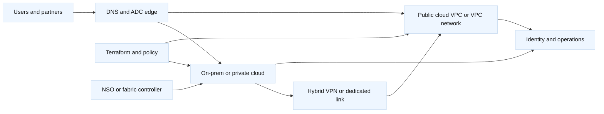

# 1. Private, Public, Hybrid, and On-Premises Models

## A. Definitions and boundaries

**On-premises** means infrastructure operated in facilities controlled by the
organization or a colocation provider: routers, switches, firewalls, ADCs,
hypervisors, storage, and application nodes. **Private cloud** adds a
self-service, pooled, API-driven operating model over infrastructure dedicated
to one organization. **Public cloud** uses provider-operated facilities and
managed services exposed through tenant APIs. **Hybrid cloud** connects two or
more of these environments so that identity, applications, data, and traffic
cross a deliberate boundary.

These labels describe ownership and operating model, not a guarantee of
security or reliability. A private cloud can be poorly isolated; a public cloud
can provide strong controls; a hybrid design can multiply failure modes.

## B. Reference architecture

The most important design question is not “where is the VM?” It is “which
control plane owns each object and how does a request cross the boundary?” A
request can traverse public DNS, a private ADC, a Cisco border router, an AWS
Transit Gateway or GCP Cloud Router, a firewall, and a node. Each hop has
different evidence and failure semantics.

## C. Decision framework

| Decision | Private/on-prem emphasis | Public cloud emphasis | Hybrid risk |
| --- | --- | --- | --- |
| Control | Hardware, hypervisor, controller, maintenance | Managed API and service limits | Split ownership and stale assumptions |
| Network | VLAN/VRF, EVPN, BGP, physical capacity | VPC/VPC network, routes, SG/firewall | Overlapping CIDRs and asymmetric paths |
| Security | Perimeter, segmentation, east-west policy | IAM plus network policy | Identity and policy translation |
| Capacity | Procurement and port/buffer limits | Quotas, regional limits, usage cost | Two capacity models and bottlenecked links |
| Recovery | Spare hardware and config restore | Multi-zone/region and service recovery | Dependency and failback complexity |
| IaC | Terraform, NSO, NDFC, device APIs | Terraform provider and managed services | Multiple state stores and owners |

## D. SDE2 and Staff framing

An SDE2 answer traces a packet and names the mechanism: DNS result, route,
firewall/security group, load-balancer listener, node, and return route. A Staff
answer adds business constraints, failure domains, migration sequencing,
ownership, cost, compliance, operational load, and measurable gates.

Avoid “cloud is more scalable” as an unsupported conclusion. State which
resource scales, the quota or bottleneck, the cost model, and what happens when
the dependency is unavailable.

## E. Networking review checklist

For every private, public, or hybrid design, answer these questions in order:

1. What name does the client resolve, and which DNS cache or TTL applies?
2. Which VIP, forwarding rule, or node address receives the first packet?
3. Which VLAN, subnet, VRF, route table, or VPC network contains each hop?
4. Where are BGP, static, dynamic, or longest-prefix decisions made?
5. Which firewall, security group, NACL, ACL, WAF, or network policy evaluates it?
6. Does the ADC terminate TLS, preserve source IP, or apply SNAT?
7. What is the reverse path, and where can asymmetric routing occur?
8. What evidence proves forwarding rather than only control-plane intent?

This keeps deployment-model discussions grounded in networking. A private
cloud and public VPC may both advertise “subnets,” but route propagation,
policy enforcement, MTU, health-check source, and failure evidence can differ.

## F. Exercise: choose a deployment model

Design a payment API, an internal batch system, and a latency-sensitive gaming
service. For each, choose private, public, or hybrid and document data gravity,
latency, compliance, peak capacity, operational skills, identity, and recovery.

**Expected answer:** there is no universal winner. A payment system may keep a
regulated data boundary private while using public-cloud burst capacity; batch
may favor public cloud elasticity; gaming may use regional public edge services
with private systems for control data. The answer is strong only when it names
the coupling and an exit or failback strategy.
