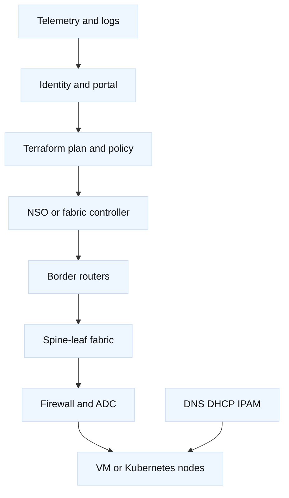

# 2. Private Cloud and On-Premises Setups

## A. Layered setup

A representative private platform has redundant border routers, spine-leaf
switches, firewalls, A10 or F5 ADCs, hypervisors, storage, Kubernetes or VM
nodes, DNS/DHCP/IPAM, and an automation layer. Cisco IOS-XE may provide WAN or
VRF routing; NX-OS may provide EVPN/VXLAN; NSO or NDFC may own intent; Terraform
may own platform inputs and external dependencies.



## B. Setup and ownership contract

| Layer | Example owner | Read-back |
| --- | --- | --- |
| IPAM/DNS | DDI team | reservation, A/AAAA, lease, TTL |
| Fabric | NDFC/network team | EVPN, VLAN/VNI, MTU, endpoint |
| Service | NSO or ADC team | service diff, VIP, pool, monitor |
| Compute | platform team | node state, listener, resource pressure |
| IaC | platform/IaC team | plan, state, drift, policy result |

Never let Terraform and NSO both own the same rendered VRF, interface, or
route policy. A private cloud has more visible hardware, but visibility does
not remove the need for a control-plane boundary.

## C. Common challenges

1. **Capacity lead time:** links, optics, ADC licenses, power, and hardware
   arrive slower than demand. Model N+1 capacity and maintenance headroom.
2. **Failure domains:** a shared chassis, power feed, route reflector, IPAM
   system, or controller can defeat apparent redundancy.
3. **Configuration drift:** break-glass CLI, controller changes, and Terraform
   state can diverge. Establish reconciliation and audit policy.
4. **Specialist burden:** the team owns upgrades, spares, firmware, certificates,
   backups, and 24x7 response.
5. **East-west blast radius:** a tenant or node policy mistake can affect a
   large fabric. Use VRFs, quotas, ACLs, and staged rollout.

## D. Networking-specific failure patterns

| Symptom | First networking hypotheses | Falsifying evidence |
| --- | --- | --- |
| VIP accepts TCP but HTTP fails | TLS profile, pool, monitor, node route | Direct node probe and ADC counters |
| Same subnet cannot communicate | VLAN/VNI mapping, SVI, ARP/ND, ACL | Correct MAC/ARP and permitted counters |
| Remote site reaches one direction | VRF leak, BGP export, NAT, return route | RIB/FIB and packet evidence both ways |
| Large payloads fail | VXLAN/VPN overhead, PMTUD, interface MTU | Size sweep and drop counters |
| Controller says success, traffic fails | Reconciliation lag or wrong owner | Effective device config and probe |

Do not stop at the management network. A private platform can have a healthy
controller and broken data plane, or a healthy data plane and unavailable API.
Keep those failure domains separate in an incident discussion.

## E. On-premises lab

Use containerized Linux routers or simulators where possible, two virtual
spines, two leaves, a virtual router, an A10/F5 lab image or fixture, and two
nodes. Allocate documentation prefixes. Practice creating a tenant, adding a
VIP, draining a member, and recovering a route-policy mistake.

```bash
# Observation shapes; adapt to your image and authorized lab.
ip route
ss -ltnp
tcpdump -ni any host 198.51.100.20
curl --fail --silent --show-error https://vip.example.invalid/healthz
```

## F. Interview Q&A

### E.1 Why can redundant hardware still be a single failure domain?

Because shared power, chassis supervisors, route reflectors, controllers,
management networks, or IPAM can fail together. Ask what actually fails
independently and test a maintenance event, not only a device reboot.

### E.2 When is private cloud a poor choice?

When demand is highly variable, procurement is slow, the team cannot operate
the platform reliably, or the workload benefits from a managed global service.
A strong answer includes a hybrid or public fallback and the measurable cost
and reliability assumptions.
