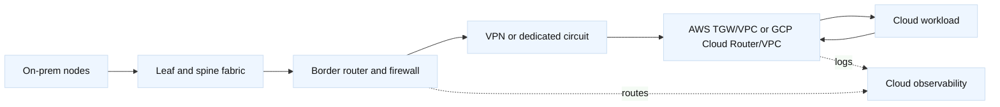

# 4. Hybrid Cloud Connectivity

## A. Reference path

## B. Connectivity choices

| Choice | Strength | Challenge |
| --- | --- | --- |
| Site-to-Site VPN | Fast to provision, encrypted | Internet variability, MTU, tunnel limits |
| AWS Direct Connect | Predictable private path | Provider lead time and redundant design |
| GCP Interconnect | High bandwidth and predictable path | VLAN attachments, regions, operational coordination |
| Transit Gateway/Cloud Router | Central routing and policy | Propagation, quotas, route leaks, ownership |
| ADC-to-cloud | Central traffic policy | SNAT, asymmetric return, capacity, TLS semantics |

Use two independent paths when the SLO justifies it. “Two tunnels” are not
independent if they share one router, circuit, provider, or power domain.

## C. Routing and security contract

Write down prefixes, ASNs, BGP timers, import/export policy, maximum-prefix
limits, default-route ownership, NAT, MTU, DNS resolution direction, and the
return path. Specify whether the cloud workload initiates connections and what
source address the on-prem service sees. In AWS verify TGW/VPN propagation and
security groups; in GCP verify Cloud Router advertisements, dynamic routes,
firewall rules, and HA VPN tunnel state.

## D. Networking lab: trace one flow end to end

Choose a source node in the private cloud and a destination node in AWS or GCP.
Record source/destination IP and port, DNS answer, ingress interface, VRF,
next-hop at each router, BGP-learned prefix, firewall decision, NAT mapping,
cloud route, and return route. Repeat with the source reversed. Then change one
variable—an exported prefix, ACL term, MTU, or SNAT policy—and predict the
first observable difference before testing.

**Staff extension:** define how this evidence is collected without broad
packet-capture access, how long flow logs are retained, and which team owns a
failure at the cloud/network boundary.

## E. Terraform and NSO boundary

Terraform can own the cloud attachment and pass a stable contract containing
peer addresses, ASN, attachment ID, and prefixes. NSO can own the on-prem
service and device configuration. A Cisco router provider, NDFC, or direct
NETCONF must not concurrently manage objects rendered by NSO. Store no device
secret in cloud state or outputs; use short-lived identity and secret-manager
references.

## F. Failure workflow

1. Confirm the intended source and destination prefixes.
2. Check cloud route table/dynamic route and firewall/security policy.
3. Check BGP session, accepted/advertised routes, RIB, and FIB in the correct VRF.
4. Check VPN/Interconnect counters, MTU, NAT, and ADC behavior.
5. Check node listener, host firewall, and application logs.
6. Probe both directions and compare flow logs with device counters.

A route existing in a table is not proof of forwarding. A BGP Established
session is not proof of prefix acceptance. A Terraform success is not proof of
data-plane convergence.

## G. Design exercise: active/active versus active/standby

Choose an architecture for a 99.99% internal API spanning one private site,
AWS, and GCP. Compare active/active and active/standby for routing, DNS, state,
ADC persistence, capacity, cost, failover detection, and failback.

**Answer standard:** address stateful sessions, DNS TTL and cache behavior,
route convergence, asymmetric paths, health semantics, and how a partial cloud
failure is distinguished from an application failure. State what is sacrificed
to keep the design understandable and operable.
