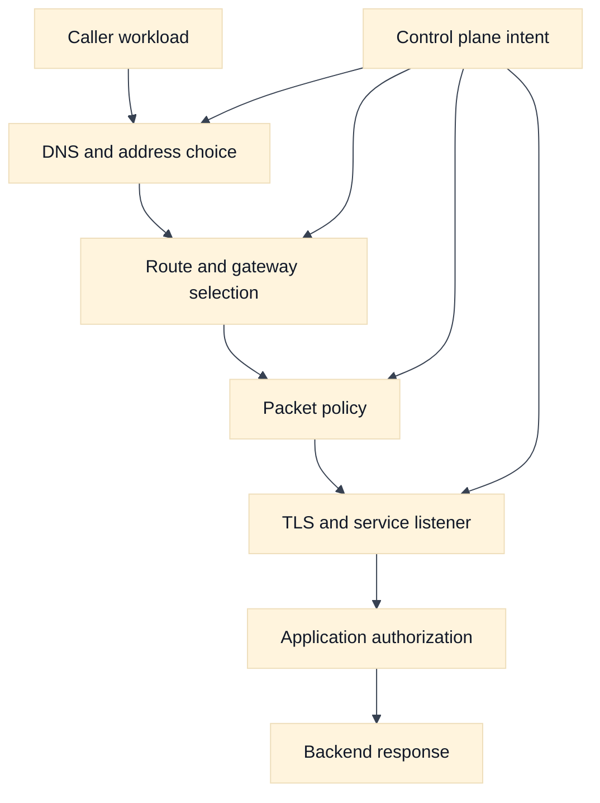
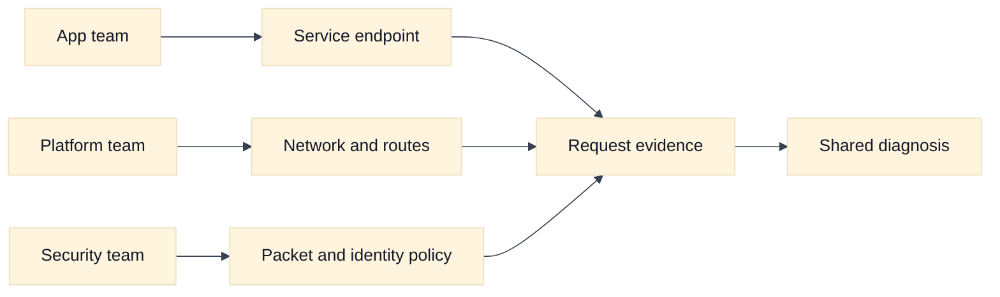

# Cloud Networking Foundations for SDE2 and Staff Interviews

## A. Learning objectives

- Separate the data plane, control plane, identity plane, and limit/cost plane in a cloud request.
- Explain why reachability, authorization, name resolution, and application health are different claims.
- Draw a request path with explicit ownership at every boundary.
- Compare AWS and Google Cloud vocabulary without assuming similarly named services behave identically.
- Build an evidence-first answer when a request is reported as “the network is down.”

## B. Prerequisites

Review the packet journey and TCP material in [the repository foundations chapter](../book/01-tcp-ip-and-packet-journeys.md), plus addressing and route selection in [the addressing chapter](../book/02-addressing-subnetting-routing.md). You should be comfortable with IP addresses, ports, DNS, TLS, a default route, and the distinction between a listener and a backend. This module adds cloud ownership and control-plane reasoning; it is not a replacement for those mechanisms.

## C. The interview mental model

A cloud network is not one object. It is a set of overlapping systems that make different promises. The data plane forwards packets and applies packet policy. The control plane stores intent and reconciles it into routes, interfaces, load balancers, endpoint attachments, and firewall rules. The identity plane decides who may call a cloud API or a protected service. The limit and cost plane determines whether the requested shape can be created sustainably.

The first useful interview move is to state the claim under test. “The service is unreachable” could mean that DNS returned no address, a route is absent, a firewall rejected a packet, a TLS handshake failed, a listener has no healthy target, an IAM decision rejected an API call, or the service is healthy but too slow. Those failures may share a symptom while requiring different evidence.

Use a five-question path for every design:

1. **Where is the caller and callee?** Name account or project, region, zone, network, subnet, workload, and endpoint without treating those names as proof of connectivity.
2. **What address is selected?** Resolve the name from the caller’s resolver context and record whether the answer is public, private, virtual, or translated.
3. **How does the packet travel?** Trace the route in both directions, including a gateway, proxy, NAT, peering link, or load balancer.
4. **Which policies apply?** List packet filters, service authorization, TLS identity, and workload identity separately.
5. **What evidence would falsify the hypothesis?** A flow record, route lookup, listener log, DNS answer, or application trace should change your mind when it contradicts the theory.

Cloud resources also have owners. A platform team may own the network and DNS zone, an application team may own a service endpoint, and a security team may own an organization-level policy. Staff-level answers name that ownership, the change boundary, and the rollback signal. “The cloud provider handles it” is not an architecture explanation because provider-managed control planes still expose configuration, limits, and failure domains.

## D. AWS and GCP comparison

**Vendor terminology:** AWS commonly organizes resources beneath accounts and Regions, with Availability Zones and VPCs providing familiar network boundaries. Google Cloud organizes resources through organizations, folders, projects, regions, and zones; a VPC network is commonly described as a global resource with regional subnets. These are vocabulary mappings, not interchangeable failure models.

| Question | AWS example | Google Cloud example | Interview caution |
| --- | --- | --- | --- |
| Administrative boundary | Account, Region, VPC | Project, region, VPC network | State who owns the boundary before choosing topology. |
| Workload placement | Subnet associated with an AZ | Regional subnet used by zonal resources | Availability and route scope need explicit verification. |
| Packet policy | Security group, network ACL, route table | VPC firewall rules, hierarchical firewall policy, routes | Similar names conceal different attachment and state behavior. |
| Private service access | Interface endpoint or endpoint service | Private Service Connect endpoint or service attachment | Service publishing is not the same as network peering. |
| Workload authorization | IAM role, IRSA, EKS Pod Identity | Service account and Workload Identity Federation for GKE | Network allowance never proves API authorization. |

**Fact:** Provider documentation is the source of truth for the selected Region, release, endpoint type, and service mode. **Inference:** The most portable interview answer starts from packet and ownership mechanics, then maps only the required provider features. For current terminology, consult [AWS VPC concepts](https://docs.aws.amazon.com/vpc/latest/userguide/what-is-amazon-vpc.html) and [Google Cloud VPC documentation](https://cloud.google.com/vpc/docs/vpc).

## E. Worked scenario: “DNS works but the request fails”

Assume fictional service `orders.internal.example` is called by `checkout-a` in a private subnet. The resolver returns `10.20.8.14`, the client connects to TCP 443, and the application reports a timeout. The candidate should avoid jumping to “firewall.” First, record the layers:

- Name resolution succeeded, so the selected resolver returned an address; it does not prove route or policy.
- A route lookup must show a next hop for `10.20.8.14/32` or its containing prefix.
- A flow record or packet capture should distinguish no SYN reply from an explicit rejection or a completed handshake.
- If TCP succeeds but TLS fails, inspect certificate name, trust chain, and SNI before changing network policy.
- If TLS succeeds, compare load-balancer target health and application trace IDs.

Suppose the path has a 2 ms client-to-proxy hop, a 3 ms proxy-to-service hop, and a 50 ms service budget. A 100 ms client timeout cannot be “fixed” by adding a route if the service is spending 80 ms on authorization and 30 ms on retries. A useful calculation is `2 + 3 + 80 + 30 = 115 ms`, which exceeds the timeout. The networking answer is therefore to prove transport first, then hand the latency evidence to the service owner.

## F. Diagram: layered request model

## G. Diagram: ownership and evidence

## H. Failure, evidence, and falsifiers

| Hypothesis | Evidence to collect | Falsifier |
| --- | --- | --- |
| DNS is wrong | Resolver query and answer from caller context | Correct private address and expected TTL |
| Route is missing | Route lookup and return route | Both directions select valid next hops |
| Policy blocks traffic | Flow record, rule evaluation, listener log | SYN, handshake, or accepted request is observed |
| TLS is broken | Client handshake and certificate/SNI evidence | Valid handshake and server request log |
| Service is overloaded | Latency, queue, health, and saturation signals | Healthy backend with low latency during failure |
| Control plane drift exists | Desired-versus-observed configuration | Reconciled state matches reviewed intent |

## I. Exercises

### I.1 Timed whiteboard: six planes

Take 12 minutes. Draw a caller, a private service, DNS, a route, one policy boundary, TLS termination, and an application authorization check. Mark the owner of each object and write one observation that would prove each step. Follow-up: a Staff interviewer removes the flow logs and asks how you rank the remaining evidence. Explain which uncertainty you would communicate and what low-risk observation you would request next.

### I.2 Evidence-led debugging: one symptom, three causes

Take 20 minutes. A deployment says `orders.internal.example` timed out for 7 minutes. You receive one successful DNS answer, a load-balancer health report, and a client timeout metric. Build three competing hypotheses, request evidence in cost-to-value order, and state a stopping rule. Follow-up: propose a rollout guard that detects a broken private DNS association before shifting traffic, while avoiding production commands or broad permissions.

## J. Interview questions and direct answers

### J.1 SDE2: Why is “ping fails” weak cloud-network evidence?

**Answer:** ICMP may be filtered, unsupported, or unrelated to the service protocol. Test the actual name, address, port, TLS behavior, and application request, then correlate each result with route, policy, and service logs. A failed ping proves only that one ICMP path was not observed.

### J.2 SDE2: What is the difference between reachability and authorization?

**Answer:** Reachability means packets can reach a listener and return. Authorization means that the listener or cloud API accepts the caller’s identity and requested action. A request can be reachable but denied by IAM, mTLS, an application policy, or a service-level tenant check.

### J.3 SDE2: How do you debug a timeout without changing configuration?

**Answer:** Freeze the hypothesis, collect the caller’s DNS answer, route decision, flow evidence, handshake result, load-balancer state, and service trace. Compare a known-good caller and time window. This narrows the first absent or rejected step without turning an uncertain incident into a configuration experiment.

### J.4 SDE2: Why trace the return path?

**Answer:** Forward reachability is not enough. A route, NAT mapping, policy, or asymmetric gateway can allow the request toward the service while the response takes a different or blocked path. TCP completion and flow records from both sides help detect that asymmetry.

### J.5 Staff: How would you make cloud-network diagnosis repeatable across teams?

**Answer:** Define a shared request-path contract: every incident records caller, callee, resolved address, forward and reverse route, policy checkpoints, identity, time window, and evidence owner. Standardize dashboards and escalation boundaries, but keep provider-specific commands behind adapters. Measure time to first falsifiable hypothesis and recurrence rate.

### J.6 Staff: What belongs in a design review besides the happy-path diagram?

**Answer:** Ownership, failure domains, control-plane dependencies, limits, cost, observability, rollback, identity, and data handling belong beside the request path. Ask how a zone, route controller, DNS association, endpoint, or credential issuer fails. Require a falsifier for each major assumption and a safe migration path.

### J.7 Staff: When is a managed cloud abstraction the wrong choice?

**Answer:** It is wrong when its hidden scope, cost, policy, observability, or failure semantics conflict with the service requirement. I would compare the abstraction with a simpler portable mechanism, quantify operational burden, and verify provider limits. “Managed” reduces implementation work; it does not remove architecture risk.

### J.8 SDE2: How should an answer handle uncertain provider behavior?

**Answer:** Label the statement as an inference, state the condition that could change it, and name the official documentation or safe test that would verify it. Avoid inventing quotas or claiming two similarly named features are equivalent. Explicit uncertainty is stronger than a confident unsupported detail.

## K. References and evidence labels

- **Fact:** [AWS VPC concepts](https://docs.aws.amazon.com/vpc/latest/userguide/what-is-amazon-vpc.html) and [Google Cloud VPC overview](https://cloud.google.com/vpc/docs/vpc).
- **Vendor terminology:** [AWS Regions and Availability Zones](https://docs.aws.amazon.com/global-infrastructure/latest/regions/aws-regions.html) and [Google Cloud locations](https://cloud.google.com/compute/docs/regions-zones).
- **Inference:** The five-plane model and evidence ordering are engineering tools derived from the repository’s [observability chapter](../book/12-observability-and-troubleshooting.md) and [cloud primitives topic](../book/topics/37-cloud-networking-primitives.md).
- [DNS operations](../book/06-dns-resolution-and-operations.md), [security foundations](../book/17-network-security-waf-zero-trust.md), and [interview whiteboard drills](../docs/interview-whiteboard-drills.md) provide deeper portable material.

