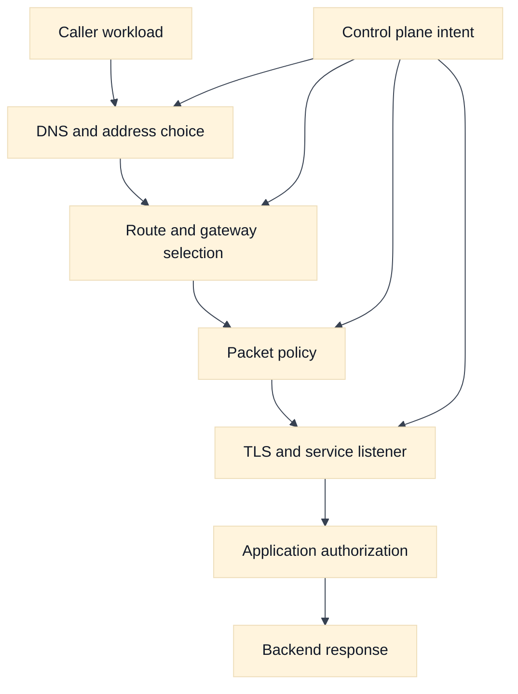
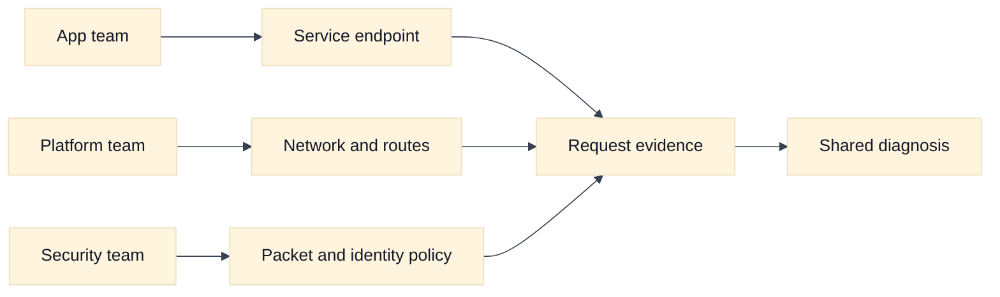

# Cloud Networking Foundations for SDE2 and Staff Interviews

## A. Learning objectives

- Separate the data plane, control plane, identity plane, and limit/cost plane in a cloud request.
- Explain why reachability, authorization, name resolution, and application health are different claims.
- Draw a request path with explicit ownership at every boundary.
- Compare AWS and Google Cloud vocabulary without assuming similarly named services behave identically.
- Build an evidence-first answer when a request is reported as “the network is down.”

## B. Prerequisites

Review the packet journey and TCP material in [the repository foundations chapter](../book/01-tcp-ip-and-packet-journeys.md), plus addressing and route selection in [the addressing chapter](../book/02-addressing-subnetting-routing.md). You should be comfortable with IP addresses, ports, DNS, TLS, a default route, and the distinction between a listener and a backend. This module adds cloud ownership and control-plane reasoning; it is not a replacement for those mechanisms.

## C. The interview mental model

A cloud network is not one object. It is a set of overlapping systems that make different promises. The data plane forwards packets and applies packet policy. The control plane stores intent and reconciles it into routes, interfaces, load balancers, endpoint attachments, and firewall rules. The identity plane decides who may call a cloud API or a protected service. The limit and cost plane determines whether the requested shape can be created sustainably.

The first useful interview move is to state the claim under test. “The service is unreachable” could mean that DNS returned no address, a route is absent, a firewall rejected a packet, a TLS handshake failed, a listener has no healthy target, an IAM decision rejected an API call, or the service is healthy but too slow. Those failures may share a symptom while requiring different evidence.

Use a five-question path for every design:

1. **Where is the caller and callee?** Name account or project, region, zone, network, subnet, workload, and endpoint without treating those names as proof of connectivity.
2. **What address is selected?** Resolve the name from the caller’s resolver context and record whether the answer is public, private, virtual, or translated.
3. **How does the packet travel?** Trace the route in both directions, including a gateway, proxy, NAT, peering link, or load balancer.
4. **Which policies apply?** List packet filters, service authorization, TLS identity, and workload identity separately.
5. **What evidence would falsify the hypothesis?** A flow record, route lookup, listener log, DNS answer, or application trace should change your mind when it contradicts the theory.

Cloud resources also have owners. A platform team may own the network and DNS zone, an application team may own a service endpoint, and a security team may own an organization-level policy. Staff-level answers name that ownership, the change boundary, and the rollback signal. “The cloud provider handles it” is not an architecture explanation because provider-managed control planes still expose configuration, limits, and failure domains.

## D. AWS and GCP comparison

**Vendor terminology:** AWS commonly organizes resources beneath accounts and Regions, with Availability Zones and VPCs providing familiar network boundaries. Google Cloud organizes resources through organizations, folders, projects, regions, and zones; a VPC network is commonly described as a global resource with regional subnets. These are vocabulary mappings, not interchangeable failure models.

| Question | AWS example | Google Cloud example | Interview caution |
| --- | --- | --- | --- |
| Administrative boundary | Account, Region, VPC | Project, region, VPC network | State who owns the boundary before choosing topology. |
| Workload placement | Subnet associated with an AZ | Regional subnet used by zonal resources | Availability and route scope need explicit verification. |
| Packet policy | Security group, network ACL, route table | VPC firewall rules, hierarchical firewall policy, routes | Similar names conceal different attachment and state behavior. |
| Private service access | Interface endpoint or endpoint service | Private Service Connect endpoint or service attachment | Service publishing is not the same as network peering. |
| Workload authorization | IAM role, IRSA, EKS Pod Identity | Service account and Workload Identity Federation for GKE | Network allowance never proves API authorization. |

**Fact:** Provider documentation is the source of truth for the selected Region, release, endpoint type, and service mode. **Inference:** The most portable interview answer starts from packet and ownership mechanics, then maps only the required provider features. For current terminology, consult [AWS VPC concepts](https://docs.aws.amazon.com/vpc/latest/userguide/what-is-amazon-vpc.html) and [Google Cloud VPC documentation](https://cloud.google.com/vpc/docs/vpc).

## E. Worked scenario: “DNS works but the request fails”

Assume fictional service `orders.internal.example` is called by `checkout-a` in a private subnet. The resolver returns `10.20.8.14`, the client connects to TCP 443, and the application reports a timeout. The candidate should avoid jumping to “firewall.” First, record the layers:

- Name resolution succeeded, so the selected resolver returned an address; it does not prove route or policy.
- A route lookup must show a next hop for `10.20.8.14/32` or its containing prefix.
- A flow record or packet capture should distinguish no SYN reply from an explicit rejection or a completed handshake.
- If TCP succeeds but TLS fails, inspect certificate name, trust chain, and SNI before changing network policy.
- If TLS succeeds, compare load-balancer target health and application trace IDs.

Suppose the path has a 2 ms client-to-proxy hop, a 3 ms proxy-to-service hop, and a 50 ms service budget. A 100 ms client timeout cannot be “fixed” by adding a route if the service is spending 80 ms on authorization and 30 ms on retries. A useful calculation is `2 + 3 + 80 + 30 = 115 ms`, which exceeds the timeout. The networking answer is therefore to prove transport first, then hand the latency evidence to the service owner.

## F. Diagram: layered request model



## G. Diagram: ownership and evidence



## H. Failure, evidence, and falsifiers

| Hypothesis | Evidence to collect | Falsifier |
| --- | --- | --- |
| DNS is wrong | Resolver query and answer from caller context | Correct private address and expected TTL |
| Route is missing | Route lookup and return route | Both directions select valid next hops |
| Policy blocks traffic | Flow record, rule evaluation, listener log | SYN, handshake, or accepted request is observed |
| TLS is broken | Client handshake and certificate/SNI evidence | Valid handshake and server request log |
| Service is overloaded | Latency, queue, health, and saturation signals | Healthy backend with low latency during failure |
| Control plane drift exists | Desired-versus-observed configuration | Reconciled state matches reviewed intent |

## I. Exercises

### I.1 Timed whiteboard: six planes

Take 12 minutes. Draw a caller, a private service, DNS, a route, one policy boundary, TLS termination, and an application authorization check. Mark the owner of each object and write one observation that would prove each step. Follow-up: a Staff interviewer removes the flow logs and asks how you rank the remaining evidence. Explain which uncertainty you would communicate and what low-risk observation you would request next.

### I.2 Evidence-led debugging: one symptom, three causes

Take 20 minutes. A deployment says `orders.internal.example` timed out for 7 minutes. You receive one successful DNS answer, a load-balancer health report, and a client timeout metric. Build three competing hypotheses, request evidence in cost-to-value order, and state a stopping rule. Follow-up: propose a rollout guard that detects a broken private DNS association before shifting traffic, while avoiding production commands or broad permissions.

## J. Interview questions and direct answers

### J.1 Why is “ping fails” weak cloud-network evidence?

**Answer:** ICMP may be filtered, unsupported, or unrelated to the service protocol. Test the actual name, address, port, TLS behavior, and application request, then correlate each result with route, policy, and service logs. A failed ping proves only that one ICMP path was not observed.

### J.2 What is the difference between reachability and authorization?

**Answer:** Reachability means packets can reach a listener and return. Authorization means that the listener or cloud API accepts the caller’s identity and requested action. A request can be reachable but denied by IAM, mTLS, an application policy, or a service-level tenant check.

### J.3 How do you debug a timeout without changing configuration?

**Answer:** Freeze the hypothesis, collect the caller’s DNS answer, route decision, flow evidence, handshake result, load-balancer state, and service trace. Compare a known-good caller and time window. This narrows the first absent or rejected step without turning an uncertain incident into a configuration experiment.

### J.4 Why trace the return path?

**Answer:** Forward reachability is not enough. A route, NAT mapping, policy, or asymmetric gateway can allow the request toward the service while the response takes a different or blocked path. TCP completion and flow records from both sides help detect that asymmetry.

### J.5 How would you make cloud-network diagnosis repeatable across teams?

**Answer:** Define a shared request-path contract: every incident records caller, callee, resolved address, forward and reverse route, policy checkpoints, identity, time window, and evidence owner. Standardize dashboards and escalation boundaries, but keep provider-specific commands behind adapters. Measure time to first falsifiable hypothesis and recurrence rate.

### J.6 What belongs in a design review besides the happy-path diagram?

**Answer:** Ownership, failure domains, control-plane dependencies, limits, cost, observability, rollback, identity, and data handling belong beside the request path. Ask how a zone, route controller, DNS association, endpoint, or credential issuer fails. Require a falsifier for each major assumption and a safe migration path.

### J.7 When is a managed cloud abstraction the wrong choice?

**Answer:** It is wrong when its hidden scope, cost, policy, observability, or failure semantics conflict with the service requirement. I would compare the abstraction with a simpler portable mechanism, quantify operational burden, and verify provider limits. “Managed” reduces implementation work; it does not remove architecture risk.

### J.8 How should an answer handle uncertain provider behavior?

**Answer:** Label the statement as an inference, state the condition that could change it, and name the official documentation or safe test that would verify it. Avoid inventing quotas or claiming two similarly named features are equivalent. Explicit uncertainty is stronger than a confident unsupported detail.

## K. Advanced design walk-through: from tuple to decision

### K.1 Packet and request tuple walk-through

Start with an explicit request rather than a vague statement such as “the service is down.” Assume workload `checkout-a` resolves `payments.example.test` to `10.20.8.14`, opens TCP from `10.20.4.27:49152` to `10.20.8.14:443`, negotiates TLS with SNI `payments.example.test`, and sends request ID `r-1842`. The packet tuple is source address, source port, destination address, destination port, and protocol. The request tuple adds the name, SNI, method, path, identity, and correlation ID. Each transformation must be named:

1. The resolver returns an address and TTL; this is a naming observation, not proof of reachability.
2. The workload route chooses the next hop for `10.20.8.14`; longest-prefix or provider-specific route priority is the forwarding observation.
3. A policy evaluates the five-tuple and possibly workload identity. If a proxy or NAT intervenes, record the tuple before and after that boundary.
4. TCP state proves transport progress only after SYN, SYN-ACK, and ACK evidence. TLS then proves a certificate and protocol contract, not application authorization.
5. The service observes a source that may be the workload, a proxy, or a translated address. Match its access log to `r-1842`, then follow the response tuple back to the caller.

This walk-through prevents a common SDE2 error: treating one successful `curl` as evidence that every layer is healthy. A Staff answer states which layer owns each observation and what would falsify it.

### K.2 Assumptions to calculation

Assume 240 checkout workers each create at most 18 new connections per second during a five-second burst, and each connection occupies translation state for 90 seconds. The peak mapping population is `240 x 18 x 90 = 388,800` mappings if connections are not reused. If the design has four independent egress addresses, the average mapping pressure is about 97,200 per address before provider-specific per-destination or port limits. This is an estimate, not a provider quota. The conclusion is to measure connection reuse, destination concentration, allocation behavior, and the selected AWS or GCP limits before choosing more addresses or a proxy.

State the assumptions that make the estimate useful: burst rate is per worker, all workers can burst together, connection lifetime is representative, and translation is the bottleneck. Then name a falsifier: a flow record showing only 20,000 concurrent mappings during the incident weakens the exhaustion hypothesis, while new failures concentrated on one destination strengthen a per-destination hypothesis.

### K.3 Provider non-equivalence and verification boundary

The portable model has data, control, identity, observability, and cost/limit planes. AWS and GCP expose different scopes and ownership for those planes. For example, AWS account, Region, VPC, subnet, route-table association, and security-group concepts do not map one-for-one to GCP project, region, VPC network, regional subnet, route, and firewall concepts. A GCP VPC route being global in scope does not mean every AWS route-table association behaves globally, and a similarly named managed service does not establish matching source preservation or logging.

Label provider claims as **Fact** or **Vendor terminology** and verify the exact service, region, account/project, release, and feature mode. Label a cross-provider architecture conclusion as **Inference**. A good answer says, “I expect this path to work given the documented scope, then I would verify the effective route, policy, and endpoint state in the selected environment.”

### K.4 Evidence, blast radius, and rollback

Interpret evidence by proximity to the disputed layer. A DNS answer falsifies only a name-resolution hypothesis; it does not falsify a missing route. A flow log showing no record may mean the flow never reached that logging boundary, not that the packet was denied. A server log with `r-1842` falsifies the claim that the request never arrived, but not the claim that its response was lost. Prefer independent observations from caller, enforcement point, and service.

For a route or policy change, describe blast radius before the change: affected prefixes, tenants, zones, regions, shared gateways, and control-plane dependencies. Use a canary boundary, capture effective state, and define rollback as restoration of the last-known-good intent plus verification of convergence. Rollback itself may not undo established connections, cached DNS answers, or issued credentials, so the recovery plan must address those residual states.

### K.5 Follow-up interview questions and substantive answers

**Follow-up 1: The packet reaches the backend, but the client times out. What do you ask next?**

**Answer:** I ask whether the backend emitted a response, which source and destination tuple it used, and whether the response crossed the same stateful boundary. I correlate server, proxy, NAT, and client evidence by timestamp and request ID. If the backend response exists but no client ACK appears, I prioritize return routing, translation state, MTU, or policy evidence over changing the listener.

**Follow-up 2: How do you make the five-plane model useful at Staff level?**

**Answer:** Turn it into review fields and ownership: every design names the data path, controller, identity issuer, telemetry, limit, cost owner, failure boundary, and rollback signal. The model is useful only when it changes decisions, exposes missing owners, and produces a falsifiable test for each important assumption.

**Follow-up 3: When is a fast rollback unsafe?**

**Answer:** It is unsafe when the change altered data routing, authorization, DNS, or stateful translation and the prior state no longer matches active clients or replicated data. I would pause, fence unsafe writers if required, preserve evidence, and choose a staged compensating action. Speed matters, but restoring an inconsistent state can enlarge the incident.

## M. AWS setup and use

This lab creates only a VPC, one subnet, and one security group so that a learner can inspect the five planes without launching an instance. The commands follow the [AWS VPC CLI workflow](https://docs.aws.amazon.com/vpc/latest/userguide/create-vpc.html). **Cost and state warning:** creation changes the selected account and Region. Use a sandbox account, least-privilege permissions, fictional tags, and a change ticket. Do not paste credentials into the shell; use an AWS CLI profile or an approved federated session.

### M.1 Prerequisites and placeholders

The operator needs AWS CLI credentials with permission to create, tag, describe, and delete VPCs, subnets, route tables, and security groups. A real workload would also require instance or load-balancer permissions, but this learning flow intentionally does not create one. Replace every placeholder before running a command.

```bash
export AWS_PROFILE=AWS_PROFILE
export AWS_REGION=AWS_REGION
export VPC_CIDR=10.240.0.0/16
export SUBNET_CIDR=10.240.1.0/24
export AVAILABILITY_ZONE=AWS_AVAILABILITY_ZONE
export VPC_NAME=interview-foundations-vpc

aws sts get-caller-identity --profile "$AWS_PROFILE"
aws ec2 describe-availability-zones \
  --profile "$AWS_PROFILE" --region "$AWS_REGION" \
  --filters Name=state,Values=available \
  --query 'AvailabilityZones[].ZoneName' --output text
```

The identity result is evidence of *who* can mutate state; it is not evidence that a packet can reach a service. Confirm that `AWS_REGION` and `AVAILABILITY_ZONE` belong together before creating resources.

### M.2 Create and use the smallest path

```bash
VPC_ID=$(aws ec2 create-vpc \
  --profile "$AWS_PROFILE" --region "$AWS_REGION" \
  --cidr-block "$VPC_CIDR" \
  --tag-specifications "ResourceType=vpc,Tags=[{Key=Name,Value=$VPC_NAME}]" \
  --query 'Vpc.VpcId' --output text)

SUBNET_ID=$(aws ec2 create-subnet \
  --profile "$AWS_PROFILE" --region "$AWS_REGION" \
  --vpc-id "$VPC_ID" --cidr-block "$SUBNET_CIDR" \
  --availability-zone "$AVAILABILITY_ZONE" \
  --tag-specifications 'ResourceType=subnet,Tags=[{Key=Name,Value=interview-foundations-subnet}]' \
  --query 'Subnet.SubnetId' --output text)

SG_ID=$(aws ec2 create-security-group \
  --profile "$AWS_PROFILE" --region "$AWS_REGION" \
  --group-name interview-foundations-sg \
  --description 'Educational foundations example; no public ingress' \
  --vpc-id "$VPC_ID" \
  --tag-specifications 'ResourceType=security-group,Tags=[{Key=Name,Value=interview-foundations-sg}]' \
  --query 'GroupId' --output text)
```

The VPC and subnet are the address and placement objects. The security group is a policy object, but it does not attach to the subnet and does not make a workload reachable by itself. To use the path, a separately approved test workload would attach `SG_ID` to an interface; this guide does not launch that workload. That distinction is the interview lesson: resource creation is control-plane intent, while an observed connection is data-plane evidence.

### M.3 Verify effective state and clean up

```bash
aws ec2 describe-vpcs --profile "$AWS_PROFILE" --region "$AWS_REGION" \
  --vpc-ids "$VPC_ID" \
  --query 'Vpcs[0].{VpcId:VpcId,Cidr:CidrBlock,State:State,Tags:Tags}'

aws ec2 describe-subnets --profile "$AWS_PROFILE" --region "$AWS_REGION" \
  --subnet-ids "$SUBNET_ID" \
  --query 'Subnets[0].{SubnetId:SubnetId,VpcId:VpcId,Az:AvailabilityZone,Cidr:CidrBlock,Available:AvailableIpAddressCount}'

aws ec2 describe-route-tables --profile "$AWS_PROFILE" --region "$AWS_REGION" \
  --filters "Name=vpc-id,Values=$VPC_ID"

aws ec2 describe-security-groups --profile "$AWS_PROFILE" --region "$AWS_REGION" \
  --group-ids "$SG_ID"
```

Expected evidence is a `pending` or `available` control-plane state that converges to the requested CIDR, a subnet associated with the expected VPC and AZ, a route table with the VPC-local route, and a security group with no unintended ingress. Delete in dependency order only after confirming that no test interface uses the objects:

```bash
aws ec2 delete-security-group --profile "$AWS_PROFILE" --region "$AWS_REGION" --group-id "$SG_ID"
aws ec2 delete-subnet --profile "$AWS_PROFILE" --region "$AWS_REGION" --subnet-id "$SUBNET_ID"
aws ec2 delete-vpc --profile "$AWS_PROFILE" --region "$AWS_REGION" --vpc-id "$VPC_ID"
```

If deletion reports a dependency, stop and inspect rather than broadening permissions or deleting an unknown resource. Rollback of this lab is deletion; rollback of a real service also requires restoring DNS, routes, policy, and application state.

### M.4 AWS troubleshooting follow-up

**Question:** `describe-vpcs` shows the expected VPC, but an approved test instance cannot reach a private service. What do you check next?

**Answer:** I record the instance ENI and security groups, resolve the service name from the instance, inspect the subnet’s route-table association and the route for the destination, then check the return route and flow evidence. I separate AWS API authorization from packet authorization: `sts get-caller-identity` proves the operator identity, not the instance’s IAM role or service access. I would not add `0.0.0.0/0` as a diagnostic shortcut.

## L. References and evidence labels

- **Fact:** [AWS VPC concepts](https://docs.aws.amazon.com/vpc/latest/userguide/what-is-amazon-vpc.html) and [Google Cloud VPC overview](https://cloud.google.com/vpc/docs/vpc).
- **Vendor terminology:** [AWS Regions and Availability Zones](https://docs.aws.amazon.com/global-infrastructure/latest/regions/aws-regions.html) and [Google Cloud locations](https://cloud.google.com/compute/docs/regions-zones).
- **Inference:** The five-plane model and evidence ordering are engineering tools derived from the repository’s [observability chapter](../book/12-observability-and-troubleshooting.md) and [cloud primitives topic](../book/topics/37-cloud-networking-primitives.md).
- [DNS operations](../book/06-dns-resolution-and-operations.md), [security foundations](../book/17-network-security-waf-zero-trust.md), and [interview whiteboard drills](../docs/interview-whiteboard-drills.md) provide deeper portable material.
- **Provider setup:** [AWS create a VPC using the CLI](https://docs.aws.amazon.com/vpc/latest/userguide/create-vpc.html) and [AWS route tables](https://docs.aws.amazon.com/vpc/latest/userguide/subnet-route-tables.html).

## N. GCP setup and use

This equivalent lab uses a custom-mode Google Cloud VPC and one regional subnet. Google Cloud VPC networks are global resources while subnets are regional; the [VPC overview](https://cloud.google.com/vpc/docs/vpc) and [subnet documentation](https://cloud.google.com/vpc/docs/subnets) define the provider terms. **Cost and state warning:** these commands mutate `PROJECT_ID`; a VPC and firewall rule may be free, but later workloads, external addresses, logs, and NAT can incur charges. Use a disposable project or an approved sandbox.

### N.1 Prerequisites and placeholders

Install and authenticate the Google Cloud CLI through the organization’s approved method. The caller needs permission to create, describe, and delete networks, subnets, and firewall rules. `PROJECT_ID` is a project identifier, not a display name. Replace placeholders and confirm the active project before creation.

```bash
export PROJECT_ID=PROJECT_ID
export REGION=REGION
export ZONE=ZONE
export NETWORK_NAME=interview-foundations-vpc
export SUBNET_NAME=interview-foundations-subnet
export SUBNET_CIDR=10.241.1.0/24

gcloud auth list
gcloud config set project "$PROJECT_ID"
gcloud config get-value project
gcloud compute regions describe "$REGION" --format='value(name)'
```

### N.2 Create and use the smallest path

```bash
gcloud compute networks create "$NETWORK_NAME" --subnet-mode=custom \
  --project="$PROJECT_ID" \
  --description='Educational foundations example; no public workload'

gcloud compute networks subnets create "$SUBNET_NAME" \
  --project="$PROJECT_ID" --region="$REGION" \
  --network="$NETWORK_NAME" --range="$SUBNET_CIDR" \
  --enable-private-ip-google-access

gcloud compute firewall-rules create interview-foundations-allow-internal \
  --project="$PROJECT_ID" --network="$NETWORK_NAME" \
  --direction=INGRESS --priority=1000 --action=ALLOW \
  --rules=tcp:443 --source-ranges="$SUBNET_CIDR" \
  --description='Educational rule; applies only to this fictional subnet range'
```

The custom VPC and regional subnet establish placement and local routing. The firewall rule is a network policy object; without a target VM or other supported endpoint, it has no traffic to allow. For a safe use exercise, create or use only an approved ephemeral test endpoint and target it with a network tag or service account rather than permitting broad sources.

### N.3 Verify effective state and clean up

```bash
gcloud compute networks describe "$NETWORK_NAME" --project="$PROJECT_ID" \
  --format='yaml(name,autoCreateSubnetworks,routingConfig)'

gcloud compute networks subnets describe "$SUBNET_NAME" \
  --project="$PROJECT_ID" --region="$REGION" \
  --format='yaml(name,network,region,ipCidrRange,privateIpGoogleAccess,secondaryIpRanges)'

gcloud compute routes list --project="$PROJECT_ID" \
  --filter="network:$NETWORK_NAME" --format='table(name,destRange,nextHopGateway,nextHopInstance,priority)'

gcloud compute firewall-rules describe interview-foundations-allow-internal \
  --project="$PROJECT_ID"
```

Expected evidence is the named custom network, a subnet in the intended region, the default local route plus any expected system routes, and a firewall rule whose direction, priority, source range, protocol, and target scope are understood. Remove the rule, subnet, and network only after confirming no endpoint depends on them:

```bash
gcloud compute firewall-rules delete interview-foundations-allow-internal --project="$PROJECT_ID"
gcloud compute networks subnets delete "$SUBNET_NAME" --project="$PROJECT_ID" --region="$REGION"
gcloud compute networks delete "$NETWORK_NAME" --project="$PROJECT_ID"
```

### N.4 GCP troubleshooting follow-up

**Question:** The firewall rule exists, but a test VM still cannot connect. What provider-specific evidence do you request?

**Answer:** I check the VM’s actual network, subnet, region, network tags or service account target, effective routes, and both ingress and egress firewall evaluation. I use a bounded [Connectivity Test](https://cloud.google.com/network-intelligence-center/docs/connectivity-tests/concepts/overview) for the exact source, destination, port, and project. A rule listed by name is not proof that it matched the endpoint; target scope and higher-priority or hierarchical policy can change the effective decision.
