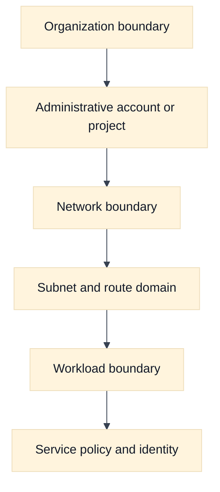
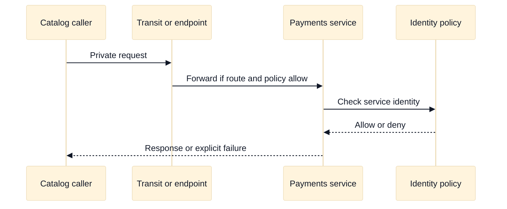

# Virtual Network Boundaries and Cloud Network Design

## A. Learning objectives

- Distinguish administrative, routing, security, and failure boundaries.
- Choose between one network, segmented networks, shared networking, peering, and transit using explicit criteria.
- Explain why isolation is a property to verify, not a label to assume.
- Compare AWS VPC and Google Cloud VPC boundary semantics.
- Present a Staff-level ownership and blast-radius argument.

## B. Prerequisites

Read [Cloud Networking Foundations](01-cloud-network-foundations.md), especially the five-plane request model. Review [cloud networking primitives](../book/topics/37-cloud-networking-primitives.md) and the repository’s [security chapter](../book/17-network-security-waf-zero-trust.md). You should know CIDR notation, route selection, security policy, and basic account or project organization.

## C. Boundary thinking

A “network boundary” can mean several different things. An administrative boundary controls who can create or change resources. A routing boundary controls which prefixes can be learned or forwarded. A security boundary controls which flows are permitted. A failure boundary limits the effect of a broken route, exhausted address pool, bad policy, or provider incident. A cost boundary determines who pays for shared gateways and cross-boundary traffic.

These boundaries often do not line up. Two networks may be administratively separate but connected by a permissive transit path. Two teams may share a VPC yet be isolated by routing and policy. Two Regions may be logically separate but share a global control-plane dependency. A strong interview answer names the desired boundary first and selects mechanisms afterward.

Use a boundary scorecard:

| Decision | Question |
| --- | --- |
| Trust | Which workloads may communicate, and who approves that relationship? |
| Blast radius | What happens if a route or firewall rule is wrong? |
| Ownership | Which team operates addresses, DNS, policy, and incident response? |
| Change rate | Do all consumers tolerate the same rollout cadence? |
| Failure | Can one provider or control-plane event affect every tenant? |
| Cost | Is shared connectivity cheaper and still attributable? |

Avoid “one VPC per team” as an automatic answer. It may reduce accidental reachability while increasing duplicated gateways, inconsistent policy, address fragmentation, and difficult service discovery. Conversely, one flat network can make ownership and incident blast radius opaque. The best design is the smallest boundary set that satisfies trust, availability, compliance, and operational needs.

## D. AWS and GCP comparison

**Vendor terminology:** AWS VPCs are regional constructs associated with accounts and Regions; subnets are placed in Availability Zones and use associated route tables. Google Cloud VPC networks are commonly presented as global resources with regional subnets, while organization and project policy can impose broader constraints.

| Design question | AWS example | Google Cloud example | Non-equivalence to state |
| --- | --- | --- | --- |
| Main network object | VPC | VPC network | Similar label, different scope and operational model. |
| Organizational sharing | AWS RAM and shared VPC patterns | Shared VPC host and service projects | Permission and ownership paths require provider verification. |
| Segmentation | Accounts, VPCs, subnets, route tables, security groups | Projects, VPCs, subnets, firewall policies, routes | Segmentation is not guaranteed by a resource name. |
| Inter-network connection | Peering or Transit Gateway | VPC Network Peering or Network Connectivity Center patterns | Check transitivity, route exchange, and overlapping CIDR rules. |
| Policy scope | Security groups, NACLs, endpoint policies, organization policies | VPC and hierarchical firewall policies, IAM, organization policies | Attachment and stateful behavior differ. |

**Fact:** AWS documents VPCs and subnets through account and Region concepts, while [Google Cloud documents VPC networks as global resources](https://cloud.google.com/vpc/docs/vpc). **Inference:** A portable design should compare scope, propagation, transitivity, and ownership rather than map “VPC” to “VPC” by name. For shared ownership, verify [AWS sharing guidance](https://docs.aws.amazon.com/vpc/latest/userguide/vpc-sharing.html) and [Google Cloud Shared VPC](https://cloud.google.com/vpc/docs/shared-vpc).

## E. Worked scenario: three teams, two trust levels

Assume fictional company Northstar has `payments`, `catalog`, and `analytics` teams. Payments handles sensitive data; catalog provides a read-only API; analytics needs batch access to curated data but must not reach payment databases. The design has two security tiers and one shared platform tier.

Use separate administrative ownership for payments, but do not infer that account separation alone provides isolation. Publish a narrow catalog service through a private service mechanism or an explicit transit policy. Permit analytics to reach a data-export endpoint, not the payment subnet. Reserve a management path with audited identity and no general east-west access.

Suppose the platform team estimates 40 services, each needing 3 routes and 2 policy objects. A flat model creates about `40 x (3 + 2) = 200` independently reviewed relationships. Grouping by service tier reduces repeated relationships: 4 shared route domains and 12 service contracts create a smaller review surface. The number is illustrative, not a provider quota. The design is superior only if the grouping still preserves tenant isolation and useful evidence.

## F. Diagram: boundary hierarchy

## G. Diagram: cross-boundary request

## H. Failure, evidence, and falsifiers

| Failure hypothesis | Evidence | Falsifier |
| --- | --- | --- |
| Network is accidentally flat | Route inventory and reachability graph | No route exists and a policy denies the attempted edge |
| Shared service is over-privileged | Consumer/provider policy and identity logs | Provider accepts only the intended caller and action |
| Peering gives transitive reachability | Route propagation and path tests | A third network has no learned route |
| Boundary has an ownership gap | Change logs and escalation map | Every object has an accountable operator |
| Segmentation caused address fragmentation | IP allocation and growth forecast | Reserved ranges support stated growth and migration |
| Global policy changed local traffic | Policy version and evaluation evidence | Local policy remained unchanged during the event |

## I. Exercises

### I.1 Timed whiteboard: shared platform with sensitive tenants

Take 18 minutes. Draw a platform network for two application teams, a shared observability service, a private API, and a sensitive database. Mark administrative, routing, security, and failure boundaries. State which relationships are direct, which use a published service, and which are forbidden. Follow-up: an interviewer asks whether a new team should receive a whole network. Explain the criteria and migration cost instead of answering from habit.

### I.2 Evidence-led rollout: boundary change

Take 25 minutes. A team wants to connect a legacy network to a shared cloud network. Produce a pre-change evidence set: CIDR inventory, route graph, policy matrix, DNS dependencies, owners, and rollback condition. Define a canary that proves intended reachability without granting broad access. Follow-up: the canary passes for one zone but fails for another; identify whether this is a route, placement, policy, or control-plane scope issue.

## J. Interview questions and direct answers

### J.1 SDE2: What is the difference between a subnet and a security boundary?

**Answer:** A subnet is primarily an address and placement domain with route associations. It may participate in a security design, but its name does not establish authorization. Security comes from evaluated policy, identity, and service behavior, all of which must be tested at the required direction and protocol.

### J.2 SDE2: When would you choose peering over transit?

**Answer:** I would choose peering for a small, explicit, low-change relationship where route scope and ownership are easy to audit. Transit is more useful when many networks need centralized control, route policy, or shared inspection. I would verify transitivity, limits, cost, and failure behavior before committing.

### J.3 SDE2: Does separate account or project mean isolated?

**Answer:** No. It can provide administrative separation, but shared services, identity permissions, peering, transit, DNS, and organization policy may still create paths. Isolation is a claim supported by route, policy, identity, and evidence checks, not by the resource hierarchy alone.

### J.4 SDE2: What belongs in a network boundary review?

**Answer:** Trust relationships, route propagation, packet enforcement, DNS visibility, service identity, ownership, quotas, cost, logging, and rollback belong in the review. I would show the allowed edges and the forbidden edges, then name the evidence that detects drift.

### J.5 Staff: How do you prevent a shared network from becoming an unowned platform?

**Answer:** Establish a product owner, service-level objectives, change review, policy-as-code ownership, chargeback, escalation paths, and tenant contracts. Define which objects are centrally managed and which are delegated. Measure drift, unauthorized reachability, incident time, and cost allocation; revisit the boundary when those signals degrade.

### J.6 Staff: What makes a boundary a failure boundary?

**Answer:** A failure boundary limits the set of workloads affected by a bad change or dependency failure. I would test route and policy blast radius, control-plane coupling, shared gateway capacity, DNS dependencies, and recovery sequencing. If one change can affect every tenant, the design has a shared failure domain regardless of labels.

### J.7 Staff: How would you migrate from a flat network safely?

**Answer:** Inventory flows and ownership, reserve non-overlapping address space, classify dependencies, introduce explicit service contracts, observe denied and allowed traffic, canary one tenant, and retain rollback until evidence is stable. I would not start by deleting routes because unknown dependencies are a predictable source of outage.

### J.8 SDE2: How do you explain a provider mapping in an interview?

**Answer:** State the portable mechanism first, then say, “In AWS this may be represented by X; in GCP it may be represented by Y; I would verify scope and behavior for the selected service.” That demonstrates useful provider fluency without pretending product names imply identical semantics.

## K. References and evidence labels

- **Fact:** [AWS VPC sharing](https://docs.aws.amazon.com/vpc/latest/userguide/vpc-sharing.html) and [Google Cloud Shared VPC](https://cloud.google.com/vpc/docs/shared-vpc).
- **Vendor terminology:** [AWS Transit Gateway](https://docs.aws.amazon.com/vpc/latest/tgw/what-is-transit-gateway.html) and [Google Cloud Network Connectivity Center](https://cloud.google.com/network-connectivity/docs/network-connectivity-center/overview).
- **Inference:** The boundary scorecard and blast-radius method extend the repository’s [zero-trust chapter](../book/17-network-security-waf-zero-trust.md) and [Staff design review pack](../docs/staff-design-review-pack.md).
- [Routing and addressing](../book/02-addressing-subnetting-routing.md) and [firewall concepts](../book/topics/19-firewalls-security-groups-nacls.md) supply the portable mechanisms used here.
