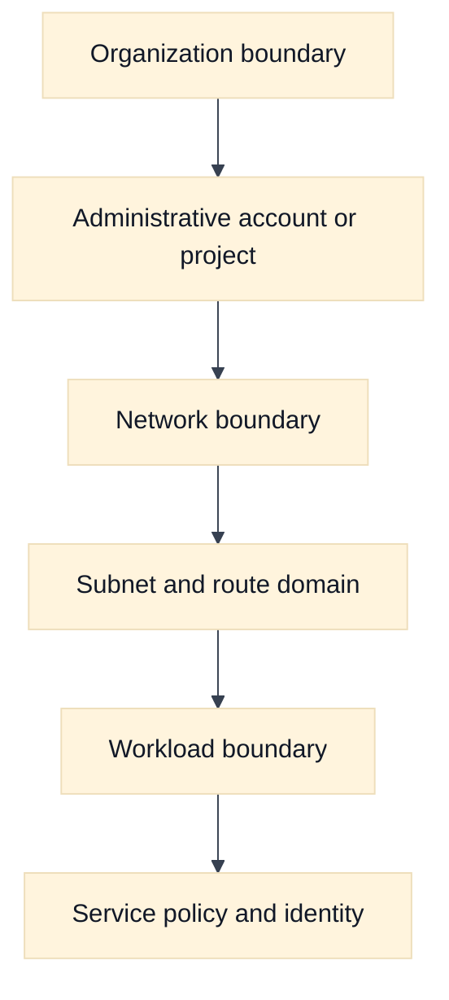
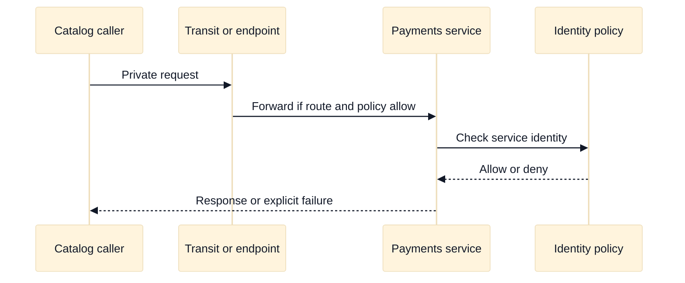

# Virtual Network Boundaries and Cloud Network Design

## A. Learning objectives

- Distinguish administrative, routing, security, and failure boundaries.
- Choose between one network, segmented networks, shared networking, peering, and transit using explicit criteria.
- Explain why isolation is a property to verify, not a label to assume.
- Compare AWS VPC and Google Cloud VPC boundary semantics.
- Present a Staff-level ownership and blast-radius argument.

## B. Prerequisites

Read [Cloud Networking Foundations](01-cloud-network-foundations.md), especially the five-plane request model. Review [cloud networking primitives](../book/topics/37-cloud-networking-primitives.md) and the repository’s [security chapter](../book/17-network-security-waf-zero-trust.md). You should know CIDR notation, route selection, security policy, and basic account or project organization.

## C. Boundary thinking

A “network boundary” can mean several different things. An administrative boundary controls who can create or change resources. A routing boundary controls which prefixes can be learned or forwarded. A security boundary controls which flows are permitted. A failure boundary limits the effect of a broken route, exhausted address pool, bad policy, or provider incident. A cost boundary determines who pays for shared gateways and cross-boundary traffic.

These boundaries often do not line up. Two networks may be administratively separate but connected by a permissive transit path. Two teams may share a VPC yet be isolated by routing and policy. Two Regions may be logically separate but share a global control-plane dependency. A strong interview answer names the desired boundary first and selects mechanisms afterward.

Use a boundary scorecard:

| Decision | Question |
| --- | --- |
| Trust | Which workloads may communicate, and who approves that relationship? |
| Blast radius | What happens if a route or firewall rule is wrong? |
| Ownership | Which team operates addresses, DNS, policy, and incident response? |
| Change rate | Do all consumers tolerate the same rollout cadence? |
| Failure | Can one provider or control-plane event affect every tenant? |
| Cost | Is shared connectivity cheaper and still attributable? |

Avoid “one VPC per team” as an automatic answer. It may reduce accidental reachability while increasing duplicated gateways, inconsistent policy, address fragmentation, and difficult service discovery. Conversely, one flat network can make ownership and incident blast radius opaque. The best design is the smallest boundary set that satisfies trust, availability, compliance, and operational needs.

## D. AWS and GCP comparison

**Vendor terminology:** AWS VPCs are regional constructs associated with accounts and Regions; subnets are placed in Availability Zones and use associated route tables. Google Cloud VPC networks are commonly presented as global resources with regional subnets, while organization and project policy can impose broader constraints.

| Design question | AWS example | Google Cloud example | Non-equivalence to state |
| --- | --- | --- | --- |
| Main network object | VPC | VPC network | Similar label, different scope and operational model. |
| Organizational sharing | AWS RAM and shared VPC patterns | Shared VPC host and service projects | Permission and ownership paths require provider verification. |
| Segmentation | Accounts, VPCs, subnets, route tables, security groups | Projects, VPCs, subnets, firewall policies, routes | Segmentation is not guaranteed by a resource name. |
| Inter-network connection | Peering or Transit Gateway | VPC Network Peering or Network Connectivity Center patterns | Check transitivity, route exchange, and overlapping CIDR rules. |
| Policy scope | Security groups, NACLs, endpoint policies, organization policies | VPC and hierarchical firewall policies, IAM, organization policies | Attachment and stateful behavior differ. |

**Fact:** AWS documents VPCs and subnets through account and Region concepts, while [Google Cloud documents VPC networks as global resources](https://cloud.google.com/vpc/docs/vpc). **Inference:** A portable design should compare scope, propagation, transitivity, and ownership rather than map “VPC” to “VPC” by name. For shared ownership, verify [AWS sharing guidance](https://docs.aws.amazon.com/vpc/latest/userguide/vpc-sharing.html) and [Google Cloud Shared VPC](https://cloud.google.com/vpc/docs/shared-vpc).

## E. Worked scenario: three teams, two trust levels

Assume fictional company Northstar has `payments`, `catalog`, and `analytics` teams. Payments handles sensitive data; catalog provides a read-only API; analytics needs batch access to curated data but must not reach payment databases. The design has two security tiers and one shared platform tier.

Use separate administrative ownership for payments, but do not infer that account separation alone provides isolation. Publish a narrow catalog service through a private service mechanism or an explicit transit policy. Permit analytics to reach a data-export endpoint, not the payment subnet. Reserve a management path with audited identity and no general east-west access.

Suppose the platform team estimates 40 services, each needing 3 routes and 2 policy objects. A flat model creates about `40 x (3 + 2) = 200` independently reviewed relationships. Grouping by service tier reduces repeated relationships: 4 shared route domains and 12 service contracts create a smaller review surface. The number is illustrative, not a provider quota. The design is superior only if the grouping still preserves tenant isolation and useful evidence.

## F. Diagram: boundary hierarchy



## G. Diagram: cross-boundary request



## H. Failure, evidence, and falsifiers

| Failure hypothesis | Evidence | Falsifier |
| --- | --- | --- |
| Network is accidentally flat | Route inventory and reachability graph | No route exists and a policy denies the attempted edge |
| Shared service is over-privileged | Consumer/provider policy and identity logs | Provider accepts only the intended caller and action |
| Peering gives transitive reachability | Route propagation and path tests | A third network has no learned route |
| Boundary has an ownership gap | Change logs and escalation map | Every object has an accountable operator |
| Segmentation caused address fragmentation | IP allocation and growth forecast | Reserved ranges support stated growth and migration |
| Global policy changed local traffic | Policy version and evaluation evidence | Local policy remained unchanged during the event |

## I. Exercises

### I.1 Timed whiteboard: shared platform with sensitive tenants

Take 18 minutes. Draw a platform network for two application teams, a shared observability service, a private API, and a sensitive database. Mark administrative, routing, security, and failure boundaries. State which relationships are direct, which use a published service, and which are forbidden. Follow-up: an interviewer asks whether a new team should receive a whole network. Explain the criteria and migration cost instead of answering from habit.

### I.2 Evidence-led rollout: boundary change

Take 25 minutes. A team wants to connect a legacy network to a shared cloud network. Produce a pre-change evidence set: CIDR inventory, route graph, policy matrix, DNS dependencies, owners, and rollback condition. Define a canary that proves intended reachability without granting broad access. Follow-up: the canary passes for one zone but fails for another; identify whether this is a route, placement, policy, or control-plane scope issue.

## J. Interview questions and direct answers

### J.1 What is the difference between a subnet and a security boundary?

**Answer:** A subnet is primarily an address and placement domain with route associations. It may participate in a security design, but its name does not establish authorization. Security comes from evaluated policy, identity, and service behavior, all of which must be tested at the required direction and protocol.

### J.2 When would you choose peering over transit?

**Answer:** I would choose peering for a small, explicit, low-change relationship where route scope and ownership are easy to audit. Transit is more useful when many networks need centralized control, route policy, or shared inspection. I would verify transitivity, limits, cost, and failure behavior before committing.

### J.3 Does separate account or project mean isolated?

**Answer:** No. It can provide administrative separation, but shared services, identity permissions, peering, transit, DNS, and organization policy may still create paths. Isolation is a claim supported by route, policy, identity, and evidence checks, not by the resource hierarchy alone.

### J.4 What belongs in a network boundary review?

**Answer:** Trust relationships, route propagation, packet enforcement, DNS visibility, service identity, ownership, quotas, cost, logging, and rollback belong in the review. I would show the allowed edges and the forbidden edges, then name the evidence that detects drift.

### J.5 How do you prevent a shared network from becoming an unowned platform?

**Answer:** Establish a product owner, service-level objectives, change review, policy-as-code ownership, chargeback, escalation paths, and tenant contracts. Define which objects are centrally managed and which are delegated. Measure drift, unauthorized reachability, incident time, and cost allocation; revisit the boundary when those signals degrade.

### J.6 What makes a boundary a failure boundary?

**Answer:** A failure boundary limits the set of workloads affected by a bad change or dependency failure. I would test route and policy blast radius, control-plane coupling, shared gateway capacity, DNS dependencies, and recovery sequencing. If one change can affect every tenant, the design has a shared failure domain regardless of labels.

### J.7 How would you migrate from a flat network safely?

**Answer:** Inventory flows and ownership, reserve non-overlapping address space, classify dependencies, introduce explicit service contracts, observe denied and allowed traffic, canary one tenant, and retain rollback until evidence is stable. I would not start by deleting routes because unknown dependencies are a predictable source of outage.

### J.8 How do you explain a provider mapping in an interview?

**Answer:** State the portable mechanism first, then say, “In AWS this may be represented by X; in GCP it may be represented by Y; I would verify scope and behavior for the selected service.” That demonstrates useful provider fluency without pretending product names imply identical semantics.

## K. Advanced boundary review: isolation as a testable claim

### K.1 Packet and request tuple walk-through

Assume tenant A calls a shared policy service in a platform network. The client sends `(10.40.12.19:53001 -> 10.70.4.18:443, TCP)` for `POST /evaluate`, with tenant identity `tenant-a` and request ID `b-442`. Walk the tuple through each boundary: the source subnet route, the inter-network attachment, any inspection hop, the service listener, and the reverse path. Then walk the request identity separately. A transit path may preserve a source address while a proxy changes it; a shared endpoint may make many consumers appear as one provider-facing source. Neither address alone proves tenant authorization.

Ask which edges are intentionally reachable and which are merely possible because of a broad route. If tenant B can select the same destination and policy path, the boundary is not expressed at the needed identity or network layer. The answer should include a negative test: show that an unapproved tuple is rejected at the first intended enforcement point and that the rejection is observable.

### K.2 Assumptions to calculation

Suppose three tenant groups each need 600 Mbps peak to a shared service, but the design promises to survive loss of one of two inspection zones. The surviving-zone requirement is `(3 x 600) / 1 = 1,800 Mbps`, before a stated headroom factor. With 30% headroom, the target is 2,340 Mbps, not 780 Mbps per zone. If each zone has two 1-Gbps inspection paths, the design fails the stated loss scenario even though normal traffic fits. This calculation is an engineering estimate; verify actual throughput, connection, rule, and failover limits for the selected AWS or GCP service.

The important Staff-level move is to connect capacity to boundary choice. A single shared choke point may be cheaper and easier to govern, but its blast radius includes every tenant. Independent paths reduce correlated failure while increasing policy duplication, cost, and drift risk.

### K.3 Provider non-equivalence and verification boundary

AWS VPC sharing, accounts, subnets, route-table associations, security groups, and Transit Gateway attachments express ownership differently from GCP Shared VPC host/service projects, global VPC networks, routes, hierarchical firewall policies, and Network Connectivity Center patterns. “Separate account” and “separate project” are administrative facts, not isolation proofs. AWS subnet-to-route-table association behavior should not be assumed from GCP’s global VPC route model; likewise, a GCP firewall target selector is not an AWS security-group attachment.

Use **Fact** for documented provider behavior, **Vendor terminology** for product names, and **Inference** for the design conclusion that a boundary reduces blast radius. Verify effective routes, inherited policy, target selection, transitivity, quotas, and ownership permissions in the chosen account/project and region. In an interview, explicitly say which comparison is a hypothesis until the provider documentation or a bounded test confirms it.

### K.4 Evidence, blast radius, and rollback

Evidence must distinguish administrative separation from packet isolation. A resource inventory can prove ownership metadata but cannot prove that no path exists. Route graphs identify possible reachability; effective policy and flow records show whether a particular tuple was allowed or denied. Application identity logs are needed to falsify the claim that a network-allowed tenant request was authorized.

Before changing a shared boundary, enumerate affected tenants, prefixes, DNS views, inspection capacity, service endpoints, and emergency access. Canary one low-risk consumer, snapshot effective policy and routes, and watch both allowed and denied traffic. Rollback should restore the prior graph and policy version, but preserve newly learned dependencies and avoid immediately deleting temporary routes or records. If the change exposed data, rollback of packets does not reverse reads; incident handling and access review remain necessary.

### K.5 Follow-up interview questions and substantive answers

**Follow-up 1: Would you put every team in one shared VPC to reduce complexity?**

**Answer:** Only if the trust model, ownership, route scale, noisy-neighbor risk, and failure objective support it. A shared network can simplify connectivity but centralizes route, policy, address, quota, and gateway blast radius. I would define service contracts and guardrails, then compare that model with separate network domains joined through explicitly reviewed interfaces.

**Follow-up 2: How do you prove that an environment is isolated?**

**Answer:** Define isolation as a set of forbidden edges and identities, build a route and policy graph, test representative tuples from each trust domain, and retain effective-state evidence. Include DNS, shared endpoints, management paths, and control-plane permissions. “No incident has occurred” is not evidence of isolation.

**Follow-up 3: What is the safest migration from flat to segmented networking?**

**Answer:** Inventory observed dependencies, classify intended contracts, add observability and narrow policies in report-only or staged mode, migrate one boundary at a time, and keep a bounded rollback path. I would measure unexpected denies and permitted-but-unowned flows. Deleting broad routes before discovering dependencies is fast only until the first hidden dependency fails.

## M. AWS setup and use

The following lab creates two empty VPC boundaries and inspects them; it does not launch compute or connect the networks. This makes the administrative, routing, and security boundaries visible without creating a transit dependency. Read the [AWS VPC sharing documentation](https://docs.aws.amazon.com/vpc/latest/userguide/vpc-sharing.html) and [Transit Gateway overview](https://docs.aws.amazon.com/vpc/latest/tgw/what-is-transit-gateway.html) before turning this into a shared-network design. **Cost and state warning:** VPC creation mutates the selected account. Peering, Transit Gateway, VPN, NAT, and cross-zone traffic can incur charges. Use a sandbox and explicit tags.

### M.1 Prerequisites and create two boundaries

You need an AWS profile with permission to create, tag, describe, and delete VPCs and subnets. Use non-overlapping ranges because a future peering or hybrid connection cannot safely route overlapping CIDRs without an explicit translation design.

```bash
export AWS_PROFILE=AWS_PROFILE
export AWS_REGION=AWS_REGION
export VPC_A_CIDR=10.242.0.0/16
export VPC_B_CIDR=10.243.0.0/16
export AZ_A=AWS_AVAILABILITY_ZONE_A
export AZ_B=AWS_AVAILABILITY_ZONE_B

aws sts get-caller-identity --profile "$AWS_PROFILE"
VPC_A_ID=$(aws ec2 create-vpc --profile "$AWS_PROFILE" --region "$AWS_REGION" \
  --cidr-block "$VPC_A_CIDR" \
  --tag-specifications 'ResourceType=vpc,Tags=[{Key=Name,Value=boundary-lab-a}]' \
  --query 'Vpc.VpcId' --output text)
VPC_B_ID=$(aws ec2 create-vpc --profile "$AWS_PROFILE" --region "$AWS_REGION" \
  --cidr-block "$VPC_B_CIDR" \
  --tag-specifications 'ResourceType=vpc,Tags=[{Key=Name,Value=boundary-lab-b}]' \
  --query 'Vpc.VpcId' --output text)

SUBNET_A_ID=$(aws ec2 create-subnet --profile "$AWS_PROFILE" --region "$AWS_REGION" \
  --vpc-id "$VPC_A_ID" --cidr-block 10.242.1.0/24 --availability-zone "$AZ_A" \
  --tag-specifications 'ResourceType=subnet,Tags=[{Key=Name,Value=boundary-lab-a-subnet}]' \
  --query 'Subnet.SubnetId' --output text)
SUBNET_B_ID=$(aws ec2 create-subnet --profile "$AWS_PROFILE" --region "$AWS_REGION" \
  --vpc-id "$VPC_B_ID" --cidr-block 10.243.1.0/24 --availability-zone "$AZ_B" \
  --tag-specifications 'ResourceType=subnet,Tags=[{Key=Name,Value=boundary-lab-b-subnet}]' \
  --query 'Subnet.SubnetId' --output text)
```

### M.2 Use and verify the boundary claim

```bash
aws ec2 describe-vpcs --profile "$AWS_PROFILE" --region "$AWS_REGION" \
  --vpc-ids "$VPC_A_ID" "$VPC_B_ID" \
  --query 'Vpcs[].{VpcId:VpcId,Cidr:CidrBlock,State:State,Tags:Tags}'

aws ec2 describe-route-tables --profile "$AWS_PROFILE" --region "$AWS_REGION" \
  --filters "Name=vpc-id,Values=$VPC_A_ID,$VPC_B_ID" \
  --query 'RouteTables[].{Id:RouteTableId,Vpc:VpcId,Routes:Routes,Associations:Associations}'

aws ec2 describe-vpc-peering-connections --profile "$AWS_PROFILE" --region "$AWS_REGION" \
  --filters Name=status-code,Values=active,pending-acceptance
```

Expected evidence is two distinct VPC IDs, non-overlapping CIDRs, subnet associations to the intended VPCs, and no peering or transit attachment unless one was deliberately created. A VPC ID is an administrative boundary, not proof that data cannot cross it: inspect shared endpoints, IAM permissions, DNS forwarding, peering, transit, VPN, and provider-managed services. If you later add a peering route, add a narrow destination and test both directions; do not use a default route as a shortcut.

### M.3 Cleanup and rollback

```bash
aws ec2 delete-subnet --profile "$AWS_PROFILE" --region "$AWS_REGION" --subnet-id "$SUBNET_A_ID"
aws ec2 delete-subnet --profile "$AWS_PROFILE" --region "$AWS_REGION" --subnet-id "$SUBNET_B_ID"
aws ec2 delete-vpc --profile "$AWS_PROFILE" --region "$AWS_REGION" --vpc-id "$VPC_A_ID"
aws ec2 delete-vpc --profile "$AWS_PROFILE" --region "$AWS_REGION" --vpc-id "$VPC_B_ID"
```

Delete only after checking for interfaces, endpoints, route attachments, and test resources. For a real boundary migration, rollback means restoring the prior route and policy graph, not simply deleting the new VPC; preserve DNS and application ownership evidence.

### M.4 AWS troubleshooting follow-up

**Question:** Two VPCs have no visible peering, but a workload can call a service in the other environment. Is the boundary broken?

**Answer:** I would first identify the actual destination address and service type, then inspect Transit Gateway or VPN attachments, shared VPC relationships, PrivateLink endpoints, public egress, DNS forwarding, and IAM. I would compare flow evidence with the intended path. Reachability through a published service may be an approved narrow edge, while a broad route or public path may violate the boundary contract.

## L. References and evidence labels

- **Fact:** [AWS VPC sharing](https://docs.aws.amazon.com/vpc/latest/userguide/vpc-sharing.html) and [Google Cloud Shared VPC](https://cloud.google.com/vpc/docs/shared-vpc).
- **Vendor terminology:** [AWS Transit Gateway](https://docs.aws.amazon.com/vpc/latest/tgw/what-is-transit-gateway.html) and [Google Cloud Network Connectivity Center](https://cloud.google.com/network-connectivity/docs/network-connectivity-center/overview).
- **Inference:** The boundary scorecard and blast-radius method extend the repository’s [zero-trust chapter](../book/17-network-security-waf-zero-trust.md) and [Staff design review pack](../docs/staff-design-review-pack.md).
- [Routing and addressing](../book/02-addressing-subnetting-routing.md) and [firewall concepts](../book/topics/19-firewalls-security-groups-nacls.md) supply the portable mechanisms used here.
- **Provider setup:** [AWS VPC sharing](https://docs.aws.amazon.com/vpc/latest/userguide/vpc-sharing.html) and [AWS Transit Gateway route tables](https://docs.aws.amazon.com/vpc/latest/tgw/tgw-route-tables.html).

## N. GCP setup and use

This lab creates two custom-mode Google Cloud VPC networks and one subnet in each, then proves that no VPC peering exists by default. See [Google Cloud VPC networks](https://cloud.google.com/vpc/docs/vpc) and [Shared VPC](https://cloud.google.com/vpc/docs/shared-vpc). **Cost and state warning:** these commands mutate `PROJECT_ID`; later peering, VPN, Network Connectivity Center, external addresses, and traffic can incur charges. Use a disposable project and do not use production network names.

### N.1 Prerequisites and create two boundaries

The caller needs permissions to create, describe, and delete compute networks and subnets. In Google Cloud, a VPC network is global while its subnet is regional; do not infer that the region on a subnet makes the whole VPC regional.

```bash
export PROJECT_ID=PROJECT_ID
export REGION=REGION
export NETWORK_A=boundary-lab-a
export NETWORK_B=boundary-lab-b
export SUBNET_A=boundary-lab-a-subnet
export SUBNET_B=boundary-lab-b-subnet

gcloud auth list
gcloud config set project "$PROJECT_ID"
gcloud compute networks create "$NETWORK_A" --subnet-mode=custom
gcloud compute networks create "$NETWORK_B" --subnet-mode=custom
gcloud compute networks subnets create "$SUBNET_A" --project="$PROJECT_ID" \
  --region="$REGION" --network="$NETWORK_A" --range=10.244.1.0/24
gcloud compute networks subnets create "$SUBNET_B" --project="$PROJECT_ID" \
  --region="$REGION" --network="$NETWORK_B" --range=10.245.1.0/24
```

### N.2 Use and verify the boundary claim

```bash
gcloud compute networks describe "$NETWORK_A" --project="$PROJECT_ID" \
  --format='yaml(name,autoCreateSubnetworks,routingConfig)'
gcloud compute networks describe "$NETWORK_B" --project="$PROJECT_ID" \
  --format='yaml(name,autoCreateSubnetworks,routingConfig)'
gcloud compute networks subnets list --project="$PROJECT_ID" \
  --filter="region:$REGION" --format='table(name,network,ipCidrRange,region)'
gcloud compute networks peerings list --project="$PROJECT_ID" \
  --network="$NETWORK_A"
```

Expected evidence is two network names, non-overlapping subnet ranges, and an empty peering list unless a connection was intentionally configured. Also inspect firewall rules, routes, Private Service Connect attachments, shared VPC host/service-project relationships, DNS policies, and public paths before claiming isolation. To add connectivity later, use a narrow, reviewed peering or service-publication design and verify the reverse path.

### N.3 Cleanup and rollback

```bash
gcloud compute networks subnets delete "$SUBNET_A" --project="$PROJECT_ID" --region="$REGION"
gcloud compute networks subnets delete "$SUBNET_B" --project="$PROJECT_ID" --region="$REGION"
gcloud compute networks delete "$NETWORK_A" --project="$PROJECT_ID"
gcloud compute networks delete "$NETWORK_B" --project="$PROJECT_ID"
```

Before deletion, check for VM interfaces, forwarding rules, routes, firewall dependencies, and service attachments. In a real shared-network change, restore the previous effective policy and routes first, then remove temporary objects after clients and DNS caches converge.

### N.4 GCP troubleshooting follow-up

**Question:** A subnet in `NETWORK_A` can reach `NETWORK_B`, although the peering list is empty. What do you investigate?

**Answer:** I inspect the destination IP, effective routes, firewall rules, external IP or Cloud NAT path, Shared VPC relationships, Private Service Connect endpoints, VPN or Network Connectivity Center spokes, and DNS answers. I run a bounded Connectivity Test for the exact endpoints. The empty peering list only falsifies one cross-network mechanism; it does not prove that all other edges are absent.
