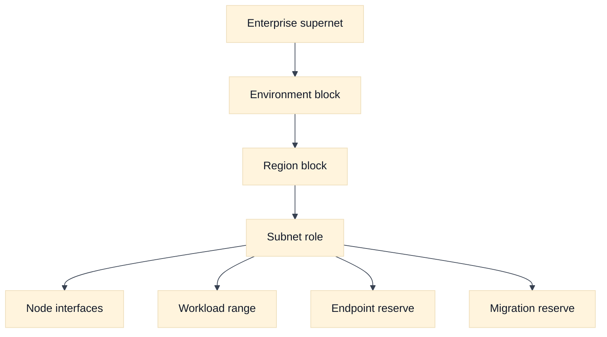
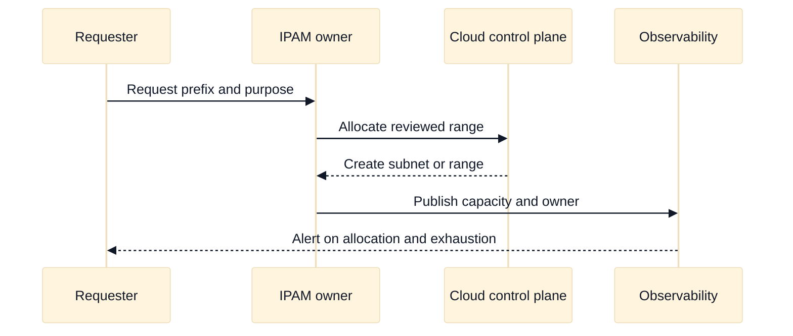

# Subnet and IP Address Planning in Cloud Networks

## A. Learning objectives

- Build a non-overlapping address plan with growth, failure, and migration reserve.
- Distinguish subnet scope from workload, pod, service, and endpoint address consumption.
- Explain IPv4 pressure, IPv6 choices, and the operational cost of fragmented space.
- Compare AWS and GCP subnet placement and managed-container range planning.
- Diagnose address exhaustion with evidence rather than by repeatedly resizing a subnet.

## B. Prerequisites

Review [addressing, subnetting, and route selection](../book/02-addressing-subnetting-routing.md), [cloud primitives](../book/topics/37-cloud-networking-primitives.md), and [the foundations module](01-cloud-network-foundations.md). You should be able to calculate a prefix size, understand usable host space at a high level, and distinguish an interface address from a service virtual IP. Provider-specific reserved-address counts and service limits are intentionally not memorized here; check current official documentation for the selected product and region.

## C. Address planning mental model

An address plan is an ownership and change-management artifact, not just a CIDR spreadsheet. Start with a hierarchy: enterprise supernet, environment, region, failure domain, subnet role, and workload range. Allocate contiguous blocks where future aggregation matters, but preserve holes for mergers, hybrid links, and services that require fixed shapes. Record who may allocate from each block and how exhaustion is reported.

Separate these consumers:

- **Node or interface ranges:** addresses attached to virtual machines, nodes, gateways, and appliances.
- **Workload ranges:** pod or task addresses when the platform gives workloads routable addresses.
- **Service ranges:** virtual IPs or cluster service addresses that may not be directly routed like an interface.
- **Endpoint ranges:** private service endpoints, load-balancer interfaces, and inspection attachments.
- **Control and migration ranges:** management, temporary overlap mediation, and blue/green deployment space.

Capacity is not only host count. A design can have free addresses but still fail because a particular zone, interface type, route table, endpoint, or control-plane operation has a limit. Track demand as a distribution. If zone A has 60 percent of workloads and a zone-loss plan moves half of that demand, the surviving zones need headroom for the moved load, not merely the normal average.

For a prefix, the rough IPv4 host calculation is `2^(32-prefix)`, after subtracting provider, network, broadcast, or platform reservations as documented for the product. Use rough math in an interview, label it as an estimate, and state that exact usable capacity is provider and feature dependent. IPv6 can reduce address scarcity, but it does not automatically solve routing policy, application compatibility, egress, logging, or identity problems.

## D. AWS and GCP comparison

**Vendor terminology:** AWS subnets are associated with Availability Zones, and route tables are associated with subnets. Google Cloud VPC networks use regional subnets and global route concepts; GKE may use primary and secondary ranges depending on the cluster networking model.

| Planning concern | AWS example | Google Cloud example | What to verify |
| --- | --- | --- | --- |
| Placement | Subnets are tied to an Availability Zone | Subnets are regional and serve zonal resources | Failure and route scope for the selected service. |
| Workload allocation | ENI and service-specific interface consumption | NICs plus GKE alias or secondary range consumption | Per-workload address behavior and limits. |
| Container ranges | VPC CNI pod addresses often consume VPC space | GKE VPC-native clusters use alias IP ranges | CNI mode, version, and expansion procedure. |
| Private endpoints | Interface endpoints and load-balancer interfaces consume addresses | Private access and PSC endpoints consume addresses according to product mode | Endpoint count, regional behavior, and source identity. |
| IPv6 | Dual-stack and egress features vary by service | Dual-stack support and subnet configuration vary by service | Current regional and product support. |

**Fact:** [AWS subnet documentation](https://docs.aws.amazon.com/vpc/latest/userguide/configure-subnets.html) and [Google Cloud subnet documentation](https://cloud.google.com/vpc/docs/subnets) describe different scope models. **Vendor terminology:** “secondary range” is a Google Cloud/GKE term, while AWS commonly discusses VPC CNI address allocation and ENIs. **Inference:** The portable question is “which object consumes an address, where can it be placed, and what happens during failure?”

## E. Worked scenario: three environments and two regions

Northstar needs development, staging, and production in two fictional regions. Each region has three failure zones. Production expects 180 nodes, up to 20 workload addresses per node, 30 private endpoints, and 25 percent growth. The team also wants 20 percent reserve for migration.

If every workload address must come from the same VPC space, the rough production workload requirement is `180 x 20 = 3,600`. Growth adds `900`, and migration reserve adds `720` if applied after growth, for `5,220` addresses before platform reservations. A `/19` has 8,192 total addresses, so it may be a candidate, but the answer must check the provider’s usable count, distribution across zones, node address density, and whether workload addresses are separate ranges. If pods use a separate range, the node subnet can be smaller while the workload range receives the growth reserve.

Do not allocate one giant block and call the problem solved. Place a per-region, per-role plan in a table, reserve non-overlapping space for on-premises and future acquisition, and test a simulated zone loss. Document an exhaustion alarm based on allocated and available addresses, not only CPU utilization.

## F. Diagram: address hierarchy



## G. Diagram: allocation lifecycle



## H. Failure, evidence, and falsifiers

| Hypothesis | Evidence | Falsifier |
| --- | --- | --- |
| Subnet is exhausted | Allocation inventory by zone and object type | Adequate free addresses in the failing scope |
| Pod range is exhausted | CNI or cluster range usage | Workload range has capacity and placement succeeds |
| Fragmentation blocks growth | IPAM free-list and contiguous-prefix request | A suitable contiguous block is available |
| Zone loss cannot be absorbed | Per-zone demand and failover simulation | Surviving zones retain required headroom |
| Overlap causes route ambiguity | Prefix inventory across connected domains | No overlapping prefixes on the attempted path |
| Resize is unsafe | Route, dependency, and migration plan | Change is supported with tested rollback |

## I. Exercises

### I.1 Timed whiteboard: address plan

Take 20 minutes. Allocate fictional RFC 1918 space for two regions, three environments, three zones, node interfaces, workload addresses, private endpoints, and a future hybrid connection. Show at least 25 percent growth and a migration reserve. Follow-up: the interviewer changes the workload model from one address per pod to several addresses per node. Recalculate the pressure and explain which assumptions are provider-dependent.

### I.2 Evidence-led rollout: exhausted range

Take 25 minutes. A cluster rollout fails only in one zone with an “address unavailable” symptom. Define the evidence order: allocation by zone, pending workload placement, CNI events, route state, control-plane quota, and recent changes. Propose a safe temporary mitigation and a durable plan. Follow-up: explain why expanding a range without checking overlap and route propagation can create a larger outage.

## J. Interview questions and direct answers

### J.1 How do you size a subnet?

**Answer:** Identify every address consumer, calculate normal and failure demand, add growth and migration reserve, partition by placement and ownership, then validate provider reservations and limits. I would show the assumptions and alarms, not present a single prefix as universally correct.

### J.2 Why can free addresses still fail allocation?

**Answer:** Capacity may be scoped by zone, interface type, quota, contiguous-prefix requirement, endpoint type, or control-plane state. Aggregate free space does not prove that the requested object can be placed in the required scope. Break usage down by consumer and placement.

### J.3 What is the difference between a service IP and an interface IP?

**Answer:** An interface IP is usually attached to a network interface and participates in forwarding. A service IP may be virtual, implemented by a load balancer or proxy, and mapped to changing backends. Its routing, source preservation, health, and logging behavior must be verified rather than inferred from the address format.

### J.4 How does overlap hurt hybrid connectivity?

**Answer:** A router cannot safely distinguish two identical destinations without policy or translation. Longest-prefix selection cannot resolve equal overlapping prefixes. Resolve overlap before connecting, use a carefully bounded translation or proxy design when unavoidable, and document the identity and return-path implications.

### J.5 How would you govern IP allocation across many teams?

**Answer:** Establish an IPAM source of truth with delegated pools, purpose and owner metadata, approval rules for connected domains, automated overlap checks, and exhaustion SLOs. Review actual allocation against declared demand. Treat address space as a platform product with migration reserve and a deprecation process.

### J.6 When would you prefer separate workload ranges?

**Answer:** Separate ranges are useful when workload density, routing, ownership, or scaling differs from node interfaces. They can reduce pressure on node subnets and make policy clearer, but add route, observability, and expansion dependencies. I would choose them only after confirming CNI behavior and failure evidence.

### J.7 Is IPv6 an answer to every address problem?

**Answer:** No. It addresses scarcity and can simplify endpoint identity, but applications, firewalls, DNS, egress, observability, dependencies, and staff expertise must support it. A dual-stack migration needs explicit coverage and rollback, not a claim that a larger address space removes operational complexity.

### J.8 What would you monitor?

**Answer:** Monitor allocated and free addresses by subnet, zone, range, and consumer; pending allocation failures; growth rate; overlap findings; route changes; and quota headroom. Alert before exhaustion and attach an owner and action to each alert so it is not merely a dashboard metric.

## K. Advanced address-plan review: capacity, placement, and recovery

### K.1 Packet and request tuple walk-through

Treat an address plan as part of the request path. Suppose a worker at `10.51.8.24` calls a service at `10.62.16.9:8443`. The tuple is not enough to answer whether the request can be placed: identify the worker interface or pod address source, the subnet or secondary range that owns it, the route scope, any endpoint or load-balancer address, and the return destination. If a Kubernetes pod address comes from a separate range, the packet may leave the node with a source that changes policy targeting and flow-log interpretation. If a private endpoint consumes an interface address, a successful DNS answer can still point at a depleted or unreachable placement scope.

For each hop, record the address owner and allocation scope. A service IP may be virtual and movable; an interface IP may be tied to a zone or node lifecycle. The interview answer should distinguish “the address is syntactically valid” from “the address is allocated, routed, authorized, observable, and recoverable.”

### K.2 Assumptions to calculation

Assume two regions, three zones per region, 180 nodes per zone, two interface addresses per node, 30% growth, and 20% reserve for migration and replacement. A simple interface estimate is `180 x 2 x 1.30 x 1.20 = 562` addresses per zone before subnet/provider reservations and other consumers. A `/23` has 512 total IPv4 addresses, so it is insufficient even before reserved addresses; the next candidate must be checked against the provider’s usable-address rules and endpoint, load-balancer, and management consumption.

For container ranges, repeat the calculation separately for node interfaces, pod addresses, and service virtual IPs. Do not add all categories blindly if one category is not allocated from the same pool. State the assumptions and then identify the falsifier: actual IPAM inventory showing only 90 nodes and one address per node would invalidate this estimate, while a placement error that names a specific exhausted zone supports it.

### K.3 Provider non-equivalence and verification boundary

AWS subnets are Availability Zone-scoped and commonly consume VPC address space through interfaces and service-specific allocations. GCP subnets are regional and serve zonal resources, while GKE VPC-native clusters use primary and secondary alias ranges. Those statements are not a promise that every service allocates addresses identically. A subnet’s apparent free count may not capture per-zone, per-interface, per-endpoint, quota, or contiguous-range constraints.

Use **Fact** for documented placement and allocation behavior, **Vendor terminology** for terms such as ENI, alias IP, primary range, and secondary range, and **Inference** for sizing recommendations. Verify the selected AWS/GCP service, CNI mode, region, version, reserved addresses, expansion support, and quota. In an interview, explain the portable arithmetic first, then state that the provider’s usable capacity and failure scope must be confirmed from current documentation.

### K.4 Evidence, blast radius, and rollback

Interpret “address exhaustion” narrowly. A failed allocation with free aggregate addresses may indicate the wrong zone, unsupported placement, a limit on a resource type, an unavailable contiguous block, or delayed control-plane release. Collect allocation inventory by scope, pending requests, object type, and timestamp. A route table showing the prefix proves forwarding intent but not that a new interface can be created inside it.

Address changes have a wide blast radius because they affect routing, firewall allowlists, DNS, certificates, partner contracts, and logs. Prefer adding a new range and migrating canaries over renumbering an active range. A rollback plan must say whether old and new addresses can coexist, how DNS TTL and connection draining are handled, and when the old range is safe to retire. Restoring the old CIDR does not restore clients that cached the new address or partners that updated allowlists.

### K.5 Follow-up interview questions and substantive answers

**Follow-up 1: The dashboard shows 40% free addresses, but deployment fails. What is your first hypothesis?**

**Answer:** The aggregate metric hides the relevant allocation scope. I would inspect the target zone or secondary range, resource type, quota, prefix shape, and pending control-plane state. I would compare a small control allocation in the same scope and use the provider error as evidence rather than immediately expanding every subnet.

**Follow-up 2: Would you use a larger CIDR to solve all future growth?**

**Answer:** Not automatically. A large range can simplify growth but may collide with on-premises, peers, acquired networks, or future regions and can make policy and route summarization harder. I would reserve non-overlapping blocks based on a growth model, publish ownership, and retain migration space while avoiding an unbounded address promise.

**Follow-up 3: How do you make a renumbering rollback safe?**

**Answer:** Run old and new paths in parallel where supported, keep stable service names, migrate by dependency or shard, validate return routes and policy, and delay deallocation until caches, connections, certificates, and partners converge. Roll back traffic selection first; remove addresses later. The rollback criterion should be observable error and dependency evidence, not elapsed time alone.

## M. AWS setup and use

This exercise creates two non-overlapping AWS subnets in one VPC and uses provider output to reason about placement and address headroom. Review [AWS subnet creation](https://docs.aws.amazon.com/vpc/latest/userguide/create-subnets.html) first. **Cost and state warning:** subnet creation is stateful even when the subnet itself has no hourly charge; attached interfaces, NAT, load balancers, and instances can incur charges. Use an existing sandbox `VPC_ID` or create a disposable VPC, and never use a production CIDR without an approved IPAM allocation.

### M.1 Prerequisites and address plan

The learner needs permission to describe VPCs and subnets and, for the optional creation flow, to create, tag, and delete subnets. The example reserves one subnet for application interfaces and one for a future private endpoint. The ranges are documentation-only and must be checked against all peered, transit, VPN, and on-premises prefixes.

```bash
export AWS_PROFILE=AWS_PROFILE
export AWS_REGION=AWS_REGION
export VPC_ID=VPC_ID
export AZ_A=AWS_AVAILABILITY_ZONE_A
export AZ_B=AWS_AVAILABILITY_ZONE_B
export APP_SUBNET_CIDR=10.246.10.0/24
export ENDPOINT_SUBNET_CIDR=10.246.20.0/24

aws sts get-caller-identity --profile "$AWS_PROFILE"
aws ec2 describe-vpcs --profile "$AWS_PROFILE" --region "$AWS_REGION" \
  --vpc-ids "$VPC_ID" --query 'Vpcs[0].{VpcId:VpcId,Cidr:CidrBlock}'
aws ec2 describe-subnets --profile "$AWS_PROFILE" --region "$AWS_REGION" \
  --filters "Name=vpc-id,Values=$VPC_ID" \
  --query 'Subnets[].{Id:SubnetId,Az:AvailabilityZone,Cidr:CidrBlock,Available:AvailableIpAddressCount}'
```

### M.2 Create and use the subnets

```bash
APP_SUBNET_ID=$(aws ec2 create-subnet \
  --profile "$AWS_PROFILE" --region "$AWS_REGION" --vpc-id "$VPC_ID" \
  --cidr-block "$APP_SUBNET_CIDR" --availability-zone "$AZ_A" \
  --tag-specifications 'ResourceType=subnet,Tags=[{Key=Name,Value=interview-app-subnet}]' \
  --query 'Subnet.SubnetId' --output text)

ENDPOINT_SUBNET_ID=$(aws ec2 create-subnet \
  --profile "$AWS_PROFILE" --region "$AWS_REGION" --vpc-id "$VPC_ID" \
  --cidr-block "$ENDPOINT_SUBNET_CIDR" --availability-zone "$AZ_B" \
  --tag-specifications 'ResourceType=subnet,Tags=[{Key=Name,Value=interview-endpoint-subnet}]' \
  --query 'Subnet.SubnetId' --output text)

aws ec2 describe-subnets --profile "$AWS_PROFILE" --region "$AWS_REGION" \
  --subnet-ids "$APP_SUBNET_ID" "$ENDPOINT_SUBNET_ID" \
  --query 'Subnets[].{Id:SubnetId,Az:AvailabilityZone,Cidr:CidrBlock,Available:AvailableIpAddressCount}'
```

The `AvailableIpAddressCount` value is a provider-reported observation for the specific subnet, not a universal formula. Use it with workload-specific interface consumption, zonal placement, and reserved growth. To use the endpoint subnet, associate it with the intended route table and endpoint only after checking that the route and security policy match the service contract; do not assume a new subnet inherits the desired custom route table.

### M.3 Cleanup and rollback

```bash
aws ec2 describe-route-tables --profile "$AWS_PROFILE" --region "$AWS_REGION" \
  --filters "Name=association.subnet-id,Values=$APP_SUBNET_ID,$ENDPOINT_SUBNET_ID"
aws ec2 delete-subnet --profile "$AWS_PROFILE" --region "$AWS_REGION" --subnet-id "$APP_SUBNET_ID"
aws ec2 delete-subnet --profile "$AWS_PROFILE" --region "$AWS_REGION" --subnet-id "$ENDPOINT_SUBNET_ID"
```

The delete commands work only when no ENI, endpoint, load balancer, or other resource remains. During a real renumbering, rollback by switching a stable name or route to the old subnet and retaining the old range until interfaces, DNS caches, certificates, and partner allowlists converge.

### M.4 AWS troubleshooting follow-up

**Question:** The subnet reports free IPs, but a new endpoint or workload cannot be placed. What is your next evidence request?

**Answer:** I check the target AZ, subnet-specific free count, prefix size, interface type, service quota, route-table association, and the exact provider error. Aggregate VPC capacity can conceal a zonal or resource-type limit. I compare a small control allocation in the same subnet and inspect pending interfaces before expanding the CIDR.

## N. GCP setup and use

Google Cloud uses regional subnets and supports secondary ranges for workloads such as VPC-native GKE. Read [Google Cloud subnet creation](https://cloud.google.com/vpc/docs/create-modify-vpc-networks) and [alias IP ranges](https://cloud.google.com/vpc/docs/alias-ip) for the exact feature mode. **Cost and state warning:** these commands mutate `PROJECT_ID`; later VMs, load balancers, NAT, and logging may incur charges. Secondary-range expansion can be difficult to reverse, so use a disposable network or an approved IPAM plan.

### N.1 Prerequisites and create a regional range

```bash
export PROJECT_ID=PROJECT_ID
export REGION=REGION
export NETWORK_NAME=NETWORK_NAME
export SUBNET_NAME=SUBNET_NAME
export SUBNET_CIDR=10.247.10.0/24
export POD_RANGE=10.248.0.0/16
export SERVICE_RANGE=10.249.0.0/20

gcloud auth list
gcloud config set project "$PROJECT_ID"
gcloud compute networks subnets describe "$SUBNET_NAME" \
  --project="$PROJECT_ID" --region="$REGION" \
  --format='yaml(name,network,region,ipCidrRange,secondaryIpRanges)'

gcloud compute networks subnets create "$SUBNET_NAME" \
  --project="$PROJECT_ID" --region="$REGION" --network="$NETWORK_NAME" \
  --range="$SUBNET_CIDR" --enable-private-ip-google-access \
  --secondary-range="pods=$POD_RANGE,services=$SERVICE_RANGE"
```

The final command is a create operation and will fail safely if the subnet already exists; inspect the error rather than choosing a different CIDR at random. Secondary ranges are distinct address pools and must not overlap any reachable network. A GKE cluster or other consumer must explicitly use the named ranges; merely creating them does not allocate pod or service addresses.

### N.2 Verify capacity and use the ranges

```bash
gcloud compute networks subnets describe "$SUBNET_NAME" \
  --project="$PROJECT_ID" --region="$REGION" \
  --format='yaml(name,ipCidrRange,secondaryIpRanges,privateIpGoogleAccess)'
gcloud compute networks subnets list --project="$PROJECT_ID" \
  --filter="network:$NETWORK_NAME" \
  --format='table(name,region,ipCidrRange,secondaryIpRanges[].rangeName)'
gcloud compute addresses list --project="$PROJECT_ID" \
  --filter="region:$REGION" --format='table(name,address,status,subnetwork)'
```

Expected evidence is the primary range, both named secondary ranges, the intended region, and no overlap in the surrounding inventory. A capacity answer should state whether pressure is in primary VM interfaces, a secondary pod range, a service range, or a quota. If a test cluster is later created, select the existing subnet and explicitly map its secondary ranges; record the cluster version and IP allocation mode.

### N.3 Cleanup and rollback

```bash
gcloud compute networks subnets describe "$SUBNET_NAME" \
  --project="$PROJECT_ID" --region="$REGION" \
  --format='yaml(name,secondaryIpRanges)'
gcloud compute networks subnets delete "$SUBNET_NAME" \
  --project="$PROJECT_ID" --region="$REGION"
```

Deletion requires all dependent interfaces and clusters to be removed, and it may destroy the address plan for every consumer. For a production change, prefer adding a new range and migrating canaries; rollback traffic to the old range before deallocating the new one.

### N.4 GCP troubleshooting follow-up

**Question:** A GKE deployment reports IP exhaustion while the primary subnet looks healthy. Which GCP-specific scopes do you inspect?

**Answer:** I inspect the subnet’s primary and secondary ranges, the cluster’s selected range names, the affected region and node placement, current allocation, and relevant project or service quotas. I verify effective state with `gcloud compute networks subnets describe` and the cluster’s network configuration. A healthy primary range does not falsify exhaustion in a secondary pod range.

## L. References and evidence labels

- **Fact:** [AWS subnets](https://docs.aws.amazon.com/vpc/latest/userguide/configure-subnets.html) and [Google Cloud subnets](https://cloud.google.com/vpc/docs/subnets).
- **Vendor terminology:** [Amazon VPC CNI](https://docs.aws.amazon.com/eks/latest/userguide/pod-networking.html) and [GKE VPC-native clusters](https://cloud.google.com/kubernetes-engine/docs/concepts/alias-ips).
- **Inference:** Capacity formulas and reserve guidance are engineering estimates; confirm exact usable addresses and quotas in the selected service documentation.
- [Portable subnetting](../book/02-addressing-subnetting-routing.md), [Kubernetes ingress](../book/15-cloud-networking-and-kubernetes-ingress.md), and [capacity/SLO engineering](../book/topics/16-capacity-performance-and-slo-engineering.md) provide related material.
- **Provider setup:** [AWS create subnets](https://docs.aws.amazon.com/vpc/latest/userguide/create-subnets.html) and [Google Cloud create or modify VPC networks](https://cloud.google.com/vpc/docs/create-modify-vpc-networks).
