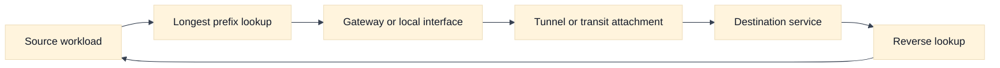
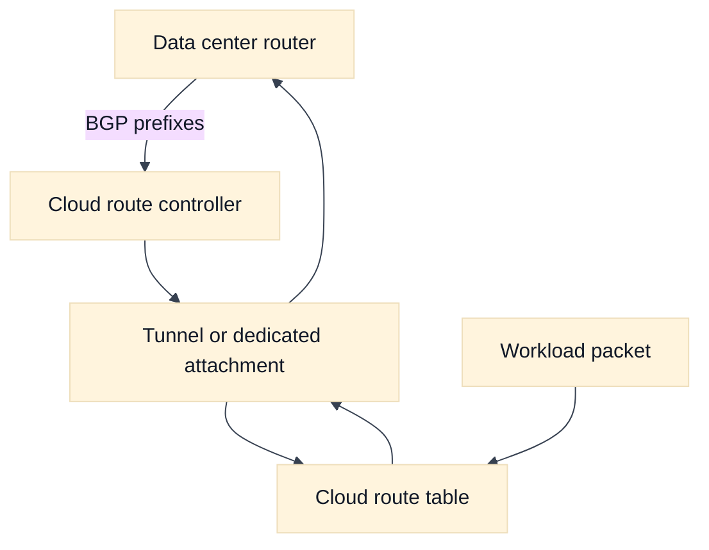

# Routes, Gateways, and Hybrid Cloud Connectivity

## A. Learning objectives

- Trace forward and reverse routes using longest-prefix reasoning.
- Explain gateways, peering, transit, VPN, and dedicated connectivity by behavior and ownership.
- Identify route propagation, overlapping CIDRs, asymmetric paths, and control-plane drift.
- Compare AWS and GCP hybrid connectivity without assuming transitivity or identical scopes.
- Construct an evidence-led diagnosis for a hybrid timeout.

## B. Prerequisites

Read [Cloud Networking Foundations](01-cloud-network-foundations.md), [Virtual Network Boundaries](02-virtual-network-boundaries-and-design.md), and [Subnet and IP Planning](03-subnet-and-ip-address-planning.md). Review the route and packet material in [the addressing chapter](../book/02-addressing-subnetting-routing.md) and BGP fundamentals in [the BGP chapter](../book/16-bgp-anycast-and-multi-region.md). You should know that a route is a forwarding decision, not permission to use the destination.

## C. Route and gateway mental model

For a packet, routing answers “which next hop should receive this destination?” A gateway is a role in that path: an internet edge, NAT device, VPN tunnel, peering attachment, transit router, proxy, or inspection appliance. Some gateways are stateful and translate or inspect traffic; others only forward. A route that points to a gateway does not prove that the gateway has a usable attachment, policy, capacity, or return route.

Use the same sequence on both directions:

1. Identify the source and destination address actually used after DNS and translation.
2. Find the most specific matching route at the sender.
3. Follow the next hop and any route advertisement or policy that installed it.
4. Evaluate packet policy, tunnel state, NAT, and inspection behavior.
5. Repeat for the response destination, which may be the translated source.

Hybrid connectivity adds another control plane. A data center router, cloud route controller, VPN endpoint, or dedicated interconnect may exchange prefixes dynamically. BGP session health is not the same as application health: a session can be established while an unwanted route is advertised, a return path is missing, or an intermediate firewall rejects traffic. Staff answers name prefix filters, maximum-prefix protection, change ownership, and rollback.

Peering is often deliberately non-transitive. Transit may provide centralized connectivity, but it introduces shared capacity, route-policy, and failure dependencies. VPN provides encryption over an underlying path, yet tunnel “up” can coexist with MTU, fragmentation, route, or policy failures. Dedicated links can improve predictable capacity but do not make application dependencies highly available automatically.

## D. AWS and GCP comparison

**Vendor terminology:** AWS commonly uses route tables, VPC peering, Transit Gateway, Site-to-Site VPN, and Direct Connect. Google Cloud uses VPC routes, Cloud Router, Cloud VPN, Interconnect, VPC Network Peering, and additional connectivity products. The terms describe provider mechanisms, not a universal topology.

| Mechanism | AWS example | Google Cloud example | Compare explicitly |
| --- | --- | --- | --- |
| Static or local routing | VPC route tables | VPC routes and subnet behavior | Scope, association, priority, and propagation. |
| Central transit | Transit Gateway | Network Connectivity Center or hub patterns | Transitivity, route policy, attachment limits, and cost. |
| Encrypted hybrid path | Site-to-Site VPN | Cloud VPN | Tunnel health, BGP/static mode, MTU, and failover. |
| Dedicated path | Direct Connect | Cloud Interconnect | Redundancy, provider demarcation, routing ownership, and maintenance. |
| Dynamic routing | BGP with gateway or transit features | Cloud Router with BGP | Advertised prefixes, custom policies, and regional/global scope. |

**Fact:** [AWS route tables](https://docs.aws.amazon.com/vpc/latest/userguide/route-table-options.html) and [Google Cloud routes](https://cloud.google.com/vpc/docs/routes) have provider-specific scope and behavior. **Inference:** Ask whether a connection is transitive, which prefixes propagate, and who owns the return path before selecting a product. Never infer that a healthy BGP session means every application flow is healthy.

## E. Worked scenario: asymmetric hybrid flow

Fictional `warehouse-a` at `10.70.4.25` calls cloud `inventory` at `10.80.6.14` over a VPN. The forward path selects a specific `10.80.0.0/16` route into the tunnel. The inventory response is destined for `10.70.4.25`, but the cloud side learned only `10.70.0.0/17`; the actual address is outside that prefix. The SYN leaves, the response has no valid return route, and the client times out.

The calculation is simple but useful: `10.70.4.25` belongs to `10.70.0.0/17` because the third-octet boundary for `/17` covers 0 through 127. If the warehouse address had been `10.70.200.25`, the same advertisement would not cover it. The interview answer should inspect both route tables and advertisements, then verify tunnel counters and policy. Adding a default route may hide the symptom while expanding the blast radius, so it is not a first fix.

## F. Diagram: route selection



## G. Diagram: hybrid control and data planes



## H. Failure, evidence, and falsifiers

| Hypothesis | Evidence | Falsifier |
| --- | --- | --- |
| Missing return route | Both route lookups and advertisements | Specific routes exist in both directions |
| Tunnel failure | Tunnel counters, negotiation, and path evidence | Packets traverse and responses return |
| Bad prefix advertisement | BGP received and sent route sets | Exact intended prefixes are accepted |
| MTU or fragmentation issue | Packet size tests and retransmission pattern | Small and large payloads both succeed |
| Policy denies hybrid flow | Firewall or inspection decision | Flow is explicitly accepted at each boundary |
| Transit is saturated | Interface, queue, and latency metrics | Capacity remains below safe headroom |

## I. Exercises

### I.1 Timed whiteboard: hub-and-spoke route policy

Take 20 minutes. Draw two cloud networks, one data center, a shared inspection point, and a partner network. Mark which prefixes are advertised, which paths are transitive, and how the response returns. Add a failure of the primary tunnel and explain convergence. Follow-up: the partner has an overlapping CIDR; propose a proxy or translation boundary and discuss source identity.

### I.2 Evidence-led debugging: VPN is up, API is down

Take 25 minutes. Build a command-agnostic evidence plan: resolved address, route selection, BGP prefixes, tunnel counters, MTU, firewall decisions, NAT state, and service logs. Rank evidence by ability to falsify hypotheses. Follow-up: a route exists but packets are absent from flow logs; explain whether the observation points to the wrong interface, logging scope, or an earlier DNS/client failure.

## J. Interview questions and direct answers

### J.1 Why inspect the reverse route?

**Answer:** Responses have their own destination and can select a different path. Missing advertisements, asymmetric policy, NAT, or an inspection device can permit the request while dropping the response. A complete diagnosis traces both directions using the actual post-translation addresses.

### J.2 What does longest-prefix match do?

**Answer:** It selects the most specific matching destination prefix among available routes. It does not prove that the next hop is healthy or permitted. If two routes have the same specificity, provider-specific priority and state may decide, so verify the relevant selection rules.

### J.3 Is a VPN tunnel being up enough?

**Answer:** No. It proves a control or negotiation state, not end-to-end application success. Verify prefixes, route installation, MTU, policy, tunnel counters, and a real protocol exchange. A tunnel can be healthy while the wrong network is advertised or a return route is absent.

### J.4 Peering or transit for two networks?

**Answer:** For two stable networks with a narrow relationship, peering may be simpler. For many networks or centralized route and inspection policy, transit may be more manageable. I would compare transitivity, limits, cost, ownership, route propagation, and failure blast radius.

### J.5 How do you design hybrid connectivity for failure?

**Answer:** Use independent paths and devices where justified, explicit prefix filters, tested convergence, application timeouts that tolerate failover, and evidence for tunnel, route, and service state. Avoid declaring success based on redundant circuits alone. Exercise failure and include rollback and ownership for both cloud and data-center teams.

### J.6 How do you protect a shared route controller?

**Answer:** Separate desired intent from learned state, review prefix changes, constrain advertisements, apply maximum-prefix and loop protections, alert on unexpected route deltas, and keep a tested last-known-good configuration. Changes need an owner and a bounded blast radius; a central controller deserves stricter change policy because its reach is broad.

### J.7 How should a design handle overlapping CIDRs?

**Answer:** Prefer renumbering because it preserves transparent identity and simpler evidence. If impossible, isolate the overlap behind a proxy or carefully bounded translation, document which identity is visible on each side, and test return paths and logs. Do not connect overlapping domains and hope route priority resolves it.

### J.8 What evidence distinguishes route failure from firewall failure?

**Answer:** A route lookup and packet/flow observation establish whether forwarding is attempted. A policy decision or counter shows whether a packet was evaluated and rejected. If no packet reaches the policy boundary, investigate an earlier route or interface issue; if it reaches and is denied, the policy hypothesis gains support.

## K. Advanced route review: forwarding, convergence, and hybrid failure

### K.1 Packet and request tuple walk-through

Assume an application in `10.81.12.44:443` calls an on-premises database at `172.22.40.15:5432`. Trace `(10.81.12.44:443 -> 172.22.40.15:5432, TCP)` through the cloud subnet route, transit or VPN attachment, cloud edge, customer router, database firewall, and the reverse path. At each boundary ask: which destination prefix matched, which next hop won, was the route learned or static, and what source address did the next device observe? A VPN control session being established is separate from this data-plane tuple.

Then trace the request contract: DNS name, TLS or database identity, timeout, and correlation ID. If a proxy or translation layer exists, record both tuples. An asymmetric path can allow SYN in and lose SYN-ACK out even though each local route table appears plausible. A Staff answer draws forward and reverse paths separately and identifies the state owner.

### K.2 Assumptions to calculation

Suppose the primary hybrid path carries 700 Mbps peak and the design requires operation after one path fails, with 25% headroom. If there are two equal paths and either may be lost, each surviving path must support `700 x 1.25 = 875 Mbps`; the normal design should not assume both paths are available for safety. If encryption and inspection overhead reduce usable capacity by an assumed 15%, provisioned link capacity should be at least `875 / 0.85 = 1,030 Mbps`, rounded up to the next supported tier. These are engineering assumptions, not provider guarantees.

Falsify the congestion hypothesis with interface and queue evidence below the calculated threshold during the incident. Conversely, high retransmission with low link utilization should redirect investigation toward MTU, route asymmetry, policy, or an application timeout rather than adding bandwidth.

### K.3 Provider non-equivalence and verification boundary

AWS route tables, Transit Gateway, Site-to-Site VPN, Direct Connect, and BGP have different route scope, propagation, attachment, and policy behavior from GCP VPC routes, Cloud Router, Cloud VPN, Interconnect, and Network Connectivity Center. “Transit” is an architectural role, not a guarantee that two provider transit products have equal transitivity, inspection insertion, route priority, or failure convergence. AWS subnet association should not be generalized to GCP’s global VPC route model.

Label provider behavior as **Fact** or **Vendor terminology** and comparison conclusions as **Inference**. Verify advertised and received prefixes, route priority, regional/global scope, BGP timers and policies, MTU, quotas, and maintenance behavior for the exact account/project, region, attachment, and release. A strong answer names the route lookup or provider documentation that will confirm the assumption.

### K.4 Evidence, blast radius, and rollback

Evidence should be ordered from intent to forwarding to application: desired prefixes, learned routes, effective route selection, tunnel counters, packet/flow records, transport retransmission, and service logs. “Tunnel up” falsifies only a negotiation failure. “Route present” falsifies only a missing-route hypothesis for that scope; it does not prove the selected next hop is healthy. An MTU test that works for small packets but fails with the application’s payload is especially valuable because it explains protocol-specific symptoms.

Route changes can affect every prefix behind a shared attachment. Before rollout, define changed advertisements, affected spokes, failover path, convergence budget, and a last-known-good route policy. Canary a narrow prefix, enforce maximum-prefix and loop protections, observe both directions, and keep rollback available. Withdrawals can be slower or riskier than additions, and existing sessions may remain pinned; rollback must include connection draining and application retry behavior.

### K.5 Follow-up interview questions and substantive answers

**Follow-up 1: Both sides show the route, but the request still times out. What do you check?**

**Answer:** I verify the exact longest-prefix winner and next-hop state on both directions, then inspect tunnel counters, MTU, policy, NAT, and packet evidence at each demarcation. I compare a small control payload with the real protocol. A route entry is intent; an observed bidirectional handshake is stronger evidence.

**Follow-up 2: Would you advertise all cloud prefixes to the data center?**

**Answer:** Only if the operational and security model requires it. Summarization can reduce route scale but may create a broader blast radius and send traffic to an attachment that cannot reach every component. I would advertise explicit, owned prefixes with filters, document failure behavior, and test whether summarization changes the return path.

**Follow-up 3: When is automatic failover a liability?**

**Answer:** It is a liability when route convergence is faster than application or data readiness, when both paths share a hidden failure, or when oscillation causes repeated connection loss. I would gate failover on path health and service readiness, add hold-down or dampening where appropriate, and measure recovery against the RTO rather than celebrating route convergence alone.

## M. AWS setup and use

This lab shows how to inspect AWS route-table associations and, when a reviewed attachment already exists, add one narrow route toward a fictional hybrid prefix. It uses the [AWS route-table model](https://docs.aws.amazon.com/vpc/latest/userguide/subnet-route-tables.html). **Cost and state warning:** route changes can redirect real traffic immediately; Transit Gateway, Site-to-Site VPN, and Direct Connect resources can incur charges. Use a sandbox or a non-production route table. Never substitute a real customer prefix for the example range.

### M.1 Prerequisites and inspect before changing

The learner needs read permission for VPC route tables and, for the optional route change, permission to create and delete routes. `TRANSIT_GATEWAY_ID` must identify an approved attachment in the same Region. If there is no approved gateway, run only the read-only commands.

```bash
export AWS_PROFILE=AWS_PROFILE
export AWS_REGION=AWS_REGION
export VPC_ID=VPC_ID
export ROUTE_TABLE_ID=ROUTE_TABLE_ID
export SUBNET_ID=SUBNET_ID
export TRANSIT_GATEWAY_ID=TRANSIT_GATEWAY_ID
export HYBRID_PREFIX=10.250.0.0/16

aws sts get-caller-identity --profile "$AWS_PROFILE"
aws ec2 describe-route-tables --profile "$AWS_PROFILE" --region "$AWS_REGION" \
  --route-table-ids "$ROUTE_TABLE_ID" \
  --query 'RouteTables[0].{Id:RouteTableId,Vpc:VpcId,Associations:Associations,Routes:Routes}'
aws ec2 describe-subnets --profile "$AWS_PROFILE" --region "$AWS_REGION" \
  --subnet-ids "$SUBNET_ID" --query 'Subnets[0].{Id:SubnetId,Vpc:VpcId,Az:AvailabilityZone}'
aws ec2 search-transit-gateway-routes --profile "$AWS_PROFILE" --region "$AWS_REGION" \
  --transit-gateway-route-table-id TRANSIT_GATEWAY_ROUTE_TABLE_ID \
  --filters "Name=type,Values=static,propagated"
```

The route table output is effective intent for the subnet association, not proof of a working tunnel. Confirm that `ROUTE_TABLE_ID` is associated with `SUBNET_ID`, that the destination is not overlapped by a more-specific route, and that the return path is advertised. The Transit Gateway lookup requires a real route-table ID; if it is unavailable, omit that command.

### M.2 Add, use, and verify one narrow route

```bash
aws ec2 create-route --profile "$AWS_PROFILE" --region "$AWS_REGION" \
  --route-table-id "$ROUTE_TABLE_ID" \
  --destination-cidr-block "$HYBRID_PREFIX" \
  --transit-gateway-id "$TRANSIT_GATEWAY_ID"

aws ec2 describe-route-tables --profile "$AWS_PROFILE" --region "$AWS_REGION" \
  --route-table-ids "$ROUTE_TABLE_ID" \
  --query 'RouteTables[0].Routes[?DestinationCidrBlock==`10.250.0.0/16`].{Destination:DestinationCidrBlock,Target:TransitGatewayId,State:State,Type:Type}'
aws ec2 describe-vpn-connections --profile "$AWS_PROFILE" --region "$AWS_REGION" \
  --query 'VpnConnections[].{Id:VpnConnectionId,State:State,Options:Options}'
```

Use the route only with a test source and destination that both owners approve. Expected evidence is an `active` route, an available attachment, tunnel or BGP state where applicable, and a successful bidirectional protocol test. A route with `blackhole` state, a missing return advertisement, or a successful control-plane call with no SYN-ACK means the path is not usable. Prefer [VPC Reachability Analyzer](https://docs.aws.amazon.com/vpc/latest/reachability/getting-started.html) or flow evidence where the selected endpoints support it.

### M.3 Roll back safely

```bash
aws ec2 delete-route --profile "$AWS_PROFILE" --region "$AWS_REGION" \
  --route-table-id "$ROUTE_TABLE_ID" \
  --destination-cidr-block "$HYBRID_PREFIX"
aws ec2 describe-route-tables --profile "$AWS_PROFILE" --region "$AWS_REGION" \
  --route-table-ids "$ROUTE_TABLE_ID" \
  --query 'RouteTables[0].Routes'
```

Delete the route only after confirming that the previous path remains valid and that no test is still using it. In a real rollout, capture the previous route table, advertise a canary prefix first, monitor both directions, and account for established connections that may not move when the route changes.

### M.4 AWS troubleshooting follow-up

**Question:** The VPN tunnel is `UP`, but the private API times out. What is your AWS-specific sequence?

**Answer:** I verify the subnet association and exact longest-prefix route, then inspect Transit Gateway or VPN route propagation, customer-gateway advertisements, security groups, NACLs, MTU, and flow logs. I test the reverse path separately. “Tunnel up” proves a control or negotiation state, not that the application prefix is installed, permitted, and returning through the same attachment.

## N. GCP setup and use

Google Cloud routes are VPC-level resources and can use a VPN tunnel or other next hop. See [Google Cloud routes](https://cloud.google.com/vpc/docs/routes), [Cloud VPN](https://cloud.google.com/network-connectivity/docs/vpn/concepts/overview), and [Connectivity Tests](https://cloud.google.com/network-intelligence-center/docs/connectivity-tests/concepts/overview). **Cost and state warning:** a custom route changes forwarding for matching traffic, while HA VPN, Cloud Router, and Interconnect can incur charges. Use a test network and a reserved fictional prefix.

### N.1 Prerequisites and inspect effective routes

```bash
export PROJECT_ID=PROJECT_ID
export REGION=REGION
export NETWORK_NAME=NETWORK_NAME
export VPN_TUNNEL_NAME=VPN_TUNNEL_NAME
export ROUTE_NAME=interview-hybrid-route
export HYBRID_PREFIX=10.251.0.0/16

gcloud auth list
gcloud config set project "$PROJECT_ID"
gcloud compute routes list --project="$PROJECT_ID" \
  --filter="network:$NETWORK_NAME" \
  --format='table(name,destRange,nextHopGateway,nextHopVpnTunnel,nextHopInstance,priority,routeType)'
gcloud compute vpn-tunnels describe "$VPN_TUNNEL_NAME" \
  --project="$PROJECT_ID" --region="$REGION" \
  --format='yaml(name,status,peerIp,router)'
```

The route list shows VPC routing intent and the tunnel status shows one control-plane dependency. Inspect Cloud Router learned or advertised routes when dynamic routing is used. Confirm that `HYBRID_PREFIX` is not already claimed by a peering, subnet, or on-premises route before adding a static route.

### N.2 Add, use, and verify one narrow route

```bash
gcloud compute routes create "$ROUTE_NAME" --project="$PROJECT_ID" \
  --network="$NETWORK_NAME" --destination-range="$HYBRID_PREFIX" \
  --next-hop-vpn-tunnel="$VPN_TUNNEL_NAME" \
  --next-hop-vpn-tunnel-region="$REGION" --priority=900

gcloud compute routes describe "$ROUTE_NAME" --project="$PROJECT_ID" \
  --format='yaml(name,network,destRange,nextHopVpnTunnel,priority,routeType)'
gcloud network-management connectivity-tests create interview-hybrid-test \
  --project="$PROJECT_ID" --source-ip-address=10.252.1.10 \
  --destination-ip-address=10.251.1.10 --destination-network="$NETWORK_NAME" \
  --destination-port=443 --protocol=TCP --round-trip
```

The Connectivity Test source and destination are fictional placeholders unless you replace them with approved endpoint identities. Its result is configuration-analysis evidence, not a substitute for a real application transaction. Expected evidence is the intended route, the tunnel as next hop, no more-specific competing route, firewall allowance, and a valid return path.

### N.3 Roll back safely

```bash
gcloud compute routes delete "$ROUTE_NAME" --project="$PROJECT_ID"
gcloud compute routes list --project="$PROJECT_ID" \
  --filter="network:$NETWORK_NAME AND destRange=$HYBRID_PREFIX"
```

Before deletion, confirm the previous route or dynamic advertisement is healthy. For production, stage a narrow prefix and retain the old path until application and tunnel evidence agree; route deletion does not close existing sessions or repair data-plane state.

### N.4 GCP troubleshooting follow-up

**Question:** Connectivity Tests says the path is blocked even though the Cloud VPN tunnel is established. What do you inspect?

**Answer:** I inspect the exact source and destination network, effective route and priority, tunnel region, Cloud Router advertisements, ingress and egress firewall rules, and the return path. I compare the test’s configuration result with flow logs and an application-level probe. A tunnel status is only one dependency; it does not prove that the selected prefix is learned, preferred, permitted, and reachable.

## L. References and evidence labels

- **Fact:** [AWS route options](https://docs.aws.amazon.com/vpc/latest/userguide/route-table-options.html), [AWS Transit Gateway](https://docs.aws.amazon.com/vpc/latest/tgw/what-is-transit-gateway.html), and [Google Cloud routes](https://cloud.google.com/vpc/docs/routes).
- **Vendor terminology:** [AWS Site-to-Site VPN](https://docs.aws.amazon.com/vpn/latest/s2svpn/VPC_VPN.html), [Google Cloud VPN](https://cloud.google.com/network-connectivity/docs/vpn/concepts/overview), and [Cloud Router](https://cloud.google.com/network-connectivity/docs/router/concepts/overview).
- **Inference:** The route troubleshooting sequence extends [BGP and anycast](../book/16-bgp-anycast-and-multi-region.md) and [network observability](../book/12-observability-and-troubleshooting.md).
- [NAT and conntrack](../book/topics/24-nat-conntrack-and-snat.md) covers translation and state once a route exists.
- **Provider setup:** [AWS route tables](https://docs.aws.amazon.com/vpc/latest/userguide/subnet-route-tables.html), [Google Cloud routes](https://cloud.google.com/vpc/docs/routes), and [Google Cloud Connectivity Tests](https://cloud.google.com/network-intelligence-center/docs/connectivity-tests/concepts/overview).
